# 🇱🇰 Sri Lanka - Census of Population and Housing 2024


**154** Datasets on Population, Housing and more, by Country, Province, District, Divisional Secretariat Division (DSD), Grama Niladhari Division (GND), Electoral District (ED), Polling Division (PD), and Local Government Authority (LG) levels.

## 01. [Population-Gender](data/Population-Gender)

### Data by Country & Province

| region_id | region_name | total_value | male | female |
| --: | --: | --: | --: | --:|
| LK | Sri Lanka | 21,781,800 | 10,512,344 | 11,269,456 |
| LK-1 | Western | 6,117,341 | 2,961,374 | 3,155,967 |
| LK-2 | Central | 2,714,045 | 1,298,405 | 1,415,640 |
| LK-3 | Southern | 2,606,679 | 1,258,830 | 1,347,849 |
| LK-4 | Northern | 1,150,148 | 551,273 | 598,875 |
| LK-5 | Eastern | 1,783,214 | 850,607 | 932,607 |
| LK-6 | North Western | 2,586,972 | 1,243,316 | 1,343,656 |
| LK-7 | North Central | 1,407,610 | 686,257 | 721,353 |
| LK-8 | Uva | 1,399,892 | 683,745 | 716,147 |
| LK-9 | Sabaragamuwa | 2,015,899 | 978,537 | 1,037,362 |

### Example Data Row (JSON)

```json
{
    "region_id": "LK",
    "region_name": "Sri Lanka",
    "region_ent_type": "country",
    "values": {
        "male": 10512344,
        "female": 11269456
    },
    "total_value": 21781800
}
```

### Data Files

- [📄 data/Population-Gender/data.json (3.3 MB)](data/Population-Gender/data.json)
- [📕 data/Population-Gender/data.tsv (629.5 kB)](data/Population-Gender/data.tsv)
- [📊 original_docs/GN_population_excel.xlsx (1.5 MB)](original_docs/GN_population_excel.xlsx)

### Source

- 🌐: [https://www.statistics.gov.lk/Population/StaticalInformation/CPH2024/GN_population_excel](https://www.statistics.gov.lk/Population/StaticalInformation/CPH2024/GN_population_excel)


## 02. [Population-Ethnicity](data/Population-Ethnicity)

### Data by Country & Province

| region_id | region_name | total_value | sinhalese | sri_lanka_tamil | indian_malaiyaga_tamil | sri_lanka_moor_muslim | burgher | malay | sri_lanka_chetty | bharatha | veddha | other |
| --: | --: | --: | --: | --: | --: | --: | --: | --: | --: | --: | --: | --:|
| LK | Sri Lanka | 21,781,800 | 16,140,688 | 2,665,574 | 590,087 | 2,274,372 | 25,159 | 22,838 | 1,753 | 553 | 1,287 | 59,489 |
| LK-1 | Western | 6,117,341 | 5,115,543 | 379,680 | 26,271 | 542,333 | 15,725 | 16,126 | 1,753 | 553 | 0 | 19,357 |
| LK-2 | Central | 2,714,045 | 1,783,899 | 222,924 | 406,956 | 289,281 | 2,395 | 952 | 0 | 0 | 0 | 7,638 |
| LK-3 | Southern | 2,606,679 | 2,470,423 | 27,994 | 10,187 | 88,145 | 127 | 3,882 | 0 | 0 | 0 | 5,921 |
| LK-4 | Northern | 1,150,148 | 34,023 | 1,052,660 | 2,726 | 57,151 | 25 | 0 | 0 | 0 | 0 | 3,563 |
| LK-5 | Eastern | 1,783,214 | 390,538 | 677,890 | 1,221 | 703,155 | 4,503 | 367 | 0 | 0 | 898 | 4,642 |
| LK-6 | North Western | 2,586,972 | 2,193,622 | 67,272 | 1,689 | 314,035 | 1,519 | 931 | 0 | 0 | 0 | 7,904 |
| LK-7 | North Central | 1,407,610 | 1,272,757 | 11,147 | 173 | 119,657 | 57 | 56 | 0 | 0 | 221 | 3,542 |
| LK-8 | Uva | 1,399,892 | 1,139,983 | 95,535 | 96,469 | 63,685 | 548 | 499 | 0 | 0 | 168 | 3,005 |
| LK-9 | Sabaragamuwa | 2,015,899 | 1,739,900 | 130,472 | 44,395 | 96,930 | 260 | 25 | 0 | 0 | 0 | 3,917 |

### Example Data Row (JSON)

```json
{
    "region_id": "LK",
    "region_name": "Sri Lanka",
    "region_ent_type": "country",
    "values": {
        "sinhalese": 16140688,
        "sri_lanka_tamil": 2665574,
        "indian_malaiyaga_tamil": 590087,
        "sri_lanka_moor_muslim": 2274372,
        "burgher": 25159,
        "malay": 22838,
        "sri_lanka_chetty": 1753,
        "bharatha": 553,
        "veddha": 1287,
        "other": 59489
    },
    "total_value": 21781800
}
```

### Data Files

- [📄 data/Population-Ethnicity/data.json (6.4 MB)](data/Population-Ethnicity/data.json)
- [📕 data/Population-Ethnicity/data.tsv (863.4 kB)](data/Population-Ethnicity/data.tsv)
- [📊 original_docs/GNLevel-GN_Level_Population_by_Ethnic_Group.xlsx (6.8 MB)](original_docs/GNLevel-GN_Level_Population_by_Ethnic_Group.xlsx)

### Source

- 🌐: [https://www.statistics.gov.lk/Population/StaticalInformation/CPH2024/GNLevel/GN_Level_Population_by_Ethnic_Group](https://www.statistics.gov.lk/Population/StaticalInformation/CPH2024/GNLevel/GN_Level_Population_by_Ethnic_Group)


## 03. [Population-Religion](data/Population-Religion)

### Data by Country & Province

| region_id | region_name | total_value | buddhist | hindu | islam | roman_catholic | other_christian | other |
| --: | --: | --: | --: | --: | --: | --: | --: | --:|
| LK | Sri Lanka | 21,781,800 | 15,196,960 | 2,718,154 | 2,327,605 | 1,209,072 | 266,515 | 63,494 |
| LK-1 | Western | 6,117,341 | 4,507,601 | 305,971 | 568,301 | 616,413 | 104,869 | 14,186 |
| LK-2 | Central | 2,714,045 | 1,760,853 | 565,722 | 296,754 | 55,680 | 26,421 | 8,615 |
| LK-3 | Southern | 2,606,679 | 2,463,066 | 28,775 | 92,985 | 5,093 | 7,568 | 9,192 |
| LK-4 | Northern | 1,150,148 | 32,374 | 829,092 | 59,860 | 175,462 | 49,827 | 3,533 |
| LK-5 | Eastern | 1,783,214 | 388,164 | 596,842 | 706,572 | 46,596 | 41,109 | 3,931 |
| LK-6 | North Western | 2,586,972 | 1,918,652 | 43,060 | 318,870 | 278,850 | 17,211 | 10,329 |
| LK-7 | North Central | 1,407,610 | 1,262,247 | 9,588 | 120,511 | 6,869 | 3,663 | 4,732 |
| LK-8 | Uva | 1,399,892 | 1,135,408 | 180,305 | 65,203 | 9,852 | 5,431 | 3,693 |
| LK-9 | Sabaragamuwa | 2,015,899 | 1,728,595 | 158,799 | 98,549 | 14,257 | 10,416 | 5,283 |

### Example Data Row (JSON)

```json
{
    "region_id": "LK",
    "region_name": "Sri Lanka",
    "region_ent_type": "country",
    "values": {
        "buddhist": 15196960,
        "hindu": 2718154,
        "islam": 2327605,
        "roman_catholic": 1209072,
        "other_christian": 266515,
        "other": 63494
    },
    "total_value": 21781800
}
```

### Data Files

- [📄 data/Population-Religion/data.json (4.7 MB)](data/Population-Religion/data.json)
- [📕 data/Population-Religion/data.tsv (753.6 kB)](data/Population-Religion/data.tsv)
- [📊 original_docs/GNLevel-GN_Level_Population_by_Religion.xlsx (1.0 MB)](original_docs/GNLevel-GN_Level_Population_by_Religion.xlsx)

### Source

- 🌐: [https://www.statistics.gov.lk/Population/StaticalInformation/CPH2024/GNLevel/GN_Level_Population_by_Religion](https://www.statistics.gov.lk/Population/StaticalInformation/CPH2024/GNLevel/GN_Level_Population_by_Religion)


## 04. [Population-AgeGroup](data/Population-AgeGroup)

### Data by Country & Province

| region_id | region_name | total_value | 00_04 | 05_09 | 10_14 | 15_19 | 20_24 | 25_29 | 30_34 | 35_39 | 40_44 | 45_49 | 50_54 | 55_59 | 60_64 | 65_69 | 70_74 | 75_79 | 80_84 | 85_89 | 90_94 | 95_and_above |
| --: | --: | --: | --: | --: | --: | --: | --: | --: | --: | --: | --: | --: | --: | --: | --: | --: | --: | --: | --: | --: | --: | --:|
| LK | Sri Lanka | 21,781,800 | 1,215,120 | 1,556,523 | 1,735,196 | 1,795,038 | 1,608,606 | 1,372,458 | 1,414,060 | 1,452,703 | 1,602,344 | 1,490,765 | 1,341,807 | 1,276,056 | 1,183,310 | 991,814 | 795,539 | 522,990 | 268,415 | 111,029 | 39,235 | 8,792 |
| LK-1 | Western | 6,117,341 | 287,116 | 369,976 | 428,367 | 475,748 | 486,242 | 411,892 | 396,532 | 403,369 | 458,173 | 445,763 | 412,374 | 380,280 | 343,391 | 285,239 | 231,712 | 162,489 | 85,998 | 36,613 | 13,076 | 2,991 |
| LK-2 | Central | 2,714,045 | 154,205 | 204,497 | 235,152 | 229,457 | 192,660 | 154,026 | 162,232 | 173,222 | 192,876 | 179,495 | 161,999 | 163,045 | 155,726 | 130,207 | 102,224 | 68,790 | 34,734 | 13,854 | 4,609 | 1,035 |
| LK-3 | Southern | 2,606,679 | 142,793 | 190,768 | 209,476 | 215,333 | 178,596 | 152,631 | 164,052 | 174,519 | 187,572 | 170,305 | 158,824 | 151,599 | 143,734 | 127,415 | 103,385 | 70,188 | 38,224 | 18,201 | 7,295 | 1,769 |
| LK-4 | Northern | 1,150,148 | 73,293 | 79,675 | 90,800 | 96,680 | 98,803 | 88,553 | 83,444 | 77,294 | 81,599 | 73,899 | 60,386 | 54,470 | 54,236 | 47,215 | 41,357 | 27,932 | 13,342 | 5,195 | 1,675 | 300 |
| LK-5 | Eastern | 1,783,214 | 137,014 | 157,548 | 157,400 | 169,326 | 146,886 | 126,629 | 127,105 | 116,811 | 124,535 | 110,400 | 95,671 | 89,532 | 79,012 | 59,664 | 43,627 | 24,716 | 11,701 | 4,151 | 1,227 | 259 |
| LK-6 | North Western | 2,586,972 | 148,254 | 191,642 | 210,926 | 214,171 | 176,527 | 152,409 | 161,533 | 173,373 | 192,544 | 179,687 | 158,485 | 153,502 | 144,739 | 122,896 | 99,957 | 60,025 | 30,313 | 11,271 | 3,866 | 852 |
| LK-7 | North Central | 1,407,610 | 83,713 | 112,655 | 125,152 | 117,867 | 97,492 | 82,682 | 93,829 | 97,166 | 108,645 | 101,145 | 88,419 | 79,891 | 72,924 | 58,945 | 44,684 | 24,831 | 11,129 | 4,626 | 1,503 | 312 |
| LK-8 | Uva | 1,399,892 | 83,349 | 109,270 | 119,643 | 114,780 | 96,666 | 86,593 | 96,137 | 99,529 | 102,117 | 92,838 | 82,728 | 81,850 | 76,369 | 61,507 | 45,617 | 28,239 | 14,326 | 5,882 | 2,014 | 438 |
| LK-9 | Sabaragamuwa | 2,015,899 | 105,383 | 140,492 | 158,280 | 161,676 | 134,734 | 117,043 | 129,196 | 137,420 | 154,283 | 137,233 | 122,921 | 121,887 | 113,179 | 98,726 | 82,976 | 55,780 | 28,648 | 11,236 | 3,970 | 836 |

### Example Data Row (JSON)

```json
{
    "region_id": "LK",
    "region_name": "Sri Lanka",
    "region_ent_type": "country",
    "values": {
        "00_04": 1215120,
        "05_09": 1556523,
        "10_14": 1735196,
        "15_19": 1795038,
        "20_24": 1608606,
        "25_29": 1372458,
        "30_34": 1414060,
        "35_39": 1452703,
        "40_44": 1602344,
        "45_49": 1490765,
        "50_54": 1341807,
        "55_59": 1276056,
        "60_64": 1183310,
        "65_69": 991814,
        "70_74": 795539,
        "75_79": 522990,
        "80_84": 268415,
        "85_89": 111029,
        "90_94": 39235,
        "95_and_above": 8792
    },
    "total_value": 21781800
}
```

### Data Files

- [📄 data/Population-AgeGroup/data.json (8.5 MB)](data/Population-AgeGroup/data.json)
- [📕 data/Population-AgeGroup/data.tsv (1.5 MB)](data/Population-AgeGroup/data.tsv)
- [📊 original_docs/GNLevel-GN_Level_Population_by_Five_Year_Age_Group.xlsx (2.1 MB)](original_docs/GNLevel-GN_Level_Population_by_Five_Year_Age_Group.xlsx)

### Source

- 🌐: [https://www.statistics.gov.lk/Population/StaticalInformation/CPH2024/GNLevel/GN_Level_Population_by_Five_Year_Age_Group](https://www.statistics.gov.lk/Population/StaticalInformation/CPH2024/GNLevel/GN_Level_Population_by_Five_Year_Age_Group)


## 05. [Housing-Structure](data/Housing-Structure)

### Data by Country & Province

| region_id | region_name | total_value | single_house_single_storeyed | single_house_two_storeyed | single_house_more_than_two_storeyed | attached_house_1st_floor | attached_house_2nd_floor | attached_house_from_3_to_4_floors | attached_house_from_5_to_10_floors | attached_house_from_11_to_19_floors | attached_house_from_20_floors_or_more | other |
| --: | --: | --: | --: | --: | --: | --: | --: | --: | --: | --: | --: | --:|
| LK | Sri Lanka | 6,030,541 | 4,958,009 | 751,375 | 59,484 | 164,419 | 50,030 | 25,373 | 12,853 | 6,031 | 1,756 | 1,211 |
| LK-1 | Western | 1,686,506 | 1,177,294 | 360,332 | 32,722 | 44,627 | 32,464 | 18,775 | 12,272 | 5,994 | 1,756 | 270 |
| LK-2 | Central | 730,925 | 539,831 | 95,235 | 11,754 | 70,508 | 9,149 | 3,866 | 469 | 23 | 0 | 90 |
| LK-3 | Southern | 722,971 | 615,514 | 91,046 | 5,317 | 6,959 | 3,271 | 748 | 60 | 14 | 0 | 42 |
| LK-4 | Northern | 307,459 | 292,371 | 13,396 | 604 | 466 | 325 | 109 | 5 | 0 | 0 | 183 |
| LK-5 | Eastern | 489,362 | 452,172 | 32,702 | 1,365 | 1,432 | 774 | 491 | 8 | 0 | 0 | 418 |
| LK-6 | North Western | 738,403 | 681,543 | 52,350 | 1,295 | 2,143 | 785 | 139 | 38 | 0 | 0 | 110 |
| LK-7 | North Central | 397,890 | 373,745 | 22,469 | 559 | 581 | 393 | 117 | 1 | 0 | 0 | 25 |
| LK-8 | Uva | 390,145 | 337,782 | 27,180 | 2,355 | 20,632 | 1,384 | 781 | 0 | 0 | 0 | 31 |
| LK-9 | Sabaragamuwa | 566,880 | 487,757 | 56,665 | 3,513 | 17,071 | 1,485 | 347 | 0 | 0 | 0 | 42 |

### Example Data Row (JSON)

```json
{
    "region_id": "LK",
    "region_name": "Sri Lanka",
    "region_ent_type": "country",
    "values": {
        "single_house_single_storeyed": 4958009,
        "single_house_two_storeyed": 751375,
        "single_house_more_than_two_storeyed": 59484,
        "attached_house_1st_floor": 164419,
        "attached_house_2nd_floor": 50030,
        "attached_house_from_3_to_4_floors": 25373,
        "attached_house_from_5_to_10_floors": 12853,
        "attached_house_from_11_to_19_floors": 6031,
        "attached_house_from_20_floors_or_more": 1756,
        "other": 1211
    },
    "total_value": 6030541
}
```

### Data Files

- [📄 data/Housing-Structure/data.json (8.9 MB)](data/Housing-Structure/data.json)
- [📕 data/Housing-Structure/data.tsv (846.3 kB)](data/Housing-Structure/data.tsv)
- [📊 original_docs/OHU_GN_excel.xlsx (3.4 MB)](original_docs/OHU_GN_excel.xlsx)

### Source

- 🌐: [https://www.statistics.gov.lk/Population/StaticalInformation/CPH2024/OHU_GN_excel](https://www.statistics.gov.lk/Population/StaticalInformation/CPH2024/OHU_GN_excel)


## 06. [Housing-Walls](data/Housing-Walls)

### Data by Country & Province

| region_id | region_name | total_value | bricks | cement_block | granite_cube_stones | cabook | pressed_soil_bricks | warichchi_mud | cadjan_palmyrah | planks_metal_sheets_asbestos | zink_aluminium_sheets | other | not_relevant |
| --: | --: | --: | --: | --: | --: | --: | --: | --: | --: | --: | --: | --: | --:|
| LK | Sri Lanka | 6,030,541 | 2,799,913 | 2,828,027 | 95,717 | 68,497 | 111,245 | 70,011 | 7,650 | 43,260 | 3,870 | 1,140 | 1,211 |
| LK-1 | Western | 1,686,506 | 444,198 | 1,147,193 | 8,468 | 48,401 | 15,695 | 9,478 | 122 | 12,045 | 407 | 229 | 270 |
| LK-2 | Central | 730,925 | 282,854 | 363,613 | 49,021 | 1,925 | 21,108 | 8,484 | 35 | 3,318 | 332 | 145 | 90 |
| LK-3 | Southern | 722,971 | 365,930 | 313,267 | 4,658 | 10,786 | 14,814 | 9,670 | 41 | 3,546 | 111 | 106 | 42 |
| LK-4 | Northern | 307,459 | 17,403 | 280,072 | 516 | 147 | 1,122 | 1,376 | 1,569 | 4,395 | 642 | 34 | 183 |
| LK-5 | Eastern | 489,362 | 361,634 | 108,255 | 482 | 217 | 1,475 | 4,504 | 2,306 | 8,428 | 1,599 | 44 | 418 |
| LK-6 | North Western | 738,403 | 595,052 | 118,669 | 725 | 365 | 5,526 | 7,102 | 3,440 | 6,863 | 437 | 114 | 110 |
| LK-7 | North Central | 397,890 | 335,859 | 53,722 | 238 | 108 | 1,936 | 5,107 | 57 | 667 | 123 | 48 | 25 |
| LK-8 | Uva | 390,145 | 215,064 | 114,216 | 11,494 | 2,313 | 36,894 | 8,617 | 38 | 1,089 | 135 | 254 | 31 |
| LK-9 | Sabaragamuwa | 566,880 | 181,919 | 329,020 | 20,115 | 4,235 | 12,675 | 15,673 | 42 | 2,909 | 84 | 166 | 42 |

### Example Data Row (JSON)

```json
{
    "region_id": "LK",
    "region_name": "Sri Lanka",
    "region_ent_type": "country",
    "values": {
        "bricks": 2799913,
        "cement_block": 2828027,
        "granite_cube_stones": 95717,
        "cabook": 68497,
        "pressed_soil_bricks": 111245,
        "warichchi_mud": 70011,
        "cadjan_palmyrah": 7650,
        "planks_metal_sheets_asbestos": 43260,
        "zink_aluminium_sheets": 3870,
        "other": 1140,
        "not_relevant": 1211
    },
    "total_value": 6030541
}
```

### Data Files

- [📄 data/Housing-Walls/data.json (7.2 MB)](data/Housing-Walls/data.json)
- [📕 data/Housing-Walls/data.tsv (885.4 kB)](data/Housing-Walls/data.tsv)
- [📊 original_docs/OHU_GN_excel.xlsx (3.4 MB)](original_docs/OHU_GN_excel.xlsx)

### Source

- 🌐: [https://www.statistics.gov.lk/Population/StaticalInformation/CPH2024/OHU_GN_excel](https://www.statistics.gov.lk/Population/StaticalInformation/CPH2024/OHU_GN_excel)


## 07. [Housing-Floor](data/Housing-Floor)

### Data by Country & Province

| region_id | region_name | total_value | cement | terrazzo_tile_granite_wood_finished | concrete | mud | wood | sand | other | not_relevant |
| --: | --: | --: | --: | --: | --: | --: | --: | --: | --: | --:|
| LK | Sri Lanka | 6,030,541 | 3,710,163 | 1,692,659 | 498,925 | 115,259 | 2,579 | 7,707 | 2,038 | 1,211 |
| LK-1 | Western | 1,686,506 | 836,713 | 754,097 | 87,793 | 5,688 | 1,159 | 578 | 208 | 270 |
| LK-2 | Central | 730,925 | 486,204 | 160,536 | 58,877 | 24,089 | 361 | 385 | 383 | 90 |
| LK-3 | Southern | 722,971 | 408,910 | 236,461 | 66,411 | 10,752 | 190 | 109 | 96 | 42 |
| LK-4 | Northern | 307,459 | 250,340 | 43,976 | 7,171 | 4,107 | 114 | 1,039 | 529 | 183 |
| LK-5 | Eastern | 489,362 | 392,963 | 54,405 | 30,161 | 7,006 | 93 | 3,989 | 327 | 418 |
| LK-6 | North Western | 738,403 | 466,494 | 173,106 | 85,119 | 11,929 | 304 | 1,117 | 224 | 110 |
| LK-7 | North Central | 397,890 | 249,106 | 69,140 | 68,233 | 11,145 | 46 | 138 | 57 | 25 |
| LK-8 | Uva | 390,145 | 249,488 | 68,548 | 47,422 | 24,260 | 132 | 176 | 88 | 31 |
| LK-9 | Sabaragamuwa | 566,880 | 369,945 | 132,390 | 47,738 | 16,283 | 180 | 176 | 126 | 42 |

### Example Data Row (JSON)

```json
{
    "region_id": "LK",
    "region_name": "Sri Lanka",
    "region_ent_type": "country",
    "values": {
        "cement": 3710163,
        "terrazzo_tile_granite_wood_finished": 1692659,
        "concrete": 498925,
        "mud": 115259,
        "wood": 2579,
        "sand": 7707,
        "other": 2038,
        "not_relevant": 1211
    },
    "total_value": 6030541
}
```

### Data Files

- [📄 data/Housing-Floor/data.json (5.5 MB)](data/Housing-Floor/data.json)
- [📕 data/Housing-Floor/data.tsv (802.5 kB)](data/Housing-Floor/data.tsv)
- [📊 original_docs/OHU_GN_excel.xlsx (3.4 MB)](original_docs/OHU_GN_excel.xlsx)

### Source

- 🌐: [https://www.statistics.gov.lk/Population/StaticalInformation/CPH2024/OHU_GN_excel](https://www.statistics.gov.lk/Population/StaticalInformation/CPH2024/OHU_GN_excel)


## 08. [Housing-Roof](data/Housing-Roof)

### Data by Country & Province

| region_id | region_name | total_value | tile | asbestos | concrete | zink_aluminium_sheet | metal_sheet | cadjan_palmyrah_straw | other | not_relevant |
| --: | --: | --: | --: | --: | --: | --: | --: | --: | --: | --:|
| LK | Sri Lanka | 6,030,541 | 2,032,441 | 3,209,496 | 440,761 | 85,422 | 163,735 | 88,820 | 8,655 | 1,211 |
| LK-1 | Western | 1,686,506 | 363,704 | 1,098,621 | 190,819 | 10,224 | 12,480 | 10,085 | 303 | 270 |
| LK-2 | Central | 730,925 | 66,210 | 471,886 | 83,423 | 34,464 | 53,758 | 20,521 | 573 | 90 |
| LK-3 | Southern | 722,971 | 311,194 | 365,468 | 31,230 | 2,162 | 7,330 | 5,322 | 223 | 42 |
| LK-4 | Northern | 307,459 | 182,198 | 100,468 | 7,101 | 6,190 | 5,841 | 3,731 | 1,747 | 183 |
| LK-5 | Eastern | 489,362 | 285,586 | 121,898 | 54,518 | 7,358 | 7,875 | 8,896 | 2,813 | 418 |
| LK-6 | North Western | 738,403 | 487,945 | 192,946 | 18,700 | 9,457 | 14,211 | 12,523 | 2,511 | 110 |
| LK-7 | North Central | 397,890 | 96,127 | 280,591 | 9,748 | 2,902 | 4,495 | 3,826 | 176 | 25 |
| LK-8 | Uva | 390,145 | 90,405 | 232,820 | 18,874 | 7,033 | 36,734 | 4,085 | 163 | 31 |
| LK-9 | Sabaragamuwa | 566,880 | 149,072 | 344,798 | 26,348 | 5,632 | 21,011 | 19,831 | 146 | 42 |

### Example Data Row (JSON)

```json
{
    "region_id": "LK",
    "region_name": "Sri Lanka",
    "region_ent_type": "country",
    "values": {
        "tile": 2032441,
        "asbestos": 3209496,
        "concrete": 440761,
        "zink_aluminium_sheet": 85422,
        "metal_sheet": 163735,
        "cadjan_palmyrah_straw": 88820,
        "other": 8655,
        "not_relevant": 1211
    },
    "total_value": 6030541
}
```

### Data Files

- [📄 data/Housing-Roof/data.json (5.7 MB)](data/Housing-Roof/data.json)
- [📕 data/Housing-Roof/data.tsv (805.1 kB)](data/Housing-Roof/data.tsv)
- [📊 original_docs/OHU_GN_excel.xlsx (3.4 MB)](original_docs/OHU_GN_excel.xlsx)

### Source

- 🌐: [https://www.statistics.gov.lk/Population/StaticalInformation/CPH2024/OHU_GN_excel](https://www.statistics.gov.lk/Population/StaticalInformation/CPH2024/OHU_GN_excel)


## 09. [Housing-Water](data/Housing-Water)

### Data by Country & Province

| region_id | region_name | total_value | protected_well | semi_protected_well | unprotected_well | tube_well | spring_fountain | pipe_borne_nwsdb | pipe_borne_local_authority | pipe_borne_community | pipe_borne_private | tank_river_stream | rain_water | bottled_water | filter_ro | bowser | other |
| --: | --: | --: | --: | --: | --: | --: | --: | --: | --: | --: | --: | --: | --: | --: | --: | --: | --:|
| LK | Sri Lanka | 6,111,315 | 1,624,506 | 267,327 | 77,806 | 270,401 | 230,268 | 2,374,349 | 100,764 | 419,247 | 130,394 | 59,336 | 4,346 | 63,753 | 456,849 | 31,208 | 761 |
| LK-1 | Western | 1,703,420 | 547,468 | 47,227 | 9,979 | 45,657 | 5,123 | 983,503 | 9,099 | 39,974 | 9,811 | 1,849 | 114 | 3,140 | 128 | 95 | 253 |
| LK-2 | Central | 749,019 | 91,497 | 21,372 | 9,024 | 16,174 | 96,127 | 299,310 | 44,481 | 92,552 | 39,614 | 24,126 | 382 | 1,576 | 11,453 | 1,199 | 132 |
| LK-3 | Southern | 728,288 | 239,865 | 47,351 | 15,823 | 6,870 | 12,729 | 315,660 | 6,322 | 48,336 | 15,673 | 6,369 | 134 | 4,677 | 7,877 | 545 | 57 |
| LK-4 | Northern | 312,002 | 103,270 | 30,918 | 7,908 | 81,540 | 193 | 36,032 | 6,082 | 3,896 | 1,886 | 514 | 439 | 5,387 | 26,012 | 7,862 | 63 |
| LK-5 | Eastern | 499,217 | 83,224 | 14,057 | 4,964 | 50,650 | 734 | 319,708 | 2,697 | 9,774 | 771 | 585 | 80 | 736 | 9,859 | 1,278 | 100 |
| LK-6 | North Western | 745,193 | 281,852 | 58,067 | 12,442 | 53,483 | 4,291 | 63,057 | 5,932 | 37,229 | 11,245 | 954 | 1,816 | 38,618 | 157,245 | 18,926 | 36 |
| LK-7 | North Central | 402,469 | 27,167 | 3,488 | 1,125 | 3,067 | 5,351 | 91,184 | 7,187 | 24,505 | 3,245 | 532 | 745 | 7,785 | 226,167 | 906 | 15 |
| LK-8 | Uva | 400,025 | 68,602 | 14,099 | 5,774 | 6,877 | 40,628 | 140,265 | 10,265 | 70,074 | 14,065 | 9,990 | 492 | 865 | 17,645 | 364 | 20 |
| LK-9 | Sabaragamuwa | 571,682 | 181,561 | 30,748 | 10,767 | 6,083 | 65,092 | 125,630 | 8,699 | 92,907 | 34,084 | 14,417 | 144 | 969 | 463 | 33 | 85 |

### Example Data Row (JSON)

```json
{
    "region_id": "LK",
    "region_name": "Sri Lanka",
    "region_ent_type": "country",
    "values": {
        "protected_well": 1624506,
        "semi_protected_well": 267327,
        "unprotected_well": 77806,
        "tube_well": 270401,
        "spring_fountain": 230268,
        "pipe_borne_nwsdb": 2374349,
        "pipe_borne_local_authority": 100764,
        "pipe_borne_community": 419247,
        "pipe_borne_private": 130394,
        "tank_river_stream": 59336,
        "rain_water": 4346,
        "bottled_water": 63753,
        "filter_ro": 456849,
        "bowser": 31208,
        "other": 761
    },
    "total_value": 6111315
}
```

### Data Files

- [📄 data/Housing-Water/data.json (8.9 MB)](data/Housing-Water/data.json)
- [📕 data/Housing-Water/data.tsv (1.0 MB)](data/Housing-Water/data.tsv)
- [📊 original_docs/HH_GND_excel.xlsx (3.7 MB)](original_docs/HH_GND_excel.xlsx)

### Source

- 🌐: [https://www.statistics.gov.lk/Population/StaticalInformation/CPH2024/HH_GND_excel](https://www.statistics.gov.lk/Population/StaticalInformation/CPH2024/HH_GND_excel)


## 10. [Housing-Cooking-Fuel](data/Housing-Cooking-Fuel)

### Data by Country & Province

| region_id | region_name | total_value | firewood | kerosene | gas | electricity | sawdust_paddy_husk | bio_gas | other | not_relevant |
| --: | --: | --: | --: | --: | --: | --: | --: | --: | --: | --:|
| LK | Sri Lanka | 6,111,315 | 3,381,781 | 32,974 | 2,588,502 | 19,540 | 1,739 | 7,179 | 2,361 | 77,239 |
| LK-1 | Western | 1,703,420 | 433,777 | 15,637 | 1,203,412 | 10,508 | 303 | 356 | 1,152 | 38,275 |
| LK-2 | Central | 749,019 | 489,749 | 2,717 | 249,179 | 2,191 | 84 | 559 | 175 | 4,365 |
| LK-3 | Southern | 728,288 | 438,164 | 1,173 | 277,959 | 1,226 | 89 | 82 | 304 | 9,291 |
| LK-4 | Northern | 312,002 | 186,993 | 2,879 | 117,444 | 422 | 95 | 1,814 | 40 | 2,315 |
| LK-5 | Eastern | 499,217 | 232,633 | 5,032 | 251,630 | 1,291 | 1,007 | 3,557 | 111 | 3,956 |
| LK-6 | North Western | 745,193 | 534,964 | 2,782 | 195,933 | 1,394 | 35 | 570 | 272 | 9,243 |
| LK-7 | North Central | 402,469 | 304,792 | 737 | 92,753 | 560 | 12 | 186 | 103 | 3,326 |
| LK-8 | Uva | 400,025 | 327,040 | 957 | 68,808 | 988 | 82 | 32 | 50 | 2,068 |
| LK-9 | Sabaragamuwa | 571,682 | 433,669 | 1,060 | 131,384 | 960 | 32 | 23 | 154 | 4,400 |

### Example Data Row (JSON)

```json
{
    "region_id": "LK",
    "region_name": "Sri Lanka",
    "region_ent_type": "country",
    "values": {
        "firewood": 3381781,
        "kerosene": 32974,
        "gas": 2588502,
        "electricity": 19540,
        "sawdust_paddy_husk": 1739,
        "bio_gas": 7179,
        "other": 2361,
        "not_relevant": 77239
    },
    "total_value": 6111315
}
```

### Data Files

- [📄 data/Housing-Cooking-Fuel/data.json (5.4 MB)](data/Housing-Cooking-Fuel/data.json)
- [📕 data/Housing-Cooking-Fuel/data.tsv (789.0 kB)](data/Housing-Cooking-Fuel/data.tsv)
- [📊 original_docs/HH_GND_excel.xlsx (3.7 MB)](original_docs/HH_GND_excel.xlsx)

### Source

- 🌐: [https://www.statistics.gov.lk/Population/StaticalInformation/CPH2024/HH_GND_excel](https://www.statistics.gov.lk/Population/StaticalInformation/CPH2024/HH_GND_excel)


## 11. [Housing-Lighting](data/Housing-Lighting)

### Data by Country & Province

| region_id | region_name | total_value | electricity_grid | kerosene_lamp | solar_grid | solar_standalone | bio_gas | generator | other |
| --: | --: | --: | --: | --: | --: | --: | --: | --: | --:|
| LK | Sri Lanka | 6,111,315 | 5,987,585 | 95,150 | 8,093 | 5,817 | 244 | 1,230 | 13,196 |
| LK-1 | Western | 1,703,420 | 1,682,433 | 10,565 | 5,206 | 1,514 | 121 | 288 | 3,293 |
| LK-2 | Central | 749,019 | 736,755 | 9,880 | 360 | 495 | 27 | 127 | 1,375 |
| LK-3 | Southern | 728,288 | 717,303 | 7,272 | 705 | 496 | 11 | 76 | 2,425 |
| LK-4 | Northern | 312,002 | 301,963 | 8,902 | 284 | 294 | 12 | 156 | 391 |
| LK-5 | Eastern | 499,217 | 479,020 | 18,042 | 393 | 213 | 17 | 102 | 1,430 |
| LK-6 | North Western | 745,193 | 729,060 | 13,132 | 553 | 1,252 | 28 | 164 | 1,004 |
| LK-7 | North Central | 402,469 | 392,571 | 8,494 | 206 | 440 | 12 | 31 | 715 |
| LK-8 | Uva | 400,025 | 389,582 | 8,556 | 183 | 571 | 8 | 93 | 1,032 |
| LK-9 | Sabaragamuwa | 571,682 | 558,898 | 10,307 | 203 | 542 | 8 | 193 | 1,531 |

### Example Data Row (JSON)

```json
{
    "region_id": "LK",
    "region_name": "Sri Lanka",
    "region_ent_type": "country",
    "values": {
        "electricity_grid": 5987585,
        "kerosene_lamp": 95150,
        "solar_grid": 8093,
        "solar_standalone": 5817,
        "bio_gas": 244,
        "generator": 1230,
        "other": 13196
    },
    "total_value": 6111315
}
```

### Data Files

- [📄 data/Housing-Lighting/data.json (5.2 MB)](data/Housing-Lighting/data.json)
- [📕 data/Housing-Lighting/data.tsv (740.1 kB)](data/Housing-Lighting/data.tsv)
- [📊 original_docs/HH_GND_excel.xlsx (3.7 MB)](original_docs/HH_GND_excel.xlsx)

### Source

- 🌐: [https://www.statistics.gov.lk/Population/StaticalInformation/CPH2024/HH_GND_excel](https://www.statistics.gov.lk/Population/StaticalInformation/CPH2024/HH_GND_excel)


## 12. [Housing-Toilet](data/Housing-Toilet)

### Data by Country & Province

| region_id | region_name | total_value | within_unit_exclusive | within_unit_shared | within_premises_exclusive | within_premises_shared | no_toilet_sharing | common_public | none |
| --: | --: | --: | --: | --: | --: | --: | --: | --: | --:|
| LK | Sri Lanka | 6,111,315 | 3,798,777 | 157,456 | 1,832,587 | 197,678 | 101,924 | 9,567 | 13,326 |
| LK-1 | Western | 1,703,420 | 1,402,581 | 39,527 | 206,499 | 37,544 | 11,147 | 5,440 | 682 |
| LK-2 | Central | 749,019 | 458,565 | 26,474 | 219,652 | 28,760 | 12,295 | 1,882 | 1,391 |
| LK-3 | Southern | 728,288 | 415,171 | 13,432 | 265,541 | 21,117 | 12,060 | 375 | 592 |
| LK-4 | Northern | 312,002 | 132,194 | 7,133 | 155,196 | 7,486 | 8,163 | 214 | 1,616 |
| LK-5 | Eastern | 499,217 | 286,398 | 14,745 | 156,914 | 16,916 | 19,498 | 258 | 4,488 |
| LK-6 | North Western | 745,193 | 407,961 | 17,499 | 277,976 | 27,876 | 11,301 | 624 | 1,956 |
| LK-7 | North Central | 402,469 | 193,979 | 10,318 | 170,120 | 18,899 | 7,869 | 135 | 1,149 |
| LK-8 | Uva | 400,025 | 177,500 | 14,094 | 177,759 | 20,475 | 9,071 | 245 | 881 |
| LK-9 | Sabaragamuwa | 571,682 | 324,428 | 14,234 | 202,930 | 18,605 | 10,520 | 394 | 571 |

### Example Data Row (JSON)

```json
{
    "region_id": "LK",
    "region_name": "Sri Lanka",
    "region_ent_type": "country",
    "values": {
        "within_unit_exclusive": 3798777,
        "within_unit_shared": 157456,
        "within_premises_exclusive": 1832587,
        "within_premises_shared": 197678,
        "no_toilet_sharing": 101924,
        "common_public": 9567,
        "none": 13326
    },
    "total_value": 6111315
}
```

### Data Files

- [📄 data/Housing-Toilet/data.json (5.9 MB)](data/Housing-Toilet/data.json)
- [📕 data/Housing-Toilet/data.tsv (772.5 kB)](data/Housing-Toilet/data.tsv)
- [📊 original_docs/HH_GND_excel.xlsx (3.7 MB)](original_docs/HH_GND_excel.xlsx)

### Source

- 🌐: [https://www.statistics.gov.lk/Population/StaticalInformation/CPH2024/HH_GND_excel](https://www.statistics.gov.lk/Population/StaticalInformation/CPH2024/HH_GND_excel)


## 13. [Officers who have  Assigned for Census of Population and Housing 2024 Activities](data/final-report-tables/chapter-1/1.1.1-Officers-who-have--Assigned-for-Census-of-Population-and-Housing-2024-Activities)
*🟢 Structured Data was extracted from PDF.*

### Data by District

| Region Id | Region Name | Region Ent Type | Deputy Census Commissioners | Assistant Census Commissioners | Technical Staff Zonal Supervisors And District Statistical Branch Head | Technical Staff Divisional Census Officer | Technical Staff Area Supervisors | Technical Staff Circle Officers | Other Non Technical Staff | Enumerators Who Used Tablet Computers Capi | Enumerators Who Used Smart Phones Byoad | Total Value |
| :-- | :-- | :-- | :-- | :-- | :-- | :-- | :-- | :-- | :-- | :-- | :-- | :-- |
| LK-11 | Colombo | district | 14 | 14 | 18 | 13 | 53 | 98 | 70 | 1104 | 1986 | 3370 |
| LK-12 | Gampaha | district | 14 | 14 | 13 | 13 | 48 | 90 | 70 | 1493 | 1572 | 3327 |
| LK-13 | Kalutara | district | 15 | 15 | 5 | 14 | 29 | 51 | 75 | 792 | 836 | 1832 |
| LK-21 | Kandy | district | 21 | 21 | 6 | 20 | 36 | 63 | 105 | 1056 | 779 | 2107 |
| LK-22 | Matale | district | 12 | 12 | 3 | 11 | 16 | 27 | 60 | 432 | 317 | 890 |
| LK-23 | Nuwara Eliya | district | 11 | 11 | 4 | 10 | 19 | 35 | 55 | 557 | 431 | 1133 |
| LK-31 | Galle | district | 23 | 23 | 5 | 22 | 32 | 55 | 115 | 836 | 642 | 1753 |
| LK-32 | Matara | district | 17 | 17 | 4 | 16 | 23 | 40 | 85 | 626 | 497 | 1325 |
| LK-33 | Hambantota | district | 13 | 13 | 3 | 12 | 19 | 31 | 65 | 488 | 435 | 1079 |
| LK-41 | Jaffna | district | 16 | 16 | 3 | 15 | 18 | 28 | 80 | 431 | 375 | 982 |
| LK-42 | Mannar | district | 6 | 6 | 2 | 5 | 5 | 6 | 30 | 103 | 87 | 250 |
| LK-43 | Vavuniya | district | 5 | 5 | 2 | 4 | 6 | 10 | 25 | 117 | 152 | 326 |
| LK-44 | Mullaitivu | district | 7 | 7 | 2 | 6 | 6 | 8 | 35 | 117 | 89 | 277 |
| LK-45 | Kilinochchi | district | 5 | 5 | 2 | 4 | 5 | 6 | 25 | 97 | 103 | 252 |
| LK-51 | Batticaloa | district | 15 | 15 | 3 | 14 | 18 | 31 | 75 | 445 | 391 | 1007 |
| LK-52 | Ampara | district | 21 | 21 | 4 | 20 | 23 | 34 | 105 | 492 | 529 | 1249 |
| LK-53 | Trincomalee | district | 12 | 12 | 3 | 11 | 15 | 22 | 60 | 288 | 329 | 752 |
| LK-61 | Kurunegala | district | 31 | 31 | 8 | 30 | 54 | 94 | 155 | 1478 | 1052 | 2933 |
| LK-62 | Puttalam | district | 17 | 17 | 4 | 16 | 24 | 37 | 85 | 589 | 581 | 1370 |
| LK-71 | Anuradhapura | district | 23 | 23 | 5 | 22 | 33 | 57 | 115 | 812 | 655 | 1745 |
| LK-72 | Polonnaruwa | district | 8 | 8 | 3 | 7 | 12 | 22 | 40 | 323 | 330 | 753 |
| LK-81 | Badulla | district | 16 | 16 | 4 | 15 | 28 | 46 | 80 | 661 | 552 | 1418 |
| LK-82 | Monaragala | district | 12 | 12 | 3 | 11 | 17 | 27 | 60 | 381 | 406 | 929 |
| LK-91 | Ratnapura | district | 19 | 19 | 6 | 18 | 36 | 62 | 95 | 895 | 781 | 1931 |
| LK-92 | Kegalle | district | 12 | 12 | 5 | 11 | 26 | 46 | 60 | 708 | 487 | 1367 |
### Example Data Row (JSON)

```json
{
    "region_id": "LK-11",
    "region_name": "Colombo",
    "region_ent_type": "district",
    "values": {
        "deputy_census_commissioners": 14,
        "assistant_census_commissioners": 14,
        "technical_staff_zonal_supervisors_and_district_statistical_branch_head": 18,
        "technical_staff_divisional_census_officer": 13,
        "technical_staff_area_supervisors": 53,
        "technical_staff_circle_officers": 98,
        "other_non_technical_staff": 70,
        "enumerators_who_used_tablet_computers_capi": 1104,
        "enumerators_who_used_smart_phones_byoad": 1986
    },
    "total_value": 3370
}
```

### Source

- [https://www.statistics.gov.lk/Resource/en/Population/CPH_2024/CPH2024_Final_Eng.pdf](https://www.statistics.gov.lk/Resource/en/Population/CPH_2024/CPH2024_Final_Eng.pdf) (Table 1.1.1)

## 14. [The Questions and Topics Included in the Censuses of Sri Lanka 1871 - 2024](data/final-report-tables/chapter-1/1.1.2-The-Questions-and-Topics-Included-in-the-Censuses-of-Sri-Lanka-1871---2024)
*🟠 Raw Text Data was extracted from PDF, but not parsed into structured data.*

### Raw Data (first 10 rows)

| Col 1 | Col 2 | Col 3 | Col 4 | Col 5 | Col 6 |
| :-- | :-- | :-- | :-- | :-- | :-- |
|  |  | Census of Population and Housing - 2024 |  |  |  |
| In the Census of Population and Housing - 2024, data collection was carried out primarily using the CAPI |  |  |  |  |  |
| (Computer Assisted Personal Interviewing) method. As a result, the time and cost required for data entry |  |  |  |  |  |
| were significantly reduced, enabling the publication of census data more rapidly compared with previous |  |  |  |  |  |
| censuses. |  |  |  |  |  |
| Accordingly, the preliminary report containing basic census information (based on provisional data) titled |  |  |  |  |  |
| “Population of Sri Lanka by District” was officially released on 24 March 2025. This report was presented |  |  |  |  |  |
| to His Excellency the President, who serves as the Minister in charge of the line ministry, and it presented |  |  |  |  |  |
| the total population of the country at the district level. |  |  |  |  |  |
| In the second stage, population and housing information at the Divisional Secretariat Division level was |  |  |  |  |  |

### Source

- [https://www.statistics.gov.lk/Resource/en/Population/CPH_2024/CPH2024_Final_Eng.pdf](https://www.statistics.gov.lk/Resource/en/Population/CPH_2024/CPH2024_Final_Eng.pdf) (Table 1.1.2)

## 15. [Evolution of the Number of Administrative Districts In Sri Lanka from 1871 to 2024](data/final-report-tables/chapter-2/2.1-Evolution-of-the-Number-of-Administrative-Districts-In-Sri-Lanka-from-1871-to-2024)
*🟠 Raw Text Data was extracted from PDF, but not parsed into structured data.*

### Raw Data (first 10 rows)

| Col 1 |
| :-- |
| Census of Population and Housing - 2024 |
| 2.2.2 Division by district |
| The 5 provinces established in 1833 by the Colebrooke Reform consisted of 23 districts. The boundaries |
| of these districts have been subject to changes from time to time and due to these changes, the number of |
| districts has changed in subsequent censuses. This is shown in the table 2.1 below. |
| Although the division of administrative districts changed from 1871 to 1981, in 2001 the country's territory |
| was divided into 25 administrative districts, which remains the same today. |
| District |
| Total |
| Colombo |

### Source

- [https://www.statistics.gov.lk/Resource/en/Population/CPH_2024/CPH2024_Final_Eng.pdf](https://www.statistics.gov.lk/Resource/en/Population/CPH_2024/CPH2024_Final_Eng.pdf) (Table 2.1)

## 16. [Administrative Structure by District, 1981](data/final-report-tables/chapter-2/2.2-Administrative-Structure-by-District,-1981)
*🟢 Structured Data was extracted from PDF.*

### Data by District

| Region Id | Region Name | Region Ent Type | Assistant Government Agend Divisions | Grama Sevaka Divisions | Municipal Councils | Urban Councils | Town Councils | Total Value |
| :-- | :-- | :-- | :-- | :-- | :-- | :-- | :-- | :-- |
| LK-11 | Colombo | district | 8 | 121 | 2 | 4 | 6 | 141 |
| LK-12 | Gampaha | district | 13 | 389 | 1 | 6 | 9 | 418 |
| LK-13 | Kalutara | district | 10 | 230 | 0 | 4 | 6 | 250 |
| LK-21 | Kandy | district | 16 | 430 | 1 | 4 | 2 | 453 |
| LK-22 | Matale | district | 10 | 170 | 1 | 0 | 3 | 184 |
| LK-23 | Nuwara Eliya | district | 4 | 98 | 1 | 2 | 1 | 106 |
| LK-31 | Galle | district | 16 | 274 | 1 | 1 | 7 | 299 |
| LK-32 | Matara | district | 11 | 214 | 0 | 2 | 2 | 229 |
| LK-33 | Hambantota | district | 8 | 165 | 0 | 2 | 4 | 179 |
| LK-41 | Jaffna | district | 16 | 150 | 1 | 3 | 9 | 179 |
| LK-42 | Mannar | district | 4 | 33 | 0 | 0 | 1 | 38 |
| LK-43 | Vavuniya | district | 4 | 23 | 0 | 1 | 0 | 28 |
| LK-44 | Mullaitivu | district | 4 | 26 | 0 | 0 | 1 | 31 |
| LK-51 | Batticaloa | district | 7 | 87 | 1 | 0 | 2 | 97 |
| LK-52 | Ampara | district | 12 | 108 | 0 | 1 | 2 | 123 |
| LK-53 | Trincomalee | district | 9 | 48 | 0 | 1 | 3 | 61 |
| LK-61 | Kurunegala | district | 17 | 510 | 1 | 1 | 3 | 532 |
| LK-62 | Puttalam | district | 10 | 178 | 0 | 2 | 5 | 195 |
| LK-71 | Anuradhapura | district | 16 | 189 | 0 | 1 | 1 | 207 |
| LK-72 | Polonnaruwa | district | 5 | 60 | 0 | 0 | 2 | 67 |
| LK-81 | Badulla | district | 14 | 151 | 1 | 2 | 4 | 172 |
| LK-82 | Monaragala | district | 8 | 88 | 0 | 0 | 1 | 97 |
| LK-91 | Ratnapura | district | 13 | 175 | 1 | 1 | 3 | 193 |
| LK-92 | Kegalle | district | 10 | 196 | 0 | 1 | 6 | 213 |
### Example Data Row (JSON)

```json
{
    "region_id": "LK-11",
    "region_name": "Colombo",
    "region_ent_type": "district",
    "values": {
        "assistant_government_agend_divisions": 8,
        "grama_sevaka_divisions": 121,
        "municipal_councils": 2,
        "urban_councils": 4,
        "town_councils": 6
    },
    "total_value": 141
}
```

### Source

- [https://www.statistics.gov.lk/Resource/en/Population/CPH_2024/CPH2024_Final_Eng.pdf](https://www.statistics.gov.lk/Resource/en/Population/CPH_2024/CPH2024_Final_Eng.pdf) (Table 2.2)

## 17. [Administrative Structure by District, 2012](data/final-report-tables/chapter-2/2.3-Administrative-Structure-by-District,-2012)
*🟢 Structured Data was extracted from PDF.*

### Data by District

| Region Id | Region Name | Region Ent Type | Assistant Government Agend Divisions | Grama Sevaka Divisions | Municipal Councils | Urban Councils | Town Councils | Total Value |
| :-- | :-- | :-- | :-- | :-- | :-- | :-- | :-- | :-- |
| LK-11 | Colombo | district | 13 | 557 | 5 | 5 | 3 | 583 |
| LK-12 | Gampaha | district | 13 | 1177 | 2 | 5 | 12 | 1209 |
| LK-13 | Kalutara | district | 14 | 762 | 0 | 4 | 12 | 792 |
| LK-21 | Kandy | district | 20 | 1187 | 1 | 4 | 17 | 1229 |
| LK-22 | Matale | district | 11 | 545 | 2 | 0 | 11 | 569 |
| LK-23 | Nuwara Eliya | district | 5 | 491 | 1 | 2 | 5 | 504 |
| LK-31 | Galle | district | 19 | 895 | 1 | 2 | 17 | 934 |
| LK-32 | Matara | district | 16 | 650 | 1 | 1 | 15 | 683 |
| LK-33 | Hambantota | district | 12 | 576 | 1 | 1 | 10 | 600 |
| LK-41 | Jaffna | district | 15 | 435 | 1 | 3 | 13 | 467 |
| LK-42 | Mannar | district | 5 | 153 | 0 | 1 | 4 | 163 |
| LK-43 | Vavuniya | district | 4 | 102 | 0 | 1 | 4 | 111 |
| LK-44 | Mullaitivu | district | 6 | 136 | 0 | 0 | 4 | 146 |
| LK-45 | Kilinochchi | district | 4 | 95 | 0 | 0 | 3 | 102 |
| LK-51 | Batticaloa | district | 14 | 346 | 1 | 2 | 9 | 372 |
| LK-52 | Ampara | district | 20 | 503 | 2 | 1 | 17 | 543 |
| LK-53 | Trincomalee | district | 11 | 230 | 0 | 2 | 11 | 254 |
| LK-61 | Kurunegala | district | 30 | 1610 | 1 | 1 | 19 | 1661 |
| LK-62 | Puttalam | district | 16 | 548 | 0 | 2 | 10 | 576 |
| LK-71 | Anuradhapura | district | 22 | 694 | 1 | 0 | 18 | 735 |
| LK-72 | Polonnaruwa | district | 7 | 295 | 0 | 0 | 7 | 309 |
| LK-81 | Badulla | district | 15 | 567 | 2 | 1 | 15 | 600 |
| LK-82 | Monaragala | district | 11 | 319 | 0 | 0 | 10 | 340 |
| LK-91 | Ratnapura | district | 17 | 575 | 1 | 2 | 14 | 609 |
| LK-92 | Kegalle | district | 11 | 573 | 0 | 1 | 11 | 596 |
### Example Data Row (JSON)

```json
{
    "region_id": "LK-11",
    "region_name": "Colombo",
    "region_ent_type": "district",
    "values": {
        "assistant_government_agend_divisions": 13,
        "grama_sevaka_divisions": 557,
        "municipal_councils": 5,
        "urban_councils": 5,
        "town_councils": 3
    },
    "total_value": 583
}
```

### Source

- [https://www.statistics.gov.lk/Resource/en/Population/CPH_2024/CPH2024_Final_Eng.pdf](https://www.statistics.gov.lk/Resource/en/Population/CPH_2024/CPH2024_Final_Eng.pdf) (Table 2.3)

## 18. [Administrative Structure by District, 2024](data/final-report-tables/chapter-2/2.4-Administrative-Structure-by-District,-2024)
*🟢 Structured Data was extracted from PDF.*

### Data by District

| Region Id | Region Name | Region Ent Type | Assistant Government Agend Divisions | Grama Sevaka Divisions | Municipal Councils | Urban Councils | Town Councils | Total Value |
| :-- | :-- | :-- | :-- | :-- | :-- | :-- | :-- | :-- |
| LK-11 | Colombo | district | 13 | 557 | 5 | 5 | 3 | 583 |
| LK-12 | Gampaha | district | 13 | 1177 | 2 | 5 | 12 | 1209 |
| LK-13 | Kalutara | district | 14 | 762 | 13 | 33 | 13 | 835 |
| LK-21 | Kandy | district | 20 | 1187 | 1 | 4 | 17 | 1229 |
| LK-22 | Matale | district | 11 | 5321 | 2 | 0 | 11 | 5345 |
| LK-23 | Nuwara Eliya | district | 10 | 491 | 1 | 2 | 9 | 513 |
| LK-31 | Galle | district | 22 | 895 | 1 | 2 | 17 | 937 |
| LK-32 | Matara | district | 16 | 650 | 1 | 1 | 14 | 682 |
| LK-33 | Hambantota | district | 12 | 576 | 1 | 1 | 10 | 600 |
| LK-41 | Jaffna | district | 15 | 435 | 1 | 3 | 13 | 467 |
| LK-42 | Mannar | district | 5 | 153 | 0 | 1 | 4 | 163 |
| LK-43 | Vavuniya | district | 4 | 102 | 13 | -3 | 4 | 120 |
| LK-44 | Mullaitivu | district | 6 | 136 | 0 | 0 | 5 | 147 |
| LK-45 | Kilinochchi | district | 4 | 95 | 0 | 0 | 3 | 102 |
| LK-51 | Batticaloa | district | 14 | 3462 | 1 | 2 | 9 | 3488 |
| LK-52 | Ampara | district | 204 | 503 | 2 | 1 | 17 | 727 |
| LK-53 | Trincomalee | district | 11 | 230 | 13 | 13 | 11 | 278 |
| LK-61 | Kurunegala | district | 30 | 1610 | 1 | 1 | 19 | 1661 |
| LK-62 | Puttalam | district | 16 | 548 | 13 | 13 | 10 | 600 |
| LK-71 | Anuradhapura | district | 22 | 694 | 1 | 0 | 18 | 735 |
| LK-72 | Polonnaruwa | district | 7 | 295 | 1 | 0 | 7 | 310 |
| LK-81 | Badulla | district | 15 | 567 | 2 | 1 | 15 | 600 |
| LK-82 | Monaragala | district | 11 | 319 | 0 | 0 | 10 | 340 |
| LK-91 | Ratnapura | district | 18 | 575 | 1 | 2 | 14 | 610 |
| LK-92 | Kegalle | district | 11 | 573 | 13 | -3 | 11 | 605 |
### Example Data Row (JSON)

```json
{
    "region_id": "LK-11",
    "region_name": "Colombo",
    "region_ent_type": "district",
    "values": {
        "assistant_government_agend_divisions": 13,
        "grama_sevaka_divisions": 557,
        "municipal_councils": 5,
        "urban_councils": 5,
        "town_councils": 3
    },
    "total_value": 583
}
```

### Source

- [https://www.statistics.gov.lk/Resource/en/Population/CPH_2024/CPH2024_Final_Eng.pdf](https://www.statistics.gov.lk/Resource/en/Population/CPH_2024/CPH2024_Final_Eng.pdf) (Table 2.4)

## 19. [Total Population, Intercensal Increase and Average Annual Growth Rate by Census Year, 1871 - 2024](data/final-report-tables/chapter-3/3.1-Total-Population,-Intercensal-Increase-and-Average-Annual-Growth-Rate-by-Census-Year,-1871---2024)
*🔴 Table was detected in PDF, but not parsed into textual data.*

### Original Table


### Source

- [https://www.statistics.gov.lk/Resource/en/Population/CPH_2024/CPH2024_Final_Eng.pdf](https://www.statistics.gov.lk/Resource/en/Population/CPH_2024/CPH2024_Final_Eng.pdf) (Table 3.1)

## 20. [Distribution of Population by Province and District, 2024](data/final-report-tables/chapter-3/3.2-Distribution-of-Population-by-Province-and-District,-2024)
*🟠 Raw Text Data was extracted from PDF, but not parsed into structured data.*

### Raw Data (first 10 rows)

| Col 1 | Col 2 | Col 3 |
| :-- | :-- | :-- |
|  | Table 3.2 : Distribution of Population by Province and District, 2024 |  |
|  | Population |  |
| Province and District |  |  |
|  | Number | Percentage |
| Sri Lanka | 21,781,800 | 100.0 |
| Western Province | 6,117,341 | 28.1 |
| Colombo | 2,375,415 | 10.9 |
| Gampaha | 2,436,142 | 11.2 |
| Kalutara | 1,305,784 | 6.0 |
| Central Province | 2,714,045 | 12.5 |

### Source

- [https://www.statistics.gov.lk/Resource/en/Population/CPH_2024/CPH2024_Final_Eng.pdf](https://www.statistics.gov.lk/Resource/en/Population/CPH_2024/CPH2024_Final_Eng.pdf) (Table 3.2)

## 21. [Population and Average Annual Growth Rate by District, Census Years 1981- 2024](data/final-report-tables/chapter-3/3.3-Population-and-Average-Annual-Growth-Rate-by-District,-Census-Years-1981--2024)
*🟢 Structured Data was extracted from PDF.*

### Data by District

| Region Id | Region Name | Region Ent Type | Population 1981 | Population 2001 | Population 2012 | Population 2024 |
| :-- | :-- | :-- | :-- | :-- | :-- | :-- |
| LK-11 | Colombo | district | 1675847 | 2239696 | 2324349 | 2375415 |
| LK-12 | Gampaha | district | 1367813 | 2060470 | 2304833 | 2436142 |
| LK-13 | Kalutara | district | 823964 | 1065635 | 1221948 | 1305784 |
| LK-21 | Kandy | district | 1032335 | 1276202 | 1375382 | 1461895 |
| LK-22 | Matale | district | 352860 | 439031 | 484531 | 526870 |
| LK-23 | Nuwara Eliya | district | 583716 | 702689 | 711644 | 725280 |
| LK-31 | Galle | district | 805403 | 989769 | 1063334 | 1097372 |
| LK-32 | Matara | district | 642235 | 760990 | 814048 | 837889 |
| LK-33 | Hambantota | district | 421277 | 525913 | 599903 | 671418 |
| LK-41 | Jaffna | district | 734474 | 0 | 583882 | 594751 |
| LK-42 | Mannar | district | 105276 | 0 | 99570 | 123756 |
| LK-43 | Vavuniya | district | 93694 | 0 | 172115 | 172312 |
| LK-44 | Mullaitivu | district | 73886 | 0 | 92238 | 122619 |
| LK-45 | Kilinochchi | district | 90778 | 0 | 113510 | 136710 |
| LK-51 | Batticaloa | district | 329343 | 0 | 526567 | 595918 |
| LK-52 | Ampara | district | 383275 | 592596 | 649402 | 744551 |
| LK-53 | Trincomalee | district | 250771 | 0 | 379541 | 442745 |
| LK-61 | Kurunegala | district | 1198795 | 1458385 | 1618465 | 1768156 |
| LK-62 | Puttalam | district | 485619 | 709002 | 762396 | 818816 |
| LK-71 | Anuradhapura | district | 575546 | 742535 | 860575 | 960080 |
| LK-72 | Polonnaruwa | district | 253411 | 358804 | 406088 | 447530 |
| LK-81 | Badulla | district | 620839 | 778422 | 815405 | 872307 |
| LK-82 | Monaragala | district | 269684 | 396521 | 451058 | 527585 |
| LK-91 | Ratnapura | district | 779927 | 1016221 | 1088007 | 1145423 |
| LK-92 | Kegalle | district | 678456 | 784371 | 840648 | 870476 |
### Example Data Row (JSON)

```json
{
    "region_id": "LK-11",
    "region_name": "Colombo",
    "region_ent_type": "district",
    "values": {
        "population_1981": 1675847,
        "population_2001": 2239696,
        "population_2012": 2324349,
        "population_2024": 2375415
    }
}
```

### Source

- [https://www.statistics.gov.lk/Resource/en/Population/CPH_2024/CPH2024_Final_Eng.pdf](https://www.statistics.gov.lk/Resource/en/Population/CPH_2024/CPH2024_Final_Eng.pdf) (Table 3.3)

## 22. [Population Density by District, 1981, 2001, 2012 and 2024](data/final-report-tables/chapter-3/3.4-Population-Density-by-District,-1981,-2001,-2012-and-2024)
*🔴 Table was detected in PDF, but not parsed into textual data.*

### Original Table

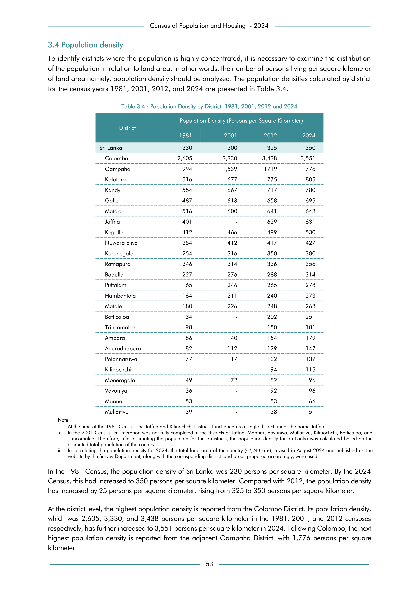

### Source

- [https://www.statistics.gov.lk/Resource/en/Population/CPH_2024/CPH2024_Final_Eng.pdf](https://www.statistics.gov.lk/Resource/en/Population/CPH_2024/CPH2024_Final_Eng.pdf) (Table 3.4)

## 23. [Distribution of Population by Sector, 2012 and 2024](data/final-report-tables/chapter-3/3.5-Distribution-of-Population-by-Sector,-2012-and-2024)
*🔴 Table was detected in PDF, but not parsed into textual data.*

### Original Table


### Source

- [https://www.statistics.gov.lk/Resource/en/Population/CPH_2024/CPH2024_Final_Eng.pdf](https://www.statistics.gov.lk/Resource/en/Population/CPH_2024/CPH2024_Final_Eng.pdf) (Table 3.5)

## 24. [Population Distribution by District and Sector, 2024](data/final-report-tables/chapter-3/3.6-Population-Distribution-by-District-and-Sector,-2024)
*🔴 Table was detected in PDF, but not parsed into textual data.*

### Original Table

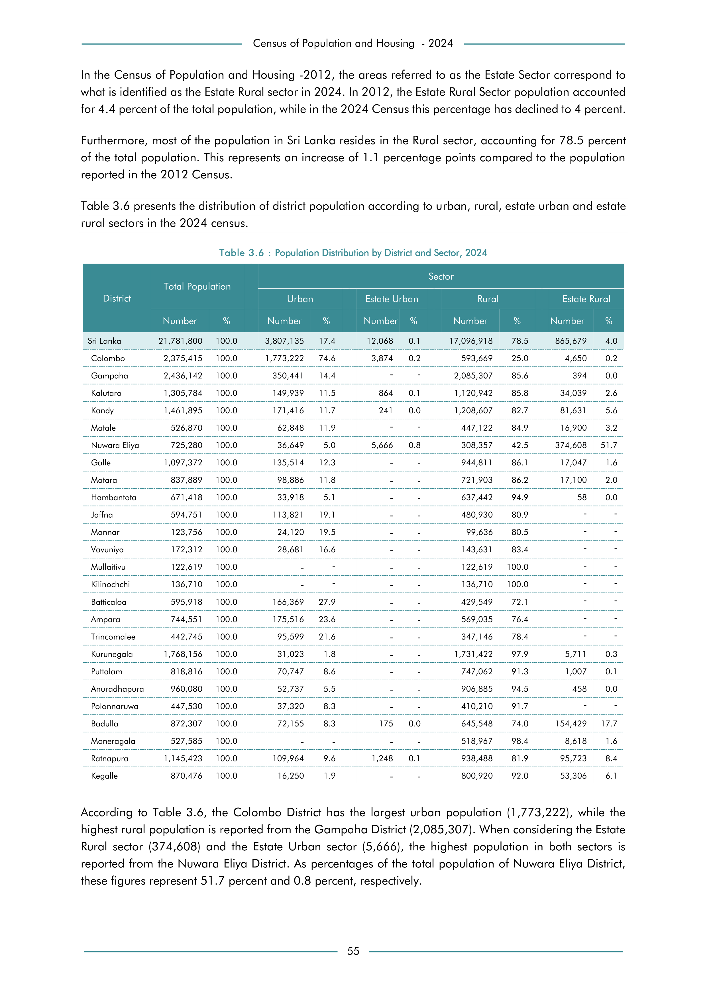

### Source

- [https://www.statistics.gov.lk/Resource/en/Population/CPH_2024/CPH2024_Final_Eng.pdf](https://www.statistics.gov.lk/Resource/en/Population/CPH_2024/CPH2024_Final_Eng.pdf) (Table 3.6)

## 25. [Lifetime Migrants by District of Dirth and District of Usual Residence,](data/final-report-tables/chapter-5/5.1.1-Lifetime-Migrants-by-District-of-Dirth-and-District-of-Usual-Residence,)
*🔴 Table was detected in PDF, but not parsed into textual data.*

### Original Table

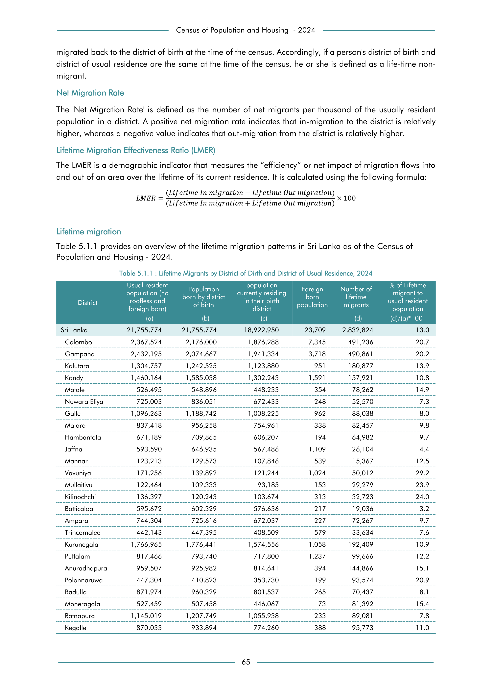

### Source

- [https://www.statistics.gov.lk/Resource/en/Population/CPH_2024/CPH2024_Final_Eng.pdf](https://www.statistics.gov.lk/Resource/en/Population/CPH_2024/CPH2024_Final_Eng.pdf) (Table 5.1.1)

## 26. [In, Out and Net Lifetime Migrants by District, 2024](data/final-report-tables/chapter-5/5.1.2-In,-Out-and-Net-Lifetime-Migrants-by-District,-2024)
*🔴 Table was detected in PDF, but not parsed into textual data.*

### Original Table

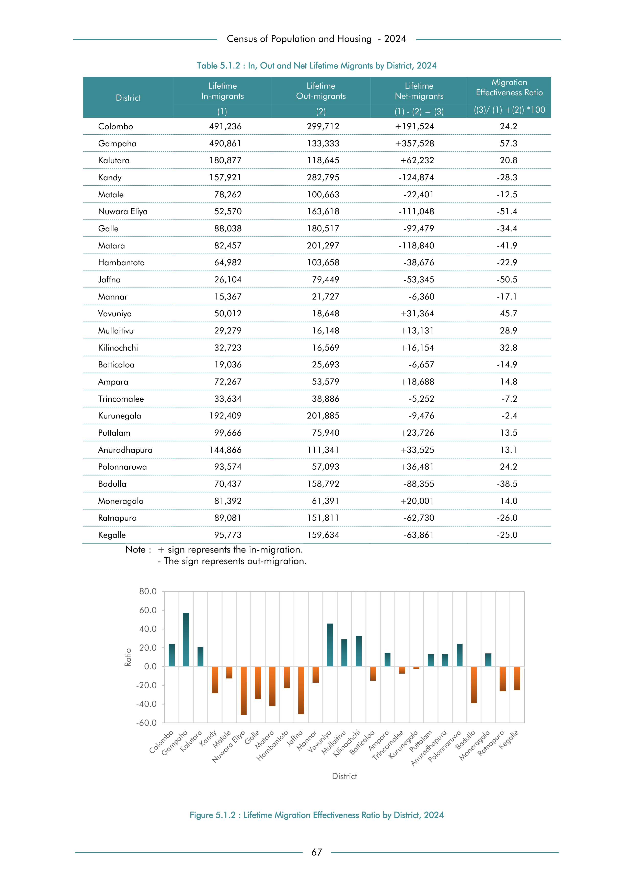

### Source

- [https://www.statistics.gov.lk/Resource/en/Population/CPH_2024/CPH2024_Final_Eng.pdf](https://www.statistics.gov.lk/Resource/en/Population/CPH_2024/CPH2024_Final_Eng.pdf) (Table 5.1.2)

## 27. [Largest Migration Flows of Lifetime Migrants by District of Usual Residence, 2024](data/final-report-tables/chapter-5/5.1.3-Largest-Migration-Flows-of-Lifetime-Migrants-by-District-of-Usual-Residence,-2024)
*🟢 Structured Data was extracted from PDF.*

### Data by District

| Region Id | Region Name | Region Ent Type | Lifetime In Migrants | 1St Largest Stream Migration District Name | 1St Largest Stream Migration District Id | P 1St Largest Stream Migration District | 2Nd Largest Stream Migration District Name | 2Nd Largest Stream Migration District Id | P 2Nd Largest Stream Migration District | 3Rd Largest Stream Migration District Name | 3Rd Largest Stream Migration District Id | P 3Rd Largest Stream Migration District |
| :-- | :-- | :-- | :-- | :-- | :-- | :-- | :-- | :-- | :-- | :-- | :-- | :-- |
| LK-11 | Colombo | district | 491236 | Matara | LK-32 | 0.109 | Galle | LK-31 | 0.102 | Kandy | LK-21 | 0.099 |
| LK-12 | Gampaha | district | 490861 | Colombo | LK-11 | 0.234 | Kurunegala | LK-61 | 0.097 | Kandy | LK-21 | 0.084 |
| LK-13 | Kalutara | district | 180877 | Colombo | LK-11 | 0.336 | Galle | LK-31 | 0.149 | Ratnapura | LK-91 | 0.094 |
| LK-21 | Kandy | district | 157921 | Nuwara Eliya | LK-23 | 0.172 | Matale | LK-22 | 0.115 | Kegalle | LK-92 | 0.094 |
| LK-22 | Matale | district | 78262 | Kandy | LK-21 | 0.334 | Kurunegala | LK-61 | 0.121 | Anuradhapura | LK-71 | 0.103 |
| LK-23 | Nuwara Eliya | district | 52570 | Kandy | LK-21 | 0.361 | Badulla | LK-81 | 0.175 | Kegalle | LK-92 | 0.065 |
| LK-31 | Galle | district | 88038 | Matara | LK-32 | 0.292 | Kalutara | LK-13 | 0.13 | Colombo | LK-11 | 0.122 |
| LK-32 | Matara | district | 82457 | Hambantota | LK-33 | 0.252 | Galle | LK-31 | 0.234 | Colombo | LK-11 | 0.102 |
| LK-33 | Hambantota | district | 64982 | Matara | LK-32 | 0.383 | Ratnapura | LK-91 | 0.12 | Galle | LK-31 | 0.098 |
| LK-41 | Jaffna | district | 26104 | Kilinochchi | LK-45 | 0.22 | Mullaitivu | LK-44 | 0.17 | Vavuniya | LK-43 | 0.086 |
| LK-42 | Mannar | district | 15367 | Puttalam | LK-62 | 0.36 | Jaffna | LK-41 | 0.207 | Vavuniya | LK-43 | 0.084 |
| LK-43 | Vavuniya | district | 50012 | Jaffna | LK-41 | 0.319 | Kilinochchi | LK-45 | 0.091 | Mullaitivu | LK-44 | 0.079 |
| LK-44 | Mullaitivu | district | 29279 | Jaffna | LK-41 | 0.345 | Kilinochchi | LK-45 | 0.098 | Vavuniya | LK-43 | 0.073 |
| LK-45 | Kilinochchi | district | 32723 | Jaffna | LK-41 | 0.492 | Mullaitivu | LK-44 | 0.085 | Kandy | LK-21 | 0.083 |
| LK-51 | Batticaloa | district | 19036 | Ampara | LK-52 | 0.234 | Trincomalee | LK-53 | 0.113 | Badulla | LK-81 | 0.103 |
| LK-52 | Ampara | district | 72267 | Kandy | LK-21 | 0.192 | Badulla | LK-81 | 0.152 | Batticaloa | LK-51 | 0.085 |
| LK-53 | Trincomalee | district | 33634 | Anuradhapura | LK-71 | 0.116 | Kandy | LK-21 | 0.108 | Jaffna | LK-41 | 0.098 |
| LK-61 | Kurunegala | district | 192409 | Kandy | LK-21 | 0.127 | Gampaha | LK-12 | 0.125 | Puttalam | LK-62 | 0.116 |
| LK-62 | Puttalam | district | 99666 | Kurunegala | LK-61 | 0.276 | Gampaha | LK-12 | 0.149 | Mannar | LK-42 | 0.105 |
| LK-71 | Anuradhapura | district | 144866 | Kurunegala | LK-61 | 0.178 | Kandy | LK-21 | 0.143 | Matale | LK-22 | 0.109 |
| LK-72 | Polonnaruwa | district | 93574 | Kandy | LK-21 | 0.188 | Kurunegala | LK-61 | 0.114 | Kegalle | LK-92 | 0.103 |
| LK-81 | Badulla | district | 70437 | Nuwara Eliya | LK-23 | 0.149 | Kandy | LK-21 | 0.147 | Moneragala | LK-82 | 0.146 |
| LK-82 | Monaragala | district | 81392 | Badulla | LK-81 | 0.259 | Hambantota | LK-33 | 0.179 | Ratnapura | LK-91 | 0.112 |
| LK-91 | Ratnapura | district | 89081 | Hambantota | LK-33 | 0.141 | Matara | LK-32 | 0.131 | Colombo | LK-11 | 0.121 |
| LK-92 | Kegalle | district | 95773 | Kandy | LK-21 | 0.178 | Kurunegala | LK-61 | 0.141 | Colombo | LK-11 | 0.109 |
### Example Data Row (JSON)

```json
{
    "region_id": "LK-11",
    "region_name": "Colombo",
    "region_ent_type": "district",
    "values": {
        "lifetime_in_migrants": 491236,
        "1st_largest_stream_migration_district_name": "Matara",
        "1st_largest_stream_migration_district_id": "LK-32",
        "p_1st_largest_stream_migration_district": 0.109,
        "2nd_largest_stream_migration_district_name": "Galle",
        "2nd_largest_stream_migration_district_id": "LK-31",
        "p_2nd_largest_stream_migration_district": 0.102,
        "3rd_largest_stream_migration_district_name": "Kandy",
        "3rd_largest_stream_migration_district_id": "LK-21",
        "p_3rd_largest_stream_migration_district": 0.099
    }
}
```

### Source

- [https://www.statistics.gov.lk/Resource/en/Population/CPH_2024/CPH2024_Final_Eng.pdf](https://www.statistics.gov.lk/Resource/en/Population/CPH_2024/CPH2024_Final_Eng.pdf) (Table 5.1.3)

## 28. [Largest Migration Flows of Lifetime Migrants who have Migrated Out of their District of Birth, 2024](data/final-report-tables/chapter-5/5.1.4-Largest-Migration-Flows-of-Lifetime-Migrants-who-have-Migrated-Out-of-their-District-of-Birth,-2024)
*🟢 Structured Data was extracted from PDF.*

### Data by District

| Region Id | Region Name | Region Ent Type | Lifetime In Migrants | 1St Largest Stream Migration District Name | 1St Largest Stream Migration District Id | P 1St Largest Stream Migration District | 2Nd Largest Stream Migration District Name | 2Nd Largest Stream Migration District Id | P 2Nd Largest Stream Migration District | 3Rd Largest Stream Migration District Name | 3Rd Largest Stream Migration District Id | P 3Rd Largest Stream Migration District |
| :-- | :-- | :-- | :-- | :-- | :-- | :-- | :-- | :-- | :-- | :-- | :-- | :-- |
| LK-11 | Colombo | district | 299712 | Gampaha | LK-12 | 0.383 | Kalutara | LK-13 | 0.203 | Kurunegala | LK-61 | 0.049 |
| LK-12 | Gampaha | district | 133333 | Colombo | LK-11 | 0.257 | Kurunegala | LK-61 | 0.181 | Puttalam | LK-62 | 0.112 |
| LK-13 | Kalutara | district | 118645 | Colombo | LK-11 | 0.359 | Gampaha | LK-12 | 0.159 | Galle | LK-31 | 0.096 |
| LK-21 | Kandy | district | 282795 | Colombo | LK-11 | 0.172 | Gampaha | LK-12 | 0.146 | Matale | LK-22 | 0.093 |
| LK-22 | Matale | district | 100663 | Kandy | LK-21 | 0.181 | Anuradhapura | LK-71 | 0.157 | Gampaha | LK-12 | 0.125 |
| LK-23 | Nuwara Eliya | district | 163618 | Colombo | LK-11 | 0.214 | Gampaha | LK-12 | 0.173 | Kandy | LK-21 | 0.166 |
| LK-31 | Galle | district | 180517 | Colombo | LK-11 | 0.278 | Gampaha | LK-12 | 0.156 | Kalutara | LK-13 | 0.15 |
| LK-32 | Matara | district | 201297 | Colombo | LK-11 | 0.266 | Gampaha | LK-12 | 0.145 | Galle | LK-31 | 0.128 |
| LK-33 | Hambantota | district | 103658 | Matara | LK-32 | 0.201 | Colombo | LK-11 | 0.179 | Moneragala | LK-82 | 0.14 |
| LK-41 | Jaffna | district | 79449 | Colombo | LK-11 | 0.205 | Kilinochchi | LK-45 | 0.203 | Vavuniya | LK-43 | 0.2 |
| LK-42 | Mannar | district | 21727 | Puttalam | LK-62 | 0.48 | Vavuniya | LK-43 | 0.137 | Jaffna | LK-41 | 0.069 |
| LK-43 | Vavuniya | district | 18648 | Anuradhapura | LK-71 | 0.232 | Jaffna | LK-41 | 0.12 | Mullaitivu | LK-44 | 0.115 |
| LK-44 | Mullaitivu | district | 16148 | Jaffna | LK-41 | 0.275 | Vavuniya | LK-43 | 0.244 | Kilinochchi | LK-45 | 0.171 |
| LK-45 | Kilinochchi | district | 16569 | Jaffna | LK-41 | 0.347 | Vavuniya | LK-43 | 0.275 | Mullaitivu | LK-44 | 0.172 |
| LK-51 | Batticaloa | district | 25693 | Ampara | LK-52 | 0.239 | Colombo | LK-11 | 0.148 | Trincomalee | LK-53 | 0.091 |
| LK-52 | Ampara | district | 53579 | Colombo | LK-11 | 0.142 | Gampaha | LK-12 | 0.122 | Polonnaruwa | LK-72 | 0.092 |
| LK-53 | Trincomalee | district | 38886 | Anuradhapura | LK-71 | 0.127 | Gampaha | LK-12 | 0.123 | Colombo | LK-11 | 0.096 |
| LK-61 | Kurunegala | district | 201885 | Gampaha | LK-12 | 0.235 | Puttalam | LK-62 | 0.136 | Anuradhapura | LK-71 | 0.128 |
| LK-62 | Puttalam | district | 75940 | Kurunegala | LK-61 | 0.295 | Gampaha | LK-12 | 0.269 | Colombo | LK-11 | 0.092 |
| LK-71 | Anuradhapura | district | 111341 | Gampaha | LK-12 | 0.192 | Kurunegala | LK-61 | 0.163 | Colombo | LK-11 | 0.12 |
| LK-72 | Polonnaruwa | district | 57093 | Gampaha | LK-12 | 0.153 | Kurunegala | LK-61 | 0.112 | Kandy | LK-21 | 0.112 |
| LK-81 | Badulla | district | 158792 | Colombo | LK-11 | 0.208 | Gampaha | LK-12 | 0.152 | Moneragala | LK-82 | 0.133 |
| LK-82 | Monaragala | district | 61391 | Badulla | LK-81 | 0.168 | Colombo | LK-11 | 0.157 | Gampaha | LK-12 | 0.125 |
| LK-91 | Ratnapura | district | 151811 | Colombo | LK-11 | 0.273 | Gampaha | LK-12 | 0.15 | Kalutara | LK-13 | 0.112 |
| LK-92 | Kegalle | district | 159634 | Gampaha | LK-12 | 0.217 | Colombo | LK-11 | 0.18 | Kurunegala | LK-61 | 0.134 |
### Example Data Row (JSON)

```json
{
    "region_id": "LK-11",
    "region_name": "Colombo",
    "region_ent_type": "district",
    "values": {
        "lifetime_in_migrants": 299712,
        "1st_largest_stream_migration_district_name": "Gampaha",
        "1st_largest_stream_migration_district_id": "LK-12",
        "p_1st_largest_stream_migration_district": 0.383,
        "2nd_largest_stream_migration_district_name": "Kalutara",
        "2nd_largest_stream_migration_district_id": "LK-13",
        "p_2nd_largest_stream_migration_district": 0.203,
        "3rd_largest_stream_migration_district_name": "Kurunegala",
        "3rd_largest_stream_migration_district_id": "LK-61",
        "p_3rd_largest_stream_migration_district": 0.049
    }
}
```

### Source

- [https://www.statistics.gov.lk/Resource/en/Population/CPH_2024/CPH2024_Final_Eng.pdf](https://www.statistics.gov.lk/Resource/en/Population/CPH_2024/CPH2024_Final_Eng.pdf) (Table 5.1.4)

## 29. [In-migration, Out-migration, and Net Migration by District,](data/final-report-tables/chapter-5/5.1.5-In-migration,-Out-migration,-and-Net-Migration-by-District,)
*🔴 Table was detected in PDF, but not parsed into textual data.*

### Original Table

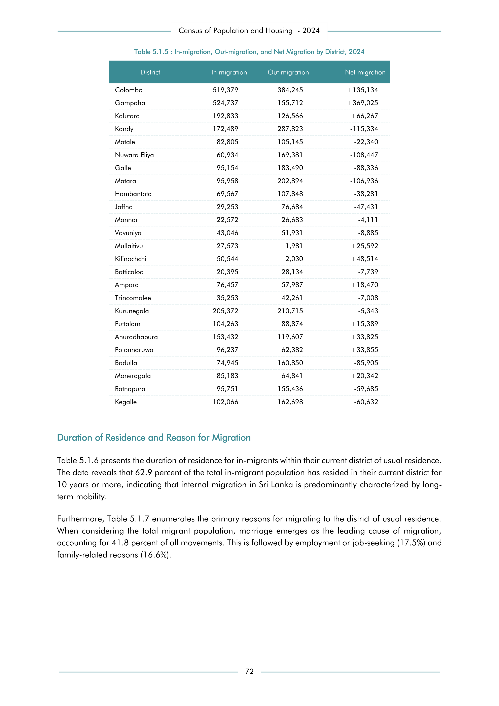

### Source

- [https://www.statistics.gov.lk/Resource/en/Population/CPH_2024/CPH2024_Final_Eng.pdf](https://www.statistics.gov.lk/Resource/en/Population/CPH_2024/CPH2024_Final_Eng.pdf) (Table 5.1.5)

## 30. [In-migrants by District of Usual Residence and Duration of Residence, 2024](data/final-report-tables/chapter-5/5.1.6-In-migrants-by-District-of-Usual-Residence-and-Duration-of-Residence,-2024)
*🟢 Structured Data was extracted from PDF.*

### Data by District

| Region Id | Region Name | Region Ent Type | 00 04 Years | 04 09 Years | 10 Or More Years | Total Value |
| :-- | :-- | :-- | :-- | :-- | :-- | :-- |
| LK-11 | Colombo | district | 149236 | 65105 | 305038 | 519379 |
| LK-12 | Gampaha | district | 139859 | 71540 | 313338 | 524737 |
| LK-13 | Kalutara | district | 47096 | 28994 | 116743 | 192833 |
| LK-21 | Kandy | district | 44174 | 22248 | 106067 | 172489 |
| LK-22 | Matale | district | 17519 | 10310 | 54976 | 82805 |
| LK-23 | Nuwara Eliya | district | 13415 | 7253 | 40266 | 60934 |
| LK-31 | Galle | district | 24208 | 12492 | 58454 | 95154 |
| LK-32 | Matara | district | 24796 | 12589 | 58573 | 95958 |
| LK-33 | Hambantota | district | 15048 | 9723 | 44796 | 69567 |
| LK-41 | Jaffna | district | 10935 | 3688 | 14630 | 29253 |
| LK-42 | Mannar | district | 3292 | 2220 | 17060 | 22572 |
| LK-43 | Vavuniya | district | 9395 | 4099 | 29552 | 43046 |
| LK-44 | Mullaitivu | district | 5132 | 2692 | 19749 | 27573 |
| LK-45 | Kilinochchi | district | 6423 | 2953 | 41168 | 50544 |
| LK-51 | Batticaloa | district | 9791 | 2368 | 8236 | 20395 |
| LK-52 | Ampara | district | 15547 | 6795 | 54115 | 76457 |
| LK-53 | Trincomalee | district | 8426 | 4603 | 22224 | 35253 |
| LK-61 | Kurunegala | district | 53587 | 26516 | 125269 | 205372 |
| LK-62 | Puttalam | district | 24566 | 11316 | 68381 | 104263 |
| LK-71 | Anuradhapura | district | 32249 | 16636 | 104547 | 153432 |
| LK-72 | Polonnaruwa | district | 12868 | 7976 | 75393 | 96237 |
| LK-81 | Badulla | district | 20503 | 9582 | 44860 | 74945 |
| LK-82 | Monaragala | district | 15604 | 9808 | 59771 | 85183 |
| LK-91 | Ratnapura | district | 23481 | 12010 | 60260 | 95751 |
| LK-92 | Kegalle | district | 22537 | 13198 | 66331 | 102066 |
### Example Data Row (JSON)

```json
{
    "region_id": "LK-11",
    "region_name": "Colombo",
    "region_ent_type": "district",
    "values": {
        "00_04_years": 149236,
        "04_09_years": 65105,
        "10_or_more_years": 305038
    },
    "total_value": 519379
}
```

### Source

- [https://www.statistics.gov.lk/Resource/en/Population/CPH_2024/CPH2024_Final_Eng.pdf](https://www.statistics.gov.lk/Resource/en/Population/CPH_2024/CPH2024_Final_Eng.pdf) (Table 5.1.6)

## 31. [Reasons for Migration from District of Previous Residence to District of Usual Residence, 2024](data/final-report-tables/chapter-5/5.1.7-Reasons-for-Migration-from-District-of-Previous-Residence-to-District-of-Usual-Residence,-2024)
*🟢 Structured Data was extracted from PDF.*

### Data by District

| Region Id | Region Name | Region Ent Type | Marriage | Employment Searching For Job | Education | Accompanied A Family Member | Returning For Permanent Residence | Development Projects | Resettled After Displacement | A Disaster A Displaced Happened In The Prior Place | Other |  Rounding Error | Total Value |
| :-- | :-- | :-- | :-- | :-- | :-- | :-- | :-- | :-- | :-- | :-- | :-- | :-- | :-- |
| LK-11 | Colombo | district | 132442 | 196325 | 61287 | 90372 | 28046 | 519 | 519 | 2078 | 7271 | 520 | 519379 |
| LK-12 | Gampaha | district | 183133 | 136956 | 22564 | 99700 | 67166 | 1049 | 1049 | 3148 | 9445 | 527 | 524737 |
| LK-13 | Kalutara | district | 82918 | 21790 | 6556 | 33360 | 37988 | 193 | 964 | 2121 | 6942 | 1 | 192833 |
| LK-21 | Kandy | district | 87107 | 16731 | 18456 | 27081 | 17939 | 172 | 345 | 862 | 3622 | 174 | 172489 |
| LK-22 | Matale | district | 47447 | 7121 | 2567 | 13414 | 9109 | 414 | 414 | 745 | 1490 | 84 | 82805 |
| LK-23 | Nuwara Eliya | district | 36317 | 6215 | 2133 | 10176 | 3412 | 305 | 792 | 853 | 731 | 0 | 60934 |
| LK-31 | Galle | district | 54428 | 9801 | 5519 | 13131 | 8374 | 0 | 190 | 476 | 3140 | 95 | 95154 |
| LK-32 | Matara | district | 52585 | 6621 | 8540 | 11803 | 13530 | 0 | 192 | 576 | 2111 | 0 | 95958 |
| LK-33 | Hambantota | district | 42853 | 5148 | 1600 | 8765 | 6887 | 626 | 209 | 557 | 2991 | -69 | 69567 |
| LK-41 | Jaffna | district | 3481 | 3130 | 5880 | 3774 | 6260 | 0 | 6143 | 176 | 380 | 29 | 29253 |
| LK-42 | Mannar | district | 3454 | 1196 | 316 | 2889 | 2551 | 23 | 10947 | 1129 | 90 | -23 | 22572 |
| LK-43 | Vavuniya | district | 9040 | 4735 | 2583 | 9126 | 2841 | 732 | 7576 | 6156 | 301 | -44 | 43046 |
| LK-44 | Mullaitivu | district | 7445 | 3171 | 634 | 5377 | 2454 | 1930 | 2868 | 3391 | 303 | 0 | 27573 |
| LK-45 | Kilinochchi | district | 6419 | 3184 | 2426 | 5661 | 3083 | 202 | 25626 | 3690 | 202 | 51 | 50544 |
| LK-51 | Batticaloa | district | 6037 | 2713 | 5303 | 3304 | 1509 | 41 | 489 | 775 | 224 | 0 | 20395 |
| LK-52 | Ampara | district | 26836 | 6422 | 6575 | 11010 | 11392 | 10857 | 841 | 1606 | 917 | 1 | 76457 |
| LK-53 | Trincomalee | district | 14066 | 4512 | 2432 | 8390 | 2538 | 494 | 1727 | 740 | 353 | 1 | 35253 |
| LK-61 | Kurunegala | district | 111928 | 20743 | 11912 | 32860 | 19100 | 616 | 616 | 1643 | 5956 | -2 | 205372 |
| LK-62 | Puttalam | district | 42852 | 15535 | 2815 | 18663 | 7298 | 626 | 7924 | 6464 | 2085 | 1 | 104263 |
| LK-71 | Anuradhapura | district | 69505 | 14269 | 9973 | 29152 | 14576 | 7365 | 2148 | 2301 | 3836 | 307 | 153432 |
| LK-72 | Polonnaruwa | district | 40035 | 8469 | 2021 | 17130 | 13666 | 11452 | 674 | 1251 | 1636 | -97 | 96237 |
| LK-81 | Badulla | district | 44068 | 6895 | 6445 | 9368 | 5471 | 525 | 150 | 375 | 1649 | -1 | 74945 |
| LK-82 | Monaragala | district | 44721 | 10563 | 2044 | 13289 | 10903 | 1107 | 170 | 681 | 1704 | 1 | 85183 |
| LK-91 | Ratnapura | district | 53046 | 10341 | 5554 | 14075 | 8905 | 192 | 192 | 479 | 3064 | -97 | 95751 |
| LK-92 | Kegalle | district | 67364 | 7043 | 3879 | 12656 | 7961 | 0 | 102 | 510 | 2552 | -1 | 102066 |
### Example Data Row (JSON)

```json
{
    "region_id": "LK-11",
    "region_name": "Colombo",
    "region_ent_type": "district",
    "values": {
        "marriage": 132442,
        "employment_searching_for_job": 196325,
        "education": 61287,
        "accompanied_a_family_member": 90372,
        "returning_for_permanent_residence": 28046,
        "development_projects": 519,
        "resettled_after_displacement": 519,
        "a_disaster_a_displaced_happened_in_the_prior_place": 2078,
        "other": 7271,
        "_rounding_error": 520
    },
    "total_value": 519379
}
```

### Source

- [https://www.statistics.gov.lk/Resource/en/Population/CPH_2024/CPH2024_Final_Eng.pdf](https://www.statistics.gov.lk/Resource/en/Population/CPH_2024/CPH2024_Final_Eng.pdf) (Table 5.1.7)

## 32. [Distribution of the Usually Resident Population of a District by their Permanent Residence, 2024](data/final-report-tables/chapter-5/5.1.8-Distribution-of-the-Usually-Resident-Population-of-a-District-by-their-Permanent-Residence,-2024)
*🔴 Table was detected in PDF, but not parsed into textual data.*

### Original Table

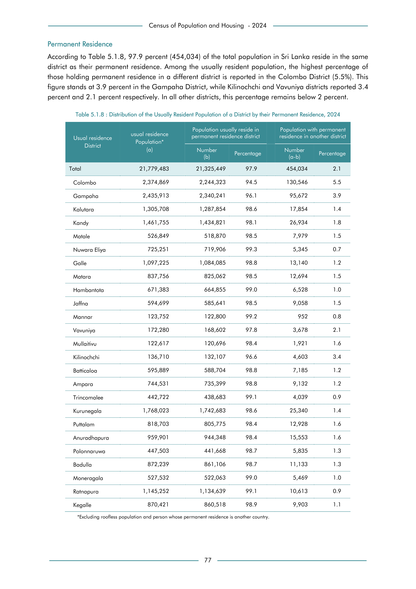

### Source

- [https://www.statistics.gov.lk/Resource/en/Population/CPH_2024/CPH2024_Final_Eng.pdf](https://www.statistics.gov.lk/Resource/en/Population/CPH_2024/CPH2024_Final_Eng.pdf) (Table 5.1.8)

## 33. [Population Temporarily Living Abroad by District and Sex, 2024](data/final-report-tables/chapter-5/5.2.1-Population-Temporarily-Living-Abroad-by-District-and-Sex,-2024)
*🟢 Structured Data was extracted from PDF.*

### Data by District

| Region Id | Region Name | Region Ent Type | Male | Female | Total Value |
| :-- | :-- | :-- | :-- | :-- | :-- |
| LK-11 | Colombo | district | 43531 | 27908 | 71439 |
| LK-12 | Gampaha | district | 54734 | 31343 | 86077 |
| LK-13 | Kalutara | district | 25238 | 16114 | 41352 |
| LK-21 | Kandy | district | 35518 | 21712 | 57230 |
| LK-22 | Matale | district | 10682 | 9382 | 20064 |
| LK-23 | Nuwara Eliya | district | 6158 | 10755 | 16913 |
| LK-31 | Galle | district | 25283 | 15061 | 40344 |
| LK-32 | Matara | district | 14822 | 6498 | 21320 |
| LK-33 | Hambantota | district | 9432 | 4799 | 14231 |
| LK-41 | Jaffna | district | 8091 | 1334 | 9425 |
| LK-42 | Mannar | district | 1228 | 412 | 1640 |
| LK-43 | Vavuniya | district | 2413 | 1208 | 3621 |
| LK-44 | Mullaitivu | district | 961 | 422 | 1383 |
| LK-45 | Kilinochchi | district | 1309 | 316 | 1625 |
| LK-51 | Batticaloa | district | 23723 | 4536 | 28259 |
| LK-52 | Ampara | district | 26917 | 4420 | 31337 |
| LK-53 | Trincomalee | district | 7193 | 4429 | 11622 |
| LK-61 | Kurunegala | district | 34699 | 29417 | 64116 |
| LK-62 | Puttalam | district | 27185 | 20038 | 47223 |
| LK-71 | Anuradhapura | district | 12343 | 13279 | 25622 |
| LK-72 | Polonnaruwa | district | 6433 | 6783 | 13216 |
| LK-81 | Badulla | district | 5749 | 7483 | 13232 |
| LK-82 | Monaragala | district | 2765 | 2063 | 4828 |
| LK-91 | Ratnapura | district | 10145 | 8551 | 18696 |
| LK-92 | Kegalle | district | 16183 | 11251 | 27434 |
### Example Data Row (JSON)

```json
{
    "region_id": "LK-11",
    "region_name": "Colombo",
    "region_ent_type": "district",
    "values": {
        "male": 43531,
        "female": 27908
    },
    "total_value": 71439
}
```

### Source

- [https://www.statistics.gov.lk/Resource/en/Population/CPH_2024/CPH2024_Final_Eng.pdf](https://www.statistics.gov.lk/Resource/en/Population/CPH_2024/CPH2024_Final_Eng.pdf) (Table 5.2.1)

## 34. [Population Temporarily Living Abroad by Sector, Sex and Age Group, 2024](data/final-report-tables/chapter-5/5.2.2-Population-Temporarily-Living-Abroad-by-Sector,-Sex-and-Age-Group,-2024)
*🔴 Table was detected in PDF, but not parsed into textual data.*

### Original Table

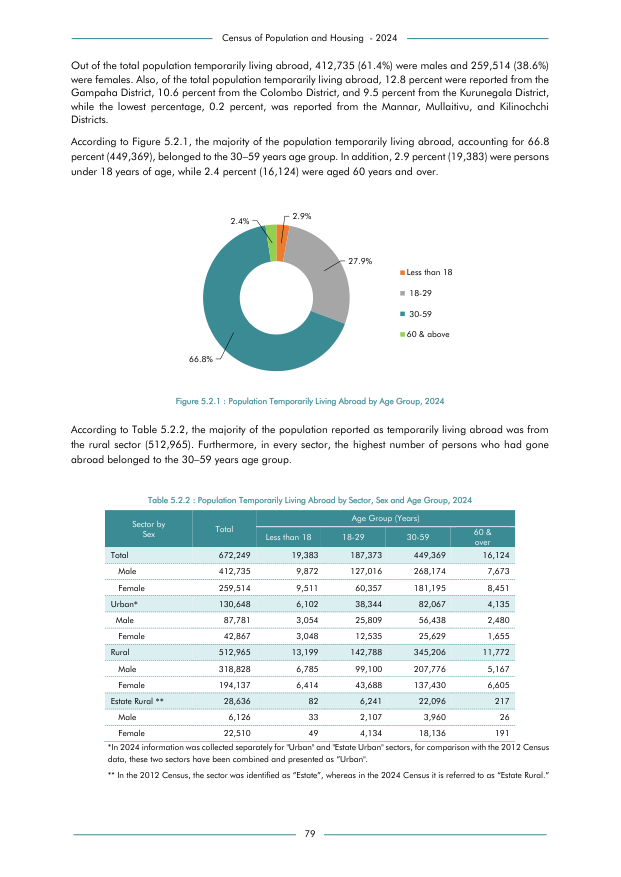

### Source

- [https://www.statistics.gov.lk/Resource/en/Population/CPH_2024/CPH2024_Final_Eng.pdf](https://www.statistics.gov.lk/Resource/en/Population/CPH_2024/CPH2024_Final_Eng.pdf) (Table 5.2.2)

## 35. [Population Temporarily Living Abroad by District and Main Reason for Living in Abroad, 2024](data/final-report-tables/chapter-5/5.2.3-Population-Temporarily-Living-Abroad-by-District-and-Main-Reason-for-Living-in-Abroad,-2024)
*🔴 Table was detected in PDF, but not parsed into textual data.*

### Original Table

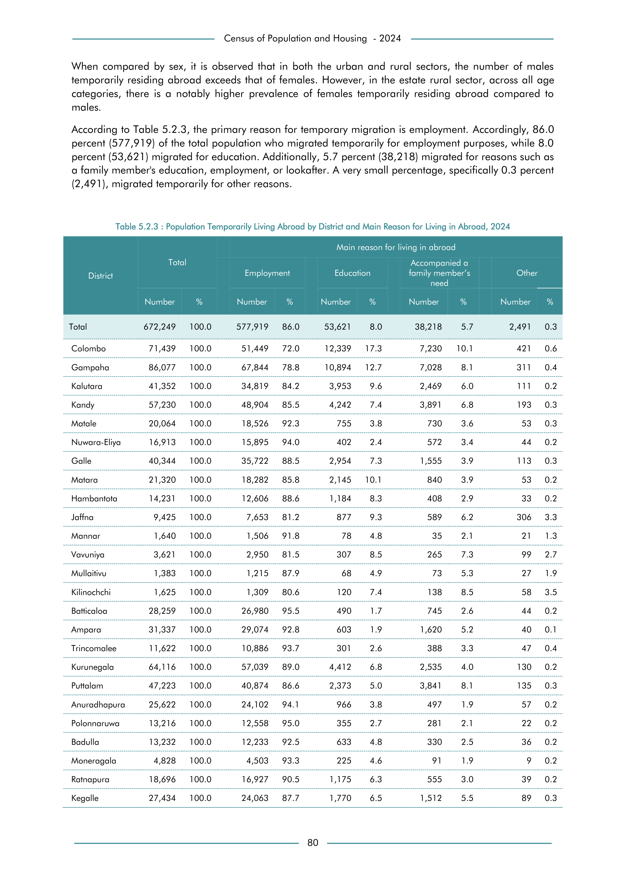

### Source

- [https://www.statistics.gov.lk/Resource/en/Population/CPH_2024/CPH2024_Final_Eng.pdf](https://www.statistics.gov.lk/Resource/en/Population/CPH_2024/CPH2024_Final_Eng.pdf) (Table 5.2.3)

## 36. [Population Temporarily Living Abroad by Main Reason for Living Abroad and Age Group, 2024](data/final-report-tables/chapter-5/5.2.4-Population-Temporarily-Living-Abroad-by-Main-Reason-for-Living-Abroad-and-Age-Group,-2024)
*🟠 Raw Text Data was extracted from PDF, but not parsed into structured data.*

### Raw Data (first 10 rows)

| Col 1 | Col 2 | Col 3 | Col 4 | Col 5 | Col 6 | Col 7 | Col 8 | Col 9 | Col 10 | Col 11 |
| :-- | :-- | :-- | :-- | :-- | :-- | :-- | :-- | :-- | :-- | :-- |
|  |  |  | Employment |  | Education |  | family |  | Other |  |
|  |  |  |  |  |  |  | member’s need |  |  |  |
|  | Number | % | Number | % | Number | % | Number | % | Number | % |
| Total | 672,249 | 100.0 | 577,919 | 86.0 | 53,621 | 8.0 | 38,218 | 5.7 | 2,491 | 0.3 |
| Less than 18 | 19,383 | 100.0 | 0 | 0.0 | 1,486 | 7.7 | 17,862 | 92.1 | 35 | 0.2 |
|  |  |  |  |  |  | 20. |  |  |  |  |
| 18 - 29 | 187,373 | 100.0 | 142,256 | 75.9 | 38,053 |  | 6,348 | 3.4 | 716 | 0.4 |
|  |  |  |  |  |  | 3 |  |  |  |  |
| 30 - 59 | 449,369 | 100.0 | 423,249 | 94.2 | 14,042 | 3.1 | 10,530 | 2.3 | 1,548 | 0.4 |
| 60 & over | 16,124 | 100.0 | 12,414 | 77.0 | 40 | 0.2 | 3,478 | 21.6 | 192 | 1.2 |

### Source

- [https://www.statistics.gov.lk/Resource/en/Population/CPH_2024/CPH2024_Final_Eng.pdf](https://www.statistics.gov.lk/Resource/en/Population/CPH_2024/CPH2024_Final_Eng.pdf) (Table 5.2.4)

## 37. [Population Temporarily Living Abroad, by Main Reason for Living Abroad, Country of Residence and Sex,](data/final-report-tables/chapter-5/5.2.5-Population-Temporarily-Living-Abroad,-by-Main-Reason-for-Living-Abroad,-Country-of-Residence-and-Sex,)
*🟠 Raw Text Data was extracted from PDF, but not parsed into structured data.*

### Raw Data (first 10 rows)

| Col 1 | Col 2 | Col 3 | Col 4 | Col 5 | Col 6 | Col 7 | Col 8 | Col 9 | Col 10 | Col 11 | Col 12 | Col 13 | Col 14 | Col 15 | Col 16 |
| :-- | :-- | :-- | :-- | :-- | :-- | :-- | :-- | :-- | :-- | :-- | :-- | :-- | :-- | :-- | :-- |
|  |  |  |  |  |  |  |  |  |  |  | Accompanied a family |  |  |  |  |
|  |  |  |  |  | Employment |  |  | Education |  |  |  |  |  | Other |  |
| residence |  |  |  |  |  |  |  |  |  |  | member’s need |  |  |  |  |
|  | Total | Male | Female | Total | Male | Female | Total | Male | Female | Total | Male | Female | Total | Male | Female |
|  | 672,249 | 412,735 | 259,514 | 577,919 | 367,680 | 210,239 | 53,621 | 29,735 | 23,886 | 38,218 | 14,422 | 23,796 | 2,491 | 898 | 1,593 |
| Total |  |  |  |  |  |  |  |  |  |  |  |  |  |  |  |
|  | 100.0 | 100.0 | 100.0 | 100.0 | 100.0 | 100.0 | 100.0 | 100.0 | 100.0 | 100.0 | 100.0 | 100.0 | 100.0 | 100.0 | 100.0 |
| Kuwait | 15.2 | 7.1 | 28.3 | 17.4 | 7.8 | 34.3 | 0.6 | 0.5 | 0.8 | 3.7 | 2.8 | 4.2 | 4.5 | 2.0 | 5.8 |
| United Arab Emirates | 14.8 | 16.8 | 11.6 | 16.2 | 18.3 | 12.7 | 2.5 | 2.6 | 2.5 | 11.2 | 10.9 | 11.5 | 6.9 | 7.5 | 6.6 |
| Saudi Arabia | 11.6 | 9.1 | 15.5 | 13.0 | 10.0 | 18.4 | 0.7 | 0.9 | 0.5 | 5.6 | 5.0 | 6.0 | 3.6 | 2.9 | 4.0 |

### Source

- [https://www.statistics.gov.lk/Resource/en/Population/CPH_2024/CPH2024_Final_Eng.pdf](https://www.statistics.gov.lk/Resource/en/Population/CPH_2024/CPH2024_Final_Eng.pdf) (Table 5.2.5)

## 38. [Total Population, Sex ratio and the Percentage of Male and Female, 1946-2024](data/final-report-tables/chapter-6/6.1.1-Total-Population,-Sex-ratio-and-the-Percentage-of-Male-and-Female,-1946-2024)
*🔴 Table was detected in PDF, but not parsed into textual data.*

### Original Table


### Source

- [https://www.statistics.gov.lk/Resource/en/Population/CPH_2024/CPH2024_Final_Eng.pdf](https://www.statistics.gov.lk/Resource/en/Population/CPH_2024/CPH2024_Final_Eng.pdf) (Table 6.1.1)

## 39. [Sex Ratio by Sector, 2024](data/final-report-tables/chapter-6/6.1.2-Sex-Ratio-by-Sector,-2024)
*🔴 Table was detected in PDF, but not parsed into textual data.*

### Original Table


### Source

- [https://www.statistics.gov.lk/Resource/en/Population/CPH_2024/CPH2024_Final_Eng.pdf](https://www.statistics.gov.lk/Resource/en/Population/CPH_2024/CPH2024_Final_Eng.pdf) (Table 6.1.2)

## 40. [Population by Age Groups and Sex, 2012 and](data/final-report-tables/chapter-6/6.1.3-Population-by-Age-Groups-and-Sex,-2012-and)
*🔴 Table was detected in PDF, but not parsed into textual data.*

### Original Table

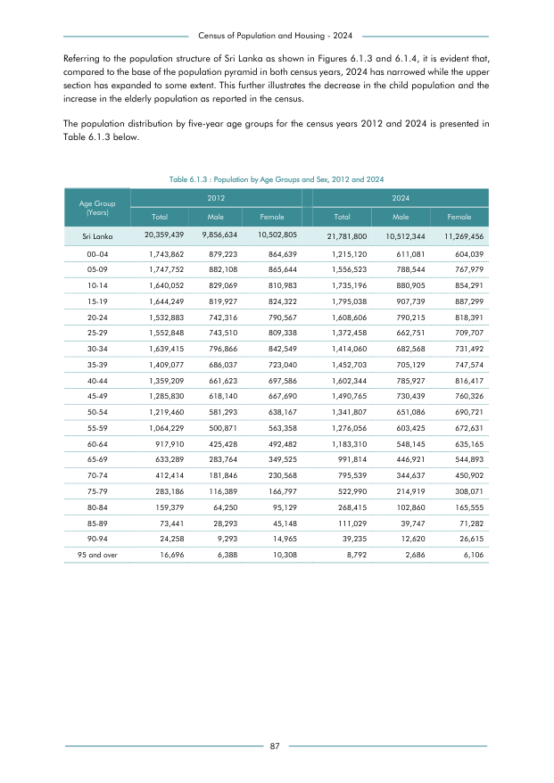

### Source

- [https://www.statistics.gov.lk/Resource/en/Population/CPH_2024/CPH2024_Final_Eng.pdf](https://www.statistics.gov.lk/Resource/en/Population/CPH_2024/CPH2024_Final_Eng.pdf) (Table 6.1.3)

## 41. [Percentage Distribution of Population by Age Group, 1946–2024](data/final-report-tables/chapter-6/6.1.4-Percentage-Distribution-of-Population-by-Age-Group,-1946–2024)
*🔴 Table was detected in PDF, but not parsed into textual data.*

### Original Table

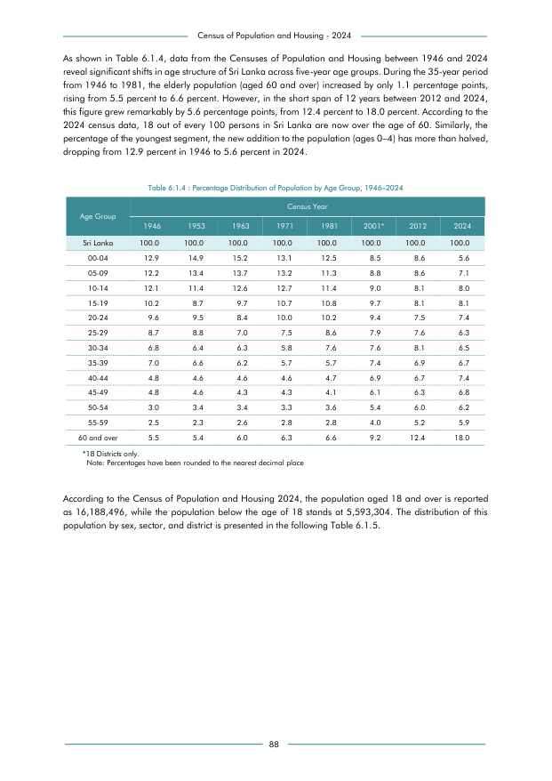

### Source

- [https://www.statistics.gov.lk/Resource/en/Population/CPH_2024/CPH2024_Final_Eng.pdf](https://www.statistics.gov.lk/Resource/en/Population/CPH_2024/CPH2024_Final_Eng.pdf) (Table 6.1.4)

## 42. [Population Over and Below 18 Years of Age by Sector and District, 2024](data/final-report-tables/chapter-6/6.1.5-Population-Over-and-Below-18-Years-of-Age-by-Sector-and-District,-2024)
*🟠 Raw Text Data was extracted from PDF, but not parsed into structured data.*

### Raw Data (first 10 rows)

| Col 1 | Col 2 | Col 3 | Col 4 | Col 5 | Col 6 | Col 7 | Col 8 | Col 9 | Col 10 |
| :-- | :-- | :-- | :-- | :-- | :-- | :-- | :-- | :-- | :-- |
|  |  | Total Population |  |  | Male |  |  | Female |  |
| Sector and district |  |  |  |  |  |  |  |  |  |
|  |  | Age less | Age 18 and |  | Age less | Age 18 and |  | Age less | Age 18 and |
|  | Total |  |  | Total |  |  | Total |  |  |
|  |  | than 18 | over |  | than 18 | over |  | than 18 | over |
| Sri Lanka | 21,781,800 | 5,593,304 | 16,188,496 | 10,512,344 | 2,831,838 | 7,680,506 | 11,269,456 | 2,761,466 | 8,507,990 |
| Sector |  |  |  |  |  |  |  |  |  |
| Urban | 3,807,135 | 897,096 | 2,910,039 | 1,832,193 | 455,035 | 1,377,158 | 1,974,942 | 442,061 | 1,532,881 |
| Rural | 17,096,918 | 4,436,678 | 12,660,240 | 8,253,837 | 2,245,989 | 6,007,848 | 8,843,081 | 2,190,689 | 6,652,392 |
| Rural Estate | 865,679 | 256,135 | 609,544 | 420,330 | 129,059 | 291,271 | 445,349 | 127,076 | 318,273 |

### Source

- [https://www.statistics.gov.lk/Resource/en/Population/CPH_2024/CPH2024_Final_Eng.pdf](https://www.statistics.gov.lk/Resource/en/Population/CPH_2024/CPH2024_Final_Eng.pdf) (Table 6.1.5)

## 43. [Elderly Population and Sex Ratio by Age Groups, 2012 and 2024](data/final-report-tables/chapter-6/6.1.6-Elderly-Population-and-Sex-Ratio-by-Age-Groups,-2012-and-2024)
*🔴 Table was detected in PDF, but not parsed into textual data.*

### Original Table

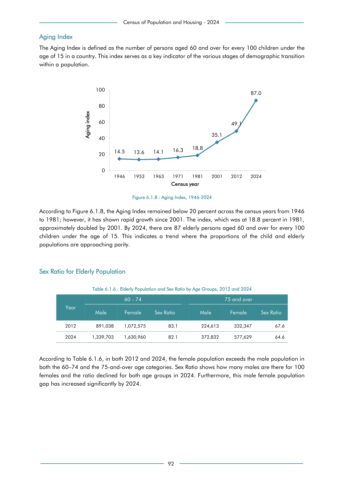

### Source

- [https://www.statistics.gov.lk/Resource/en/Population/CPH_2024/CPH2024_Final_Eng.pdf](https://www.statistics.gov.lk/Resource/en/Population/CPH_2024/CPH2024_Final_Eng.pdf) (Table 6.1.6)

## 44. [Median Age of the Population, 1946-2024](data/final-report-tables/chapter-6/6.1.7-Median-Age-of-the-Population,-1946-2024)
*🔴 Table was detected in PDF, but not parsed into textual data.*

### Original Table


### Source

- [https://www.statistics.gov.lk/Resource/en/Population/CPH_2024/CPH2024_Final_Eng.pdf](https://www.statistics.gov.lk/Resource/en/Population/CPH_2024/CPH2024_Final_Eng.pdf) (Table 6.1.7)

## 45. [Population Distribution by Ethnic Group, 2024](data/final-report-tables/chapter-6/6.1.8-Population-Distribution-by-Ethnic-Group,-2024)
*🔴 Table was detected in PDF, but not parsed into textual data.*

### Original Table

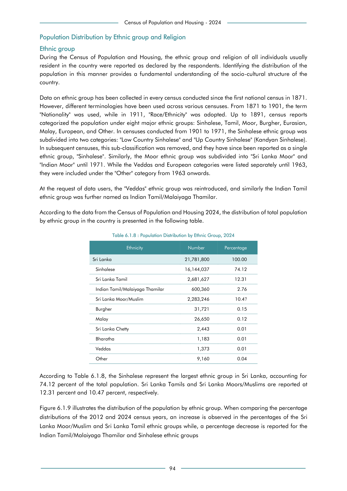

### Source

- [https://www.statistics.gov.lk/Resource/en/Population/CPH_2024/CPH2024_Final_Eng.pdf](https://www.statistics.gov.lk/Resource/en/Population/CPH_2024/CPH2024_Final_Eng.pdf) (Table 6.1.8)

## 46. [Percentage Distribution of the Population by Ethnic Group and Province, 2024](data/final-report-tables/chapter-6/6.1.9-Percentage-Distribution-of-the-Population-by-Ethnic-Group-and-Province,-2024)
*🔴 Table was detected in PDF, but not parsed into textual data.*

### Original Table

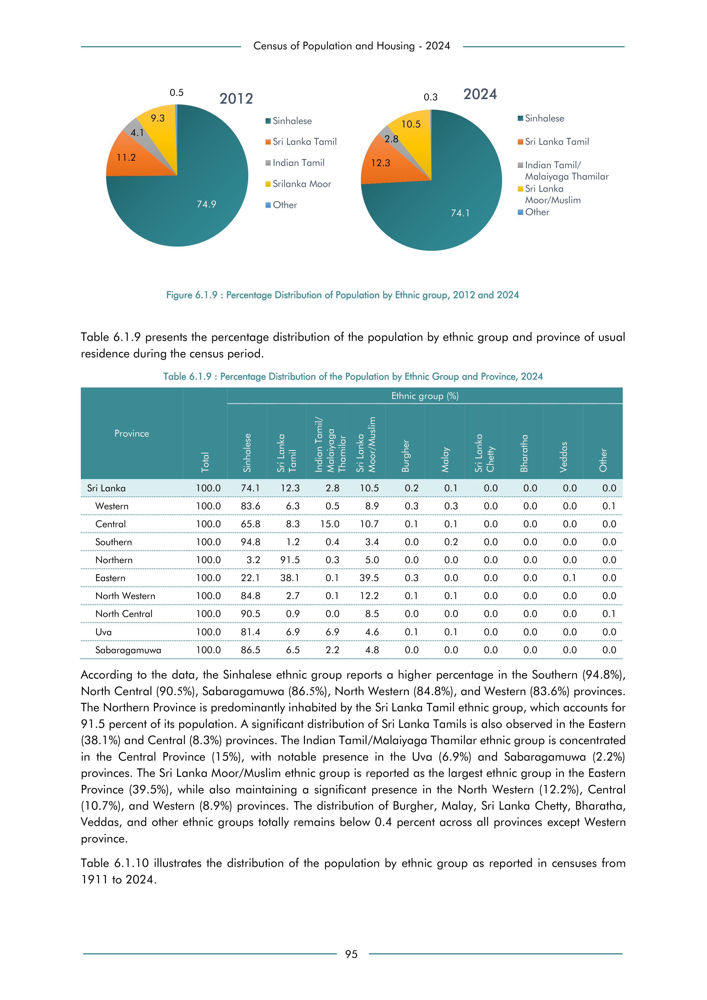

### Source

- [https://www.statistics.gov.lk/Resource/en/Population/CPH_2024/CPH2024_Final_Eng.pdf](https://www.statistics.gov.lk/Resource/en/Population/CPH_2024/CPH2024_Final_Eng.pdf) (Table 6.1.9)

## 47. [Population by Ethnic Group, 1911 - 2024 (in](data/final-report-tables/chapter-6/6.1.10-Population-by-Ethnic-Group,-1911---2024-(in)
*🟠 Raw Text Data was extracted from PDF, but not parsed into structured data.*

### Raw Data (first 10 rows)

| Col 1 | Col 2 | Col 3 | Col 4 | Col 5 | Col 6 | Col 7 | Col 8 | Col 9 | Col 10 | Col 11 | Col 12 |
| :-- | :-- | :-- | :-- | :-- | :-- | :-- | :-- | :-- | :-- | :-- | :-- |
|  |  |  |  | Table 6.1.10 : Population by Ethnic Group, 1911 - 2024 (in Thousands) |  |  |  |  |  |  |  |
|  |  |  |  |  |  | Census Year |  |  |  |  |  |
| Ethnic group |  |  |  |  |  |  |  |  |  |  |  |
|  | 1911 | 1921(4) | 1931(5) | 1946 | 1953 | 1963 | 1971 | 1981 | 2001(3) | 2012 | 2024 |
| Sri Lanka | 4,106.4 | 4,498.6 | 5,306.0 | 6,657.3 | 8,097.9 | 10,582.0 | 12,689.9 | 14,846.8 | 16,929.7 | 20,359.4 | 21,781.8 |
| Low Country Sinhalese | 1,716.9 | 1,927.1 | 2,216.2 | 2,902.5 | 3,469.5 | 4,470.3 | 5,425.8 |  |  |  |  |
|  |  |  |  |  |  |  |  | 10,979.4 (2) | 13,876.2(2) | 15,250.1(2) | 16,144.0(2) |
| Up-country (Kandyan) |  |  |  |  |  |  |  |  |  |  |  |
|  | 998.6 | 1,089.1 | 1,256.8 | 1,718.0 | 2,147.2 | 3,042.6 | 3,705.5 |  |  |  |  |
| Sinhalese |  |  |  |  |  |  |  |  |  |  |  |

### Source

- [https://www.statistics.gov.lk/Resource/en/Population/CPH_2024/CPH2024_Final_Eng.pdf](https://www.statistics.gov.lk/Resource/en/Population/CPH_2024/CPH2024_Final_Eng.pdf) (Table 6.1.10)

## 48. [Distribution of Population by Ethnic Group and District, 2012 and 2024](data/final-report-tables/chapter-6/6.1.11-Distribution-of-Population-by-Ethnic-Group-and-District,-2012-and-2024)
*🟠 Raw Text Data was extracted from PDF, but not parsed into structured data.*

### Raw Data (first 10 rows)

| Col 1 | Col 2 | Col 3 | Col 4 | Col 5 | Col 6 | Col 7 | Col 8 | Col 9 | Col 10 | Col 11 | Col 12 | Col 13 | Col 14 | Col 15 | Col 16 | Col 17 |
| :-- | :-- | :-- | :-- | :-- | :-- | :-- | :-- | :-- | :-- | :-- | :-- | :-- | :-- | :-- | :-- | :-- |
|  |  |  |  |  |  |  | Indian Tamil/ Malaiyaga |  |  |  |  |  |  |  |  |  |
|  | Total |  | Sinhalese |  | Sri Lanka Tamil |  |  |  | Sri Lanka Moor/Muslim |  | Burgher |  | Malay |  | Other |  |
| District |  |  |  |  |  |  | Thamilar |  |  |  |  |  |  |  |  |  |
|  | 2012 | 2024 | 2012 | 2024 | 2012 | 2024 | 2012 | 2024 | 2012 | 2024 | 2012 | 2024 | 2012 | 2024 | 2012 | 2024 |
| Sri Lanka | 20,359,439 | 21,781,800 | 15,250,081   16,144,037 |  | 2,269,266 | 2,681,627 | 839,504 | 600,360 | 1,892,638 | 2,283,246 | 38,293 | 31,721 | 44,130 | 26,650 | 25,527 | 14,159 |
| Colombo | 2,324,349 | 2,375,415 | 1,778,971 | 1,807,945 | 235,090 | 243,856 | 24,289 | 15,427 | 249,609 | 285,346 | 13,306 | 10,643 | 14,444 | 8,249 | 8,640 | 3,949 |
| Gampaha | 2,304,833 | 2,436,142 | 2,086,469 | 2,188,512 | 81,245 | 97,925 | 9,137 | 6,575 | 97,621 | 123,220 | 10,784 | 7,030 | 12,720 | 9,488 | 6,857 | 3,392 |
| Kalutara | 1,221,948 | 1,305,784 | 1,060,107 | 1,119,109 | 23,035 | 41,361 | 23,217 | 7,198 | 113,320 | 136,412 | 1,188 | 840 | 689 | 476 | 392 | 388 |
| Kandy | 1,375,382 | 1,461,895 | 1,023,488 | 1,077,312 | 69,210 | 122,772 | 85,111 | 38,311 | 191,570 | 219,905 | 2,384 | 1,891 | 2,444 | 1,001 | 1,175 | 703 |
| Matale | 484,531 | 526,870 | 391,305 | 424,788 | 24,279 | 42,172 | 23,238 | 7,716 | 44,786 | 51,471 | 386 | 359 | 392 | 283 | 145 | 81 |

### Source

- [https://www.statistics.gov.lk/Resource/en/Population/CPH_2024/CPH2024_Final_Eng.pdf](https://www.statistics.gov.lk/Resource/en/Population/CPH_2024/CPH2024_Final_Eng.pdf) (Table 6.1.11)

## 49. [Percentage Distribution of Population by Ethnic Group and District, 2012 and 2024](data/final-report-tables/chapter-6/6.1.12-Percentage-Distribution-of-Population-by-Ethnic-Group-and-District,-2012-and-2024)
*🟠 Raw Text Data was extracted from PDF, but not parsed into structured data.*

### Raw Data (first 10 rows)

| Col 1 | Col 2 | Col 3 | Col 4 | Col 5 | Col 6 | Col 7 | Col 8 | Col 9 | Col 10 | Col 11 | Col 12 | Col 13 | Col 14 | Col 15 | Col 16 | Col 17 |
| :-- | :-- | :-- | :-- | :-- | :-- | :-- | :-- | :-- | :-- | :-- | :-- | :-- | :-- | :-- | :-- | :-- |
|  | Total |  | Sinhalese |  | Sri Lanka Tamil |  |  |  |  |  | Burgher |  | Malay |  | Other |  |
| District |  |  |  |  |  |  | Malaiyaga Thamilar |  | Moor/Muslim |  |  |  |  |  |  |  |
|  | 2012 | 2024 | 2012 | 2024 | 2012 | 2024 | 2012 | 2024 | 2012 | 2024 | 2012 | 2024 | 2012 | 2024 | 2012 | 2024 |
| Sri Lanka | 100.0 | 100.0 | 100.0 | 100.0 | 100.0 | 100.0 | 100.0 | 100.0 | 100.0 | 100.0 | 100.0 | 100.0 | 100.0 | 100.0 | 100.0 | 100.0 |
| Colombo | 11.4 | 10.9 | 11.7 | 11.2 | 10.4 | 9.1 | 2.9 | 2.6 | 13.2 | 12.5 | 34.7 | 33.6 | 32.7 | 31.0 | 33.8 | 27.9 |
| Gampaha | 11.3 | 11.2 | 13.7 | 13.6 | 3.6 | 3.7 | 1.1 | 1.1 | 5.2 | 5.4 | 28.2 | 22.2 | 28.8 | 35.6 | 26.9 | 24.0 |
| Kalutara | 6.0 | 6.0 | 7.0 | 6.9 | 1.0 | 1.5 | 2.8 | 1.2 | 6.0 | 6.0 | 3.1 | 2.6 | 1.6 | 1.8 | 1.5 | 2.7 |
| Kandy | 6.8 | 6.7 | 6.7 | 6.7 | 3.0 | 4.6 | 10.1 | 6.4 | 10.1 | 9.6 | 6.2 | 6.0 | 5.5 | 3.8 | 4.6 | 5.0 |
| Matale | 2.4 | 2.4 | 2.6 | 2.6 | 1.1 | 1.6 | 2.8 | 1.3 | 2.4 | 2.3 | 1.0 | 1.1 | 0.9 | 1.1 | 0.6 | 0.6 |
| Nuwara Eliya | 3.5 | 3.3 | 1.8 | 1.7 | 1.4 | 2.2 | 45.0 | 60.3 | 0.9 | 0.8 | 2.0 | 3.9 | 1.2 | 0.8 | 1.7 | 0.5 |

### Source

- [https://www.statistics.gov.lk/Resource/en/Population/CPH_2024/CPH2024_Final_Eng.pdf](https://www.statistics.gov.lk/Resource/en/Population/CPH_2024/CPH2024_Final_Eng.pdf) (Table 6.1.12)

## 50. [Population and Percentage Distribution by Sector and Religion, 2024](data/final-report-tables/chapter-6/6.1.13-Population-and-Percentage-Distribution-by-Sector-and-Religion,-2024)
*🔴 Table was detected in PDF, but not parsed into textual data.*

### Original Table

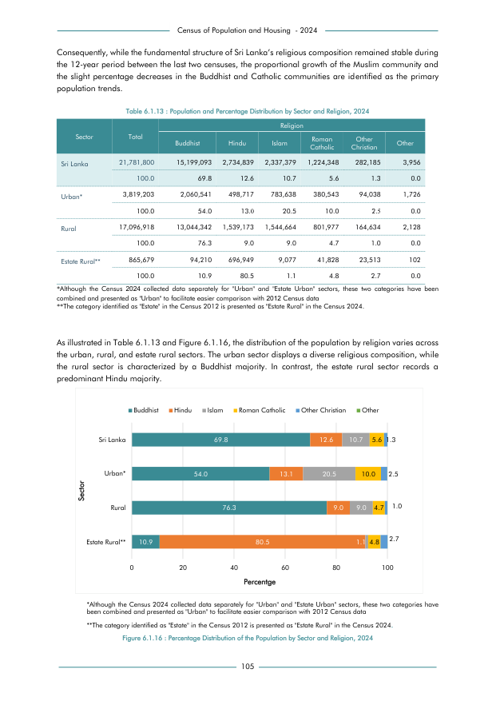

### Source

- [https://www.statistics.gov.lk/Resource/en/Population/CPH_2024/CPH2024_Final_Eng.pdf](https://www.statistics.gov.lk/Resource/en/Population/CPH_2024/CPH2024_Final_Eng.pdf) (Table 6.1.13)

## 51. [Distribution of Population by Religion and District, 2012](data/final-report-tables/chapter-6/6.1.14-Distribution-of-Population-by-Religion-and-District,-2012)
*🔴 Table was detected in PDF, but not parsed into textual data.*

### Original Table

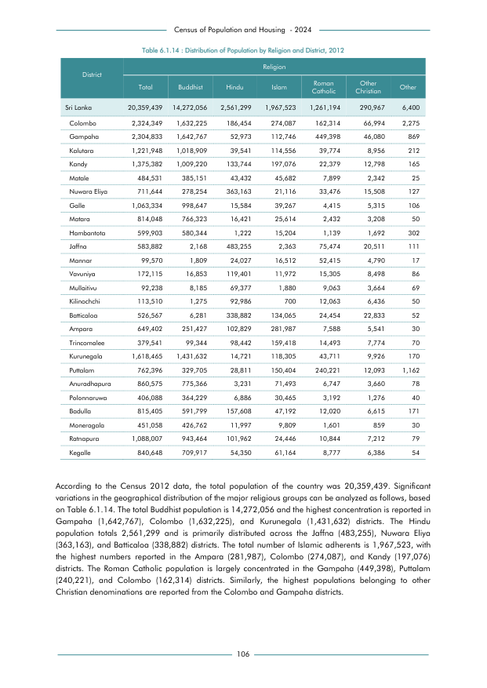

### Source

- [https://www.statistics.gov.lk/Resource/en/Population/CPH_2024/CPH2024_Final_Eng.pdf](https://www.statistics.gov.lk/Resource/en/Population/CPH_2024/CPH2024_Final_Eng.pdf) (Table 6.1.14)

## 52. [Distribution of Population by Religion and District, 2024](data/final-report-tables/chapter-6/6.1.15-Distribution-of-Population-by-Religion-and-District,-2024)
*🔴 Table was detected in PDF, but not parsed into textual data.*

### Original Table

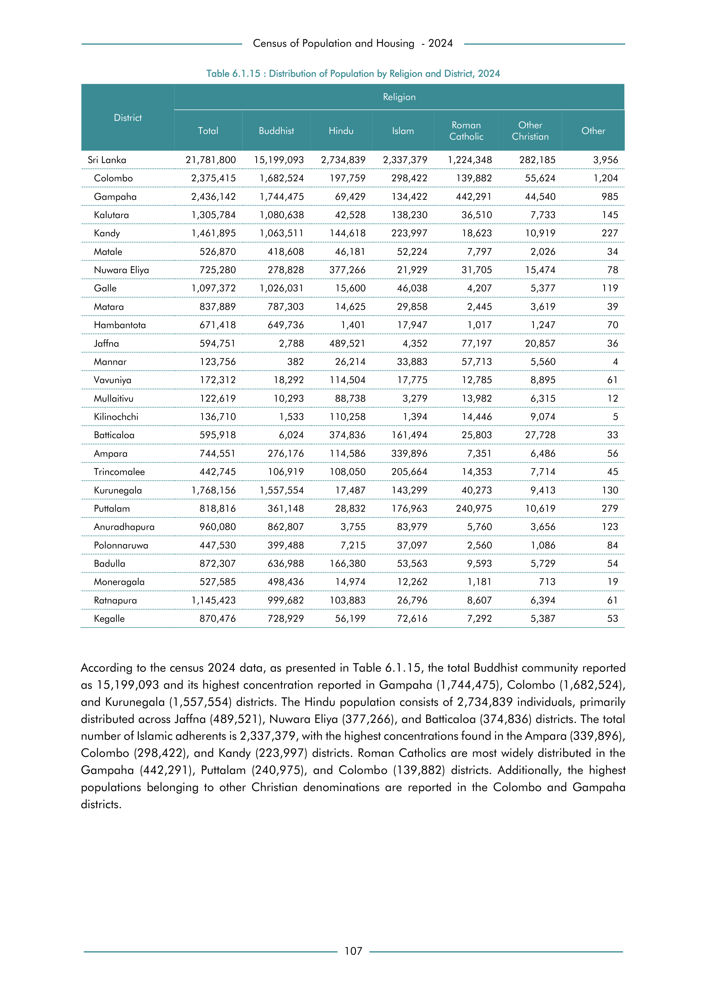

### Source

- [https://www.statistics.gov.lk/Resource/en/Population/CPH_2024/CPH2024_Final_Eng.pdf](https://www.statistics.gov.lk/Resource/en/Population/CPH_2024/CPH2024_Final_Eng.pdf) (Table 6.1.15)

## 53. [Distribution of the Population Aged 5 Years and Over by Level of Physical and Mental Difficulties for EachFunctional Domain, 2024](data/final-report-tables/chapter-6/6.2.1-Distribution-of-the-Population-Aged-5-Years-and-Over-by-Level-of-Physical-and-Mental-Difficulties-for-EachFunctional-Domain,-2024)
*🔴 Table was detected in PDF, but not parsed into textual data.*

### Original Table


### Source

- [https://www.statistics.gov.lk/Resource/en/Population/CPH_2024/CPH2024_Final_Eng.pdf](https://www.statistics.gov.lk/Resource/en/Population/CPH_2024/CPH2024_Final_Eng.pdf) (Table 6.2.1)

## 54. [Distribution of Persons Aged 5 Years and Over with Physical and Mental Difficulties by District and Difficulties,2024](data/final-report-tables/chapter-6/6.2.2-Distribution-of-Persons-Aged-5-Years-and-Over-with-Physical-and-Mental-Difficulties-by-District-and-Difficulties,2024)
*🟢 Structured Data was extracted from PDF.*

### Data by District

| Region Id | Region Name | Region Ent Type | Difficulty In Seeing | Difficulty In Hearing | Difficulty In Walking Or Climbing Steps | Difficulty In Remembering Or Concentrating | Difficulty In Selfcare Such As Washing Or Dressing | Difficulty In Communicating With Others | Difficulty In Communicating With Others Rate Per 1000 Persons | No Disability | Total Value |
| :-- | :-- | :-- | :-- | :-- | :-- | :-- | :-- | :-- | :-- | :-- | :-- |
| LK-11 | Colombo | district | 152592 | 59508 | 150614 | 69279 | 55244 | 40731 | 18 | 1743304 | 2271290 |
| LK-12 | Gampaha | district | 194156 | 76279 | 184771 | 85190 | 65653 | 44483 | 19 | 1668639 | 2319190 |
| LK-13 | Kalutara | district | 100364 | 42776 | 95264 | 45878 | 36097 | 25241 | 20 | 894105 | 1239745 |
| LK-21 | Kandy | district | 133777 | 54309 | 127934 | 57599 | 41366 | 29762 | 22 | 937730 | 1382499 |
| LK-22 | Matale | district | 52463 | 20217 | 48307 | 22094 | 15106 | 10414 | 21 | 328288 | 496910 |
| LK-23 | Nuwara Eliya | district | 72180 | 23606 | 63822 | 26066 | 22496 | 13826 | 20 | 458415 | 680431 |
| LK-31 | Galle | district | 100166 | 40849 | 85974 | 43463 | 30609 | 23279 | 22 | 715093 | 1039455 |
| LK-32 | Matara | district | 91333 | 33262 | 73867 | 35908 | 22831 | 17363 | 22 | 518226 | 792812 |
| LK-33 | Hambantota | district | 76574 | 26427 | 60341 | 28688 | 20944 | 15295 | 24 | 403326 | 631619 |
| LK-41 | Jaffna | district | 44851 | 19593 | 36754 | 20583 | 25622 | 12190 | 22 | 399613 | 559228 |
| LK-42 | Mannar | district | 9614 | 3013 | 6961 | 3328 | 5724 | 2021 | 18 | 83956 | 114635 |
| LK-43 | Vavuniya | district | 16783 | 3986 | 9737 | 4443 | 6028 | 2344 | 15 | 117709 | 161045 |
| LK-44 | Mullaitivu | district | 11787 | 3507 | 7446 | 4248 | 4956 | 2377 | 21 | 80069 | 114411 |
| LK-45 | Kilinochchi | district | 11858 | 4091 | 8284 | 4656 | 5877 | 2399 | 19 | 90352 | 127536 |
| LK-51 | Batticaloa | district | 41619 | 12329 | 31128 | 13734 | 20975 | 10162 | 18 | 420068 | 550033 |
| LK-52 | Ampara | district | 60812 | 18195 | 45225 | 20544 | 28406 | 12323 | 18 | 502649 | 688172 |
| LK-53 | Trincomalee | district | 29589 | 10254 | 23966 | 11056 | 16188 | 7307 | 18 | 309617 | 407995 |
| LK-61 | Kurunegala | district | 173734 | 68769 | 163414 | 74169 | 54425 | 36048 | 22 | 1101417 | 1671998 |
| LK-62 | Puttalam | district | 76334 | 25358 | 65914 | 30257 | 27408 | 16798 | 22 | 524629 | 766720 |
| LK-71 | Anuradhapura | district | 91904 | 33199 | 85225 | 33912 | 25233 | 17011 | 19 | 616983 | 903486 |
| LK-72 | Polonnaruwa | district | 44743 | 15322 | 35778 | 15644 | 11374 | 8334 | 20 | 289196 | 420411 |
| LK-81 | Badulla | district | 84691 | 32279 | 76673 | 33607 | 24377 | 17674 | 21 | 552847 | 822169 |
| LK-82 | Monaragala | district | 54543 | 19705 | 41463 | 19533 | 14693 | 10308 | 21 | 334108 | 494374 |
| LK-91 | Ratnapura | district | 121942 | 46515 | 97264 | 45069 | 32362 | 24013 | 22 | 717412 | 1084599 |
| LK-92 | Kegalle | district | 91546 | 39423 | 77938 | 38664 | 25991 | 19110 | 23 | 533222 | 825917 |
### Example Data Row (JSON)

```json
{
    "region_id": "LK-11",
    "region_name": "Colombo",
    "region_ent_type": "district",
    "values": {
        "difficulty_in_seeing": 152592,
        "difficulty_in_hearing": 59508,
        "difficulty_in_walking_or_climbing_steps": 150614,
        "difficulty_in_remembering_or_concentrating": 69279,
        "difficulty_in_selfcare_such_as_washing_or_dressing": 55244,
        "difficulty_in_communicating_with_others": 40731,
        "difficulty_in_communicating_with_others_rate_per_1000_persons": 18,
        "no_disability": 1743304
    },
    "total_value": 2271290
}
```

### Source

- [https://www.statistics.gov.lk/Resource/en/Population/CPH_2024/CPH2024_Final_Eng.pdf](https://www.statistics.gov.lk/Resource/en/Population/CPH_2024/CPH2024_Final_Eng.pdf) (Table 6.2.2)

## 55. [Distribution of Persons Aged 5 Years and Over with Physical and Mental Difficulties by Age Group andDifficulties, 2024](data/final-report-tables/chapter-6/6.2.3-Distribution-of-Persons-Aged-5-Years-and-Over-with-Physical-and-Mental-Difficulties-by-Age-Group-andDifficulties,-2024)
*🟠 Raw Text Data was extracted from PDF, but not parsed into structured data.*

### Raw Data (first 10 rows)

| Col 1 | Col 2 | Col 3 | Col 4 | Col 5 | Col 6 | Col 7 | Col 8 | Col 9 | Col 10 | Col 11 | Col 12 | Col 13 | Col 14 | Col 15 | Col 16 |
| :-- | :-- | :-- | :-- | :-- | :-- | :-- | :-- | :-- | :-- | :-- | :-- | :-- | :-- | :-- | :-- |
|  |  |  |  |  |  |  |  |  | Functional Domain |  |  |  |  |  |  |
|  |  | Persons with at least |  |  |  |  |  |  |  |  |  |  |  |  |  |
|  |  | one Physical or Mental |  |  |  |  |  |  |  | Difficulty in |  |  | Difficulty in Selfcare, |  | Difficulty in |
|  | Number of |  |  |  |  |  |  |  | Difficulty in Walking or |  |  |  |  |  |  |
|  |  | Difficulty |  | Difficulty in Seeing |  |  | Difficulty in Hearing |  |  |  | Remembering or |  | such as washing or |  | Communicating with |
| Age Group | Persons Aged |  |  |  |  |  |  | climbing steps |  |  |  |  |  |  |  |
|  |  |  |  |  |  |  |  |  |  |  | concentrating | dressing |  | others |  |
| (Years) | 5 Years and |  |  |  |  |  |  |  |  |  |  |  |  |  |  |
|  | Over |  |  |  |  |  |  |  |  |  |  |  |  |  |  |
|  |  |  | Rate |  | Rate |  | Rate |  | Rate |  | Rate |  | Rate |  | Rate |

### Source

- [https://www.statistics.gov.lk/Resource/en/Population/CPH_2024/CPH2024_Final_Eng.pdf](https://www.statistics.gov.lk/Resource/en/Population/CPH_2024/CPH2024_Final_Eng.pdf) (Table 6.2.3)

## 56. [Distribution of Persons Aged 5 Years and Over with Disabilities by Sex and Domain of Disability, 2024](data/final-report-tables/chapter-6/6.2.4-Distribution-of-Persons-Aged-5-Years-and-Over-with-Disabilities-by-Sex-and-Domain-of-Disability,-2024)
*🔴 Table was detected in PDF, but not parsed into textual data.*

### Original Table


### Source

- [https://www.statistics.gov.lk/Resource/en/Population/CPH_2024/CPH2024_Final_Eng.pdf](https://www.statistics.gov.lk/Resource/en/Population/CPH_2024/CPH2024_Final_Eng.pdf) (Table 6.2.4)

## 57. [Distribution of Persons Aged 5 Years and Over with Disabilities by Sector and Domain of Disability, 2024](data/final-report-tables/chapter-6/6.2.5-Distribution-of-Persons-Aged-5-Years-and-Over-with-Disabilities-by-Sector-and-Domain-of-Disability,-2024)
*🔴 Table was detected in PDF, but not parsed into textual data.*

### Original Table

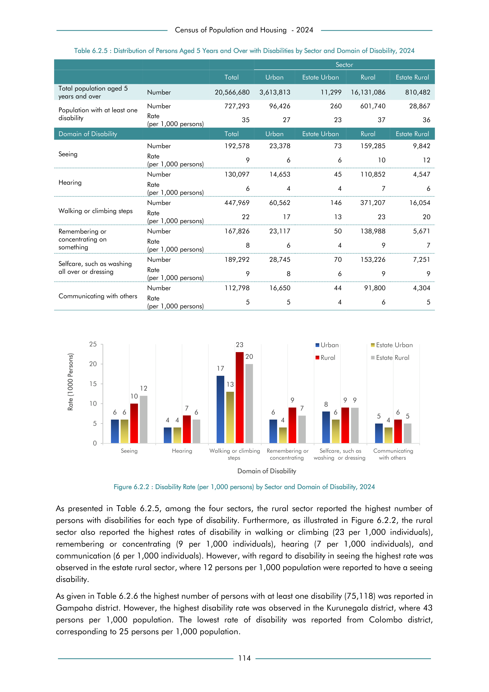

### Source

- [https://www.statistics.gov.lk/Resource/en/Population/CPH_2024/CPH2024_Final_Eng.pdf](https://www.statistics.gov.lk/Resource/en/Population/CPH_2024/CPH2024_Final_Eng.pdf) (Table 6.2.5)

## 58. [Distribution of Persons Aged 5 Years and Over with Disabilities by District and Domain of Disability, 2024](data/final-report-tables/chapter-6/6.2.6-Distribution-of-Persons-Aged-5-Years-and-Over-with-Disabilities-by-District-and-Domain-of-Disability,-2024)
*🟠 Raw Text Data was extracted from PDF, but not parsed into structured data.*

### Raw Data (first 10 rows)

| Col 1 | Col 2 | Col 3 | Col 4 | Col 5 | Col 6 | Col 7 | Col 8 | Col 9 | Col 10 | Col 11 | Col 12 | Col 13 | Col 14 | Col 15 |
| :-- | :-- | :-- | :-- | :-- | :-- | :-- | :-- | :-- | :-- | :-- | :-- | :-- | :-- | :-- |
|  | Persons with at least |  |  |  |  |  |  |  |  |  |  |  |  |  |
|  | one Disability |  |  |  |  |  |  | Walking or climbing |  | Remembering or |  | Selfcare, such as |  | Communicating with |
| Number of |  |  | Seeing |  | Hearing |  |  |  |  |  |  |  |  |  |
|  |  |  |  |  |  |  | steps |  |  | concentrating |  | washing or dressing | others |  |
| Persons Aged 5 
District |  |  |  |  |  |  |  |  |  |  |  |  |  |  |
| Years and Over |  |  |  |  |  |  |  |  |  |  |  |  |  |  |
|  |  | Rate |  | Rate |  | Rate |  | Rate |  | Rate |  | Rate |  | Rate |
|  | Number | (per 1,000 | Number | (per 1,000 | Number | (per 1,000 | Number | (per 1,000 | Number | (per 1,000 | Number | (per 1,000 | Number | (per 1,000 |
|  |  | persons) |  | persons) |  | persons) |  | persons) |  | persons) |  | persons) |  | persons) |
| Sri Lanka 
20,566,680 | 727,293 | 35 | 192,578 | 9 | 130,097 | 6 | 447,969 | 22 | 167,826 | 8 | 189,292 | 9 | 112,798 | 5 |

### Source

- [https://www.statistics.gov.lk/Resource/en/Population/CPH_2024/CPH2024_Final_Eng.pdf](https://www.statistics.gov.lk/Resource/en/Population/CPH_2024/CPH2024_Final_Eng.pdf) (Table 6.2.6)

## 59. [Distribution of Persons Aged 5 Years and Over with Disabilities by Age Group and Domain of Disability,](data/final-report-tables/chapter-6/6.2.7-Distribution-of-Persons-Aged-5-Years-and-Over-with-Disabilities-by-Age-Group-and-Domain-of-Disability,)
*🔴 Table was detected in PDF, but not parsed into textual data.*

### Original Table


### Source

- [https://www.statistics.gov.lk/Resource/en/Population/CPH_2024/CPH2024_Final_Eng.pdf](https://www.statistics.gov.lk/Resource/en/Population/CPH_2024/CPH2024_Final_Eng.pdf) (Table 6.2.7)

## 60. [Distribution of Persons with a Single Disability and with Multiple Disabilities by Age Group, 2024](data/final-report-tables/chapter-6/6.2.8-Distribution-of-Persons-with-a-Single-Disability-and-with-Multiple-Disabilities-by-Age-Group,-2024)
*🔴 Table was detected in PDF, but not parsed into textual data.*

### Original Table


### Source

- [https://www.statistics.gov.lk/Resource/en/Population/CPH_2024/CPH2024_Final_Eng.pdf](https://www.statistics.gov.lk/Resource/en/Population/CPH_2024/CPH2024_Final_Eng.pdf) (Table 6.2.8)

## 61. [Distribution of Persons Aged 5 Years and Over with Disabilities by Marital Status and Sex, 2024](data/final-report-tables/chapter-6/6.2.9-Distribution-of-Persons-Aged-5-Years-and-Over-with-Disabilities-by-Marital-Status-and-Sex,-2024)
*🔴 Table was detected in PDF, but not parsed into textual data.*

### Original Table


### Source

- [https://www.statistics.gov.lk/Resource/en/Population/CPH_2024/CPH2024_Final_Eng.pdf](https://www.statistics.gov.lk/Resource/en/Population/CPH_2024/CPH2024_Final_Eng.pdf) (Table 6.2.9)

## 62. [Distribution of Persons Aged 5 Years and Over with Disabilities by Highest Educational Qualification and Sex,2024](data/final-report-tables/chapter-6/6.2.10-Distribution-of-Persons-Aged-5-Years-and-Over-with-Disabilities-by-Highest-Educational-Qualification-and-Sex,2024)
*🔴 Table was detected in PDF, but not parsed into textual data.*

### Original Table


### Source

- [https://www.statistics.gov.lk/Resource/en/Population/CPH_2024/CPH2024_Final_Eng.pdf](https://www.statistics.gov.lk/Resource/en/Population/CPH_2024/CPH2024_Final_Eng.pdf) (Table 6.2.10)

## 63. [Distribution of Persons Aged 5 Years and Over with Disabilities by Marital Status and Domain of Disability,2024](data/final-report-tables/chapter-6/6.2.11-Distribution-of-Persons-Aged-5-Years-and-Over-with-Disabilities-by-Marital-Status-and-Domain-of-Disability,2024)
*🔴 Table was detected in PDF, but not parsed into textual data.*

### Original Table


### Source

- [https://www.statistics.gov.lk/Resource/en/Population/CPH_2024/CPH2024_Final_Eng.pdf](https://www.statistics.gov.lk/Resource/en/Population/CPH_2024/CPH2024_Final_Eng.pdf) (Table 6.2.11)

## 64. [Distribution of Persons Aged 5 Years and Over with Disabilities by Highest Educational Qualification andDomain of Disability, 2024](data/final-report-tables/chapter-6/6.2.12-Distribution-of-Persons-Aged-5-Years-and-Over-with-Disabilities-by-Highest-Educational-Qualification-andDomain-of-Disability,-2024)
*🔴 Table was detected in PDF, but not parsed into textual data.*

### Original Table

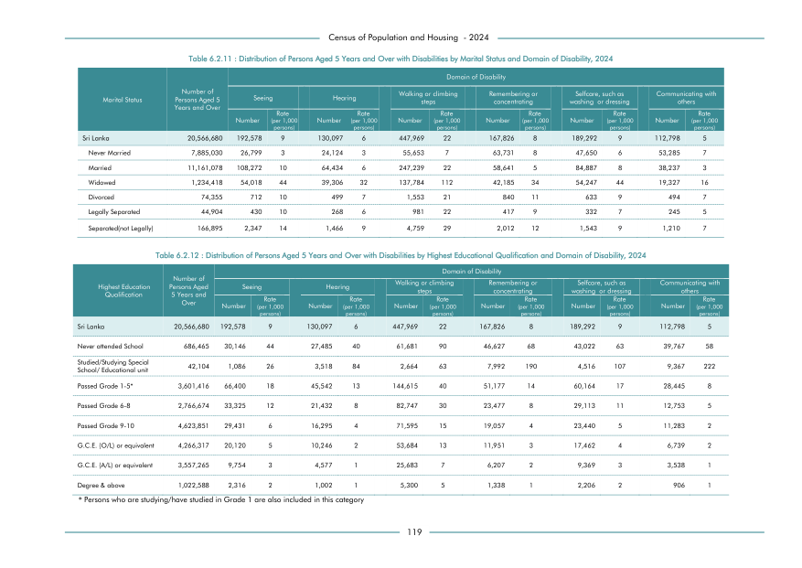

### Source

- [https://www.statistics.gov.lk/Resource/en/Population/CPH_2024/CPH2024_Final_Eng.pdf](https://www.statistics.gov.lk/Resource/en/Population/CPH_2024/CPH2024_Final_Eng.pdf) (Table 6.2.12)

## 65. [Economic Activities of Persons Aged 15 Years and Over with Disabilities, 2024](data/final-report-tables/chapter-6/6.2.13-Economic-Activities-of-Persons-Aged-15-Years-and-Over-with-Disabilities,-2024)
*🔴 Table was detected in PDF, but not parsed into textual data.*

### Original Table

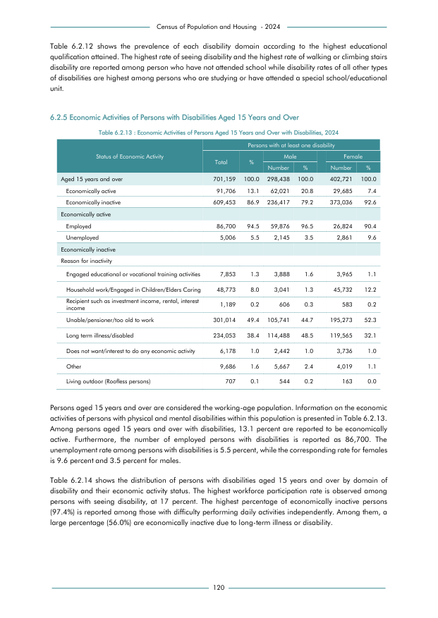

### Source

- [https://www.statistics.gov.lk/Resource/en/Population/CPH_2024/CPH2024_Final_Eng.pdf](https://www.statistics.gov.lk/Resource/en/Population/CPH_2024/CPH2024_Final_Eng.pdf) (Table 6.2.13)

## 66. [Economic Activity of Persons Aged 15 Years and Over with Disabilities by Domain of Disability, 2024](data/final-report-tables/chapter-6/6.2.14-Economic-Activity-of-Persons-Aged-15-Years-and-Over-with-Disabilities-by-Domain-of-Disability,-2024)
*🟠 Raw Text Data was extracted from PDF, but not parsed into structured data.*

### Raw Data (first 10 rows)

| Col 1 | Col 2 | Col 3 | Col 4 | Col 5 | Col 6 | Col 7 | Col 8 | Col 9 | Col 10 | Col 11 | Col 12 | Col 13 |
| :-- | :-- | :-- | :-- | :-- | :-- | :-- | :-- | :-- | :-- | :-- | :-- | :-- |
|  |  |  |  |  | climbing steps |  | concentrating |  | dressing |  |  |  |
|  | Number | % | Number | % | Number | % | Number | % | Number | % | Number | % |
| Persons with disabilities aged 15 and over | 186,920 | 100.0 | 126,354 | 100.0 | 440,020 | 100.0 | 157,789 | 100.0 | 177,101 | 100.0 | 101,345 | 100.0 |
| Economically active | 31,863 | 17.0 | 18,240 | 14.4 | 37,321 | 8.5 | 6,518 | 4.1 | 4,624 | 2.6 | 9,828 | 9.7 |
| Economically inactive | 155,057 | 83.0 | 108,114 | 85.6 | 402,699 | 91.5 | 151,271 | 95.9 | 172,477 | 97.4 | 91,517 | 90.3 |
| Economically active | 31,863 | 100.0 | 18,240 | 100.0 | 37,321 | 100.0 | 6,518 | 100.0 | 4,624 | 100.0 | 9,828 | 100.0 |
| Employed | 30,041 | 94.3 | 17,459 | 95.7 | 35,127 | 94.1 | 6,004 | 92.1 | 4,011 | 86.7 | 9,206 | 93.7 |
| Unemployed | 1,822 | 5.7 | 781 | 4.3 | 2,194 | 5.9 | 514 | 7.9 | 613 | 13.3 | 622 | 6.3 |
| Economically inactive | 155,057 | 100.0 | 108,114 | 100.0 | 402,699 | 100.0 | 151,271 | 100.0 | 172,477 | 100.0 | 91,517 | 100.0 |
| Engaged educational or vocational training |  |  |  |  |  |  |  |  |  |  |  |  |

### Source

- [https://www.statistics.gov.lk/Resource/en/Population/CPH_2024/CPH2024_Final_Eng.pdf](https://www.statistics.gov.lk/Resource/en/Population/CPH_2024/CPH2024_Final_Eng.pdf) (Table 6.2.14)

## 67. [Number of Persons Reporting and Not Reporting Diseases, 2024](data/final-report-tables/chapter-6/6.3.1-Number-of-Persons-Reporting-and-Not-Reporting-Diseases,-2024)
*🟠 Raw Text Data was extracted from PDF, but not parsed into structured data.*

### Raw Data (first 10 rows)

| Col 1 | Col 2 |
| :-- | :-- |
| 6.3 Non-Communicable Diseases |  |
| I
ntroduction |  |
| According to the World Health Organization (WHO), Non-Communicable Diseases (NCDs), also referred |  |
| to as chronic illnesses, are diseases of long duration that are not transmitted directly from one person to |  |
| another.  These  conditions  arise | from  a  combination  of  genetic,  physiological,  environmental,  and |
| behavioral  factors1.  Considering  the  rapid  increase  in  NCDs,  information  on  several  prevalent  non- |  |
| communicable diseases was collected from all usual residents in Sri Lanka during the Census of Population |  |
| and Housing - 2024 for the first time in census history. Accordingly, this chapter presents prevalence of |  |
| some commonly reported NCDs such as diabetes, high cholesterol, high blood pressure, heart disease, |  |
| kidney disease, thalassemia, cancer, stroke, asthma, and epilepsy. |  |

### Source

- [https://www.statistics.gov.lk/Resource/en/Population/CPH_2024/CPH2024_Final_Eng.pdf](https://www.statistics.gov.lk/Resource/en/Population/CPH_2024/CPH2024_Final_Eng.pdf) (Table 6.3.1)

## 68. [Prevalence Rates of the Population with at Least One Non-Communicable Disease by Age Group and Sex,](data/final-report-tables/chapter-6/6.3.2-Prevalence-Rates-of-the-Population-with-at-Least-One-Non-Communicable-Disease-by-Age-Group-and-Sex,)
*🔴 Table was detected in PDF, but not parsed into textual data.*

### Original Table

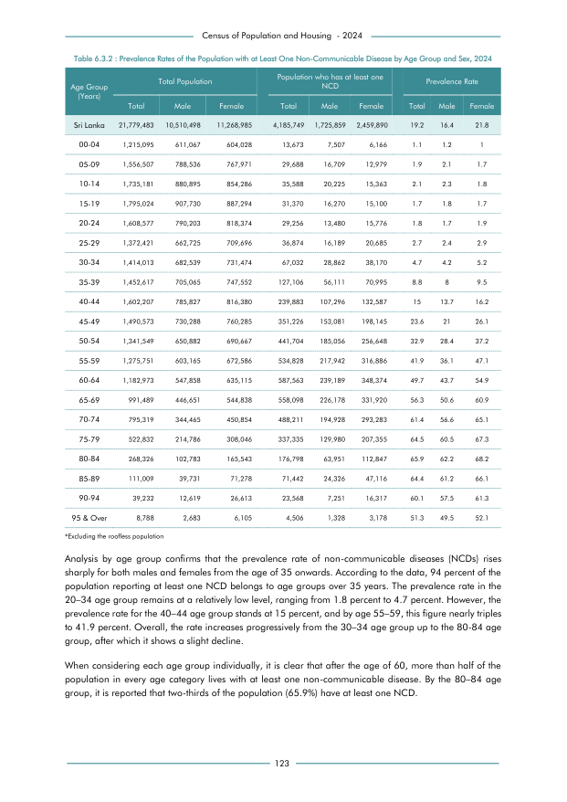

### Source

- [https://www.statistics.gov.lk/Resource/en/Population/CPH_2024/CPH2024_Final_Eng.pdf](https://www.statistics.gov.lk/Resource/en/Population/CPH_2024/CPH2024_Final_Eng.pdf) (Table 6.3.2)

## 69. [Number of Individuals Living with Non-Communicable Diseases and Prevalence Rates, 2024](data/final-report-tables/chapter-6/6.3.3-Number-of-Individuals-Living-with-Non-Communicable-Diseases-and-Prevalence-Rates,-2024)
*🔴 Table was detected in PDF, but not parsed into textual data.*

### Original Table

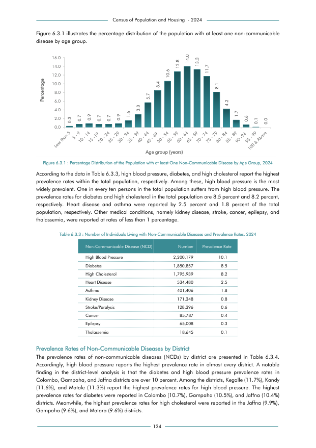

### Source

- [https://www.statistics.gov.lk/Resource/en/Population/CPH_2024/CPH2024_Final_Eng.pdf](https://www.statistics.gov.lk/Resource/en/Population/CPH_2024/CPH2024_Final_Eng.pdf) (Table 6.3.3)

## 70. [Prevalence Rates of Non-Communicable Diseases by District, 2024](data/final-report-tables/chapter-6/6.3.4-Prevalence-Rates-of-Non-Communicable-Diseases-by-District,-2024)
*🔴 Table was detected in PDF, but not parsed into textual data.*

### Original Table


### Source

- [https://www.statistics.gov.lk/Resource/en/Population/CPH_2024/CPH2024_Final_Eng.pdf](https://www.statistics.gov.lk/Resource/en/Population/CPH_2024/CPH2024_Final_Eng.pdf) (Table 6.3.4)

## 71. [Prevalence Rates of Self-Reported Illnesses by Sector, 2024](data/final-report-tables/chapter-6/6.3.5-Prevalence-Rates-of-Self-Reported-Illnesses-by-Sector,-2024)
*🔴 Table was detected in PDF, but not parsed into textual data.*

### Original Table

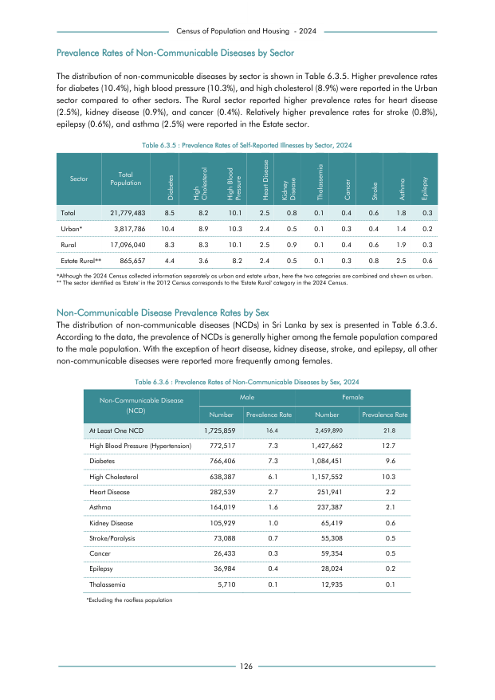

### Source

- [https://www.statistics.gov.lk/Resource/en/Population/CPH_2024/CPH2024_Final_Eng.pdf](https://www.statistics.gov.lk/Resource/en/Population/CPH_2024/CPH2024_Final_Eng.pdf) (Table 6.3.5)

## 72. [Prevalence Rates of Non-Communicable Diseases by Sex, 2024](data/final-report-tables/chapter-6/6.3.6-Prevalence-Rates-of-Non-Communicable-Diseases-by-Sex,-2024)
*🔴 Table was detected in PDF, but not parsed into textual data.*

### Original Table


### Source

- [https://www.statistics.gov.lk/Resource/en/Population/CPH_2024/CPH2024_Final_Eng.pdf](https://www.statistics.gov.lk/Resource/en/Population/CPH_2024/CPH2024_Final_Eng.pdf) (Table 6.3.6)

## 73. [Prevalence Rates of Non-Communicable Diseases by Age Group, 2024](data/final-report-tables/chapter-6/6.3.7-Prevalence-Rates-of-Non-Communicable-Diseases-by-Age-Group,-2024)
*🔴 Table was detected in PDF, but not parsed into textual data.*

### Original Table

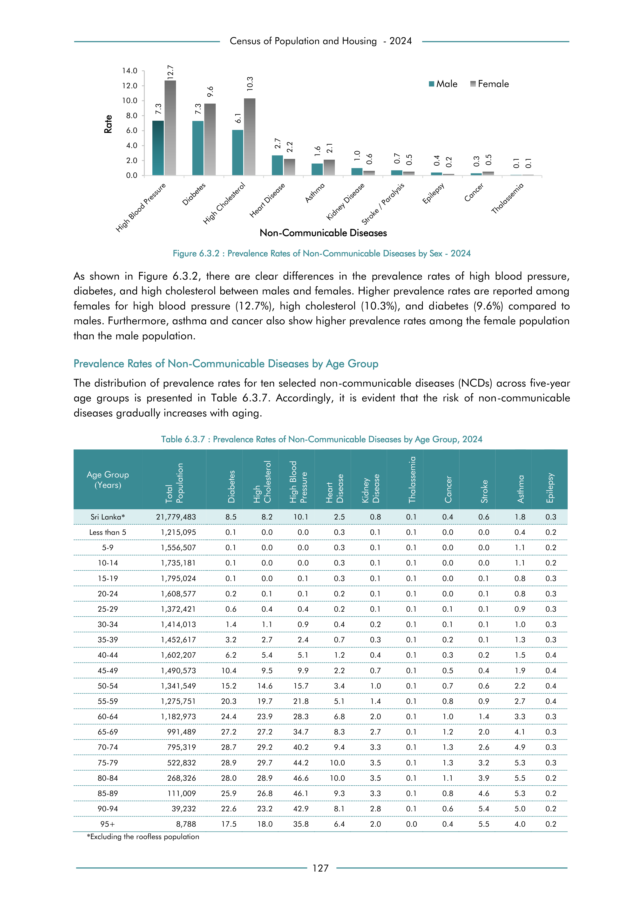

### Source

- [https://www.statistics.gov.lk/Resource/en/Population/CPH_2024/CPH2024_Final_Eng.pdf](https://www.statistics.gov.lk/Resource/en/Population/CPH_2024/CPH2024_Final_Eng.pdf) (Table 6.3.7)

## 74. [Prevalence Rates of Non-Communicable Diseases by Broad Age Groups, 2024](data/final-report-tables/chapter-6/6.3.8-Prevalence-Rates-of-Non-Communicable-Diseases-by-Broad-Age-Groups,-2024)
*🔴 Table was detected in PDF, but not parsed into textual data.*

### Original Table

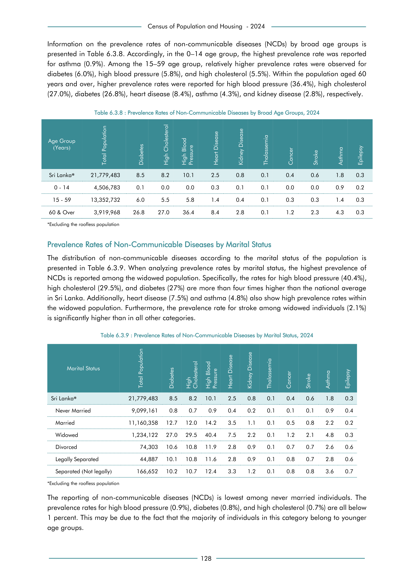

### Source

- [https://www.statistics.gov.lk/Resource/en/Population/CPH_2024/CPH2024_Final_Eng.pdf](https://www.statistics.gov.lk/Resource/en/Population/CPH_2024/CPH2024_Final_Eng.pdf) (Table 6.3.8)

## 75. [Prevalence Rates of Non-Communicable Diseases by Marital Status, 2024](data/final-report-tables/chapter-6/6.3.9-Prevalence-Rates-of-Non-Communicable-Diseases-by-Marital-Status,-2024)
*🔴 Table was detected in PDF, but not parsed into textual data.*

### Original Table


### Source

- [https://www.statistics.gov.lk/Resource/en/Population/CPH_2024/CPH2024_Final_Eng.pdf](https://www.statistics.gov.lk/Resource/en/Population/CPH_2024/CPH2024_Final_Eng.pdf) (Table 6.3.9)

## 76. [Prevalence Rates of Non-Communicable Diseases by Ethnic Group, 2024](data/final-report-tables/chapter-6/6.3.10-Prevalence-Rates-of-Non-Communicable-Diseases-by-Ethnic-Group,-2024)
*🟠 Raw Text Data was extracted from PDF, but not parsed into structured data.*

### Raw Data (first 10 rows)

| Col 1 | Col 2 | Col 3 | Col 4 | Col 5 | Col 6 | Col 7 | Col 8 | Col 9 | Col 10 | Col 11 | Col 12 |
| :-- | :-- | :-- | :-- | :-- | :-- | :-- | :-- | :-- | :-- | :-- | :-- |
| Ethnic group | Total Population | Diabetes | High Cholesterol | High Blood 
Pressure | Heart Disease | Kidney Disease | Thalassemia | Cancer | Stroke | Asthma | Epilepsy |
| Sri Lanka* | 21,779,483 | 8.5 | 8.2 | 10.1 | 2.5 | 0.8 | 0.1 | 0.4 | 0.6 | 1.8 | 0.3 |
| Sinhala | 16,142,478 | 8.6 | 8.7 | 10.5 | 2.6 | 0.8 | 0.1 | 0.4 | 0.6 | 1.7 | 0.3 |
| Sri Lanka Tamil | 2,681,263 | 8.0 | 7.2 | 8.8 | 2.1 | 0.7 | 0.1 | 0.3 | 0.6 | 3.0 | 0.4 |
| Indian Tamil/Malaiyaga |  |  |  |  |  |  |  |  |  |  |  |
|  | 600,245 | 4.6 | 3.5 | 8.5 | 2.4 | 0.5 | 0.1 | 0.3 | 0.9 | 2.4 | 0.6 |
| Thamilar |  |  |  |  |  |  |  |  |  |  |  |
| Sri Lanka Moor/ Muslim | 2,283,055 | 9.2 | 7.7 | 9.3 | 2.1 | 0.5 | 0.1 | 0.2 | 0.4 | 1.7 | 0.3 |
| Burgher | 31,717 | 10.7 | 10.0 | 12.2 | 3.1 | 0.6 | 0.1 | 0.5 | 0.6 | 1.9 | 0.2 |
| Malay | 26,649 | 11.5 | 10.4 | 13.8 | 3.0 | 0.7 | 0.1 | 0.4 | 0.5 | 1.7 | 0.3 |

### Source

- [https://www.statistics.gov.lk/Resource/en/Population/CPH_2024/CPH2024_Final_Eng.pdf](https://www.statistics.gov.lk/Resource/en/Population/CPH_2024/CPH2024_Final_Eng.pdf) (Table 6.3.10)

## 77. [Prevalence Rates for the Population Aged 25 and Over by Highest Educational Qualification, 2024](data/final-report-tables/chapter-6/6.3.11-Prevalence-Rates-for-the-Population-Aged-25-and-Over-by-Highest-Educational-Qualification,-2024)
*🟠 Raw Text Data was extracted from PDF, but not parsed into structured data.*

### Raw Data (first 10 rows)

| Col 1 | Col 2 | Col 3 | Col 4 | Col 5 | Col 6 | Col 7 | Col 8 | Col 9 | Col 10 | Col 11 | Col 12 |
| :-- | :-- | :-- | :-- | :-- | :-- | :-- | :-- | :-- | :-- | :-- | :-- |
| Attainment | Population | Diabetes | High Cholesterol | High Blood 
Pressure | Heart Disease | Kidney Disease | Thalassemia | Cancer | Stroke | Asthma | Epilepsy |
| Population aged 25 and over* | 13,869,099 | 13.3 | 12.9 | 15.8 | 3.7 | 1.2 | 0.1 | 0.6 | 0.9 | 2.4 | 0.3 |
| Never attended school | 399,879 | 17.7 | 17.8 | 27.5 | 6.2 | 2.4 | 0.2 | 1.0 | 3.1 | 6.5 | 1.5 |
| Studied/ Studying at the special |  |  |  |  |  |  |  |  |  |  |  |
|  | 17,104 | 8.0 | 6.0 | 6.8 | 1.9 | 0.6 | 0.2 | 0.2 | 1.1 | 1.6 | 3.6 |
| school/special educational unit |  |  |  |  |  |  |  |  |  |  |  |
| Passed grade 1 - 5 | 1,721,103 | 20.1 | 20.9 | 28.7 | 6.9 | 2.7 | 0.1 | 1.0 | 2.2 | 5.4 | 0.6 |
| Passed grade 6 - 8 | 1,655,351 | 18.3 | 18.3 | 23.1 | 5.9 | 2.0 | 0.1 | 0.9 | 1.5 | 3.6 | 0.5 |
| Passed grade 9 - 10 | 3,385,486 | 12.1 | 11.7 | 13.7 | 3.3 | 1.0 | 0.1 | 0.6 | 0.7 | 2.2 | 0.3 |
| G.C.E. (O/L) or equal | 3,054,744 | 12.4 | 11.7 | 13.5 | 3.1 | 0.8 | 0.1 | 0.5 | 0.5 | 1.6 | 0.2 |

### Source

- [https://www.statistics.gov.lk/Resource/en/Population/CPH_2024/CPH2024_Final_Eng.pdf](https://www.statistics.gov.lk/Resource/en/Population/CPH_2024/CPH2024_Final_Eng.pdf) (Table 6.3.11)

## 78. [Prevalence Rates of NCDs by Employment Status, 2024](data/final-report-tables/chapter-6/6.3.12-Prevalence-Rates-of-NCDs-by-Employment-Status,-2024)
*🟠 Raw Text Data was extracted from PDF, but not parsed into structured data.*

### Raw Data (first 10 rows)

| Col 1 | Col 2 | Col 3 | Col 4 | Col 5 | Col 6 | Col 7 | Col 8 | Col 9 | Col 10 | Col 11 | Col 12 |
| :-- | :-- | :-- | :-- | :-- | :-- | :-- | :-- | :-- | :-- | :-- | :-- |
|  | Employed |  |  |  |  |  |  |  |  |  |  |
| Employment status |  |  |  |  | Heart Disease | Kidney Disease |  |  |  |  |  |
|  | Population | Diabetes | High 
Cholesterol | High Blood 
Pressure |  |  | Thalassemia | Cancer | Stroke | Asthma | Epilepsy |
| Employed population aged 15 |  |  |  |  |  |  |  |  |  |  |  |
|  | 7,670,749 | 7.8 | 7.1 | 7.9 | 2.1 | 0.6 | 0.1 | 0.2 | 0.2 | 1.5 | 0.2 |
| and over |  |  |  |  |  |  |  |  |  |  |  |
| Government paid employee | 1,162,693 | 6.1 | 5.5 | 5.3 | 1.1 | 0.3 | 0.0 | 0.2 | 0.1 | 0.7 | 0.1 |
| Semi government paid |  |  |  |  |  |  |  |  |  |  |  |
|  | 170,713 | 7.6 | 6.9 | 6.5 | 1.5 | 0.3 | 0.0 | 0.2 | 0.1 | 0.9 | 0.1 |
| employee |  |  |  |  |  |  |  |  |  |  |  |

### Source

- [https://www.statistics.gov.lk/Resource/en/Population/CPH_2024/CPH2024_Final_Eng.pdf](https://www.statistics.gov.lk/Resource/en/Population/CPH_2024/CPH2024_Final_Eng.pdf) (Table 6.3.12)

## 79. [Population Aged 3 Years and Over by Sex and Educational Activity During the Census Reference Period,](data/final-report-tables/chapter-7/7.1-Population-Aged-3-Years-and-Over-by-Sex-and-Educational-Activity-During-the-Census-Reference-Period,)
*🔴 Table was detected in PDF, but not parsed into textual data.*

### Original Table

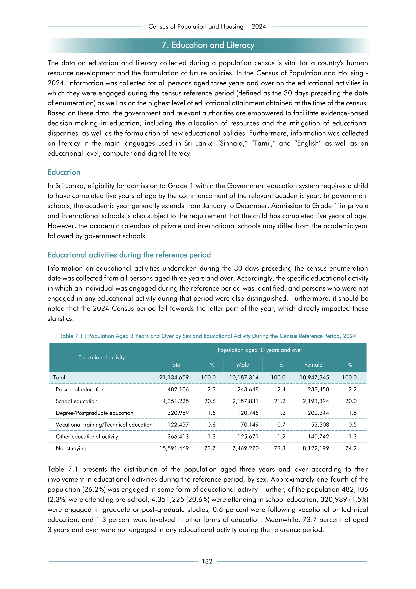

### Source

- [https://www.statistics.gov.lk/Resource/en/Population/CPH_2024/CPH2024_Final_Eng.pdf](https://www.statistics.gov.lk/Resource/en/Population/CPH_2024/CPH2024_Final_Eng.pdf) (Table 7.1)

## 80. [Percentage Pistribution of Population Aged 03 Years and Over by Educational Activity and Age Group, 2024](data/final-report-tables/chapter-7/7.2-Percentage-Pistribution-of-Population-Aged-03-Years-and-Over-by-Educational-Activity-and-Age-Group,-2024)
*🔴 Table was detected in PDF, but not parsed into textual data.*

### Original Table

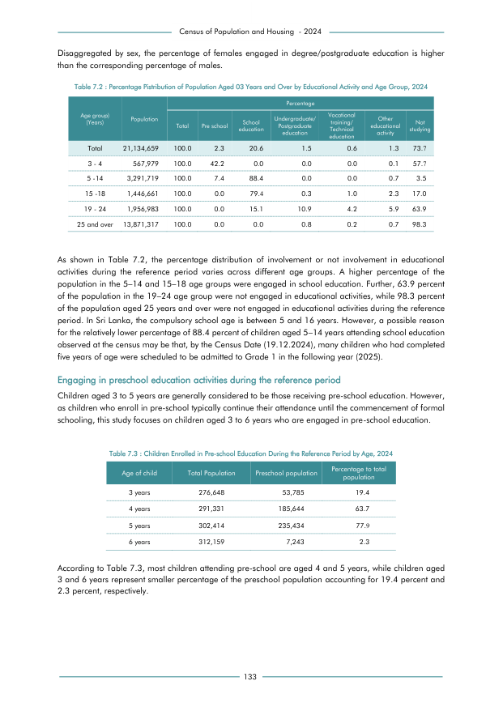

### Source

- [https://www.statistics.gov.lk/Resource/en/Population/CPH_2024/CPH2024_Final_Eng.pdf](https://www.statistics.gov.lk/Resource/en/Population/CPH_2024/CPH2024_Final_Eng.pdf) (Table 7.2)

## 81. [Children Enrolled in Pre-school Education During the Reference Period by Age, 2024](data/final-report-tables/chapter-7/7.3-Children-Enrolled-in-Pre-school-Education-During-the-Reference-Period-by-Age,-2024)
*🔴 Table was detected in PDF, but not parsed into textual data.*

### Original Table


### Source

- [https://www.statistics.gov.lk/Resource/en/Population/CPH_2024/CPH2024_Final_Eng.pdf](https://www.statistics.gov.lk/Resource/en/Population/CPH_2024/CPH2024_Final_Eng.pdf) (Table 7.3)

## 82. [Percentage of Children Receiving Preschool Education by Age Group and District, 2024](data/final-report-tables/chapter-7/7.4-Percentage-of-Children-Receiving-Preschool-Education-by-Age-Group-and-District,-2024)
*🔴 Table was detected in PDF, but not parsed into textual data.*

### Original Table

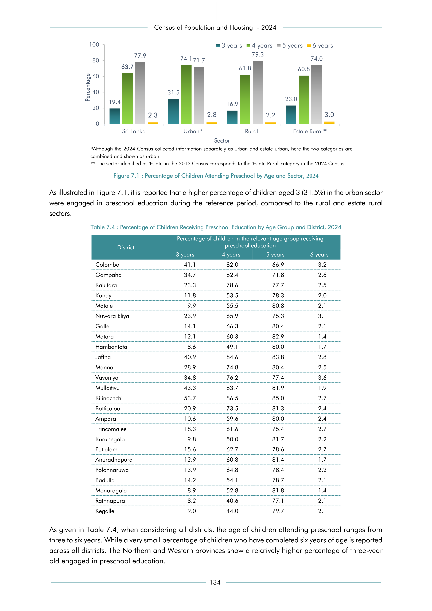

### Source

- [https://www.statistics.gov.lk/Resource/en/Population/CPH_2024/CPH2024_Final_Eng.pdf](https://www.statistics.gov.lk/Resource/en/Population/CPH_2024/CPH2024_Final_Eng.pdf) (Table 7.4)

## 83. [Population Engaged in School Education During the Reference Period by Age Group and Sex,](data/final-report-tables/chapter-7/7.5-Population-Engaged-in-School-Education-During-the-Reference-Period-by-Age-Group-and-Sex,)
*🔴 Table was detected in PDF, but not parsed into textual data.*

### Original Table

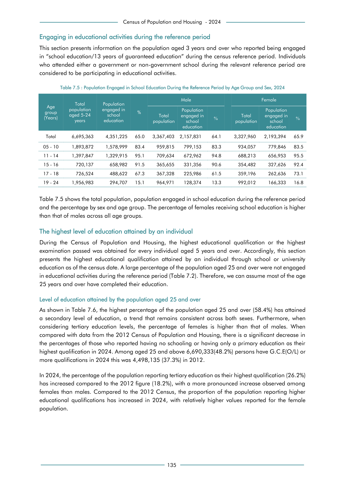

### Source

- [https://www.statistics.gov.lk/Resource/en/Population/CPH_2024/CPH2024_Final_Eng.pdf](https://www.statistics.gov.lk/Resource/en/Population/CPH_2024/CPH2024_Final_Eng.pdf) (Table 7.5)

## 84. [The Educational Level of the Population Age 25 Years and Over by Sex, 2012 and 2024](data/final-report-tables/chapter-7/7.6-The-Educational-Level-of-the-Population-Age-25-Years-and-Over-by-Sex,-2012-and-2024)
*🟠 Raw Text Data was extracted from PDF, but not parsed into structured data.*

### Raw Data (first 10 rows)

| Col 1 | Col 2 | Col 3 | Col 4 | Col 5 | Col 6 | Col 7 | Col 8 | Col 9 | Col 10 | Col 11 | Col 12 | Col 13 |
| :-- | :-- | :-- | :-- | :-- | :-- | :-- | :-- | :-- | :-- | :-- | :-- | :-- |
| Educational level | 2012 |  | 2024 |  | 2012 |  | 2024 |  | 2012 |  | 2024 |  |
|  | Number | (%) | Number | (%) | Number | (%) | Number | (%) | Number | (%) | Number | (%) |
| Population 25 years and over | 12,050,641 | 100.0 | 13,871,317 | 100.0 | 5,703,991 | 100.0 | 6,533,860 | 100.0 | 6,346,650 | 100.0 | 7,337,457 | 100.0 |
| No schooling | 561,163 | 4.7 | 400,511 | 2.9 | 172,292 | 3.0 | 136,168 | 2.1 | 388,871 | 6.1 | 264,343 | 3.6 |
| Primary educational level | 2,214,792 | 18.4 | 1,738,942 | 12.5 | 1,058,900 | 18.6 | 794,197 | 12.2 | 1,155,892 | 18.2 | 944,745 | 12.9 |
| Passed Grades 1- 5* | 2,214,792 | 18.4 | 1738942 | 12.5 | 1,058,900 | 18.6 | 794,197 | 12.2 | 1,155,892 | 18.2 | 944,745 | 12.9 |
| Secondary educational level | 7,079,569 | 58.7 | 8,096,402 | 58.4 | 3,499,694 | 61.4 | 4,025,986 | 61.6 | 3,579,875 | 56.4 | 4,070,416 | 55.5 |
| Passed Grades 6 - 8 | 1,889,721 | 15.7 | 1,655,756 | 11.9 | 991,099 | 17.4 | 848,236 | 13.0 | 898,622 | 14.2 | 807,520 | 11.0 |
| Passed Grades 9 - 10 | 2,886,830 | 23.9 | 3,385,775 | 24.5 | 1,407,833 | 24.7 | 1,692,481 | 25.9 | 1,478,997 | 23.3 | 1,693,294 | 23.1 |
| G.C.E. O/L or equivalent | 2,303,018 | 19.1 | 3,054,871 | 22.0 | 1,100,762 | 19.3 | 1,485,269 | 22.7 | 1,202,256 | 18.9 | 1,569,602 | 21.4 |

### Source

- [https://www.statistics.gov.lk/Resource/en/Population/CPH_2024/CPH2024_Final_Eng.pdf](https://www.statistics.gov.lk/Resource/en/Population/CPH_2024/CPH2024_Final_Eng.pdf) (Table 7.6)

## 85. [Percentage Distribution of Population Aged 25 and Over by Educational Level and District, 2012 and 2024](data/final-report-tables/chapter-7/7.7-Percentage-Distribution-of-Population-Aged-25-and-Over-by-Educational-Level-and-District,-2012-and-2024)
*🟠 Raw Text Data was extracted from PDF, but not parsed into structured data.*

### Raw Data (first 10 rows)

| Col 1 | Col 2 | Col 3 | Col 4 | Col 5 | Col 6 | Col 7 | Col 8 | Col 9 | Col 10 | Col 11 | Col 12 | Col 13 | Col 14 | Col 15 |
| :-- | :-- | :-- | :-- | :-- | :-- | :-- | :-- | :-- | :-- | :-- | :-- | :-- | :-- | :-- |
|  |  | Table 7.7 : Percentage Distribution of Population Aged 25 and Over by Educational Level and District, 2012 and 2024 |  |  |  |  |  |  |  |  |  |  |  |  |
|  |  |  |  |  |  |  |  | Passed Grades | Passed Grades |  |  | G.C.E. O/L or |  | G.C.E. A/L or |
|  |  | Total population aged 25 and over |  | Total |  | No schooling |  |  |  |  |  |  |  |  |
|  |  |  |  |  |  |  |  | 1- 5 |  | 6-10 |  | equivalent |  | over |
| District |  |  |  |  |  |  |  |  |  |  |  |  |  |  |
|  | 2012 | 2024 | 2012 | 2024 | 2012 | 2024 | 2012 | 2024 | 2012 | 2024 | 2012 | 2024 | 2012 | 2024 |
| Sri Lanka | 12,050,641 | 13,871,317 | 100.0 | 100.0 | 4.7 | 2.9 | 18.4 | 12.5 | 39.6 | 36.4 | 19.1 | 22.0 | 18.2 | 26.2 |
| Colombo | 1,450,574 | 1,601,927 | 100.0 | 100.0 | 2.6 | 1.6 | 9.6 | 5.8 | 33.2 | 26.6 | 25.3 | 25.9 | 29.4 | 40.1 |
| Gampaha | 1,419,483 | 1,620,233 | 100.0 | 100.0 | 1.8 | 1.1 | 9.7 | 6.1 | 40.8 | 33.2 | 25.2 | 27.1 | 22.6 | 32.5 |
| Kalutara | 748,643 | 847,732 | 100.0 | 100.0 | 3.1 | 1.8 | 14.5 | 9.4 | 40.0 | 36.6 | 22.4 | 23.8 | 20.0 | 28.4 |

### Source

- [https://www.statistics.gov.lk/Resource/en/Population/CPH_2024/CPH2024_Final_Eng.pdf](https://www.statistics.gov.lk/Resource/en/Population/CPH_2024/CPH2024_Final_Eng.pdf) (Table 7.7)

## 86. [Language Literacy Rate by Census Year and Sex, 2024](data/final-report-tables/chapter-7/7.8-Language-Literacy-Rate-by-Census-Year-and-Sex,-2024)
*🔴 Table was detected in PDF, but not parsed into textual data.*

### Original Table

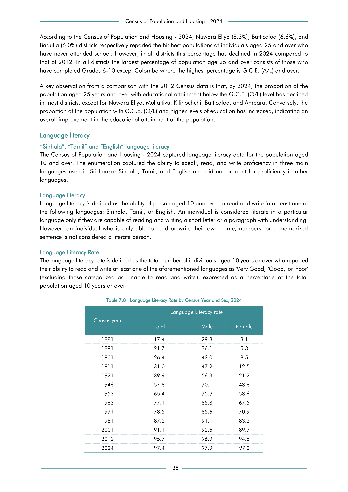

### Source

- [https://www.statistics.gov.lk/Resource/en/Population/CPH_2024/CPH2024_Final_Eng.pdf](https://www.statistics.gov.lk/Resource/en/Population/CPH_2024/CPH2024_Final_Eng.pdf) (Table 7.8)

## 87. [Language Literacy Rate by Language and Age Group, 2024](data/final-report-tables/chapter-7/7.9-Language-Literacy-Rate-by-Language-and-Age-Group,-2024)
*🔴 Table was detected in PDF, but not parsed into textual data.*

### Original Table

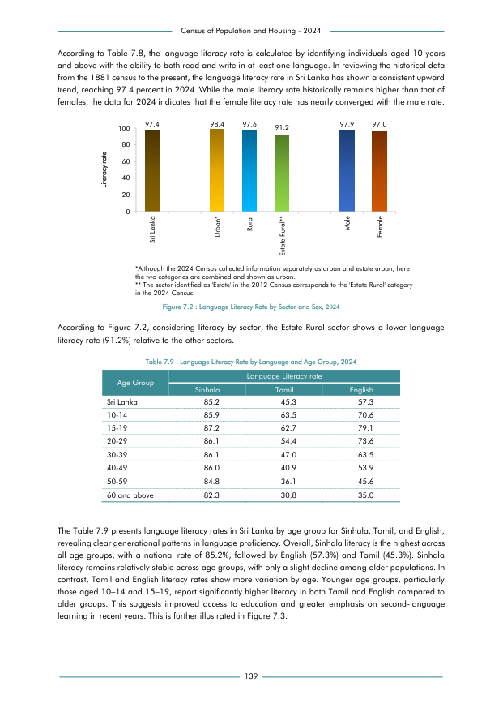

### Source

- [https://www.statistics.gov.lk/Resource/en/Population/CPH_2024/CPH2024_Final_Eng.pdf](https://www.statistics.gov.lk/Resource/en/Population/CPH_2024/CPH2024_Final_Eng.pdf) (Table 7.9)

## 88. [Language Literacy Rate by Language and District, 2024](data/final-report-tables/chapter-7/7.10-Language-Literacy-Rate-by-Language-and-District,-2024)
*🔴 Table was detected in PDF, but not parsed into textual data.*

### Original Table

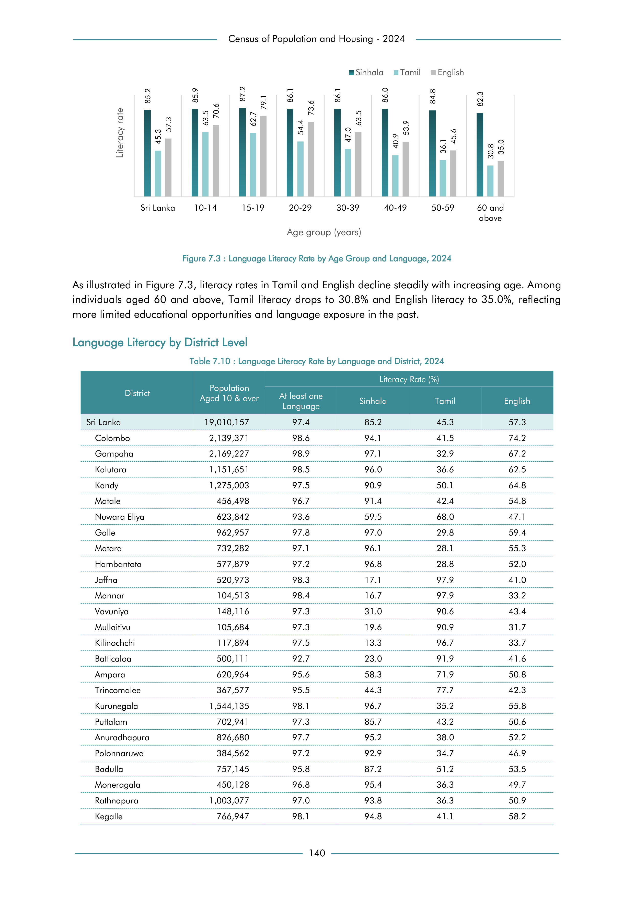

### Source

- [https://www.statistics.gov.lk/Resource/en/Population/CPH_2024/CPH2024_Final_Eng.pdf](https://www.statistics.gov.lk/Resource/en/Population/CPH_2024/CPH2024_Final_Eng.pdf) (Table 7.10)

## 89. [Language Literacy Rate by Language and Ethnic Group, 2012 and 2024](data/final-report-tables/chapter-7/7.11-Language-Literacy-Rate-by-Language-and-Ethnic-Group,-2012-and-2024)
*🔴 Table was detected in PDF, but not parsed into textual data.*

### Original Table

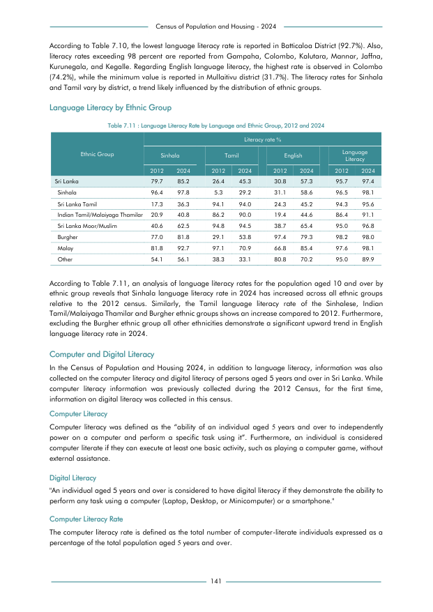

### Source

- [https://www.statistics.gov.lk/Resource/en/Population/CPH_2024/CPH2024_Final_Eng.pdf](https://www.statistics.gov.lk/Resource/en/Population/CPH_2024/CPH2024_Final_Eng.pdf) (Table 7.11)

## 90. [Computer and Digital Literacy Rate by Sector,2024](data/final-report-tables/chapter-7/7.12-Computer-and-Digital-Literacy-Rate-by-Sector,2024)
*🔴 Table was detected in PDF, but not parsed into textual data.*

### Original Table

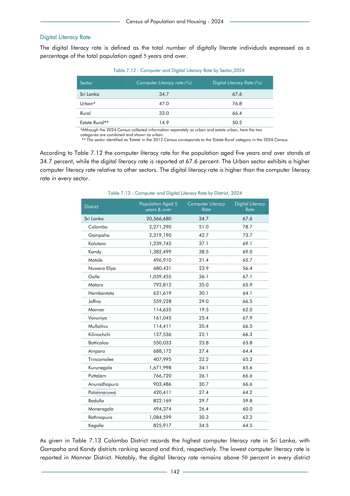

### Source

- [https://www.statistics.gov.lk/Resource/en/Population/CPH_2024/CPH2024_Final_Eng.pdf](https://www.statistics.gov.lk/Resource/en/Population/CPH_2024/CPH2024_Final_Eng.pdf) (Table 7.12)

## 91. [Computer and Digital Literacy Rate by District, 2024](data/final-report-tables/chapter-7/7.13-Computer-and-Digital-Literacy-Rate-by-District,-2024)
*🔴 Table was detected in PDF, but not parsed into textual data.*

### Original Table


### Source

- [https://www.statistics.gov.lk/Resource/en/Population/CPH_2024/CPH2024_Final_Eng.pdf](https://www.statistics.gov.lk/Resource/en/Population/CPH_2024/CPH2024_Final_Eng.pdf) (Table 7.13)

## 92. [Computer and Digital Literacy Rate by Age Group,](data/final-report-tables/chapter-7/7.14-Computer-and-Digital-Literacy-Rate-by-Age-Group,)
*🔴 Table was detected in PDF, but not parsed into textual data.*

### Original Table


### Source

- [https://www.statistics.gov.lk/Resource/en/Population/CPH_2024/CPH2024_Final_Eng.pdf](https://www.statistics.gov.lk/Resource/en/Population/CPH_2024/CPH2024_Final_Eng.pdf) (Table 7.14)

## 93. [Economically Active and Inactive Population by Sex, 2024](data/final-report-tables/chapter-8/8.1-Economically-Active-and-Inactive-Population-by-Sex,-2024)
*🔴 Table was detected in PDF, but not parsed into textual data.*

### Original Table

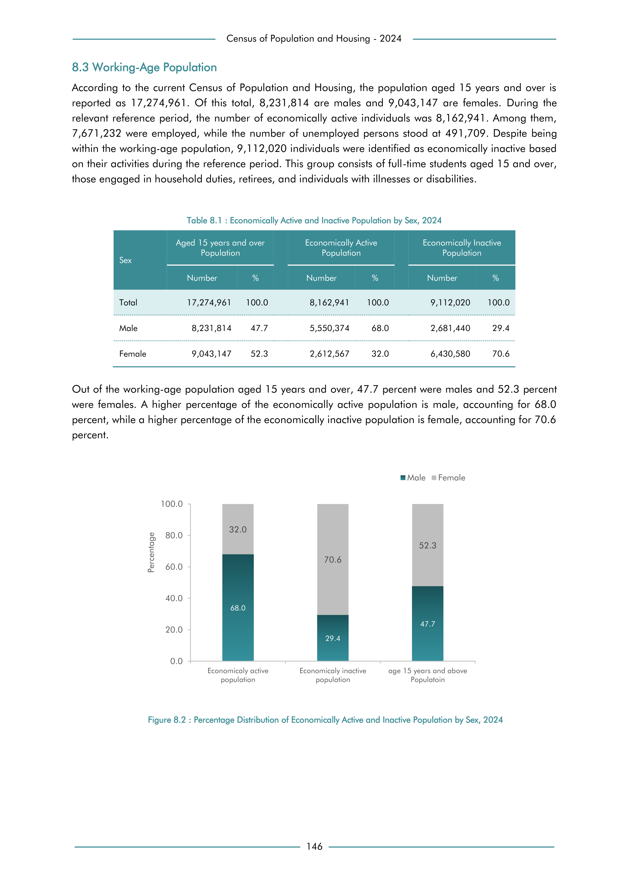

### Source

- [https://www.statistics.gov.lk/Resource/en/Population/CPH_2024/CPH2024_Final_Eng.pdf](https://www.statistics.gov.lk/Resource/en/Population/CPH_2024/CPH2024_Final_Eng.pdf) (Table 8.1)

## 94. [Economically Active Population, by Sector and Sex, 2024](data/final-report-tables/chapter-8/8.2-Economically-Active-Population,-by-Sector-and-Sex,-2024)
*🔴 Table was detected in PDF, but not parsed into textual data.*

### Original Table

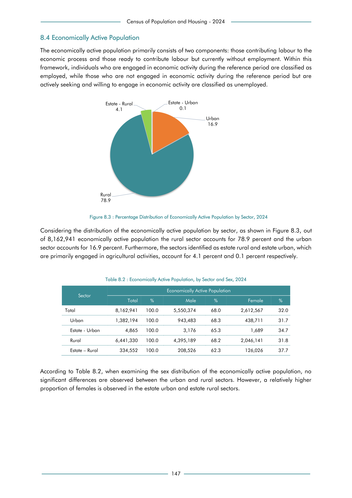

### Source

- [https://www.statistics.gov.lk/Resource/en/Population/CPH_2024/CPH2024_Final_Eng.pdf](https://www.statistics.gov.lk/Resource/en/Population/CPH_2024/CPH2024_Final_Eng.pdf) (Table 8.2)

## 95. [Economically Active Population by Sex and Age Group, 2024](data/final-report-tables/chapter-8/8.3-Economically-Active-Population-by-Sex-and-Age-Group,-2024)
*🔴 Table was detected in PDF, but not parsed into textual data.*

### Original Table

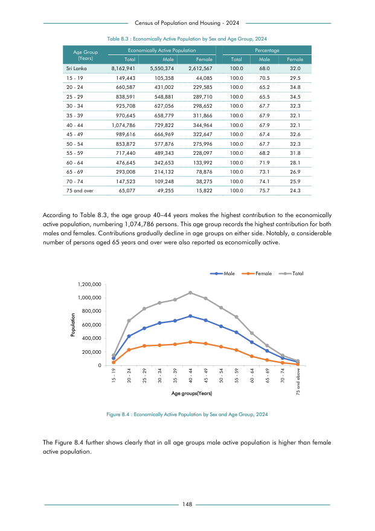

### Source

- [https://www.statistics.gov.lk/Resource/en/Population/CPH_2024/CPH2024_Final_Eng.pdf](https://www.statistics.gov.lk/Resource/en/Population/CPH_2024/CPH2024_Final_Eng.pdf) (Table 8.3)

## 96. [Labour Force Participation Rate by Age Group and Sex, 2024](data/final-report-tables/chapter-8/8.4-Labour-Force-Participation-Rate-by-Age-Group-and-Sex,-2024)
*🔴 Table was detected in PDF, but not parsed into textual data.*

### Original Table

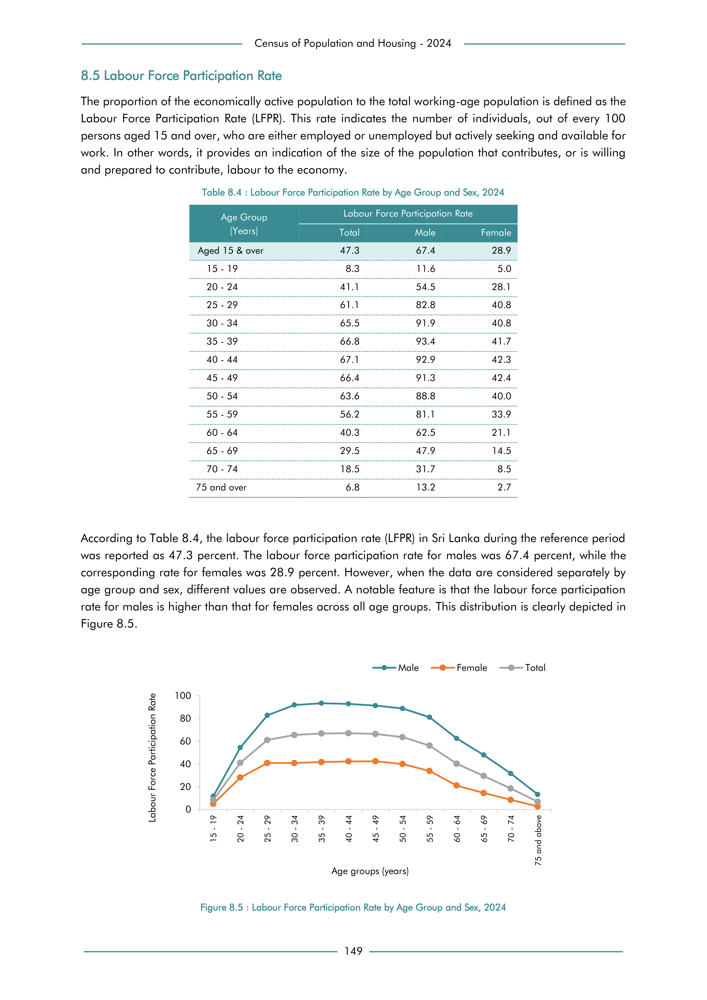

### Source

- [https://www.statistics.gov.lk/Resource/en/Population/CPH_2024/CPH2024_Final_Eng.pdf](https://www.statistics.gov.lk/Resource/en/Population/CPH_2024/CPH2024_Final_Eng.pdf) (Table 8.4)

## 97. [Labour Force Participation Rate, by Highest Educational Qualification Attained and Sex, 2024](data/final-report-tables/chapter-8/8.5-Labour-Force-Participation-Rate,-by-Highest-Educational-Qualification-Attained-and-Sex,-2024)
*🔴 Table was detected in PDF, but not parsed into textual data.*

### Original Table

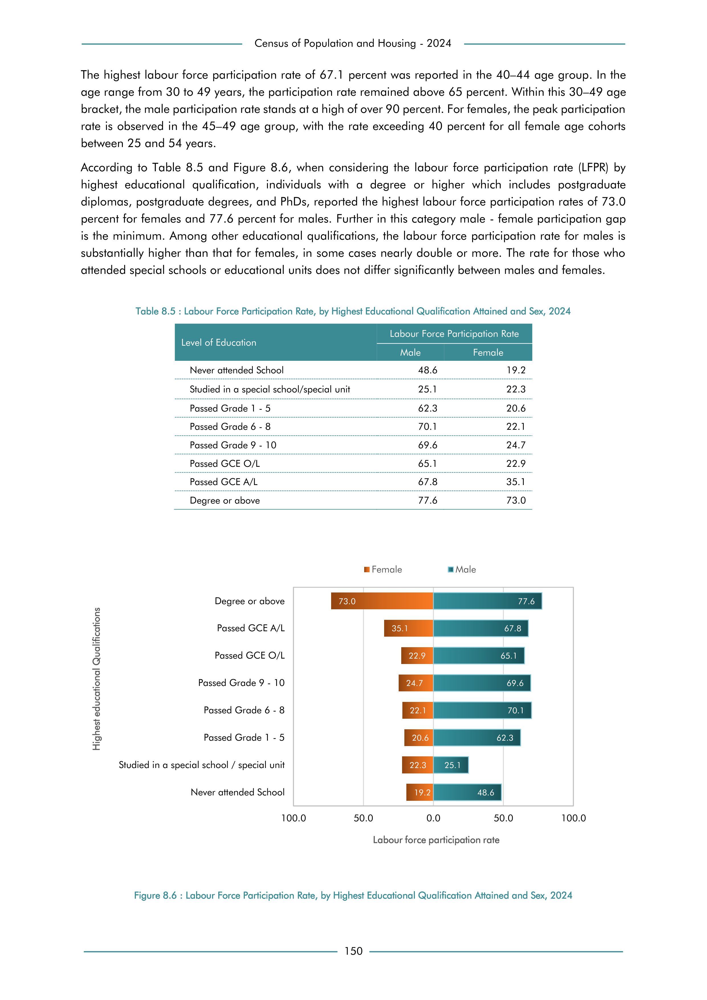

### Source

- [https://www.statistics.gov.lk/Resource/en/Population/CPH_2024/CPH2024_Final_Eng.pdf](https://www.statistics.gov.lk/Resource/en/Population/CPH_2024/CPH2024_Final_Eng.pdf) (Table 8.5)

## 98. [Employed Population by Sector and Sex, 2024](data/final-report-tables/chapter-8/8.6-Employed-Population-by-Sector-and-Sex,-2024)
*🔴 Table was detected in PDF, but not parsed into textual data.*

### Original Table

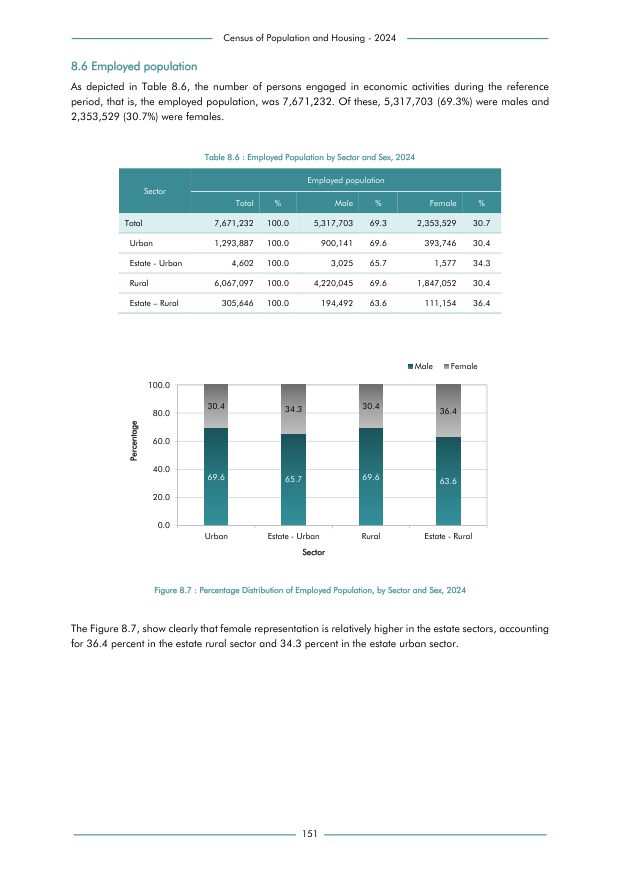

### Source

- [https://www.statistics.gov.lk/Resource/en/Population/CPH_2024/CPH2024_Final_Eng.pdf](https://www.statistics.gov.lk/Resource/en/Population/CPH_2024/CPH2024_Final_Eng.pdf) (Table 8.6)

## 99. [Employed Population, by Highest Educational Attainment and Sex, 2024](data/final-report-tables/chapter-8/8.7-Employed-Population,-by-Highest-Educational-Attainment-and-Sex,-2024)
*🔴 Table was detected in PDF, but not parsed into textual data.*

### Original Table

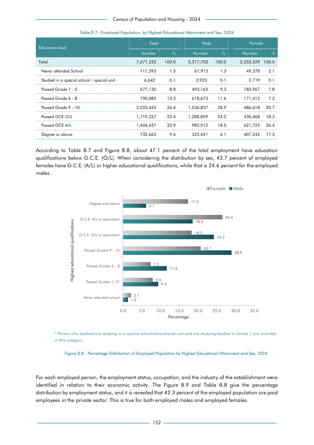

### Source

- [https://www.statistics.gov.lk/Resource/en/Population/CPH_2024/CPH2024_Final_Eng.pdf](https://www.statistics.gov.lk/Resource/en/Population/CPH_2024/CPH2024_Final_Eng.pdf) (Table 8.7)

## 100. [Employed Population by Employment Status and Sex, 2024](data/final-report-tables/chapter-8/8.8-Employed-Population-by-Employment-Status-and-Sex,-2024)
*🟠 Raw Text Data was extracted from PDF, but not parsed into structured data.*

### Raw Data (first 10 rows)

| Col 1 | Col 2 | Col 3 | Col 4 | Col 5 | Col 6 | Col 7 |
| :-- | :-- | :-- | :-- | :-- | :-- | :-- |
|  | Total |  | Male |  | Female |  |
| Employment Status |  |  |  |  |  |  |
|  | Number | % | Number | % | Number | % |
| Total | 7,671,232  100.0 |  | 5,317,703 | 100.0 | 2,353,529 | 100.0 |
| Government/Semi-Government Paid Employee | 1,333,406 | 17.4 | 741,649 | 13.9 | 591,757 | 25.1 |
| Private Sector Paid Employee | 3,244,773 | 42.3 | 2,248,841 | 42.3 | 995,932 | 42.3 |
| Employer | 277,868 | 3.6 | 242,488 | 4.6 | 35,380 | 1.5 |
| Own Account Worker | 2,407,614 | 31.4 | 1,906,739 | 35.9 | 500,875 | 21.3 |
| Contributing to Family Enterprise | 407,571 | 5.3 | 177,986 | 3.3 | 229,585 | 9.8 |

### Source

- [https://www.statistics.gov.lk/Resource/en/Population/CPH_2024/CPH2024_Final_Eng.pdf](https://www.statistics.gov.lk/Resource/en/Population/CPH_2024/CPH2024_Final_Eng.pdf) (Table 8.8)

## 101. [Unemployed Population by Sector and Sex, 2024](data/final-report-tables/chapter-8/8.9-Unemployed-Population-by-Sector-and-Sex,-2024)
*🔴 Table was detected in PDF, but not parsed into textual data.*

### Original Table

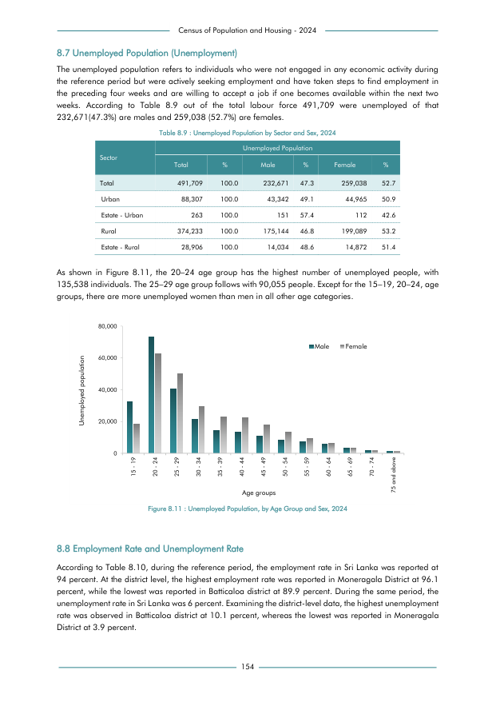

### Source

- [https://www.statistics.gov.lk/Resource/en/Population/CPH_2024/CPH2024_Final_Eng.pdf](https://www.statistics.gov.lk/Resource/en/Population/CPH_2024/CPH2024_Final_Eng.pdf) (Table 8.9)

## 102. [Employment Rate and Unemployment Rate by District, 2024](data/final-report-tables/chapter-8/8.10-Employment-Rate-and-Unemployment-Rate-by-District,-2024)
*🔴 Table was detected in PDF, but not parsed into textual data.*

### Original Table

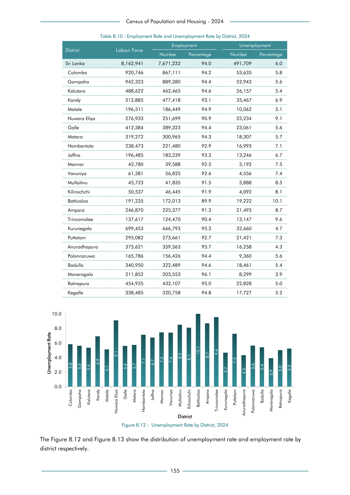

### Source

- [https://www.statistics.gov.lk/Resource/en/Population/CPH_2024/CPH2024_Final_Eng.pdf](https://www.statistics.gov.lk/Resource/en/Population/CPH_2024/CPH2024_Final_Eng.pdf) (Table 8.10)

## 103. [Economically Inactive Population by Main Reason for Inactivity, 2024](data/final-report-tables/chapter-8/8.11-Economically-Inactive-Population-by-Main-Reason-for-Inactivity,-2024)
*🔴 Table was detected in PDF, but not parsed into textual data.*

### Original Table

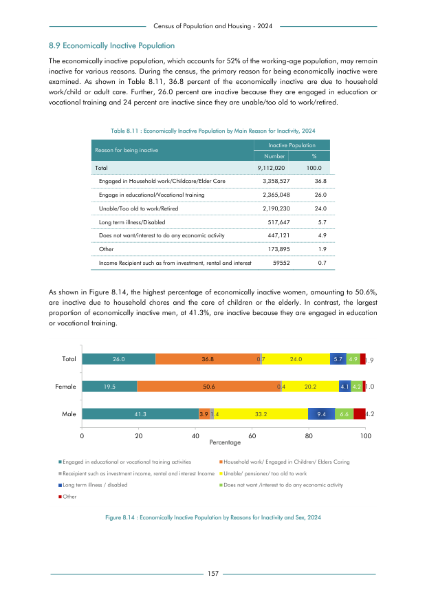

### Source

- [https://www.statistics.gov.lk/Resource/en/Population/CPH_2024/CPH2024_Final_Eng.pdf](https://www.statistics.gov.lk/Resource/en/Population/CPH_2024/CPH2024_Final_Eng.pdf) (Table 8.11)

## 104. [by Marital Status, Age Group, and Sex, 2024](data/final-report-tables/chapter-9/9.1:-by-Marital-Status,-Age-Group,-and-Sex,-2024)
*🟠 Raw Text Data was extracted from PDF, but not parsed into structured data.*

### Raw Data (first 10 rows)

| Col 1 | Col 2 | Col 3 | Col 4 | Col 5 | Col 6 | Col 7 | Col 8 | Col 9 | Col 10 | Col 11 | Col 12 | Col 13 | Col 14 | Col 15 |
| :-- | :-- | :-- | :-- | :-- | :-- | :-- | :-- | :-- | :-- | :-- | :-- | :-- | :-- | :-- |
|  |  |  |  |  |  |  |  | Marital status |  |  |  |  |  |  |
|  | Population |  |  |  |  |  |  |  |  |  |  |  |  |  |
|  |  |  |  |  |  |  |  |  |  |  | Separated |  | Separated |  |
| Age Group |  |  |  |  |  |  |  |  |  |  |  |  |  |  |
|  |  |  | Never married |  | Married |  | Widowed |  | Divorced |  |  |  |  |  |
|  |  |  |  |  |  |  |  |  |  |  | (Legally) |  | (Not legally) |  |
|  | Male | Female | Male | Female | Male | Female | Male | Female | Male | Female | Male | Female | Male | Female |
| Total | 10,512,344 | 11,269,456 | 4,808,324 | 4,291,826 | 5,417,431 | 5,743,647 | 175,421 | 1,058,997 | 28,952 | 45,403 | 17,047 | 27,857 | 65,169 | 101,726 |
|  | 2,280,530 | 2,226,309 | 2,280,530 | 2226291 | 0 | 18 | 0 | 0 | 0 | 0 | 0 | 0 | 0 | 0 |
| Less than 15 |  |  |  |  |  |  |  |  |  |  |  |  |  |  |

### Source

- [https://www.statistics.gov.lk/Resource/en/Population/CPH_2024/CPH2024_Final_Eng.pdf](https://www.statistics.gov.lk/Resource/en/Population/CPH_2024/CPH2024_Final_Eng.pdf) (Table 9.1:)

## 105. [Marital Status by Ethnic group and Sex,](data/final-report-tables/chapter-9/9.2-Marital-Status-by-Ethnic-group-and-Sex,)
*🔴 Table was detected in PDF, but not parsed into textual data.*

### Original Table

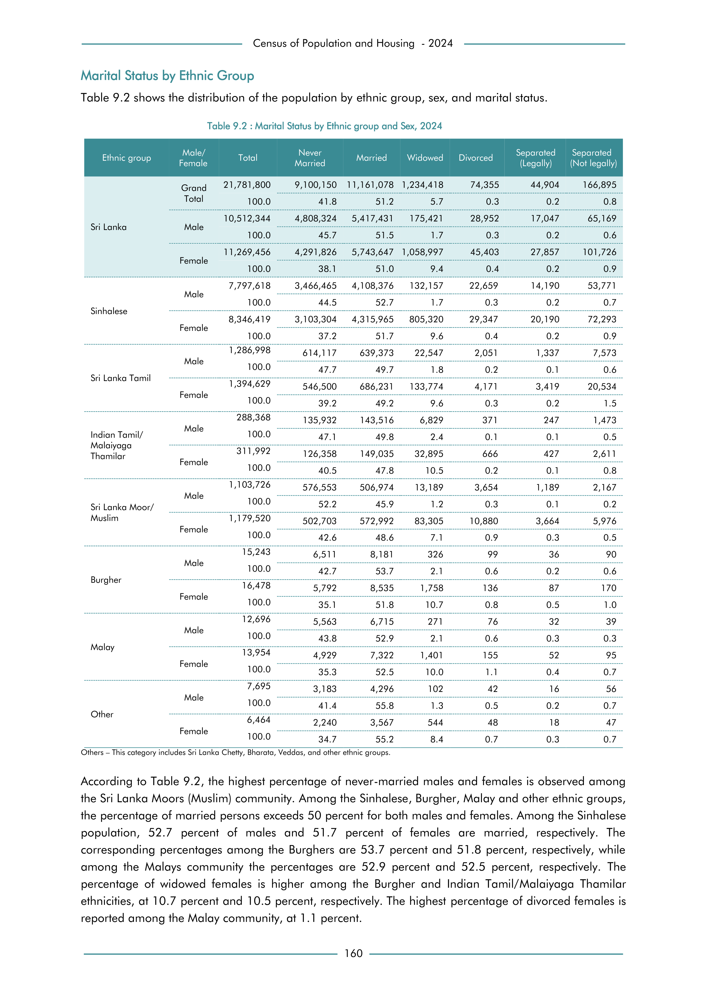

### Source

- [https://www.statistics.gov.lk/Resource/en/Population/CPH_2024/CPH2024_Final_Eng.pdf](https://www.statistics.gov.lk/Resource/en/Population/CPH_2024/CPH2024_Final_Eng.pdf) (Table 9.2)

## 106. [Population Aged 15 Years and Over by Marital Status and Sex, 2012 and 2024](data/final-report-tables/chapter-9/9.3-Population-Aged-15-Years-and-Over-by-Marital-Status-and-Sex,-2012-and-2024)
*🔴 Table was detected in PDF, but not parsed into textual data.*

### Original Table

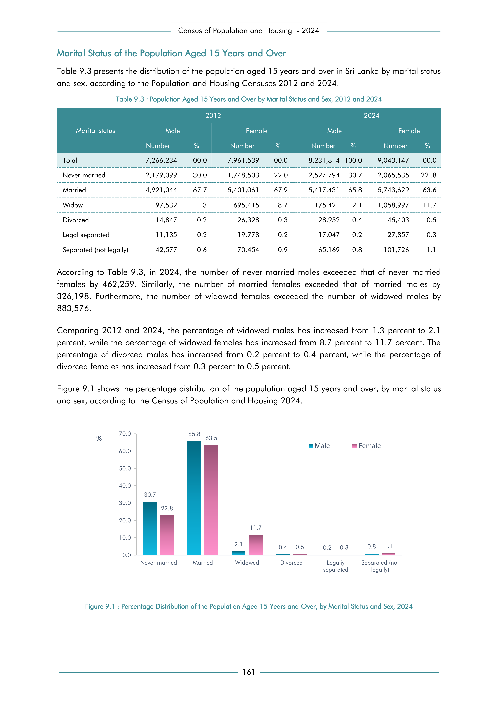

### Source

- [https://www.statistics.gov.lk/Resource/en/Population/CPH_2024/CPH2024_Final_Eng.pdf](https://www.statistics.gov.lk/Resource/en/Population/CPH_2024/CPH2024_Final_Eng.pdf) (Table 9.3)

## 107. [Percentage of Never-Married Persons within the Age Group by Sex, 1981, 2012, and 2024](data/final-report-tables/chapter-9/9.4-Percentage-of-Never-Married-Persons-within-the-Age-Group-by-Sex,-1981,-2012,-and-2024)
*🔴 Table was detected in PDF, but not parsed into textual data.*

### Original Table


### Source

- [https://www.statistics.gov.lk/Resource/en/Population/CPH_2024/CPH2024_Final_Eng.pdf](https://www.statistics.gov.lk/Resource/en/Population/CPH_2024/CPH2024_Final_Eng.pdf) (Table 9.4)

## 108. [Percentage of Married Population Aged 15 Years and Over by Age Group, 1981, 2012, and 2024](data/final-report-tables/chapter-9/9.5-Percentage-of-Married-Population-Aged-15-Years-and-Over-by-Age-Group,-1981,-2012,-and-2024)
*🔴 Table was detected in PDF, but not parsed into textual data.*

### Original Table


### Source

- [https://www.statistics.gov.lk/Resource/en/Population/CPH_2024/CPH2024_Final_Eng.pdf](https://www.statistics.gov.lk/Resource/en/Population/CPH_2024/CPH2024_Final_Eng.pdf) (Table 9.5)

## 109. [Percentage of Widowed Population Aged 15 Years and over, 1981, 2012, and 2024](data/final-report-tables/chapter-9/9.6-Percentage-of-Widowed-Population-Aged-15-Years-and-over,-1981,-2012,-and-2024)
*🔴 Table was detected in PDF, but not parsed into textual data.*

### Original Table


### Source

- [https://www.statistics.gov.lk/Resource/en/Population/CPH_2024/CPH2024_Final_Eng.pdf](https://www.statistics.gov.lk/Resource/en/Population/CPH_2024/CPH2024_Final_Eng.pdf) (Table 9.6)

## 110. [Number of Divorced or Separated Persons per 10,000 Population Aged 15 Years and Over, 1981, 2012, and](data/final-report-tables/chapter-9/9.7-Number-of-Divorced-or-Separated-Persons-per-10,000-Population-Aged-15-Years-and-Over,-1981,-2012,-and)
*🔴 Table was detected in PDF, but not parsed into textual data.*

### Original Table

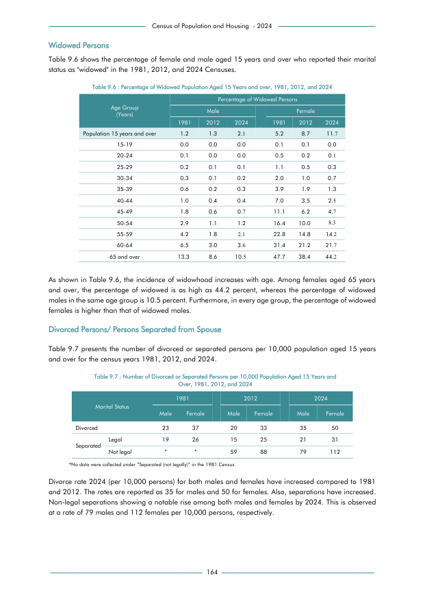

### Source

- [https://www.statistics.gov.lk/Resource/en/Population/CPH_2024/CPH2024_Final_Eng.pdf](https://www.statistics.gov.lk/Resource/en/Population/CPH_2024/CPH2024_Final_Eng.pdf) (Table 9.7)

## 111. [Mean Age at Marriage, 1953–2024](data/final-report-tables/chapter-9/9.8-Mean-Age-at-Marriage,-1953–2024)
*🔴 Table was detected in PDF, but not parsed into textual data.*

### Original Table


### Source

- [https://www.statistics.gov.lk/Resource/en/Population/CPH_2024/CPH2024_Final_Eng.pdf](https://www.statistics.gov.lk/Resource/en/Population/CPH_2024/CPH2024_Final_Eng.pdf) (Table 9.8)

## 112. [Mean Age at Marriage by Sector, 2024](data/final-report-tables/chapter-9/9.9-Mean-Age-at-Marriage-by-Sector,-2024)
*🔴 Table was detected in PDF, but not parsed into textual data.*

### Original Table

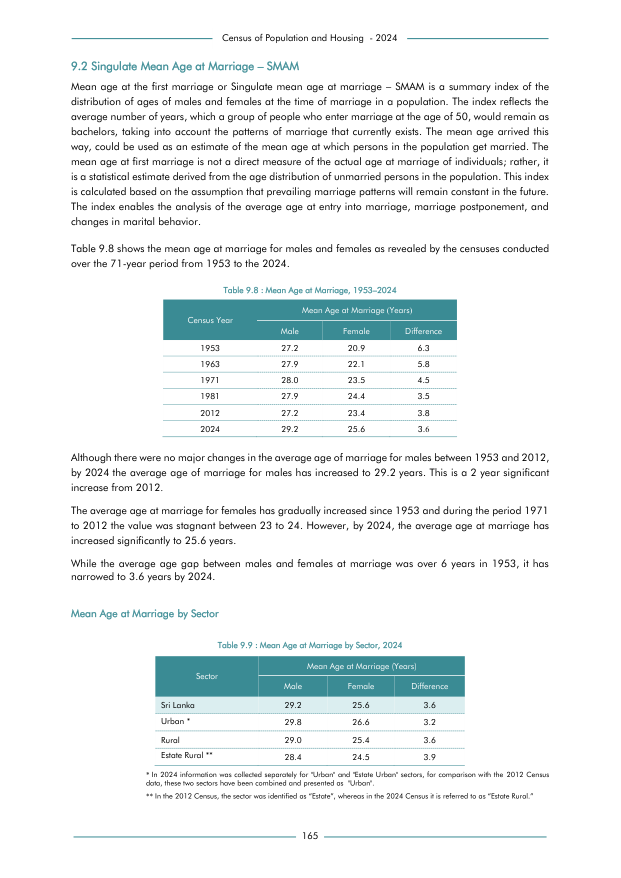

### Source

- [https://www.statistics.gov.lk/Resource/en/Population/CPH_2024/CPH2024_Final_Eng.pdf](https://www.statistics.gov.lk/Resource/en/Population/CPH_2024/CPH2024_Final_Eng.pdf) (Table 9.9)

## 113. [Mean Age at Marriage by District of Usual Residence, 2012 and 2024](data/final-report-tables/chapter-9/9.10-Mean-Age-at-Marriage-by-District-of-Usual-Residence,-2012-and-2024)
*🔴 Table was detected in PDF, but not parsed into textual data.*

### Original Table

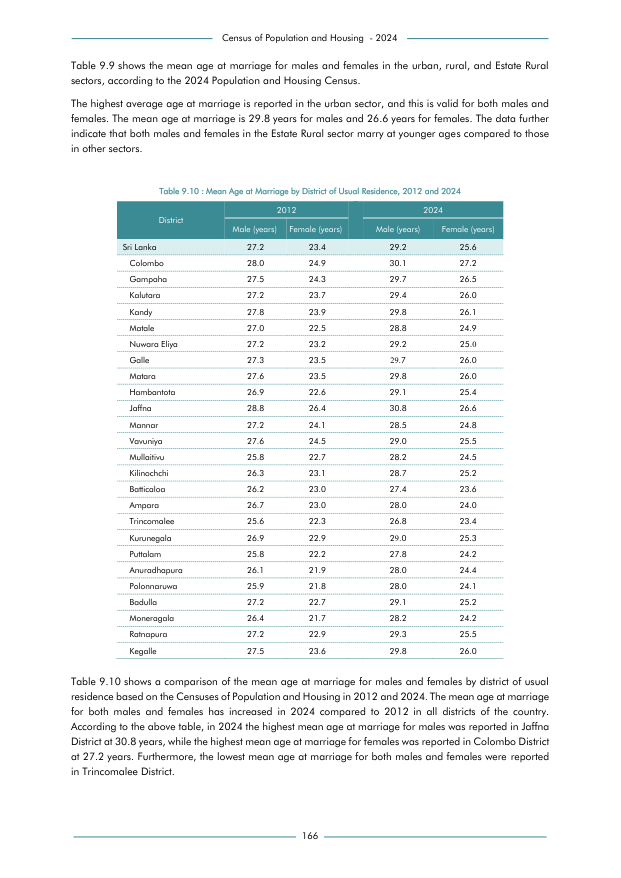

### Source

- [https://www.statistics.gov.lk/Resource/en/Population/CPH_2024/CPH2024_Final_Eng.pdf](https://www.statistics.gov.lk/Resource/en/Population/CPH_2024/CPH2024_Final_Eng.pdf) (Table 9.10)

## 114. [Mean Age at Marriage by Ethnic Group, 2024](data/final-report-tables/chapter-9/9.11-Mean-Age-at-Marriage-by-Ethnic-Group,-2024)
*🔴 Table was detected in PDF, but not parsed into textual data.*

### Original Table


### Source

- [https://www.statistics.gov.lk/Resource/en/Population/CPH_2024/CPH2024_Final_Eng.pdf](https://www.statistics.gov.lk/Resource/en/Population/CPH_2024/CPH2024_Final_Eng.pdf) (Table 9.11)

## 115. [Percentage Distribution of Ever-Married Women Aged 15 Years and Over by the Number of Live Births perWoman and Sector, 2024](data/final-report-tables/chapter-9/9.12-Percentage-Distribution-of-Ever-Married-Women-Aged-15-Years-and-Over-by-the-Number-of-Live-Births-perWoman-and-Sector,-2024)
*🔴 Table was detected in PDF, but not parsed into textual data.*

### Original Table


### Source

- [https://www.statistics.gov.lk/Resource/en/Population/CPH_2024/CPH2024_Final_Eng.pdf](https://www.statistics.gov.lk/Resource/en/Population/CPH_2024/CPH2024_Final_Eng.pdf) (Table 9.12)

## 116. [Number and Percentage Distribution of Married Women Aged 15–49 Years by Age Group, 2012 and 2024](data/final-report-tables/chapter-9/9.13-Number-and-Percentage-Distribution-of-Married-Women-Aged-15–49-Years-by-Age-Group,-2012-and-2024)
*🔴 Table was detected in PDF, but not parsed into textual data.*

### Original Table

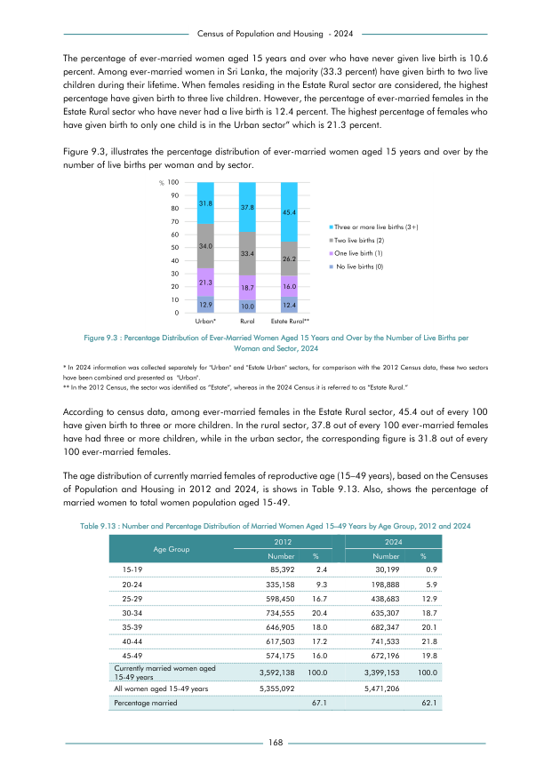

### Source

- [https://www.statistics.gov.lk/Resource/en/Population/CPH_2024/CPH2024_Final_Eng.pdf](https://www.statistics.gov.lk/Resource/en/Population/CPH_2024/CPH2024_Final_Eng.pdf) (Table 9.13)

## 117. [Age-Specific Fertility Rates (ASFR), 2012 and 2024](data/final-report-tables/chapter-9/9.14-Age-Specific-Fertility-Rates-(ASFR),-2012-and-2024)
*🔴 Table was detected in PDF, but not parsed into textual data.*

### Original Table

,-2012-and-2024/original.png)

### Source

- [https://www.statistics.gov.lk/Resource/en/Population/CPH_2024/CPH2024_Final_Eng.pdf](https://www.statistics.gov.lk/Resource/en/Population/CPH_2024/CPH2024_Final_Eng.pdf) (Table 9.14)

## 118. [Total Fertility Rate (TFR), 1981, 2012 and 2024](data/final-report-tables/chapter-9/9.15-Total-Fertility-Rate-(TFR),-1981,-2012-and-2024)
*🔴 Table was detected in PDF, but not parsed into textual data.*

### Original Table

,-1981,-2012-and-2024/original.png)

### Source

- [https://www.statistics.gov.lk/Resource/en/Population/CPH_2024/CPH2024_Final_Eng.pdf](https://www.statistics.gov.lk/Resource/en/Population/CPH_2024/CPH2024_Final_Eng.pdf) (Table 9.15)

## 119. [Age-Specific Fertility Rate (ASFR), Age-Specific Marital Fertility Rate (ASMFR), Total Fertility Rate (TFR) andTotal Marital Fertility Rate (TMFR)](data/final-report-tables/chapter-9/9.16-Age-Specific-Fertility-Rate-(ASFR),-Age-Specific-Marital-Fertility-Rate-(ASMFR),-Total-Fertility-Rate-(TFR)-andTotal-Marital-Fertility-Rate-(TMFR))
*🔴 Table was detected in PDF, but not parsed into textual data.*

### Original Table

,-Age-Specific-Marital-Fertility-Rate-(ASMFR),-Total-Fertility-Rate-(TFR)-andTotal-Marital-Fertility-Rate-(TMFR)/original.png)

### Source

- [https://www.statistics.gov.lk/Resource/en/Population/CPH_2024/CPH2024_Final_Eng.pdf](https://www.statistics.gov.lk/Resource/en/Population/CPH_2024/CPH2024_Final_Eng.pdf) (Table 9.16)

## 120. [Gross Reproduction Rate Using TFR and TMFR](data/final-report-tables/chapter-9/9.17-Gross-Reproduction-Rate-Using-TFR-and-TMFR)
*🔴 Table was detected in PDF, but not parsed into textual data.*

### Original Table

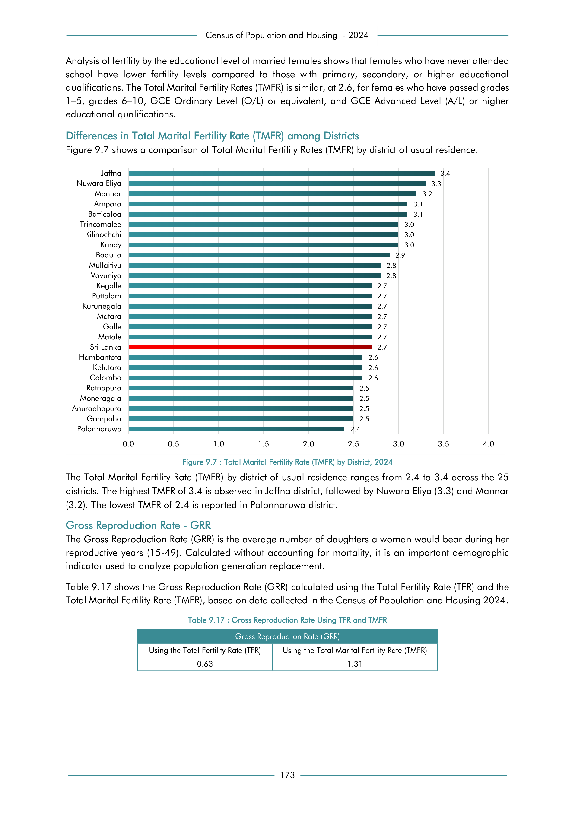

### Source

- [https://www.statistics.gov.lk/Resource/en/Population/CPH_2024/CPH2024_Final_Eng.pdf](https://www.statistics.gov.lk/Resource/en/Population/CPH_2024/CPH2024_Final_Eng.pdf) (Table 9.17)

## 121. [Percentage Distribution of Household Size by Sector, 2024](data/final-report-tables/chapter-10/10.1-Percentage-Distribution-of-Household-Size-by-Sector,-2024)
*🟠 Raw Text Data was extracted from PDF, but not parsed into structured data.*

### Raw Data (first 10 rows)

| Col 1 | Col 2 | Col 3 | Col 4 | Col 5 | Col 6 | Col 7 | Col 8 | Col 9 | Col 10 | Col 11 |
| :-- | :-- | :-- | :-- | :-- | :-- | :-- | :-- | :-- | :-- | :-- |
|  |  | Table 10.1 : Percentage Distribution of Household Size by Sector, 2024 |  |  |  |  |  |  |  |  |
|  | Total Number |  |  |  | Household Size |  |  |  |  | Average |
| Sector | of |  |  |  |  |  |  |  |  | Household |
|  |  |  |  |  |  |  |  | 7 & |  |  |
|  | Households |  |  |  |  |  |  |  |  | Size |
|  |  | 1 | 2 | 3 | 4 | 5 | 6 |  | Total |  |
|  |  |  |  |  |  |  |  | Over |  |  |
| Total | 6,111,315 | 10.5 | 18.1 | 21.0 | 25.0 | 15.9 | 6.4 | 3.1 | 100.0 | 3.5 |
| Urban* | 1,045,665 | 10.6 | 17.7 | 20.5 | 25.8 | 15.1 | 6.4 | 3.9 | 100.0 | 3.5 |
| Rural | 4,827,055 | 10.4 | 18.2 | 21.3 | 25.0 | 15.9 | 6.3 | 2.9 | 100.0 | 3.5 |

### Source

- [https://www.statistics.gov.lk/Resource/en/Population/CPH_2024/CPH2024_Final_Eng.pdf](https://www.statistics.gov.lk/Resource/en/Population/CPH_2024/CPH2024_Final_Eng.pdf) (Table 10.1)

## 122. [Percentage Distribution of the Number and of Households by Sector, District and Household Type, 2024](data/final-report-tables/chapter-10/10.2-Percentage-Distribution-of-the-Number-and-of-Households-by-Sector,-District-and-Household-Type,-2024)
*🔴 Table was detected in PDF, but not parsed into textual data.*

### Original Table

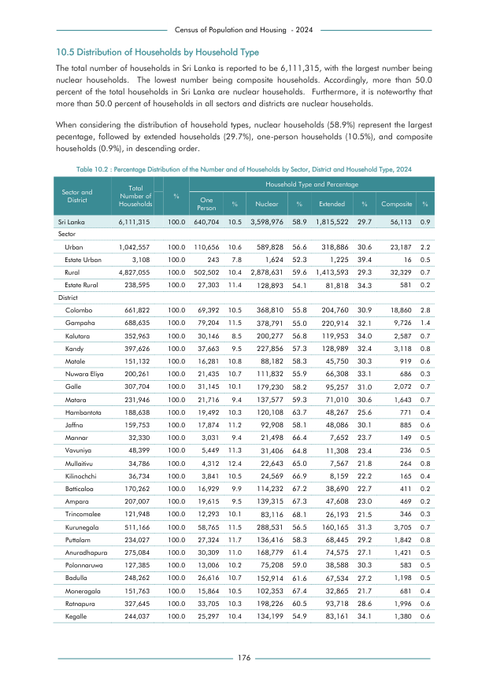

### Source

- [https://www.statistics.gov.lk/Resource/en/Population/CPH_2024/CPH2024_Final_Eng.pdf](https://www.statistics.gov.lk/Resource/en/Population/CPH_2024/CPH2024_Final_Eng.pdf) (Table 10.2)

## 123. [Percentage Distribution of the Number of Household Heads by Ethnic group of the Head of Household and typeof Household, 2024](data/final-report-tables/chapter-10/10.3-Percentage-Distribution-of-the-Number-of-Household-Heads-by-Ethnic-group-of-the-Head-of-Household-and-typeof-Household,-2024)
*🔴 Table was detected in PDF, but not parsed into textual data.*

### Original Table

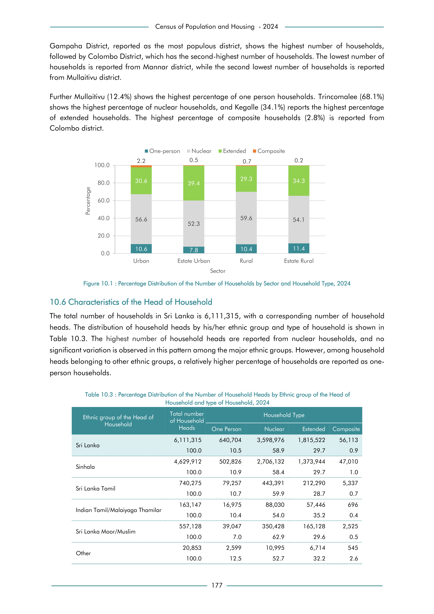

### Source

- [https://www.statistics.gov.lk/Resource/en/Population/CPH_2024/CPH2024_Final_Eng.pdf](https://www.statistics.gov.lk/Resource/en/Population/CPH_2024/CPH2024_Final_Eng.pdf) (Table 10.3)

## 124. [Percentage Distribution of the Number of Household Heads by Sex, Age Group, and Sector, 2024](data/final-report-tables/chapter-10/10.4-Percentage-Distribution-of-the-Number-of-Household-Heads-by-Sex,-Age-Group,-and-Sector,-2024)
*🟠 Raw Text Data was extracted from PDF, but not parsed into structured data.*

### Raw Data (first 10 rows)

| Col 1 | Col 2 | Col 3 | Col 4 | Col 5 | Col 6 | Col 7 |
| :-- | :-- | :-- | :-- | :-- | :-- | :-- |
|  | Total Number | Sex of the Head of Household |  |  | Age Group of the Head of Household |  |
| Sector | of Household |  |  |  |  |  |
|  | Heads |  |  | Aged below |  | Aged 65 & |
|  |  | Male | Female |  | Age 20-64 |  |
|  |  |  |  | 20 |  | over |
|  | 6,111,315 | 4,489,242 | 1,622,073 | 8,709 | 4,581,256 | 1,521,350 |
| Sri Lanka |  |  |  |  |  |  |
|  | 100.0 | 73.5 | 26.5 | 0.1 | 75.0 | 24.9 |
| U | 1,042,557 | 736,435 | 306,122 | 1,838 | 782,406 | 258,313 |
| rban |  |  |  |  |  |  |

### Source

- [https://www.statistics.gov.lk/Resource/en/Population/CPH_2024/CPH2024_Final_Eng.pdf](https://www.statistics.gov.lk/Resource/en/Population/CPH_2024/CPH2024_Final_Eng.pdf) (Table 10.4)

## 125. [Percentage Distribution of the Number of Household Heads by District, Sex, and Age Group, 2024](data/final-report-tables/chapter-10/10.5-Percentage-Distribution-of-the-Number-of-Household-Heads-by-District,-Sex,-and-Age-Group,-2024)
*🔴 Table was detected in PDF, but not parsed into textual data.*

### Original Table

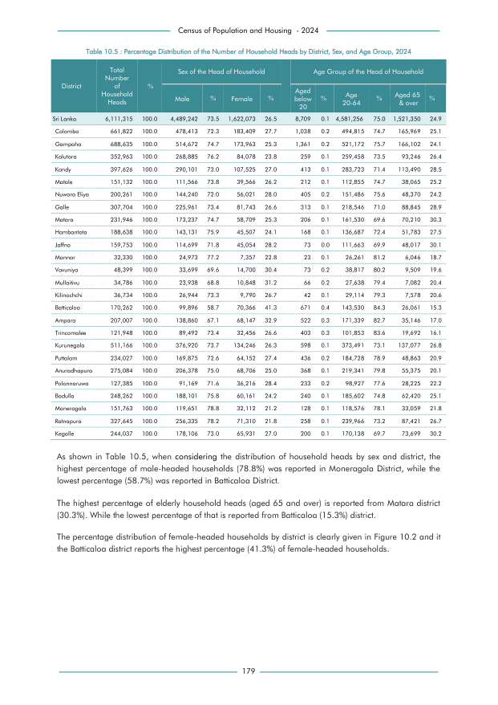

### Source

- [https://www.statistics.gov.lk/Resource/en/Population/CPH_2024/CPH2024_Final_Eng.pdf](https://www.statistics.gov.lk/Resource/en/Population/CPH_2024/CPH2024_Final_Eng.pdf) (Table 10.5)

## 126. [Percentage Distribution of the Number of Household Heads by Sector and Marital Status, 2024](data/final-report-tables/chapter-10/10.6-Percentage-Distribution-of-the-Number-of-Household-Heads-by-Sector-and-Marital-Status,-2024)
*🔴 Table was detected in PDF, but not parsed into textual data.*

### Original Table

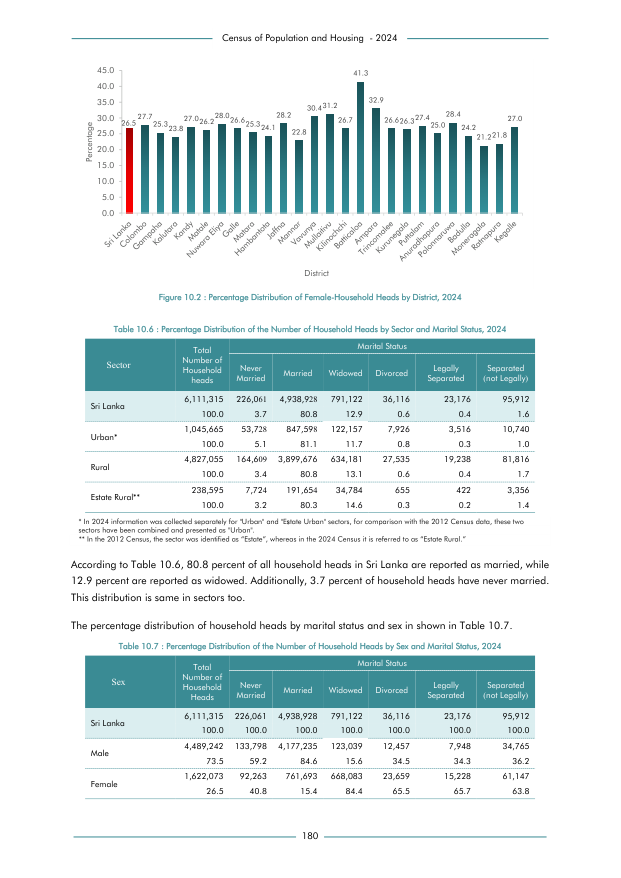

### Source

- [https://www.statistics.gov.lk/Resource/en/Population/CPH_2024/CPH2024_Final_Eng.pdf](https://www.statistics.gov.lk/Resource/en/Population/CPH_2024/CPH2024_Final_Eng.pdf) (Table 10.6)

## 127. [Percentage Distribution of the Number of Household Heads by Sex and Marital Status, 2024](data/final-report-tables/chapter-10/10.7-Percentage-Distribution-of-the-Number-of-Household-Heads-by-Sex-and-Marital-Status,-2024)
*🔴 Table was detected in PDF, but not parsed into textual data.*

### Original Table


### Source

- [https://www.statistics.gov.lk/Resource/en/Population/CPH_2024/CPH2024_Final_Eng.pdf](https://www.statistics.gov.lk/Resource/en/Population/CPH_2024/CPH2024_Final_Eng.pdf) (Table 10.7)

## 128. [Percentage Distribution of Household Heads by Highest Educational Qualification Obtained and Sector, 2024](data/final-report-tables/chapter-10/10.8-Percentage-Distribution-of-Household-Heads-by-Highest-Educational-Qualification-Obtained-and-Sector,-2024)
*🔴 Table was detected in PDF, but not parsed into textual data.*

### Original Table

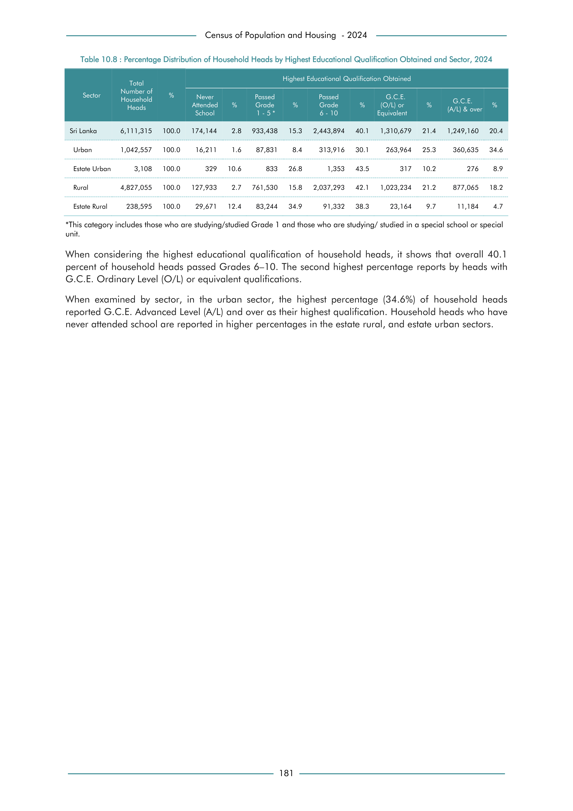

### Source

- [https://www.statistics.gov.lk/Resource/en/Population/CPH_2024/CPH2024_Final_Eng.pdf](https://www.statistics.gov.lk/Resource/en/Population/CPH_2024/CPH2024_Final_Eng.pdf) (Table 10.8)

## 129. [Percentage Distribution of Household Heads by District and Highest Educational Qualification Obtained,](data/final-report-tables/chapter-10/10.9-Percentage-Distribution-of-Household-Heads-by-District-and-Highest-Educational-Qualification-Obtained,)
*🟠 Raw Text Data was extracted from PDF, but not parsed into structured data.*

### Raw Data (first 10 rows)

| Col 1 | Col 2 | Col 3 | Col 4 | Col 5 | Col 6 | Col 7 | Col 8 | Col 9 | Col 10 | Col 11 | Col 12 | Col 13 |
| :-- | :-- | :-- | :-- | :-- | :-- | :-- | :-- | :-- | :-- | :-- | :-- | :-- |
|  |  |  |  |  |  |  | Highest Educational Qualification Obtained |  |  |  |  |  |
|  | Total |  |  |  |  |  |  |  |  |  |  |  |
|  | Number of |  |  |  |  |  |  |  |  |  |  |  |
| District |  | % | Never |  | Passed |  | Passed |  | G.C.E. |  |  |  |
|  | Household |  |  |  |  |  |  |  |  |  | G.C.E. |  |
|  |  |  | attended | % | grade | % | grade | % | (O/L) or | % |  | % |
|  | heads |  |  |  |  |  |  |  |  |  | (A/L) & over |  |
|  |  |  | school |  | 1 - 5 * |  | 6 - 10 |  | equivalent |  |  |  |
| Sri Lanka | 6,111,315 | 100.0 | 174,144 | 2.8 | 933,438 | 15.3 | 2,443,894 | 40.1 | 1,310,679 | 21.4 | 1,249,160 | 20.4 |
| Colombo | 661,822 | 100.0 | 9,113 | 1.4 | 41,277 | 6.2 | 189,119 | 28.6 | 178,500 | 27.0 | 243,813 | 36.8 |

### Source

- [https://www.statistics.gov.lk/Resource/en/Population/CPH_2024/CPH2024_Final_Eng.pdf](https://www.statistics.gov.lk/Resource/en/Population/CPH_2024/CPH2024_Final_Eng.pdf) (Table 10.9)

## 130. [and Percentage Distribution of Individuals in One Person Households Aged 60 Years and Over, by Sexand Age Group, 2024](data/final-report-tables/chapter-10/10.10:-and-Percentage-Distribution-of-Individuals-in-One-Person-Households-Aged-60-Years-and-Over,-by-Sexand-Age-Group,-2024)
*🔴 Table was detected in PDF, but not parsed into textual data.*

### Original Table

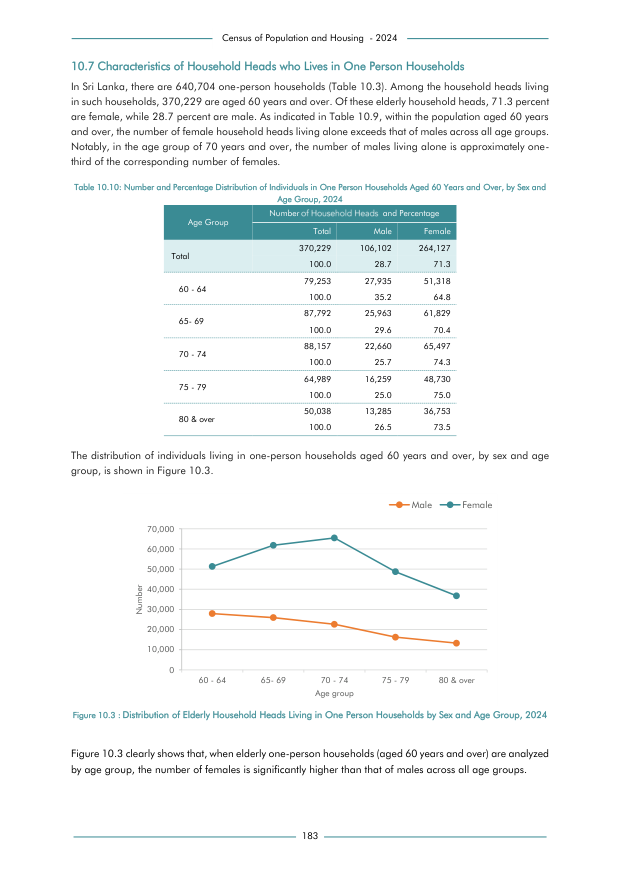

### Source

- [https://www.statistics.gov.lk/Resource/en/Population/CPH_2024/CPH2024_Final_Eng.pdf](https://www.statistics.gov.lk/Resource/en/Population/CPH_2024/CPH2024_Final_Eng.pdf) (Table 10.10:)

## 131. [Number of Occupied Housing Units by Sector, 2012 and 2024](data/final-report-tables/chapter-11/11.1-Number-of-Occupied-Housing-Units-by-Sector,-2012-and-2024)
*🔴 Table was detected in PDF, but not parsed into textual data.*

### Original Table

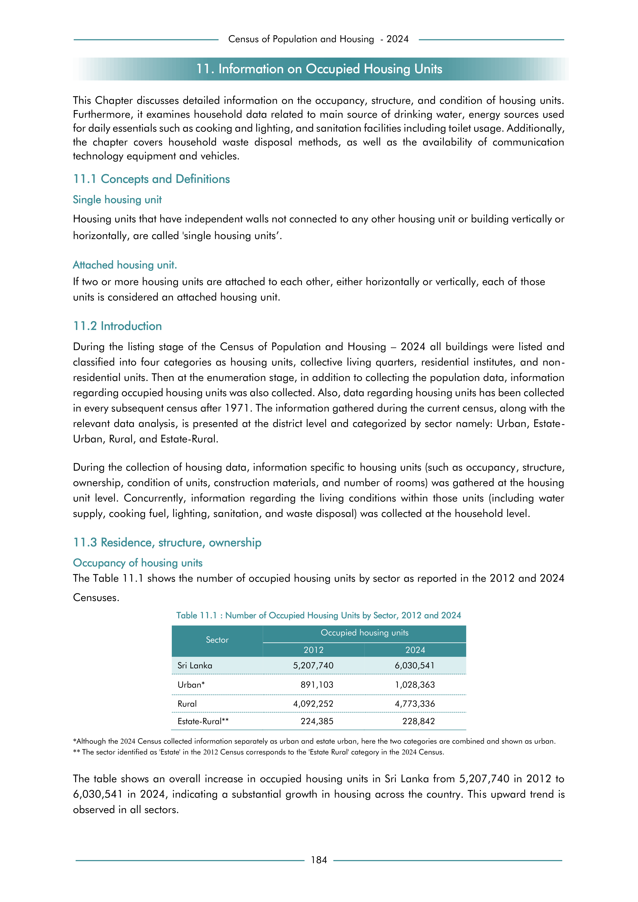

### Source

- [https://www.statistics.gov.lk/Resource/en/Population/CPH_2024/CPH2024_Final_Eng.pdf](https://www.statistics.gov.lk/Resource/en/Population/CPH_2024/CPH2024_Final_Eng.pdf) (Table 11.1)

## 132. [Number of Occupied Housing Units & Permanently Closed/Vacant Housing Units by District, 2012 and 2024](data/final-report-tables/chapter-11/11.2-Number-of-Occupied-Housing-Units-&-Permanently-Closed/Vacant-Housing-Units-by-District,-2012-and-2024)
*🟠 Raw Text Data was extracted from PDF, but not parsed into structured data.*

### Raw Data (first 10 rows)

| Col 1 |
| :-- |
| Census of Population and Housing  - 2024 |
| The rural sector accounts for the largest share of occupied housing units, increasing from 4,092,252 to |
| 4,773,336, and continues to dominate the national total. The urban sector also records a notable increase, |
| rising from 891,103 to 1,028,363, reflecting ongoing urban expansion. In contrast, the estate sector shows |
| only a marginal increase, from 224,385 to 228,842, suggesting relatively slow growth in housing within |
| estate areas compared to the other sectors. |

### Source

- [https://www.statistics.gov.lk/Resource/en/Population/CPH_2024/CPH2024_Final_Eng.pdf](https://www.statistics.gov.lk/Resource/en/Population/CPH_2024/CPH2024_Final_Eng.pdf) (Table 11.2)

## 133. [Number of Housing Units by the Year of Construction, 2024](data/final-report-tables/chapter-11/11.3-Number-of-Housing-Units-by-the-Year-of-Construction,-2024)
*🟠 Raw Text Data was extracted from PDF, but not parsed into structured data.*

### Raw Data (first 10 rows)

| Col 1 | Col 2 | Col 3 |
| :-- | :-- | :-- |
| Year | Housing units | Percentage |
| Total* | 6,029,330 | 100.0 |
| 2024 | 107,031 | 1.8 |
| 2023 | 117,352 | 1.9 |
| 2022 | 152,976 | 2.5 |
| 2021 | 144,164 | 2.4 |
| 2020 | 216,142 | 3.6 |
| 2019 | 199,745 | 3.3 |
| 2018 | 323,965 | 5.4 |
| 2017 -2013 | 780,280 | 12.9 |

### Source

- [https://www.statistics.gov.lk/Resource/en/Population/CPH_2024/CPH2024_Final_Eng.pdf](https://www.statistics.gov.lk/Resource/en/Population/CPH_2024/CPH2024_Final_Eng.pdf) (Table 11.3)

## 134. [Tenure of Housing Units by Sector and District, 2024](data/final-report-tables/chapter-11/11.4-Tenure-of-Housing-Units-by-Sector-and-District,-2024)
*🔴 Table was detected in PDF, but not parsed into textual data.*

### Original Table

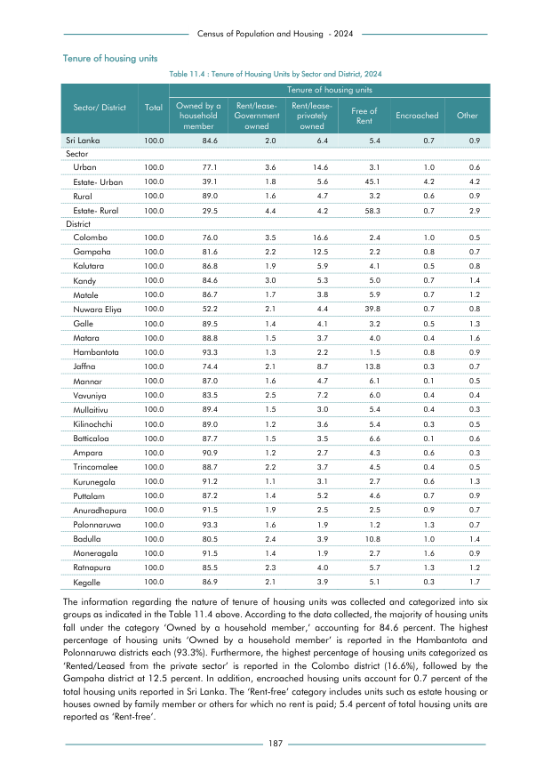

### Source

- [https://www.statistics.gov.lk/Resource/en/Population/CPH_2024/CPH2024_Final_Eng.pdf](https://www.statistics.gov.lk/Resource/en/Population/CPH_2024/CPH2024_Final_Eng.pdf) (Table 11.4)

## 135. [Percentage of Housing Units Owned by Household Members and Sector, 2012 and 2024](data/final-report-tables/chapter-11/11.5-Percentage-of-Housing-Units-Owned-by-Household-Members-and-Sector,-2012-and-2024)
*🔴 Table was detected in PDF, but not parsed into textual data.*

### Original Table

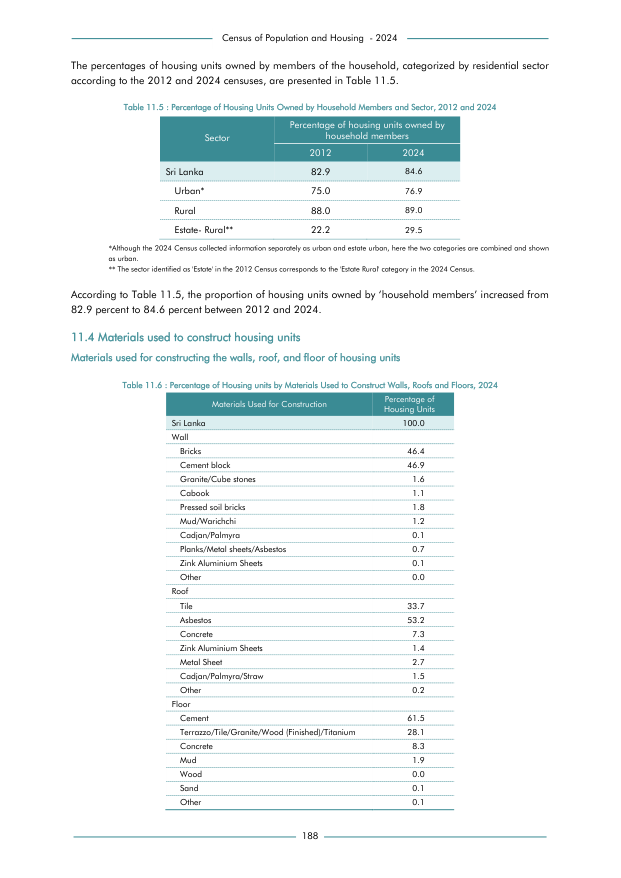

### Source

- [https://www.statistics.gov.lk/Resource/en/Population/CPH_2024/CPH2024_Final_Eng.pdf](https://www.statistics.gov.lk/Resource/en/Population/CPH_2024/CPH2024_Final_Eng.pdf) (Table 11.5)

## 136. [Percentage of Housing units by Materials Used to Construct Walls, Roofs and Floors,](data/final-report-tables/chapter-11/11.6-Percentage-of-Housing-units-by-Materials-Used-to-Construct-Walls,-Roofs-and-Floors,)
*🔴 Table was detected in PDF, but not parsed into textual data.*

### Original Table


### Source

- [https://www.statistics.gov.lk/Resource/en/Population/CPH_2024/CPH2024_Final_Eng.pdf](https://www.statistics.gov.lk/Resource/en/Population/CPH_2024/CPH2024_Final_Eng.pdf) (Table 11.6)

## 137. [of Housing Units and Status of Housing Units, by Sector and District, 2024](data/final-report-tables/chapter-11/11.7-of-Housing-Units-and-Status-of-Housing-Units,-by-Sector-and-District,-2024)
*🔴 Table was detected in PDF, but not parsed into textual data.*

### Original Table

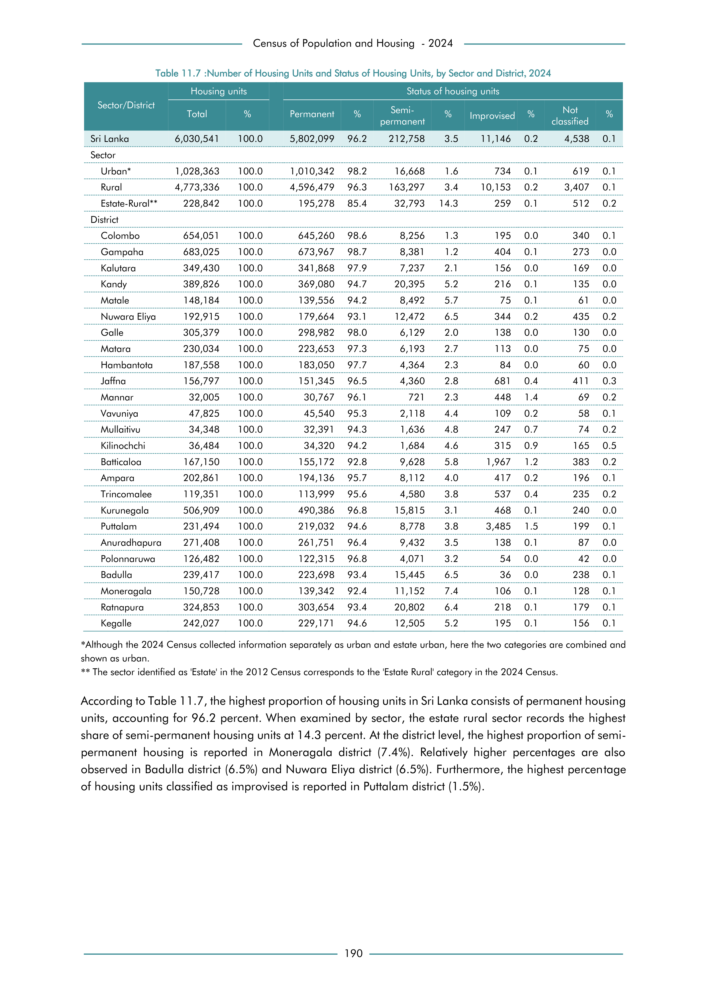

### Source

- [https://www.statistics.gov.lk/Resource/en/Population/CPH_2024/CPH2024_Final_Eng.pdf](https://www.statistics.gov.lk/Resource/en/Population/CPH_2024/CPH2024_Final_Eng.pdf) (Table 11.7)

## 138. [in Housing Units by Sector, 2024](data/final-report-tables/chapter-11/11.8-in-Housing-Units-by-Sector,-2024)
*🔴 Table was detected in PDF, but not parsed into textual data.*

### Original Table


### Source

- [https://www.statistics.gov.lk/Resource/en/Population/CPH_2024/CPH2024_Final_Eng.pdf](https://www.statistics.gov.lk/Resource/en/Population/CPH_2024/CPH2024_Final_Eng.pdf) (Table 11.8)

## 139. [Distribution of Households by Main Source of Drinking Water, 2024](data/final-report-tables/chapter-11/11.9-Distribution-of-Households-by-Main-Source-of-Drinking-Water,-2024)
*🔴 Table was detected in PDF, but not parsed into textual data.*

### Original Table


### Source

- [https://www.statistics.gov.lk/Resource/en/Population/CPH_2024/CPH2024_Final_Eng.pdf](https://www.statistics.gov.lk/Resource/en/Population/CPH_2024/CPH2024_Final_Eng.pdf) (Table 11.9)

## 140. [Percentage Distribution of Households by Availability of Drinking Water Facility, by Sector and District,](data/final-report-tables/chapter-11/11.10-Percentage-Distribution-of-Households-by-Availability-of-Drinking-Water-Facility,-by-Sector-and-District,)
*🔴 Table was detected in PDF, but not parsed into textual data.*

### Original Table


### Source

- [https://www.statistics.gov.lk/Resource/en/Population/CPH_2024/CPH2024_Final_Eng.pdf](https://www.statistics.gov.lk/Resource/en/Population/CPH_2024/CPH2024_Final_Eng.pdf) (Table 11.10)

## 141. [Distribution of Households in Sri Lanka's ability to Obtain Drinking Water Throughout the Year, 2024](data/final-report-tables/chapter-11/11.11-Distribution-of-Households-in-Sri-Lanka's-ability-to-Obtain-Drinking-Water-Throughout-the-Year,-2024)
*🟠 Raw Text Data was extracted from PDF, but not parsed into structured data.*

### Raw Data (first 10 rows)

| Col 1 | Col 2 | Col 3 | Col 4 | Col 5 | Col 6 | Col 7 |
| :-- | :-- | :-- | :-- | :-- | :-- | :-- |
|  | Table 11.11 : Distribution of Households in Sri Lanka's ability to Obtain Drinking Water Throughout the Year, 2024 |  |  |  |  |  |
|  |  |  | Ability to obtain drinking water throughout the year |  |  |  |
|  |  |  |  |  | Households |  |
| Main source of |  |  |  |  |  |  |
|  |  |  | Households with |  |  |  |
|  | Total |  |  |  | without water |  |
| drinking water |  |  |  |  |  |  |
|  |  |  | water facilities |  |  |  |
|  |  | Percentage |  | Percentage | supply for at | Percentage |
|  | households |  | throughout the |  |  |  |

### Source

- [https://www.statistics.gov.lk/Resource/en/Population/CPH_2024/CPH2024_Final_Eng.pdf](https://www.statistics.gov.lk/Resource/en/Population/CPH_2024/CPH2024_Final_Eng.pdf) (Table 11.11)

## 142. [Percentage of households Using Firewood and gas, by Sector and District,](data/final-report-tables/chapter-11/11.12-Percentage-of-households-Using-Firewood-and-gas,-by-Sector-and-District,)
*🔴 Table was detected in PDF, but not parsed into textual data.*

### Original Table

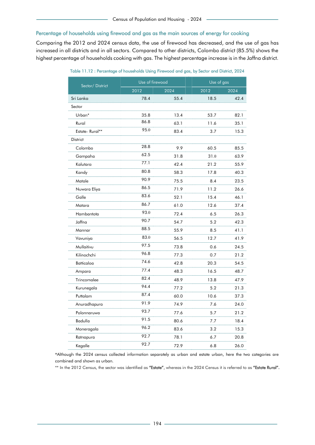

### Source

- [https://www.statistics.gov.lk/Resource/en/Population/CPH_2024/CPH2024_Final_Eng.pdf](https://www.statistics.gov.lk/Resource/en/Population/CPH_2024/CPH2024_Final_Eng.pdf) (Table 11.12)

## 143. [Household Numbers and Percentages by Main and Secondary Energy/Fuel Type for Lighting, 2024](data/final-report-tables/chapter-11/11.13-Household-Numbers-and-Percentages-by-Main-and-Secondary-Energy/Fuel-Type-for-Lighting,-2024)
*🟠 Raw Text Data was extracted from PDF, but not parsed into structured data.*

### Raw Data (first 10 rows)

| Col 1 | Col 2 | Col 3 | Col 4 | Col 5 |
| :-- | :-- | :-- | :-- | :-- |
|  | Table 11.13 : Household Numbers and Percentages by Main and Secondary Energy/Fuel Type for Lighting, 2024 |  |  |  |
|  | Main source |  | Secondary source |  |
| Energy/fuel type |  |  |  |  |
|  | Number | Percentage | Number | Percentage |
| Total | 6,111,315 | 100.0 | 6,111,315 | 100.0 |
| Electricity - National grid/Rural hydro power project | 5,987,585 | 98.0 | 7,323 | 0.1 |
| Kerosene lamp | 95,150 | 1.6 | 2,789,215 | 45.6 |
| Solar power (grid connected) | 8,093 | 0.1 | 23,548 | 0.4 |
| Solar power (standalone) | 5,817 | 0.1 | 27,598 | 0.5 |
| Other* | 14,670 | 0.2 | 40,628 | 0.7 |

### Source

- [https://www.statistics.gov.lk/Resource/en/Population/CPH_2024/CPH2024_Final_Eng.pdf](https://www.statistics.gov.lk/Resource/en/Population/CPH_2024/CPH2024_Final_Eng.pdf) (Table 11.13)

## 144. [Percentage of Households Using Electricity and Kerosene as the Main Sources of Lighting, by ResidentialSector, 2012 and 2024](data/final-report-tables/chapter-11/11.14-Percentage-of-Households-Using-Electricity-and-Kerosene-as-the-Main-Sources-of-Lighting,-by-ResidentialSector,-2012-and-2024)
*🔴 Table was detected in PDF, but not parsed into textual data.*

### Original Table


### Source

- [https://www.statistics.gov.lk/Resource/en/Population/CPH_2024/CPH2024_Final_Eng.pdf](https://www.statistics.gov.lk/Resource/en/Population/CPH_2024/CPH2024_Final_Eng.pdf) (Table 11.14)

## 145. [Percentage Distribution of Households by Type of Toilet Facilities, 2012 and 2024](data/final-report-tables/chapter-11/11.15-Percentage-Distribution-of-Households-by-Type-of-Toilet-Facilities,-2012-and-2024)
*🔴 Table was detected in PDF, but not parsed into textual data.*

### Original Table

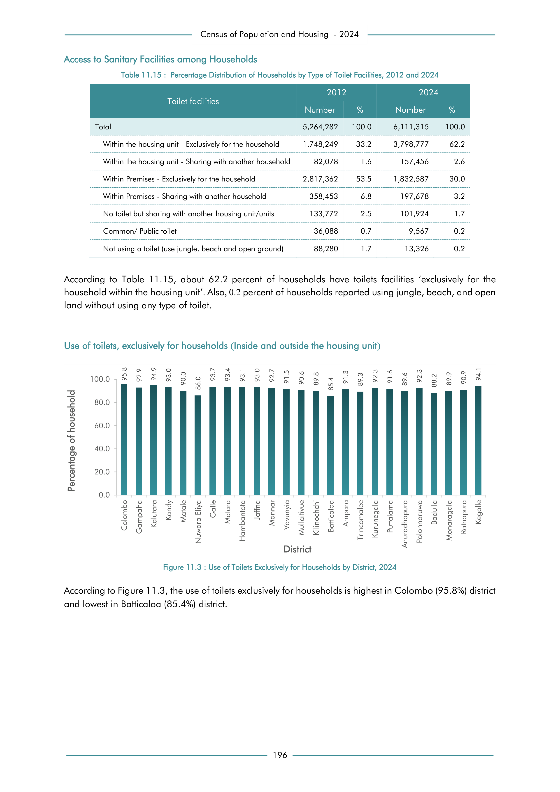

### Source

- [https://www.statistics.gov.lk/Resource/en/Population/CPH_2024/CPH2024_Final_Eng.pdf](https://www.statistics.gov.lk/Resource/en/Population/CPH_2024/CPH2024_Final_Eng.pdf) (Table 11.15)

## 146. [Percentage Distribution of Type of Toilet Used by households by Sector and District, 2024](data/final-report-tables/chapter-11/11.16-Percentage-Distribution-of-Type-of-Toilet-Used-by-households-by-Sector-and-District,-2024)
*🟠 Raw Text Data was extracted from PDF, but not parsed into structured data.*

### Raw Data (first 10 rows)

| Col 1 | Col 2 | Col 3 | Col 4 | Col 5 | Col 6 |
| :-- | :-- | :-- | :-- | :-- | :-- |
|  |  |  | Type of toilet |  |  |
| Sector/District | Total |  |  |  |  |
|  |  | Water-sealed | Not water-sealed |  | Other |
| Sri Lanka | 100.0 | 99.5 |  | 0.4 | 0.1 |
| Sector |  |  |  |  |  |
| Urban |  | 99.9 |  | 0.1 | 0.0 |
| Estate- Urban |  | 100.0 |  | 0.0 | 0.0 |
| Rural |  | 99.5 |  | 0.4 | 0.1 |
| Estate- Rural |  | 98.6 |  | 1.4 | 0.0 |
| District |  |  |  |  |  |

### Source

- [https://www.statistics.gov.lk/Resource/en/Population/CPH_2024/CPH2024_Final_Eng.pdf](https://www.statistics.gov.lk/Resource/en/Population/CPH_2024/CPH2024_Final_Eng.pdf) (Table 11.16)

## 147. [Distribution of Households by the Main Method of Disposing Solid Waste, 2024](data/final-report-tables/chapter-11/11.17:-Distribution-of-Households-by-the-Main-Method-of-Disposing-Solid-Waste,-2024)
*🟠 Raw Text Data was extracted from PDF, but not parsed into structured data.*

### Raw Data (first 10 rows)

| Col 1 | Col 2 | Col 3 | Col 4 | Col 5 | Col 6 |
| :-- | :-- | :-- | :-- | :-- | :-- |
|  |  |  |  | Sector |  |
| Method of disposing solid waste | Sri Lanka |  | Estate- |  | Estate- |
|  |  | Urban |  | Rural |  |
|  |  |  | Urban |  | Rural |
| Total number of households | 6,111,315 | 1,042,557 | 3,108 | 4,827,055 | 238,595 |
|  |  | Disposal of easy decaying waste |  |  |  |
| Total | 100.0 | 100.0 | 100.0 | 100.0 | 100.0 |
| By the local authority | 23.9 | 81.9 | 43.0 | 12.4 | 2.7 |
| Occupants burn | 34.2 | 8.4 | 28.2 | 39.7 | 35.7 |
| Occupants dispose within the premises | 34.5 | 6.3 | 13.4 | 40.4 | 38.0 |

### Source

- [https://www.statistics.gov.lk/Resource/en/Population/CPH_2024/CPH2024_Final_Eng.pdf](https://www.statistics.gov.lk/Resource/en/Population/CPH_2024/CPH2024_Final_Eng.pdf) (Table 11.17:)

## 148. [Percentage Distribution of Households by the Main Method of Disposing Liquid Waste, 2024](data/final-report-tables/chapter-11/11.18-Percentage-Distribution-of-Households-by-the-Main-Method-of-Disposing-Liquid-Waste,-2024)
*🔴 Table was detected in PDF, but not parsed into textual data.*

### Original Table


### Source

- [https://www.statistics.gov.lk/Resource/en/Population/CPH_2024/CPH2024_Final_Eng.pdf](https://www.statistics.gov.lk/Resource/en/Population/CPH_2024/CPH2024_Final_Eng.pdf) (Table 11.18)

## 149. [Percentage Distribution of Households Using Communication Technology Equipment and Vehicles by Sector,2024](data/final-report-tables/chapter-11/11.19-Percentage-Distribution-of-Households-Using-Communication-Technology-Equipment-and-Vehicles-by-Sector,2024)
*🔴 Table was detected in PDF, but not parsed into textual data.*

### Original Table

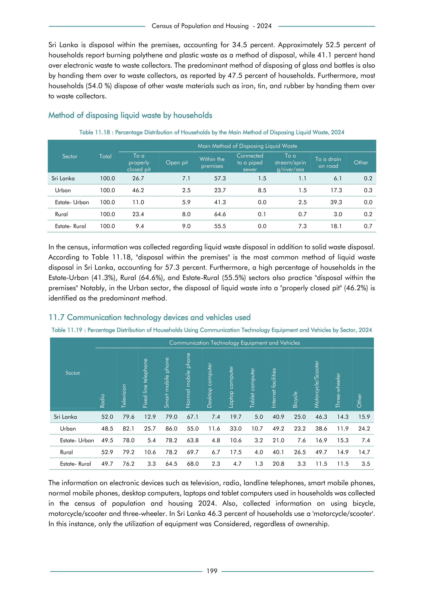

### Source

- [https://www.statistics.gov.lk/Resource/en/Population/CPH_2024/CPH2024_Final_Eng.pdf](https://www.statistics.gov.lk/Resource/en/Population/CPH_2024/CPH2024_Final_Eng.pdf) (Table 11.19)

## 150. [Myer’s Index by Sex, 1981, 2001, 2012 and 2024](data/final-report-tables/chapter-12/12.1-Myer’s-Index-by-Sex,-1981,-2001,-2012-and-2024)
*🟠 Raw Text Data was extracted from PDF, but not parsed into structured data.*

### Raw Data (first 10 rows)

| Col 1 | Col 2 | Col 3 | Col 4 | Col 5 |
| :-- | :-- | :-- | :-- | :-- |
|  | Table 12.1 : Myer’s Index by Sex, 1981, 2001, 2012 and 2024 |  |  |  |
|  |  | Myers’ Index |  |  |
| Sex |  |  |  |  |
|  | 1981 | 2001* | 2012 | 2024 |
| Both sexes | 9.7 | 2.7 | 1.7 | 1.2 |
| Male | 8.7 | 2.7 | 1.8 | 1.2 |
| Female | 11.2 | 3.0 | 1.7 | 1.1 |

### Source

- [https://www.statistics.gov.lk/Resource/en/Population/CPH_2024/CPH2024_Final_Eng.pdf](https://www.statistics.gov.lk/Resource/en/Population/CPH_2024/CPH2024_Final_Eng.pdf) (Table 12.1)

## 151. [Deviations of Terminal Digits of Reported Age, 2012 and](data/final-report-tables/chapter-12/12.2-Deviations-of-Terminal-Digits-of-Reported-Age,-2012-and)
*🔴 Table was detected in PDF, but not parsed into textual data.*

### Original Table

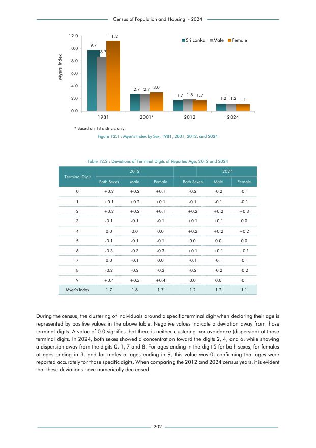

### Source

- [https://www.statistics.gov.lk/Resource/en/Population/CPH_2024/CPH2024_Final_Eng.pdf](https://www.statistics.gov.lk/Resource/en/Population/CPH_2024/CPH2024_Final_Eng.pdf) (Table 12.2)

## 152. [Myers' Index by District and Sex, 2012, 2024](data/final-report-tables/chapter-12/12.3-Myers'-Index-by-District-and-Sex,-2012,-2024)
*🔴 Table was detected in PDF, but not parsed into textual data.*

### Original Table

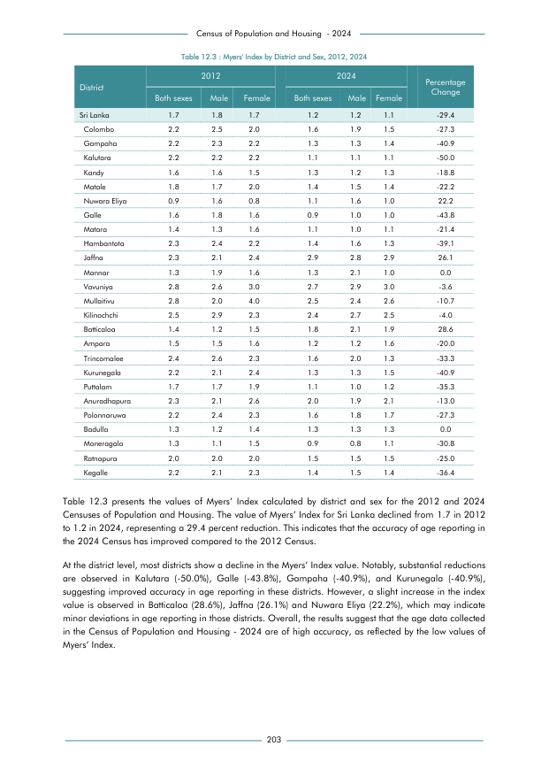

### Source

- [https://www.statistics.gov.lk/Resource/en/Population/CPH_2024/CPH2024_Final_Eng.pdf](https://www.statistics.gov.lk/Resource/en/Population/CPH_2024/CPH2024_Final_Eng.pdf) (Table 12.3)

## 153. [Whipple’s Index by Sex, 1981, 2001, 2012 and 2024](data/final-report-tables/chapter-12/12.4-Whipple’s-Index-by-Sex,-1981,-2001,-2012-and-2024)
*🔴 Table was detected in PDF, but not parsed into textual data.*

### Original Table

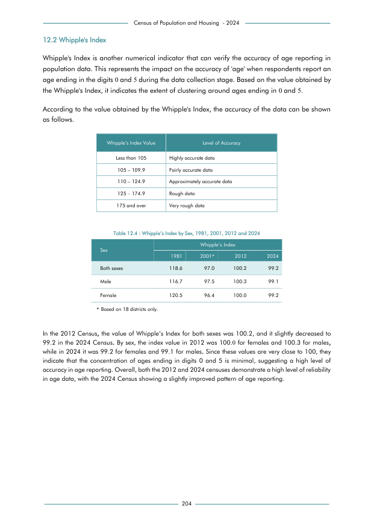

### Source

- [https://www.statistics.gov.lk/Resource/en/Population/CPH_2024/CPH2024_Final_Eng.pdf](https://www.statistics.gov.lk/Resource/en/Population/CPH_2024/CPH2024_Final_Eng.pdf) (Table 12.4)

## 154. [Whipple's Index by District and Sex, 2012 and 2024](data/final-report-tables/chapter-12/12.5-Whipple's-Index-by-District-and-Sex,-2012-and-2024)
*🔴 Table was detected in PDF, but not parsed into textual data.*

### Original Table

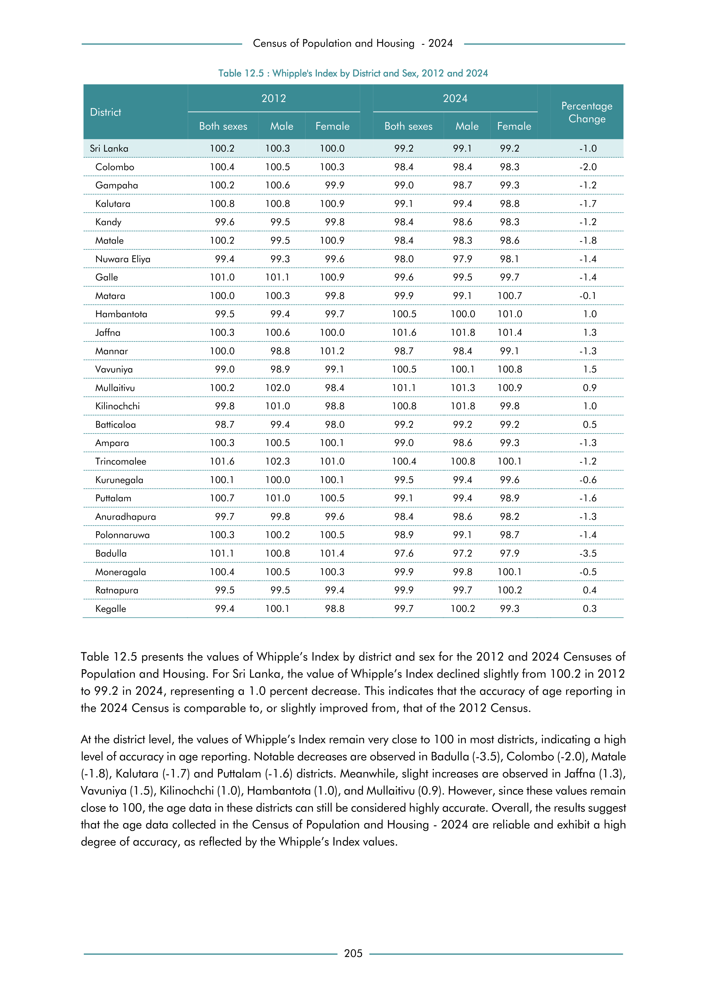

### Source

- [https://www.statistics.gov.lk/Resource/en/Population/CPH_2024/CPH2024_Final_Eng.pdf](https://www.statistics.gov.lk/Resource/en/Population/CPH_2024/CPH2024_Final_Eng.pdf) (Table 12.5)


[](https://opensource.org/licenses/MIT)
