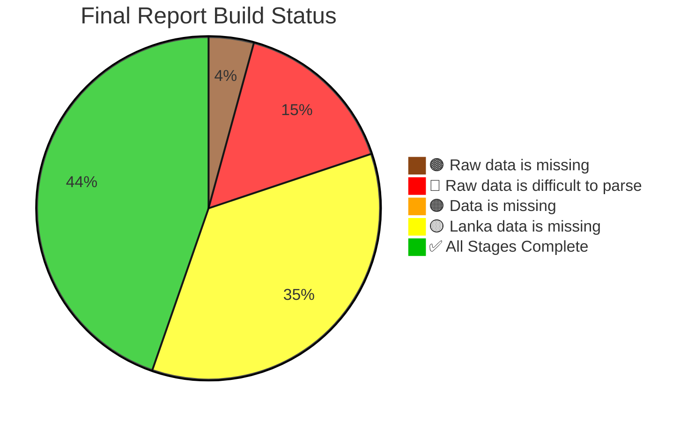

# 🇱🇰 Sri Lanka - Census of Population and Housing 2024

**154** Datasets on Population, Housing and more, by Country, Province, District, Divisional Secretariat Division (DSD), Grama Niladhari Division (GND), Electoral District (ED), Polling Division (PD), and Local Government Authority (LG) levels.

- **12** Datasets from Excel Files shared on the Website of the [Department of Census and Statistics, Sri Lanka](https://www.statistics.gov.lk/Population/StaticalInformation/CPH2024),
- **142** Datasets from the [Final Report of the Census](https://www.statistics.gov.lk/Resource/en/Population/CPH_2024/CPH2024_Final_Eng.pdf)

## Datasets from Excel Files (**12**)

*Large tables at GND level detail, on a small set of topics.*

- [Population-Gender](data/Population-Gender)
- [Population-Ethnicity](data/Population-Ethnicity)
- [Population-Religion](data/Population-Religion)
- [Population-AgeGroup](data/Population-AgeGroup)
- [Housing-Structure](data/Housing-Structure)
- [Housing-Walls](data/Housing-Walls)
- [Housing-Floor](data/Housing-Floor)
- [Housing-Roof](data/Housing-Roof)
- [Housing-Water](data/Housing-Water)
- [Housing-Cooking-Fuel](data/Housing-Cooking-Fuel)
- [Housing-Lighting](data/Housing-Lighting)
- [Housing-Toilet](data/Housing-Toilet)

## Datasets from Final Report (**142**)

*Smaller tables spanning a wide range of topics.*

### Chapter 1

- ✅ Table 1.1.1 - [Officers who have  Assigned for Census of Population and Housing 2024 Activities](data/final-report-tables/chapter-1/1.1.1-Officers-who-have--Assigned-for-Census-of-Population-and-Housing-2024-Activities/README.md)
- ✅ Table 1.1.2 - [The Questions and Topics Included in the Censuses of Sri Lanka 1871 - 2024](data/final-report-tables/chapter-1/1.1.2-The-Questions-and-Topics-Included-in-the-Censuses-of-Sri-Lanka-1871---2024/README.md)

### Chapter 2

- ✅ Table 2.1 - [Evolution of the Number of Administrative Districts In Sri Lanka from 1871 to 2024](data/final-report-tables/chapter-2/2.1-Evolution-of-the-Number-of-Administrative-Districts-In-Sri-Lanka-from-1871-to-2024/README.md)
- ✅ Table 2.2 - [Administrative Structure by District, 1981](data/final-report-tables/chapter-2/2.2-Administrative-Structure-by-District,-1981/README.md)
- ✅ Table 2.3 - [Administrative Structure by District, 2012](data/final-report-tables/chapter-2/2.3-Administrative-Structure-by-District,-2012/README.md)
- ✅ Table 2.4 - [Administrative Structure by District, 2024](data/final-report-tables/chapter-2/2.4-Administrative-Structure-by-District,-2024/README.md)

### Chapter 3

- ✅ Table 3.1 - [Total Population, Intercensal Increase and Average Annual Growth Rate by Census Year, 1871 - 2024](data/final-report-tables/chapter-3/3.1-Total-Population,-Intercensal-Increase-and-Average-Annual-Growth-Rate-by-Census-Year,-1871---2024/README.md)
- ✅ Table 3.2 - [Distribution of Population by Province and District, 2024](data/final-report-tables/chapter-3/3.2-Distribution-of-Population-by-Province-and-District,-2024/README.md)
- ✅ Table 3.3 - [Population and Average Annual Growth Rate by District, Census Years 1981- 2024](data/final-report-tables/chapter-3/3.3-Population-and-Average-Annual-Growth-Rate-by-District,-Census-Years-1981--2024/README.md)
- ✅ Table 3.4 - [Population Density by District, 1981, 2001, 2012 and 2024](data/final-report-tables/chapter-3/3.4-Population-Density-by-District,-1981,-2001,-2012-and-2024/README.md)
- ✅ Table 3.5 - [Distribution of Population by Sector, 2012 and 2024](data/final-report-tables/chapter-3/3.5-Distribution-of-Population-by-Sector,-2012-and-2024/README.md)
- ✅ Table 3.6 - [Population Distribution by District and Sector, 2024](data/final-report-tables/chapter-3/3.6-Population-Distribution-by-District-and-Sector,-2024/README.md)

### Chapter 5

- ✅ Table 5.1.1 - [Lifetime Migrants by District of Dirth and District of Usual Residence,](data/final-report-tables/chapter-5/5.1.1-Lifetime-Migrants-by-District-of-Dirth-and-District-of-Usual-Residence,/README.md)
- ✅ Table 5.1.2 - [In, Out and Net Lifetime Migrants by District, 2024](data/final-report-tables/chapter-5/5.1.2-In,-Out-and-Net-Lifetime-Migrants-by-District,-2024/README.md)
- 🟡 Table 5.1.3 - [Largest Migration Flows of Lifetime Migrants by District of Usual Residence, 2024](data/final-report-tables/chapter-5/5.1.3-Largest-Migration-Flows-of-Lifetime-Migrants-by-District-of-Usual-Residence,-2024/README.md)
- 🟡 Table 5.1.4 - [Largest Migration Flows of Lifetime Migrants who have Migrated Out of their District of Birth, 2024](data/final-report-tables/chapter-5/5.1.4-Largest-Migration-Flows-of-Lifetime-Migrants-who-have-Migrated-Out-of-their-District-of-Birth,-2024/README.md)
- ✅ Table 5.1.5 - [In-migration, Out-migration, and Net Migration by District,](data/final-report-tables/chapter-5/5.1.5-In-migration,-Out-migration,-and-Net-Migration-by-District,/README.md)
- ✅ Table 5.1.6 - [In-migrants by District of Usual Residence and Duration of Residence, 2024](data/final-report-tables/chapter-5/5.1.6-In-migrants-by-District-of-Usual-Residence-and-Duration-of-Residence,-2024/README.md)
- 🔴 Table 5.1.7 - [Reasons for Migration from District of Previous Residence to District of Usual Residence, 2024](data/final-report-tables/chapter-5/5.1.7-Reasons-for-Migration-from-District-of-Previous-Residence-to-District-of-Usual-Residence,-2024/README.md)
- ✅ Table 5.1.8 - [Distribution of the Usually Resident Population of a District by their Permanent Residence, 2024](data/final-report-tables/chapter-5/5.1.8-Distribution-of-the-Usually-Resident-Population-of-a-District-by-their-Permanent-Residence,-2024/README.md)
- ✅ Table 5.2.1 - [Population Temporarily Living Abroad by District and Sex, 2024](data/final-report-tables/chapter-5/5.2.1-Population-Temporarily-Living-Abroad-by-District-and-Sex,-2024/README.md)
- 🔴 Table 5.2.2 - [Population Temporarily Living Abroad by Sector, Sex and Age Group, 2024](data/final-report-tables/chapter-5/5.2.2-Population-Temporarily-Living-Abroad-by-Sector,-Sex-and-Age-Group,-2024/README.md)
- ✅ Table 5.2.3 - [Population Temporarily Living Abroad by District and Main Reason for Living in Abroad, 2024](data/final-report-tables/chapter-5/5.2.3-Population-Temporarily-Living-Abroad-by-District-and-Main-Reason-for-Living-in-Abroad,-2024/README.md)
- ✅ Table 5.2.4 - [Population Temporarily Living Abroad by Main Reason for Living Abroad and Age Group, 2024](data/final-report-tables/chapter-5/5.2.4-Population-Temporarily-Living-Abroad-by-Main-Reason-for-Living-Abroad-and-Age-Group,-2024/README.md)
- 🔴 Table 5.2.5 - [Population Temporarily Living Abroad, by Main Reason for Living Abroad, Country of Residence and Sex,](data/final-report-tables/chapter-5/5.2.5-Population-Temporarily-Living-Abroad,-by-Main-Reason-for-Living-Abroad,-Country-of-Residence-and-Sex,/README.md)

### Chapter 6

- 🟡 Table 6.1.1 - [Total Population, Sex ratio and the Percentage of Male and Female, 1946-2024](data/final-report-tables/chapter-6/6.1.1-Total-Population,-Sex-ratio-and-the-Percentage-of-Male-and-Female,-1946-2024/README.md)
- ✅ Table 6.1.2 - [Sex Ratio by Sector, 2024](data/final-report-tables/chapter-6/6.1.2-Sex-Ratio-by-Sector,-2024/README.md)
- 🟡 Table 6.1.3 - [Population by Age Groups and Sex, 2012 and](data/final-report-tables/chapter-6/6.1.3-Population-by-Age-Groups-and-Sex,-2012-and/README.md)
- ✅ Table 6.1.4 - [Percentage Distribution of Population by Age Group, 1946–2024](data/final-report-tables/chapter-6/6.1.4-Percentage-Distribution-of-Population-by-Age-Group,-1946–2024/README.md)
- 🟡 Table 6.1.5 - [Population Over and Below 18 Years of Age by Sector and District, 2024](data/final-report-tables/chapter-6/6.1.5-Population-Over-and-Below-18-Years-of-Age-by-Sector-and-District,-2024/README.md)
- 🔴 Table 6.1.6 - [Elderly Population and Sex Ratio by Age Groups, 2012 and 2024](data/final-report-tables/chapter-6/6.1.6-Elderly-Population-and-Sex-Ratio-by-Age-Groups,-2012-and-2024/README.md)
- ✅ Table 6.1.7 - [Median Age of the Population, 1946-2024](data/final-report-tables/chapter-6/6.1.7-Median-Age-of-the-Population,-1946-2024/README.md)
- ✅ Table 6.1.8 - [Population Distribution by Ethnic Group, 2024](data/final-report-tables/chapter-6/6.1.8-Population-Distribution-by-Ethnic-Group,-2024/README.md)
- ✅ Table 6.1.9 - [Percentage Distribution of the Population by Ethnic Group and Province, 2024](data/final-report-tables/chapter-6/6.1.9-Percentage-Distribution-of-the-Population-by-Ethnic-Group-and-Province,-2024/README.md)
- ✅ Table 6.1.10 - [Population by Ethnic Group, 1911 - 2024 (in](data/final-report-tables/chapter-6/6.1.10-Population-by-Ethnic-Group,-1911---2024-(in/README.md)
- 🟡 Table 6.1.11 - [Distribution of Population by Ethnic Group and District, 2012 and 2024](data/final-report-tables/chapter-6/6.1.11-Distribution-of-Population-by-Ethnic-Group-and-District,-2012-and-2024/README.md)
- 🟡 Table 6.1.12 - [Percentage Distribution of Population by Ethnic Group and District, 2012 and 2024](data/final-report-tables/chapter-6/6.1.12-Percentage-Distribution-of-Population-by-Ethnic-Group-and-District,-2012-and-2024/README.md)
- 🔴 Table 6.1.13 - [Population and Percentage Distribution by Sector and Religion, 2024](data/final-report-tables/chapter-6/6.1.13-Population-and-Percentage-Distribution-by-Sector-and-Religion,-2024/README.md)
- ✅ Table 6.1.14 - [Distribution of Population by Religion and District, 2012](data/final-report-tables/chapter-6/6.1.14-Distribution-of-Population-by-Religion-and-District,-2012/README.md)
- ✅ Table 6.1.15 - [Distribution of Population by Religion and District, 2024](data/final-report-tables/chapter-6/6.1.15-Distribution-of-Population-by-Religion-and-District,-2024/README.md)
- 🔴 Table 6.2.1 - [Distribution of the Population Aged 5 Years and Over by Level of Physical and Mental Difficulties for EachFunctional Domain, 2024](data/final-report-tables/chapter-6/6.2.1-Distribution-of-the-Population-Aged-5-Years-and-Over-by-Level-of-Physical-and-Mental-Difficulties-for-EachFunctional-Domain,-2024/README.md)
- 🟠 Table 6.2.2 - [Distribution of Persons Aged 5 Years and Over with Physical and Mental Difficulties by District and Difficulties,2024](data/final-report-tables/chapter-6/6.2.2-Distribution-of-Persons-Aged-5-Years-and-Over-with-Physical-and-Mental-Difficulties-by-District-and-Difficulties,2024/README.md)
- ✅ Table 6.2.3 - [Distribution of Persons Aged 5 Years and Over with Physical and Mental Difficulties by Age Group andDifficulties, 2024](data/final-report-tables/chapter-6/6.2.3-Distribution-of-Persons-Aged-5-Years-and-Over-with-Physical-and-Mental-Difficulties-by-Age-Group-andDifficulties,-2024/README.md)
- 🔴 Table 6.2.4 - [Distribution of Persons Aged 5 Years and Over with Disabilities by Sex and Domain of Disability, 2024](data/final-report-tables/chapter-6/6.2.4-Distribution-of-Persons-Aged-5-Years-and-Over-with-Disabilities-by-Sex-and-Domain-of-Disability,-2024/README.md)
- 🔴 Table 6.2.5 - [Distribution of Persons Aged 5 Years and Over with Disabilities by Sector and Domain of Disability, 2024](data/final-report-tables/chapter-6/6.2.5-Distribution-of-Persons-Aged-5-Years-and-Over-with-Disabilities-by-Sector-and-Domain-of-Disability,-2024/README.md)
- ✅ Table 6.2.6 - [Distribution of Persons Aged 5 Years and Over with Disabilities by District and Domain of Disability, 2024](data/final-report-tables/chapter-6/6.2.6-Distribution-of-Persons-Aged-5-Years-and-Over-with-Disabilities-by-District-and-Domain-of-Disability,-2024/README.md)
- ✅ Table 6.2.7 - [Distribution of Persons Aged 5 Years and Over with Disabilities by Age Group and Domain of Disability,](data/final-report-tables/chapter-6/6.2.7-Distribution-of-Persons-Aged-5-Years-and-Over-with-Disabilities-by-Age-Group-and-Domain-of-Disability,/README.md)
- ✅ Table 6.2.8 - [Distribution of Persons with a Single Disability and with Multiple Disabilities by Age Group, 2024](data/final-report-tables/chapter-6/6.2.8-Distribution-of-Persons-with-a-Single-Disability-and-with-Multiple-Disabilities-by-Age-Group,-2024/README.md)
- 🟤 Table 6.2.9 - [Distribution of Persons Aged 5 Years and Over with Disabilities by Marital Status and Sex, 2024](data/final-report-tables/chapter-6/6.2.9-Distribution-of-Persons-Aged-5-Years-and-Over-with-Disabilities-by-Marital-Status-and-Sex,-2024/README.md)
- 🟡 Table 6.2.10 - [Distribution of Persons Aged 5 Years and Over with Disabilities by Highest Educational Qualification and Sex,2024](data/final-report-tables/chapter-6/6.2.10-Distribution-of-Persons-Aged-5-Years-and-Over-with-Disabilities-by-Highest-Educational-Qualification-and-Sex,2024/README.md)
- ✅ Table 6.2.11 - [Distribution of Persons Aged 5 Years and Over with Disabilities by Marital Status and Domain of Disability,2024](data/final-report-tables/chapter-6/6.2.11-Distribution-of-Persons-Aged-5-Years-and-Over-with-Disabilities-by-Marital-Status-and-Domain-of-Disability,2024/README.md)
- ✅ Table 6.2.12 - [Distribution of Persons Aged 5 Years and Over with Disabilities by Highest Educational Qualification andDomain of Disability, 2024](data/final-report-tables/chapter-6/6.2.12-Distribution-of-Persons-Aged-5-Years-and-Over-with-Disabilities-by-Highest-Educational-Qualification-andDomain-of-Disability,-2024/README.md)
- 🔴 Table 6.2.13 - [Economic Activities of Persons Aged 15 Years and Over with Disabilities, 2024](data/final-report-tables/chapter-6/6.2.13-Economic-Activities-of-Persons-Aged-15-Years-and-Over-with-Disabilities,-2024/README.md)
- 🔴 Table 6.2.14 - [Economic Activity of Persons Aged 15 Years and Over with Disabilities by Domain of Disability, 2024](data/final-report-tables/chapter-6/6.2.14-Economic-Activity-of-Persons-Aged-15-Years-and-Over-with-Disabilities-by-Domain-of-Disability,-2024/README.md)
- 🔴 Table 6.3.1 - [Number of Persons Reporting and Not Reporting Diseases, 2024](data/final-report-tables/chapter-6/6.3.1-Number-of-Persons-Reporting-and-Not-Reporting-Diseases,-2024/README.md)
- 🟡 Table 6.3.2 - [Prevalence Rates of the Population with at Least One Non-Communicable Disease by Age Group and Sex,](data/final-report-tables/chapter-6/6.3.2-Prevalence-Rates-of-the-Population-with-at-Least-One-Non-Communicable-Disease-by-Age-Group-and-Sex,/README.md)
- 🟡 Table 6.3.3 - [Number of Individuals Living with Non-Communicable Diseases and Prevalence Rates, 2024](data/final-report-tables/chapter-6/6.3.3-Number-of-Individuals-Living-with-Non-Communicable-Diseases-and-Prevalence-Rates,-2024/README.md)
- ✅ Table 6.3.4 - [Prevalence Rates of Non-Communicable Diseases by District, 2024](data/final-report-tables/chapter-6/6.3.4-Prevalence-Rates-of-Non-Communicable-Diseases-by-District,-2024/README.md)
- ✅ Table 6.3.5 - [Prevalence Rates of Self-Reported Illnesses by Sector, 2024](data/final-report-tables/chapter-6/6.3.5-Prevalence-Rates-of-Self-Reported-Illnesses-by-Sector,-2024/README.md)
- 🟤 Table 6.3.6 - [Prevalence Rates of Non-Communicable Diseases by Sex, 2024](data/final-report-tables/chapter-6/6.3.6-Prevalence-Rates-of-Non-Communicable-Diseases-by-Sex,-2024/README.md)
- 🟡 Table 6.3.7 - [Prevalence Rates of Non-Communicable Diseases by Age Group, 2024](data/final-report-tables/chapter-6/6.3.7-Prevalence-Rates-of-Non-Communicable-Diseases-by-Age-Group,-2024/README.md)
- 🟤 Table 6.3.8 - [Prevalence Rates of Non-Communicable Diseases by Broad Age Groups, 2024](data/final-report-tables/chapter-6/6.3.8-Prevalence-Rates-of-Non-Communicable-Diseases-by-Broad-Age-Groups,-2024/README.md)
- ✅ Table 6.3.9 - [Prevalence Rates of Non-Communicable Diseases by Marital Status, 2024](data/final-report-tables/chapter-6/6.3.9-Prevalence-Rates-of-Non-Communicable-Diseases-by-Marital-Status,-2024/README.md)
- ✅ Table 6.3.10 - [Prevalence Rates of Non-Communicable Diseases by Ethnic Group, 2024](data/final-report-tables/chapter-6/6.3.10-Prevalence-Rates-of-Non-Communicable-Diseases-by-Ethnic-Group,-2024/README.md)
- ✅ Table 6.3.11 - [Prevalence Rates for the Population Aged 25 and Over by Highest Educational Qualification, 2024](data/final-report-tables/chapter-6/6.3.11-Prevalence-Rates-for-the-Population-Aged-25-and-Over-by-Highest-Educational-Qualification,-2024/README.md)
- ✅ Table 6.3.12 - [Prevalence Rates of NCDs by Employment Status, 2024](data/final-report-tables/chapter-6/6.3.12-Prevalence-Rates-of-NCDs-by-Employment-Status,-2024/README.md)

### Chapter 7

- ✅ Table 7.1 - [Population Aged 3 Years and Over by Sex and Educational Activity During the Census Reference Period,](data/final-report-tables/chapter-7/7.1-Population-Aged-3-Years-and-Over-by-Sex-and-Educational-Activity-During-the-Census-Reference-Period,/README.md)
- ✅ Table 7.2 - [Percentage Pistribution of Population Aged 03 Years and Over by Educational Activity and Age Group, 2024](data/final-report-tables/chapter-7/7.2-Percentage-Pistribution-of-Population-Aged-03-Years-and-Over-by-Educational-Activity-and-Age-Group,-2024/README.md)
- 🟡 Table 7.3 - [Children Enrolled in Pre-school Education During the Reference Period by Age, 2024](data/final-report-tables/chapter-7/7.3-Children-Enrolled-in-Pre-school-Education-During-the-Reference-Period-by-Age,-2024/README.md)
- ✅ Table 7.4 - [Percentage of Children Receiving Preschool Education by Age Group and District, 2024](data/final-report-tables/chapter-7/7.4-Percentage-of-Children-Receiving-Preschool-Education-by-Age-Group-and-District,-2024/README.md)
- 🟡 Table 7.5 - [Population Engaged in School Education During the Reference Period by Age Group and Sex,](data/final-report-tables/chapter-7/7.5-Population-Engaged-in-School-Education-During-the-Reference-Period-by-Age-Group-and-Sex,/README.md)
- 🔴 Table 7.6 - [The Educational Level of the Population Age 25 Years and Over by Sex, 2012 and 2024](data/final-report-tables/chapter-7/7.6-The-Educational-Level-of-the-Population-Age-25-Years-and-Over-by-Sex,-2012-and-2024/README.md)
- 🟡 Table 7.7 - [Percentage Distribution of Population Aged 25 and Over by Educational Level and District, 2012 and 2024](data/final-report-tables/chapter-7/7.7-Percentage-Distribution-of-Population-Aged-25-and-Over-by-Educational-Level-and-District,-2012-and-2024/README.md)
- 🟡 Table 7.8 - [Language Literacy Rate by Census Year and Sex, 2024](data/final-report-tables/chapter-7/7.8-Language-Literacy-Rate-by-Census-Year-and-Sex,-2024/README.md)
- 🟡 Table 7.9 - [Language Literacy Rate by Language and Age Group, 2024](data/final-report-tables/chapter-7/7.9-Language-Literacy-Rate-by-Language-and-Age-Group,-2024/README.md)
- ✅ Table 7.10 - [Language Literacy Rate by Language and District, 2024](data/final-report-tables/chapter-7/7.10-Language-Literacy-Rate-by-Language-and-District,-2024/README.md)
- 🟡 Table 7.11 - [Language Literacy Rate by Language and Ethnic Group, 2012 and 2024](data/final-report-tables/chapter-7/7.11-Language-Literacy-Rate-by-Language-and-Ethnic-Group,-2012-and-2024/README.md)
- 🟡 Table 7.12 - [Computer and Digital Literacy Rate by Sector,2024](data/final-report-tables/chapter-7/7.12-Computer-and-Digital-Literacy-Rate-by-Sector,2024/README.md)
- 🟡 Table 7.13 - [Computer and Digital Literacy Rate by District, 2024](data/final-report-tables/chapter-7/7.13-Computer-and-Digital-Literacy-Rate-by-District,-2024/README.md)
- 🟡 Table 7.14 - [Computer and Digital Literacy Rate by Age Group,](data/final-report-tables/chapter-7/7.14-Computer-and-Digital-Literacy-Rate-by-Age-Group,/README.md)

### Chapter 8

- ✅ Table 8.1 - [Economically Active and Inactive Population by Sex, 2024](data/final-report-tables/chapter-8/8.1-Economically-Active-and-Inactive-Population-by-Sex,-2024/README.md)
- ✅ Table 8.2 - [Economically Active Population, by Sector and Sex, 2024](data/final-report-tables/chapter-8/8.2-Economically-Active-Population,-by-Sector-and-Sex,-2024/README.md)
- ✅ Table 8.3 - [Economically Active Population by Sex and Age Group, 2024](data/final-report-tables/chapter-8/8.3-Economically-Active-Population-by-Sex-and-Age-Group,-2024/README.md)
- 🟡 Table 8.4 - [Labour Force Participation Rate by Age Group and Sex, 2024](data/final-report-tables/chapter-8/8.4-Labour-Force-Participation-Rate-by-Age-Group-and-Sex,-2024/README.md)
- 🟡 Table 8.5 - [Labour Force Participation Rate, by Highest Educational Qualification Attained and Sex, 2024](data/final-report-tables/chapter-8/8.5-Labour-Force-Participation-Rate,-by-Highest-Educational-Qualification-Attained-and-Sex,-2024/README.md)
- ✅ Table 8.6 - [Employed Population by Sector and Sex, 2024](data/final-report-tables/chapter-8/8.6-Employed-Population-by-Sector-and-Sex,-2024/README.md)
- ✅ Table 8.7 - [Employed Population, by Highest Educational Attainment and Sex, 2024](data/final-report-tables/chapter-8/8.7-Employed-Population,-by-Highest-Educational-Attainment-and-Sex,-2024/README.md)
- ✅ Table 8.8 - [Employed Population by Employment Status and Sex, 2024](data/final-report-tables/chapter-8/8.8-Employed-Population-by-Employment-Status-and-Sex,-2024/README.md)
- ✅ Table 8.9 - [Unemployed Population by Sector and Sex, 2024](data/final-report-tables/chapter-8/8.9-Unemployed-Population-by-Sector-and-Sex,-2024/README.md)
- ✅ Table 8.10 - [Employment Rate and Unemployment Rate by District, 2024](data/final-report-tables/chapter-8/8.10-Employment-Rate-and-Unemployment-Rate-by-District,-2024/README.md)
- ✅ Table 8.11 - [Economically Inactive Population by Main Reason for Inactivity, 2024](data/final-report-tables/chapter-8/8.11-Economically-Inactive-Population-by-Main-Reason-for-Inactivity,-2024/README.md)

### Chapter 9

- 🔴 Table 9.1 - [by Marital Status, Age Group, and Sex, 2024](data/final-report-tables/chapter-9/9.1-by-Marital-Status,-Age-Group,-and-Sex,-2024/README.md)
- 🔴 Table 9.2 - [Marital Status by Ethnic group and Sex,](data/final-report-tables/chapter-9/9.2-Marital-Status-by-Ethnic-group-and-Sex,/README.md)
- 🟡 Table 9.3 - [Population Aged 15 Years and Over by Marital Status and Sex, 2012 and 2024](data/final-report-tables/chapter-9/9.3-Population-Aged-15-Years-and-Over-by-Marital-Status-and-Sex,-2012-and-2024/README.md)
- 🟡 Table 9.4 - [Percentage of Never-Married Persons within the Age Group by Sex, 1981, 2012, and 2024](data/final-report-tables/chapter-9/9.4-Percentage-of-Never-Married-Persons-within-the-Age-Group-by-Sex,-1981,-2012,-and-2024/README.md)
- 🟡 Table 9.5 - [Percentage of Married Population Aged 15 Years and Over by Age Group, 1981, 2012, and 2024](data/final-report-tables/chapter-9/9.5-Percentage-of-Married-Population-Aged-15-Years-and-Over-by-Age-Group,-1981,-2012,-and-2024/README.md)
- 🟤 Table 9.6 - [Percentage of Widowed Population Aged 15 Years and over, 1981, 2012, and 2024](data/final-report-tables/chapter-9/9.6-Percentage-of-Widowed-Population-Aged-15-Years-and-over,-1981,-2012,-and-2024/README.md)
- 🟡 Table 9.7 - [Number of Divorced or Separated Persons per 10,000 Population Aged 15 Years and Over, 1981, 2012, and](data/final-report-tables/chapter-9/9.7-Number-of-Divorced-or-Separated-Persons-per-10,000-Population-Aged-15-Years-and-Over,-1981,-2012,-and/README.md)
- ✅ Table 9.8 - [Mean Age at Marriage, 1953–2024](data/final-report-tables/chapter-9/9.8-Mean-Age-at-Marriage,-1953–2024/README.md)
- ✅ Table 9.9 - [Mean Age at Marriage by Sector, 2024](data/final-report-tables/chapter-9/9.9-Mean-Age-at-Marriage-by-Sector,-2024/README.md)
- 🟡 Table 9.10 - [Mean Age at Marriage by District of Usual Residence, 2012 and 2024](data/final-report-tables/chapter-9/9.10-Mean-Age-at-Marriage-by-District-of-Usual-Residence,-2012-and-2024/README.md)
- 🟤 Table 9.11 - [Mean Age at Marriage by Ethnic Group, 2024](data/final-report-tables/chapter-9/9.11-Mean-Age-at-Marriage-by-Ethnic-Group,-2024/README.md)
- ✅ Table 9.12 - [Percentage Distribution of Ever-Married Women Aged 15 Years and Over by the Number of Live Births perWoman and Sector, 2024](data/final-report-tables/chapter-9/9.12-Percentage-Distribution-of-Ever-Married-Women-Aged-15-Years-and-Over-by-the-Number-of-Live-Births-perWoman-and-Sector,-2024/README.md)
- 🟡 Table 9.13 - [Number and Percentage Distribution of Married Women Aged 15–49 Years by Age Group, 2012 and 2024](data/final-report-tables/chapter-9/9.13-Number-and-Percentage-Distribution-of-Married-Women-Aged-15–49-Years-by-Age-Group,-2012-and-2024/README.md)
- 🟡 Table 9.14 - [Age-Specific Fertility Rates (ASFR), 2012 and 2024](data/final-report-tables/chapter-9/9.14-Age-Specific-Fertility-Rates-(ASFR),-2012-and-2024/README.md)
- 🟡 Table 9.15 - [Total Fertility Rate (TFR), 1981, 2012 and 2024](data/final-report-tables/chapter-9/9.15-Total-Fertility-Rate-(TFR),-1981,-2012-and-2024/README.md)
- 🟡 Table 9.16 - [Age-Specific Fertility Rate (ASFR), Age-Specific Marital Fertility Rate (ASMFR), Total Fertility Rate (TFR) andTotal Marital Fertility Rate (TMFR)](data/final-report-tables/chapter-9/9.16-Age-Specific-Fertility-Rate-(ASFR),-Age-Specific-Marital-Fertility-Rate-(ASMFR),-Total-Fertility-Rate-(TFR)-andTotal-Marital-Fertility-Rate-(TMFR)/README.md)
- 🔴 Table 9.17 - [Gross Reproduction Rate Using TFR and TMFR](data/final-report-tables/chapter-9/9.17-Gross-Reproduction-Rate-Using-TFR-and-TMFR/README.md)

### Chapter 10

- 🟡 Table 10.1 - [Percentage Distribution of Household Size by Sector, 2024](data/final-report-tables/chapter-10/10.1-Percentage-Distribution-of-Household-Size-by-Sector,-2024/README.md)
- ✅ Table 10.2 - [Percentage Distribution of the Number and of Households by Sector, District and Household Type, 2024](data/final-report-tables/chapter-10/10.2-Percentage-Distribution-of-the-Number-and-of-Households-by-Sector,-District-and-Household-Type,-2024/README.md)
- 🔴 Table 10.3 - [Percentage Distribution of the Number of Household Heads by Ethnic group of the Head of Household and typeof Household, 2024](data/final-report-tables/chapter-10/10.3-Percentage-Distribution-of-the-Number-of-Household-Heads-by-Ethnic-group-of-the-Head-of-Household-and-typeof-Household,-2024/README.md)
- 🔴 Table 10.4 - [Percentage Distribution of the Number of Household Heads by Sex, Age Group, and Sector, 2024](data/final-report-tables/chapter-10/10.4-Percentage-Distribution-of-the-Number-of-Household-Heads-by-Sex,-Age-Group,-and-Sector,-2024/README.md)
- 🟡 Table 10.5 - [Percentage Distribution of the Number of Household Heads by District, Sex, and Age Group, 2024](data/final-report-tables/chapter-10/10.5-Percentage-Distribution-of-the-Number-of-Household-Heads-by-District,-Sex,-and-Age-Group,-2024/README.md)
- 🔴 Table 10.6 - [Percentage Distribution of the Number of Household Heads by Sector and Marital Status, 2024](data/final-report-tables/chapter-10/10.6-Percentage-Distribution-of-the-Number-of-Household-Heads-by-Sector-and-Marital-Status,-2024/README.md)
- 🔴 Table 10.7 - [Percentage Distribution of the Number of Household Heads by Sex and Marital Status, 2024](data/final-report-tables/chapter-10/10.7-Percentage-Distribution-of-the-Number-of-Household-Heads-by-Sex-and-Marital-Status,-2024/README.md)
- ✅ Table 10.8 - [Percentage Distribution of Household Heads by Highest Educational Qualification Obtained and Sector, 2024](data/final-report-tables/chapter-10/10.8-Percentage-Distribution-of-Household-Heads-by-Highest-Educational-Qualification-Obtained-and-Sector,-2024/README.md)
- ✅ Table 10.9 - [Percentage Distribution of Household Heads by District and Highest Educational Qualification Obtained,](data/final-report-tables/chapter-10/10.9-Percentage-Distribution-of-Household-Heads-by-District-and-Highest-Educational-Qualification-Obtained,/README.md)
- 🔴 Table 10.10 - [and Percentage Distribution of Individuals in One Person Households Aged 60 Years and Over, by Sexand Age Group, 2024](data/final-report-tables/chapter-10/10.10-and-Percentage-Distribution-of-Individuals-in-One-Person-Households-Aged-60-Years-and-Over,-by-Sexand-Age-Group,-2024/README.md)

### Chapter 11

- 🟡 Table 11.1 - [Number of Occupied Housing Units by Sector, 2012 and 2024](data/final-report-tables/chapter-11/11.1-Number-of-Occupied-Housing-Units-by-Sector,-2012-and-2024/README.md)
- 🟡 Table 11.2 - [Number of Occupied Housing Units & Permanently Closed/Vacant Housing Units by District, 2012 and 2024](data/final-report-tables/chapter-11/11.2-Number-of-Occupied-Housing-Units-&-Permanently-Closed/Vacant-Housing-Units-by-District,-2012-and-2024/README.md)
- ✅ Table 11.3 - [Number of Housing Units by the Year of Construction, 2024](data/final-report-tables/chapter-11/11.3-Number-of-Housing-Units-by-the-Year-of-Construction,-2024/README.md)
- 🟡 Table 11.4 - [Tenure of Housing Units by Sector and District, 2024](data/final-report-tables/chapter-11/11.4-Tenure-of-Housing-Units-by-Sector-and-District,-2024/README.md)
- 🟡 Table 11.5 - [Percentage of Housing Units Owned by Household Members and Sector, 2012 and 2024](data/final-report-tables/chapter-11/11.5-Percentage-of-Housing-Units-Owned-by-Household-Members-and-Sector,-2012-and-2024/README.md)
- 🔴 Table 11.6 - [Percentage of Housing units by Materials Used to Construct Walls, Roofs and Floors,](data/final-report-tables/chapter-11/11.6-Percentage-of-Housing-units-by-Materials-Used-to-Construct-Walls,-Roofs-and-Floors,/README.md)
- ✅ Table 11.7 - [of Housing Units and Status of Housing Units, by Sector and District, 2024](data/final-report-tables/chapter-11/11.7-of-Housing-Units-and-Status-of-Housing-Units,-by-Sector-and-District,-2024/README.md)
- 🟡 Table 11.8 - [in Housing Units by Sector, 2024](data/final-report-tables/chapter-11/11.8-in-Housing-Units-by-Sector,-2024/README.md)
- ✅ Table 11.9 - [Distribution of Households by Main Source of Drinking Water, 2024](data/final-report-tables/chapter-11/11.9-Distribution-of-Households-by-Main-Source-of-Drinking-Water,-2024/README.md)
- 🟡 Table 11.10 - [Percentage Distribution of Households by Availability of Drinking Water Facility, by Sector and District,](data/final-report-tables/chapter-11/11.10-Percentage-Distribution-of-Households-by-Availability-of-Drinking-Water-Facility,-by-Sector-and-District,/README.md)
- ✅ Table 11.11 - [Distribution of Households in Sri Lanka's ability to Obtain Drinking Water Throughout the Year, 2024](data/final-report-tables/chapter-11/11.11-Distribution-of-Households-in-Sri-Lanka's-ability-to-Obtain-Drinking-Water-Throughout-the-Year,-2024/README.md)
- 🟡 Table 11.12 - [Percentage of households Using Firewood and gas, by Sector and District,](data/final-report-tables/chapter-11/11.12-Percentage-of-households-Using-Firewood-and-gas,-by-Sector-and-District,/README.md)
- 🟤 Table 11.13 - [Household Numbers and Percentages by Main and Secondary Energy/Fuel Type for Lighting, 2024](data/final-report-tables/chapter-11/11.13-Household-Numbers-and-Percentages-by-Main-and-Secondary-Energy/Fuel-Type-for-Lighting,-2024/README.md)
- 🟡 Table 11.14 - [Percentage of Households Using Electricity and Kerosene as the Main Sources of Lighting, by ResidentialSector, 2012 and 2024](data/final-report-tables/chapter-11/11.14-Percentage-of-Households-Using-Electricity-and-Kerosene-as-the-Main-Sources-of-Lighting,-by-ResidentialSector,-2012-and-2024/README.md)
- 🟡 Table 11.15 - [Percentage Distribution of Households by Type of Toilet Facilities, 2012 and 2024](data/final-report-tables/chapter-11/11.15-Percentage-Distribution-of-Households-by-Type-of-Toilet-Facilities,-2012-and-2024/README.md)
- 🟡 Table 11.16 - [Percentage Distribution of Type of Toilet Used by households by Sector and District, 2024](data/final-report-tables/chapter-11/11.16-Percentage-Distribution-of-Type-of-Toilet-Used-by-households-by-Sector-and-District,-2024/README.md)
- 🔴 Table 11.17 - [Distribution of Households by the Main Method of Disposing Solid Waste, 2024](data/final-report-tables/chapter-11/11.17-Distribution-of-Households-by-the-Main-Method-of-Disposing-Solid-Waste,-2024/README.md)
- 🟡 Table 11.18 - [Percentage Distribution of Households by the Main Method of Disposing Liquid Waste, 2024](data/final-report-tables/chapter-11/11.18-Percentage-Distribution-of-Households-by-the-Main-Method-of-Disposing-Liquid-Waste,-2024/README.md)
- 🟡 Table 11.19 - [Percentage Distribution of Households Using Communication Technology Equipment and Vehicles by Sector,2024](data/final-report-tables/chapter-11/11.19-Percentage-Distribution-of-Households-Using-Communication-Technology-Equipment-and-Vehicles-by-Sector,2024/README.md)

### Chapter 12

- 🟡 Table 12.1 - [Myer’s Index by Sex, 1981, 2001, 2012 and 2024](data/final-report-tables/chapter-12/12.1-Myer’s-Index-by-Sex,-1981,-2001,-2012-and-2024/README.md)
- 🟡 Table 12.2 - [Deviations of Terminal Digits of Reported Age, 2012 and](data/final-report-tables/chapter-12/12.2-Deviations-of-Terminal-Digits-of-Reported-Age,-2012-and/README.md)
- 🟡 Table 12.3 - [Myers' Index by District and Sex, 2012, 2024](data/final-report-tables/chapter-12/12.3-Myers'-Index-by-District-and-Sex,-2012,-2024/README.md)
- 🟡 Table 12.4 - [Whipple’s Index by Sex, 1981, 2001, 2012 and 2024](data/final-report-tables/chapter-12/12.4-Whipple’s-Index-by-Sex,-1981,-2001,-2012-and-2024/README.md)
- 🟡 Table 12.5 - [Whipple's Index by District and Sex, 2012 and 2024](data/final-report-tables/chapter-12/12.5-Whipple's-Index-by-District-and-Sex,-2012-and-2024/README.md)

### Final Report Build Status

| status | status_label | n | n_raw | p | color |
| :-- | :-- | --: | --: | --: | :-- |
| **1**/5 | 🟤 Raw data is missing | **6** | 6 | **4.2%** | #8B4513 |
| **2**/5 | 🔴 Raw data is difficult to parse | **22** | 22 | **15.5%** | #FF0000 |
| **3**/5 | 🟠 Data is missing | **1** | 1 | **0.7%** | #FFA500 |
| **4**/5 | 🟡 Lanka data is missing | **50** | 50 | **35.2%** | #FFFF00 |
| **5**/5 | ✅ All Stages Complete | **63** | 63 | **44.4%** | #00c000 |

    

