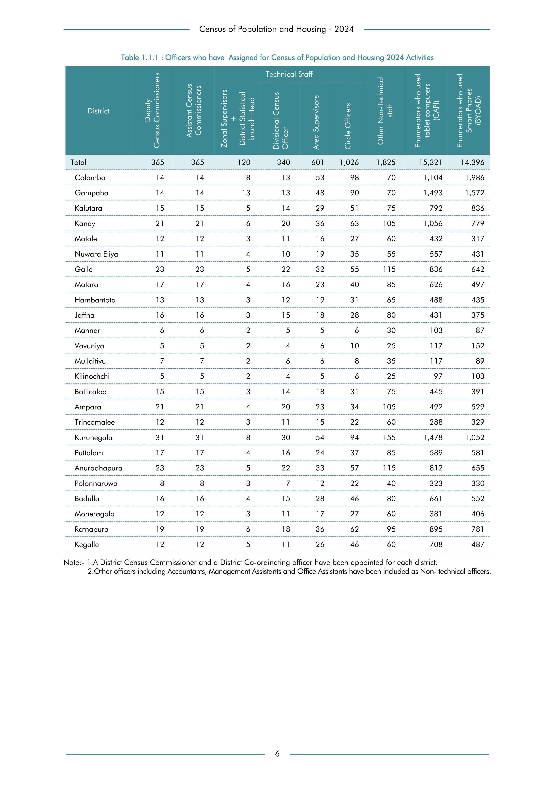

# Officers who have  Assigned for Census of Population and Housing 2024 Activities


*Table 1.1.1, Final Report, 2024 Census of Population and Housing, Department of Census and Statistics, Sri Lanka*

## Structured Data formatted for [Lanka Data API](https://github.com/nuuuwan/lanka_data)

```json
{
    "_meta": {
        "source_url": "https://www.statistics.gov.lk/Resource/en/Population/CPH_2024/CPH2024_Final_Eng.pdf#page=23",
        "source_description": [
            "Table 1.1.1, Final Report, 2024 Census of Population and Housing, Department of Census and Statistics, Sri Lanka"
        ],
        "what": {
            "CensusOfficers": "Officers who have Assigned for Census of Population and Housing 2024 Activities"
        },
        "when": "2024",
        "where_who_types": [
            "ed",
            "district",
            "country",
            "province"
        ]
    },
    "CensusOfficers": {
        "2024": {
            "LK-11": {
                "region_id": "LK-11",
                "region_name": "Colombo",
                "region_ent_type": "district",
                "values": {
                    "EnumeratorsWhoUsedSmartPhonesByoad": 1986,
                    "EnumeratorsWhoUsedTabletComputersCapi": 1104,
                    "TechnicalStaffCircleOfficers": 98,
                    "OtherNonTechnicalStaff": 70,
                    "TechnicalStaffAreaSupervisors": 53,
                    "TechnicalStaffZonalSupervisorsAndDistrictStatisticalBranchHead": 18,
...
```

- Source File: [lanka_data.json (68.0 kB)](../../../../data/final-report-tables/chapter-1/1.1.1-Officers-who-have--Assigned-for-Census-of-Population-and-Housing-2024-Activities/lanka_data.json)

## Structured Data (similar to original layout)

```json
[
    {
        "region_id": "LK-11",
        "region_name": "Colombo",
        "region_ent_type": "district",
        "values": {
            "deputy_census_commissioners": 14,
            "assistant_census_commissioners": 14,
            "technical_staff_zonal_supervisors_and_district_statistical_branch_head": 18,
            "technical_staff_divisional_census_officer": 13,
            "technical_staff_area_supervisors": 53,
            "technical_staff_circle_officers": 98,
            "other_non_technical_staff": 70,
            "enumerators_who_used_tablet_computers_capi": 1104,
            "enumerators_who_used_smart_phones_byoad": 1986
        },
        "total_value": 3370
    },
    {
        "region_id": "LK-12",
        "region_name": "Gampaha",
        "region_ent_type": "district",
        "values": {
            "deputy_census_commissioners": 14,
            "assistant_census_commissioners": 14,
            "technical_staff_zonal_supervisors_and_district_statistical_branch_head": 13,
            "technical_staff_divisional_census_officer": 13,
            "technical_staff_area_supervisors": 48,
            "technical_staff_circle_officers": 90,
            "other_non_technical_staff": 70,
...
```

- Source File: [data.json (34.7 kB)](../../../../data/final-report-tables/chapter-1/1.1.1-Officers-who-have--Assigned-for-Census-of-Population-and-Housing-2024-Activities/data.json)

## Raw Data (directly scraped from PDF)

```json
[
    [
        "Total",
        "365",
        "365",
        "120",
        "Officer \n340",
        "601",
        "1,026",
        "1,825",
        "15,321",
        "14,396"
    ],
    [
        "Colombo",
        "14",
        "14",
        "18",
        "13",
        "53",
        "98",
        "70",
        "1,104",
        "1,986"
    ],
    [
        "Gampaha",
        "14",
        "14",
        "13",
...
```
- Source File: [raw_data.json (3.0 kB)](../../../../data/final-report-tables/chapter-1/1.1.1-Officers-who-have--Assigned-for-Census-of-Population-and-Housing-2024-Activities/raw_data.json)

## Original PDF Page



- Source File: [original.pdf (49.8 kB)](../../../../data/final-report-tables/chapter-1/1.1.1-Officers-who-have--Assigned-for-Census-of-Population-and-Housing-2024-Activities/original.pdf)

## Source

- <https://www.statistics.gov.lk/Resource/en/Population/CPH_2024/CPH2024_Final_Eng.pdf#page=23>


[](https://opensource.org/licenses/MIT)
