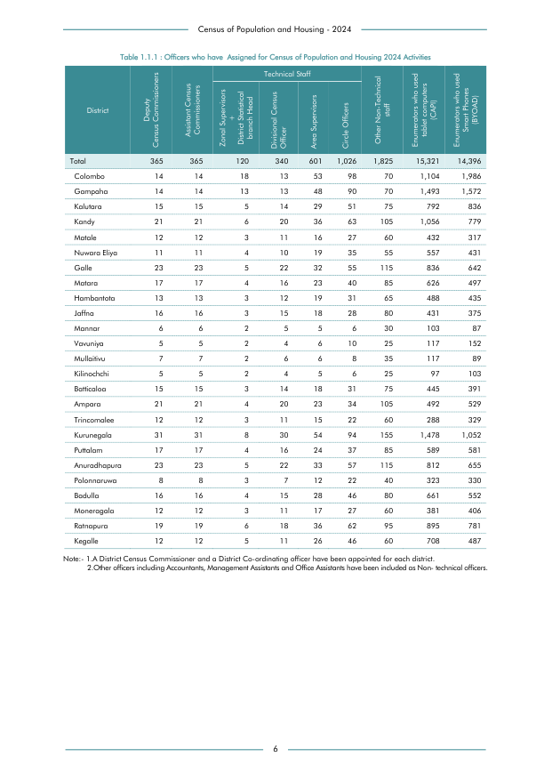

# Officers who have  Assigned for Census of Population and Housing 2024 Activities


*Table 1.1.1, Final Report, 2024 Census of Population and Housing, Department of Census and Statistics, Sri Lanka*

## Structured Data formatted for [Lanka Data API](https://github.com/nuuuwan/lanka_data)

```json
{
    "Person": {
        "Time:2024": {
            "District:colombo": {
                "CensusOfficer:deputy_census_commissioners": {
                    "Count": "Int:14"
                },
                "CensusOfficer:assistant_census_commissioners": {
                    "Count": "Int:14"
                },
                "CensusOfficer:technical_staff_zonal_supervisors_and_district_statistical_branch_head": {
                    "Count": "Int:18"
                },
                "CensusOfficer:technical_staff_divisional_census_officer": {
                    "Count": "Int:13"
                },
                "CensusOfficer:technical_staff_area_supervisors": {
                    "Count": "Int:53"
                },
                "CensusOfficer:technical_staff_circle_officers": {
                    "Count": "Int:98"
                },
                "CensusOfficer:other_non_technical_staff": {
                    "Count": "Int:70"
                },
                "CensusOfficer:enumerators_who_used_tablet_computers_capi": {
                    "Count": "Int:1104"
                },
                "CensusOfficer:enumerators_who_used_smart_phones_byoad": {
                    "Count": "Int:1986"
...
```

- Source File: [lanka_data.json (23.9 KB)](../../../../data/final-report-tables/chapter-1/1.1.1-Officers-who-have-Assigned-for-Census-of-Population-and-Housing-2024-Activities/lanka_data.json)

## Structured Data (similar to original layout)

```json
[
    {
        "region_id": "LK-11",
        "region_name": "Colombo",
        "region_ent_type": "district",
        "values": {
            "CensusOfficer:deputy_census_commissioners": 14,
            "CensusOfficer:assistant_census_commissioners": 14,
            "CensusOfficer:technical_staff_zonal_supervisors_and_district_statistical_branch_head": 18,
            "CensusOfficer:technical_staff_divisional_census_officer": 13,
            "CensusOfficer:technical_staff_area_supervisors": 53,
            "CensusOfficer:technical_staff_circle_officers": 98,
            "CensusOfficer:other_non_technical_staff": 70,
            "CensusOfficer:enumerators_who_used_tablet_computers_capi": 1104,
            "CensusOfficer:enumerators_who_used_smart_phones_byoad": 1986
        },
        "total_value": 3370
    },
    {
        "region_id": "LK-12",
        "region_name": "Gampaha",
        "region_ent_type": "district",
        "values": {
            "CensusOfficer:deputy_census_commissioners": 14,
            "CensusOfficer:assistant_census_commissioners": 14,
            "CensusOfficer:technical_staff_zonal_supervisors_and_district_statistical_branch_head": 13,
            "CensusOfficer:technical_staff_divisional_census_officer": 13,
            "CensusOfficer:technical_staff_area_supervisors": 48,
            "CensusOfficer:technical_staff_circle_officers": 90,
            "CensusOfficer:other_non_technical_staff": 70,
...
```

- Source File: [data.json (40.9 KB)](../../../../data/final-report-tables/chapter-1/1.1.1-Officers-who-have-Assigned-for-Census-of-Population-and-Housing-2024-Activities/data.json)

## Raw Data (directly scraped from PDF)

```json
[
    [
        "Total",
        "365",
        "365",
        "120",
        "Officer \n340",
        "601",
        "1,026",
        "1,825",
        "15,321",
        "14,396"
    ],
    [
        "Colombo",
        "14",
        "14",
        "18",
        "13",
        "53",
        "98",
        "70",
        "1,104",
        "1,986"
    ],
    [
        "Gampaha",
        "14",
        "14",
        "13",
...
```
- Source File: [raw_data.json (3.0 KB)](../../../../data/final-report-tables/chapter-1/1.1.1-Officers-who-have-Assigned-for-Census-of-Population-and-Housing-2024-Activities/raw_data.json)

## Original PDF Page



- Source File: [original.pdf (48.6 KB)](../../../../data/final-report-tables/chapter-1/1.1.1-Officers-who-have-Assigned-for-Census-of-Population-and-Housing-2024-Activities/original.pdf)

## Source

- <https://www.statistics.gov.lk/Resource/en/Population/CPH_2024/CPH2024_Final_Eng.pdf#page=23>


[](https://opensource.org/licenses/MIT)
