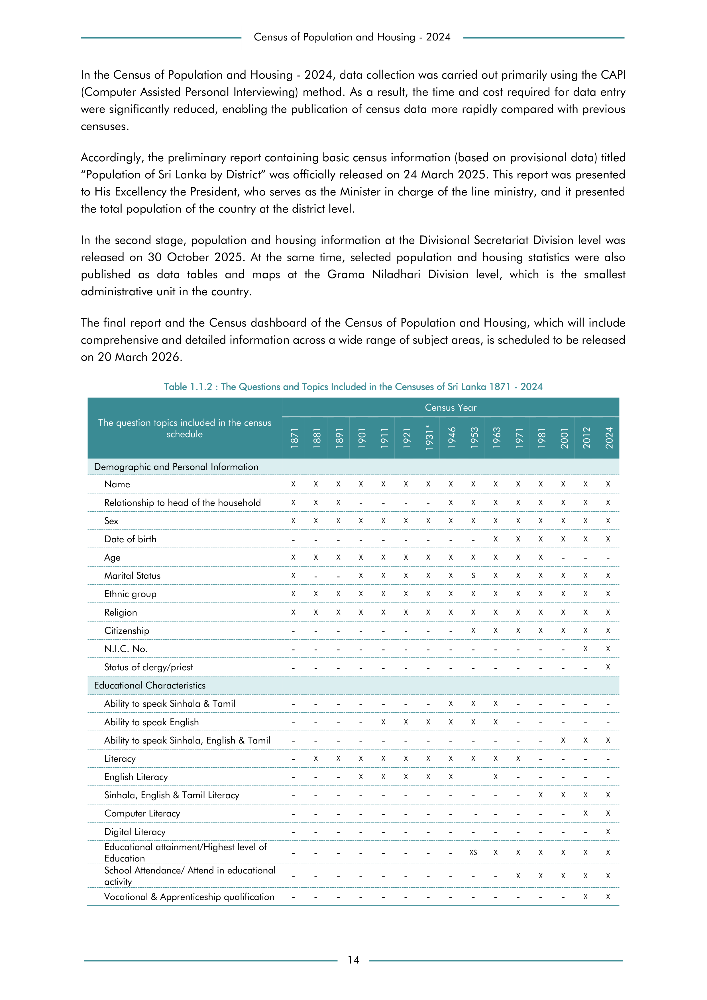

# The Questions and Topics Included in the Censuses of Sri Lanka 1871 - 2024


*Table 1.1.2, Final Report, 2024 Census of Population and Housing, Department of Census and Statistics, Sri Lanka*

## Structured Data (similar to original layout)

```json
[
    {
        "topic": "schedule",
        "values": {
            "is_census_1871": false,
            "is_census_1881": false,
            "is_census_1891": false,
            "is_census_1901": false,
            "is_census_1911": false,
            "is_census_1921": false,
            "is_census_1931": false,
            "is_census_1946": false,
            "is_census_1953": false,
            "is_census_1963": false,
            "is_census_1971": false,
            "is_census_1981": false,
            "is_census_2001": false,
            "is_census_2012": false,
            "is_census_2024": false
        }
    },
    {
        "topic": "Demographic and Personal Information",
        "values": {
            "is_census_1871": false,
            "is_census_1881": false,
            "is_census_1891": false,
            "is_census_1901": false,
            "is_census_1911": false,
            "is_census_1921": false,
...
```

- Source File: [data.json (13.2 kB)](../../../../data/final-report-tables/chapter-1/1.1.2-The-Questions-and-Topics-Included-in-the-Censuses-of-Sri-Lanka-1871---2024/data.json)

## Raw Data (directly scraped from PDF)

```json
[
    [
        "",
        "",
        "Census of Population and Housing - 2024",
        "",
        "",
        ""
    ],
    [
        "In the Census of Population and Housing - 2024, data collection was carried out primarily using the CAPI",
        "",
        "",
        "",
        "",
        ""
    ],
    [
        "(Computer Assisted Personal Interviewing) method. As a result, the time and cost required for data entry",
        "",
        "",
        "",
        "",
        ""
    ],
    [
        "were significantly reduced, enabling the publication of census data more rapidly compared with previous",
        "",
        "",
        "",
...
```
- Source File: [raw_data.json (6.5 kB)](../../../../data/final-report-tables/chapter-1/1.1.2-The-Questions-and-Topics-Included-in-the-Censuses-of-Sri-Lanka-1871---2024/raw_data.json)

## Original PDF



- Source File: [original.pdf (98.5 kB)](../../../../data/final-report-tables/chapter-1/1.1.2-The-Questions-and-Topics-Included-in-the-Censuses-of-Sri-Lanka-1871---2024/original.pdf)

## Source

- <https://www.statistics.gov.lk/Resource/en/Population/CPH_2024/CPH2024_Final_Eng.pdf#page=31>


[](https://opensource.org/licenses/MIT)
