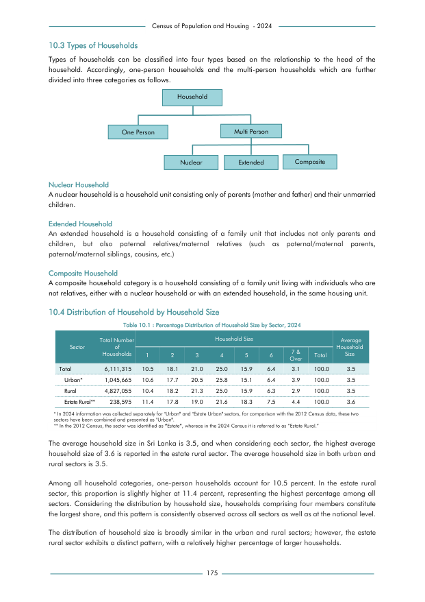

# Percentage Distribution of Household Size by Sector, 2024


*Table 10.1, Final Report, 2024 Census of Population and Housing, Department of Census and Statistics, Sri Lanka*

## Raw Data (directly scraped from PDF)

```json
[
    [
        "",
        "",
        "Table 10.1 : Percentage Distribution of Household Size by Sector, 2024",
        "",
        "",
        "",
        "",
        "",
        "",
        "",
        ""
    ],
    [
        "",
        "Total Number",
        "",
        "",
        "",
        "Household Size",
        "",
        "",
        "",
        "",
        "Average"
    ],
    [
        "Sector",
        "of \nHouseholds",
...
```
- Source File: [raw_data.json (1.1 KB)](../../../../data/final-report-tables/chapter-10/10.1-Percentage-Distribution-of-Household-Size-by-Sector,-2024/raw_data.json)

## Original PDF Page



- Source File: [original.pdf (78.7 KB)](../../../../data/final-report-tables/chapter-10/10.1-Percentage-Distribution-of-Household-Size-by-Sector,-2024/original.pdf)

## Source

- <https://www.statistics.gov.lk/Resource/en/Population/CPH_2024/CPH2024_Final_Eng.pdf#page=192>


[](https://opensource.org/licenses/MIT)
