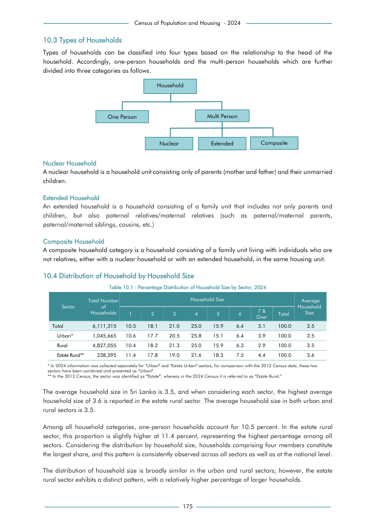

# Percentage Distribution of Household Size by Sector, 2024


*Table 10.1, Final Report, 2024 Census of Population and Housing, Department of Census and Statistics, Sri Lanka*

## Structured Data formatted for [Lanka Data API](https://github.com/nuuuwan/lanka_data)

```json
{
    "House": {
        "Time:2024": {
            "Sector:urban": {
                "HouseholdSize:1": {
                    "Count": "Int:110840"
                },
                "HouseholdSize:2": {
                    "Count": "Int:185083"
                },
                "HouseholdSize:3": {
                    "Count": "Int:214361"
                },
                "HouseholdSize:4": {
                    "Count": "Int:269782"
                },
                "HouseholdSize:5": {
                    "Count": "Int:157895"
                },
                "HouseholdSize:6": {
                    "Count": "Int:66923"
                },
                "HouseholdSize:7_or_more": {
                    "Count": "Int:40781"
                }
            },
            "Sector:rural": {
                "HouseholdSize:1": {
                    "Count": "Int:502014"
                },
...
```

- Source File: [lanka_data.json (1.6 KB)](../../../../data/final-report-tables/chapter-10/10.1-Percentage-Distribution-of-Household-Size-by-Sector-2024/lanka_data.json)

## Structured Data (similar to original layout)

```json
[
    {
        "sector": "Urban*",
        "values": {
            "1": 110840,
            "2": 185083,
            "3": 214361,
            "4": 269782,
            "5": 157895,
            "6": 66923,
            "7_or_over": 40781
        },
        "total_value": 1045665
    },
    {
        "sector": "Rural",
        "values": {
            "1": 502014,
            "2": 878524,
            "3": 1028163,
            "4": 1206764,
            "5": 767502,
            "6": 304104,
            "7_or_over": 139985
        },
        "total_value": 4827055
    },
    {
        "sector": "Estate Rural**",
        "values": {
...
```

- Source File: [data.json (670.0 B)](../../../../data/final-report-tables/chapter-10/10.1-Percentage-Distribution-of-Household-Size-by-Sector-2024/data.json)

## Raw Data (directly scraped from PDF)

```json
[
    [
        "",
        "",
        "Table 10.1 : Percentage Distribution of Household Size by Sector, 2024",
        "",
        "",
        "",
        "",
        "",
        "",
        "",
        ""
    ],
    [
        "",
        "Total Number",
        "",
        "",
        "",
        "Household Size",
        "",
        "",
        "",
        "",
        "Average"
    ],
    [
        "Sector",
        "of \nHouseholds",
...
```
- Source File: [raw_data.json (1.1 KB)](../../../../data/final-report-tables/chapter-10/10.1-Percentage-Distribution-of-Household-Size-by-Sector-2024/raw_data.json)

## Original PDF Page



- Source File: [original.pdf (78.7 KB)](../../../../data/final-report-tables/chapter-10/10.1-Percentage-Distribution-of-Household-Size-by-Sector-2024/original.pdf)

## Source

- <https://www.statistics.gov.lk/Resource/en/Population/CPH_2024/CPH2024_Final_Eng.pdf#page=192>


[](https://opensource.org/licenses/MIT)
