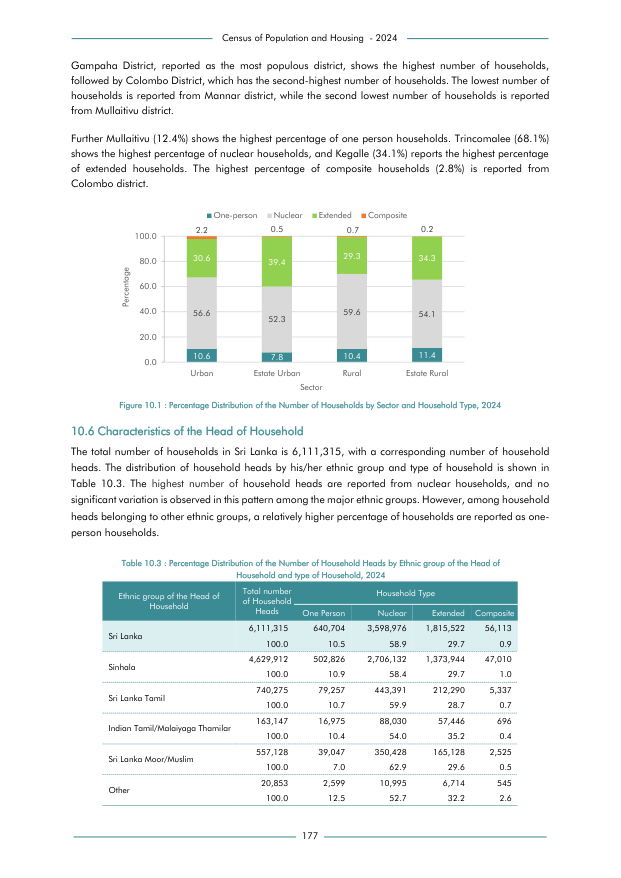

# Percentage Distribution of the Number of Household Heads by Ethnic group of the Head of Household and typeof Household, 2024


*Table 10.3, Final Report, 2024 Census of Population and Housing, Department of Census and Statistics, Sri Lanka*

## Raw Data (directly scraped from PDF)

```json
[
    [
        "Census of Population and Housing  - 2024"
    ],
    [
        "Gampaha  District,  reported  as  the  most  populous  district,  shows  the  highest  number  of  households,"
    ],
    [
        "followed by Colombo District, which has the second-highest number of households. The lowest number of"
    ],
    [
        "households is reported from Mannar district, while the second lowest number of  households is reported"
    ],
    [
        "from Mullaitivu district."
    ],
    [
        "Further Mullaitivu (12.4%) shows the highest percentage of one person households. Trincomalee (68.1%)"
    ],
    [
        "shows the highest percentage of nuclear households, and Kegalle (34.1%) reports the highest percentage"
    ],
    [
        "of  extended  households.  The  highest  percentage  of  composite  households  (2.8%)  is  reported  from"
    ],
    [
        "Colombo district."
    ],
    [
        "",
...
```
- Source File: [raw_data.json (3.0 KB)](../../../../data/final-report-tables/chapter-10/10.3-Percentage-Distribution-of-the-Number-of-Household-Heads-by-Ethnic-group-of-the-Head-of-Household-and-typeof-Household-2024/raw_data.json)

## Original PDF Page



- Source File: [original.pdf (113.6 KB)](../../../../data/final-report-tables/chapter-10/10.3-Percentage-Distribution-of-the-Number-of-Household-Heads-by-Ethnic-group-of-the-Head-of-Household-and-typeof-Household-2024/original.pdf)

## Source

- <https://www.statistics.gov.lk/Resource/en/Population/CPH_2024/CPH2024_Final_Eng.pdf#page=194>


[](https://opensource.org/licenses/MIT)
