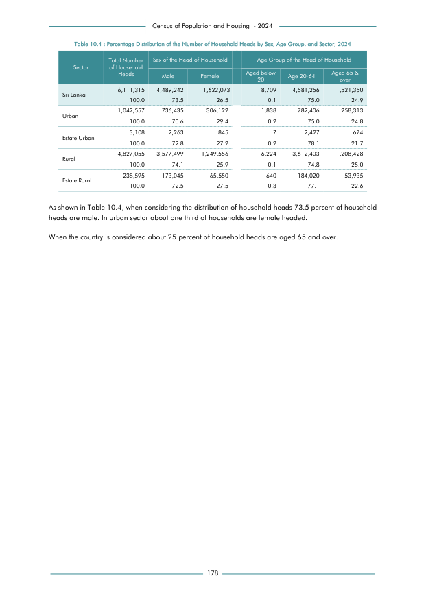

# Percentage Distribution of the Number of Household Heads by Sex, Age Group, and Sector, 2024


*Table 10.4, Final Report, 2024 Census of Population and Housing, Department of Census and Statistics, Sri Lanka*

## Raw Data (directly scraped from PDF)

```json
[
    [
        "",
        "Total Number",
        "Sex of the Head of Household",
        "",
        "",
        "Age Group of the Head of Household",
        ""
    ],
    [
        "Sector",
        "of Household \nHeads",
        "",
        "",
        "Aged below",
        "",
        "Aged 65 &"
    ],
    [
        "",
        "",
        "Male",
        "Female",
        "20",
        "Age 20-64",
        "over"
    ],
    [
        "Sri Lanka",
...
```
- Source File: [raw_data.json (1.3 KB)](../../../../data/final-report-tables/chapter-10/10.4-Percentage-Distribution-of-the-Number-of-Household-Heads-by-Sex-Age-Group-and-Sector-2024/raw_data.json)

## Original PDF Page



- Source File: [original.pdf (81.3 KB)](../../../../data/final-report-tables/chapter-10/10.4-Percentage-Distribution-of-the-Number-of-Household-Heads-by-Sex-Age-Group-and-Sector-2024/original.pdf)

## Source

- <https://www.statistics.gov.lk/Resource/en/Population/CPH_2024/CPH2024_Final_Eng.pdf#page=195>


[](https://opensource.org/licenses/MIT)
