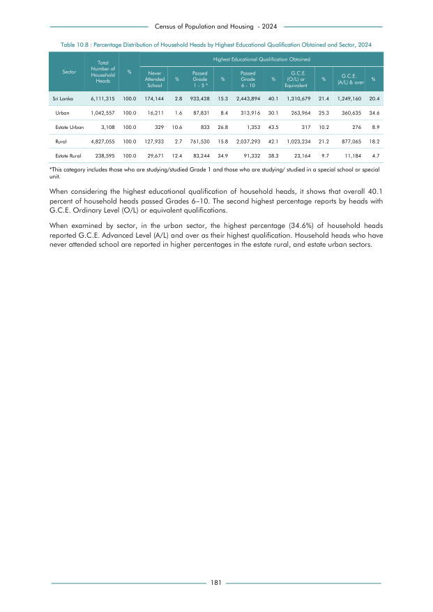

# Percentage Distribution of Household Heads by Highest Educational Qualification Obtained and Sector, 2024


*Table 10.8, Final Report, 2024 Census of Population and Housing, Department of Census and Statistics, Sri Lanka*

## Structured Data formatted for [Lanka Data API](https://github.com/nuuuwan/lanka_data)

```json
{
    "House": {
        "Time:2024": {
            "Sector:urban": {
                "HighestEducationLevel3:no_schooling": {
                    "Count": "Int:16211"
                },
                "HighestEducationLevel3:passed_1_5_years": {
                    "Count": "Int:87831"
                },
                "HighestEducationLevel3:passed_6_10_years": {
                    "Count": "Int:313916"
                },
                "HighestEducationLevel3:gce_ol": {
                    "Count": "Int:263964"
                },
                "HighestEducationLevel3:gce_al": {
                    "Count": "Int:360635"
                }
            },
            "Sector:estate_urban": {
                "HighestEducationLevel3:no_schooling": {
                    "Count": "Int:329"
                },
                "HighestEducationLevel3:passed_1_5_years": {
                    "Count": "Int:833"
                },
                "HighestEducationLevel3:passed_6_10_years": {
                    "Count": "Int:1353"
                },
...
```

- Source File: [lanka_data.json (1.9 KB)](../../../../data/final-report-tables/chapter-10/10.8-Percentage-Distribution-of-Household-Heads-by-Highest-Educational-Qualification-Obtained-and-Sector-2024/lanka_data.json)

## Structured Data (similar to original layout)

```json
[
    {
        "sector": "Sri Lanka",
        "values": {
            "no_schooling": 174144,
            "passed_1_5_years": 933438,
            "passed_6_10_years": 2443894,
            "gce_ol": 1310679,
            "gce_al": 1249160
        },
        "total_value": 6111315
    },
    {
        "sector": "Urban",
        "values": {
            "no_schooling": 16211,
            "passed_1_5_years": 87831,
            "passed_6_10_years": 313916,
            "gce_ol": 263964,
            "gce_al": 360635
        },
        "total_value": 1042557
    },
    {
        "sector": "Estate Urban",
        "values": {
            "no_schooling": 329,
            "passed_1_5_years": 833,
            "passed_6_10_years": 1353,
            "gce_ol": 317,
...
```

- Source File: [data.json (1.1 KB)](../../../../data/final-report-tables/chapter-10/10.8-Percentage-Distribution-of-Household-Heads-by-Highest-Educational-Qualification-Obtained-and-Sector-2024/data.json)

## Raw Data (directly scraped from PDF)

```json
[
    [
        "",
        "Table 10.8 : Percentage Distribution of Household Heads by Highest Educational Qualification Obtained and Sector, 2024",
        "",
        "",
        "",
        "",
        "",
        "",
        "",
        "",
        "",
        "",
        ""
    ],
    [
        "",
        "Total",
        "",
        "",
        "",
        "",
        "Highest Educational Qualification Obtained",
        "",
        "",
        "",
        "",
        "",
        ""
...
```
- Source File: [raw_data.json (2.8 KB)](../../../../data/final-report-tables/chapter-10/10.8-Percentage-Distribution-of-Household-Heads-by-Highest-Educational-Qualification-Obtained-and-Sector-2024/raw_data.json)

## Original PDF Page



- Source File: [original.pdf (51.0 KB)](../../../../data/final-report-tables/chapter-10/10.8-Percentage-Distribution-of-Household-Heads-by-Highest-Educational-Qualification-Obtained-and-Sector-2024/original.pdf)

## Source

- <https://www.statistics.gov.lk/Resource/en/Population/CPH_2024/CPH2024_Final_Eng.pdf#page=198>


[](https://opensource.org/licenses/MIT)
