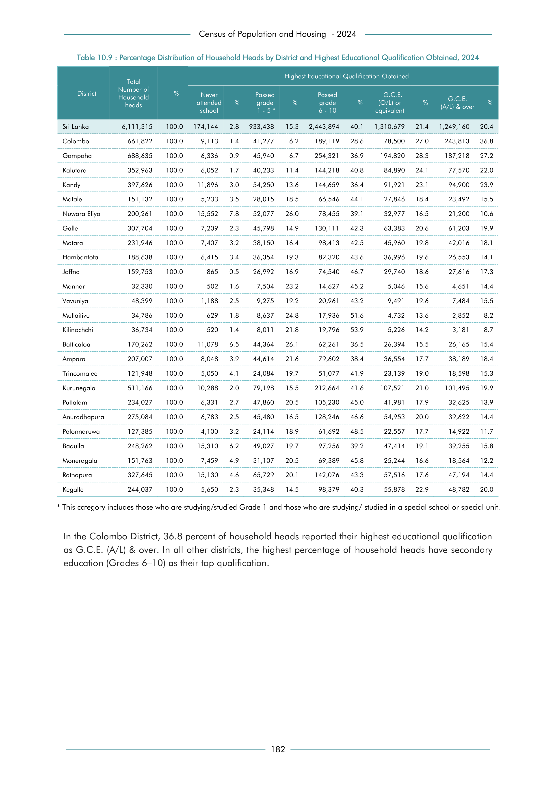

# Percentage Distribution of Household Heads by District and Highest Educational Qualification Obtained,


*Table 10.9, Final Report, 2024 Census of Population and Housing, Department of Census and Statistics, Sri Lanka*

## Structured Data formatted for [Lanka Data API](https://github.com/nuuuwan/lanka_data)

```json
{
    "_meta": {
        "source_url": "https://www.statistics.gov.lk/Resource/en/Population/CPH_2024/CPH2024_Final_Eng.pdf#page=199",
        "source_description": [
            "Table 10.9, Final Report, 2024 Census of Population and Housing, Department of Census and Statistics, Sri Lanka"
        ],
        "what": {
            "HouseholdHeadByEducation": "Percentage Distribution of Household Heads by District and Highest Educational Qualification Obtained,"
        },
        "when": "2024",
        "where_who_types": [
            "province",
            "country",
            "district",
            "ed"
        ]
    },
    "HouseholdHeadByEducation": {
        "2024": {
            "LK-11": {
                "region_id": "LK-11",
                "region_name": "Colombo",
                "region_ent_type": "district",
                "values": {
                    "GceAl": 243813,
                    "Passed610Years": 189119,
                    "GceOl": 178500,
                    "Passed15Years": 41277,
                    "NoSchooling": 9113
                },
...
```

- Source File: [lanka_data.json (31.0 kB)](../../../../data/final-report-tables/chapter-10/10.9-Percentage-Distribution-of-Household-Heads-by-District-and-Highest-Educational-Qualification-Obtained,/lanka_data.json)

## Structured Data (similar to original layout)

```json
[
    {
        "region_id": "LK-11",
        "region_name": "Colombo",
        "region_ent_type": "district",
        "values": {
            "no_schooling": 9113,
            "passed_1_5_years": 41277,
            "passed_6_10_years": 189119,
            "gce_ol": 178500,
            "gce_al": 243813
        },
        "total_value": 661822
    },
    {
        "region_id": "LK-12",
        "region_name": "Gampaha",
        "region_ent_type": "district",
        "values": {
            "no_schooling": 6336,
            "passed_1_5_years": 45940,
            "passed_6_10_years": 254321,
            "gce_ol": 194820,
            "gce_al": 187218
        },
        "total_value": 688635
    },
    {
        "region_id": "LK-13",
        "region_name": "Kalutara",
...
```

- Source File: [data.json (16.5 kB)](../../../../data/final-report-tables/chapter-10/10.9-Percentage-Distribution-of-Household-Heads-by-District-and-Highest-Educational-Qualification-Obtained,/data.json)

## Raw Data (directly scraped from PDF)

```json
[
    [
        "",
        "Total",
        "",
        "",
        "",
        "",
        "",
        "Highest Educational Qualification Obtained",
        "",
        "",
        "",
        "",
        ""
    ],
    [
        "District",
        "Number of \nHousehold",
        "%",
        "Never",
        "",
        "Passed",
        "",
        "Passed",
        "",
        "G.C.E.",
        "",
        "G.C.E.",
        ""
...
```
- Source File: [raw_data.json (5.2 kB)](../../../../data/final-report-tables/chapter-10/10.9-Percentage-Distribution-of-Household-Heads-by-District-and-Highest-Educational-Qualification-Obtained,/raw_data.json)

## Original PDF



- Source File: [original.pdf (69.5 kB)](../../../../data/final-report-tables/chapter-10/10.9-Percentage-Distribution-of-Household-Heads-by-District-and-Highest-Educational-Qualification-Obtained,/original.pdf)

## Source

- <https://www.statistics.gov.lk/Resource/en/Population/CPH_2024/CPH2024_Final_Eng.pdf#page=199>


[](https://opensource.org/licenses/MIT)
