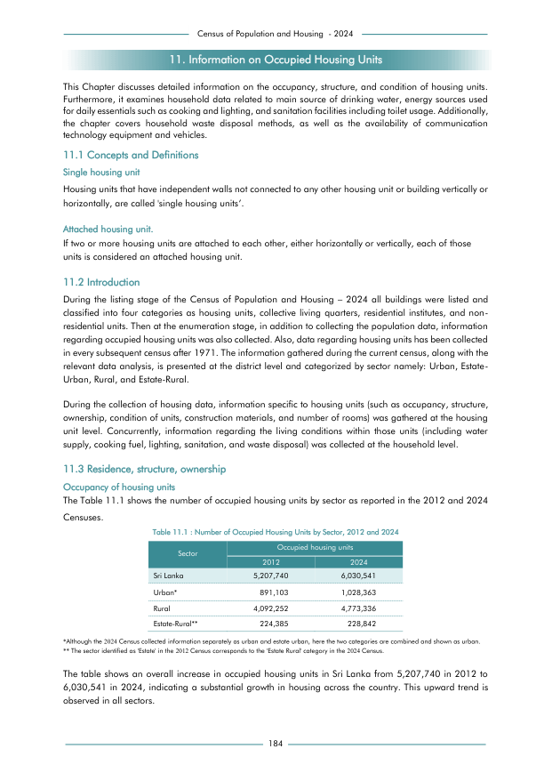

# Number of Occupied Housing Units by Sector, 2012 and 2024


*Table 11.1, Final Report, 2024 Census of Population and Housing, Department of Census and Statistics, Sri Lanka*

## Structured Data formatted for [Lanka Data API](https://github.com/nuuuwan/lanka_data)

```json
{
    "Person": {
        "Sector:urban": {
            "Time:2012": {
                "Count": "Int:891103"
            },
            "Time:2024": {
                "Count": "Int:1028363"
            }
        },
        "Sector:rural": {
            "Time:2012": {
                "Count": "Int:4092252"
            },
            "Time:2024": {
                "Count": "Int:4773336"
            }
        },
        "Sector:estate_rural": {
            "Time:2012": {
                "Count": "Int:224385"
            },
            "Time:2024": {
                "Count": "Int:228842"
            }
        }
    }
}
```

- Source File: [lanka_data.json (474.0 B)](../../../../data/final-report-tables/chapter-11/11.1-Number-of-Occupied-Housing-Units-by-Sector-2012-and-2024/lanka_data.json)

## Structured Data (similar to original layout)

```json
[
    {
        "sector": "Sri Lanka",
        "values": {
            "households_2012": 5207740,
            "households_2024": 6030541
        },
        "total_value": 11238281
    },
    {
        "sector": "Urban*",
        "values": {
            "households_2012": 891103,
            "households_2024": 1028363
        },
        "total_value": 1919466
    },
    {
        "sector": "Rural",
        "values": {
            "households_2012": 4092252,
            "households_2024": 4773336
        },
        "total_value": 8865588
    },
    {
        "sector": "Estate-Rural**",
        "values": {
            "households_2012": 224385,
            "households_2024": 228842
...
```

- Source File: [data.json (609.0 B)](../../../../data/final-report-tables/chapter-11/11.1-Number-of-Occupied-Housing-Units-by-Sector-2012-and-2024/data.json)

## Raw Data (directly scraped from PDF)

```json
[
    [
        "11. Information on Occupied Housing Units"
    ],
    [
        "This Chapter discusses detailed information on the occupancy, structure, and condition of housing units."
    ],
    [
        "Furthermore, it examines household data related to main source of drinking water, energy sources used"
    ],
    [
        "for daily essentials such as cooking and lighting, and sanitation facilities including toilet usage. Additionally,"
    ],
    [
        "the  chapter  covers  household  waste  disposal  methods,  as  well  as  the  availability  of  communication"
    ],
    [
        "technology equipment and vehicles."
    ],
    [
        "11.1 Concepts and Definitions"
    ],
    [
        "Single housing unit"
    ],
    [
        "Housing units that have independent walls not connected to any other housing unit or building vertically or"
    ],
    [
        "horizontally, are called 'single housing units\u2019."
...
```
- Source File: [raw_data.json (3.1 KB)](../../../../data/final-report-tables/chapter-11/11.1-Number-of-Occupied-Housing-Units-by-Sector-2012-and-2024/raw_data.json)

## Original PDF Page



- Source File: [original.pdf (52.1 KB)](../../../../data/final-report-tables/chapter-11/11.1-Number-of-Occupied-Housing-Units-by-Sector-2012-and-2024/original.pdf)

## Source

- <https://www.statistics.gov.lk/Resource/en/Population/CPH_2024/CPH2024_Final_Eng.pdf#page=201>


[](https://opensource.org/licenses/MIT)
