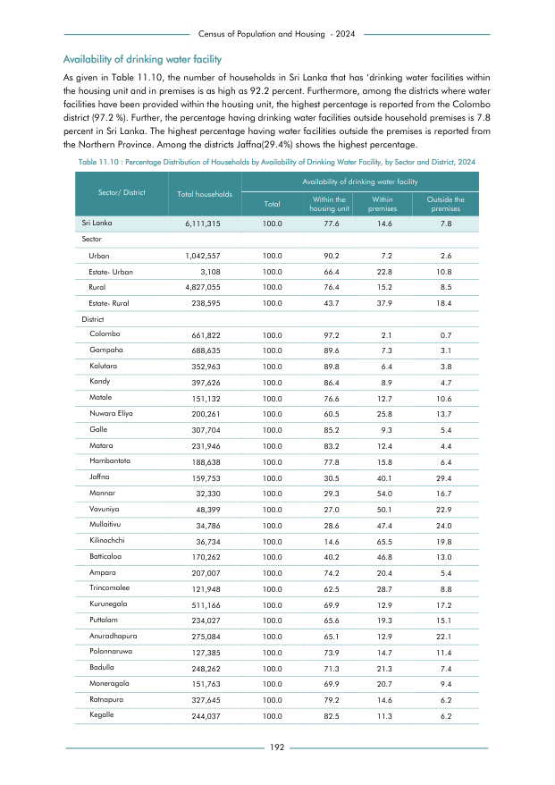

# Percentage Distribution of Households by Availability of Drinking Water Facility, by Sector and District,


*Table 11.10, Final Report, 2024 Census of Population and Housing, Department of Census and Statistics, Sri Lanka*

## Structured Data formatted for [Lanka Data API](https://github.com/nuuuwan/lanka_data)

```json
{
    "Person": {
        "Time:2024": {
            "District:colombo": {
                "SourceOfDrinkingWater:within_housing_unit": {
                    "Count": "Int:643291"
                },
                "SourceOfDrinkingWater:within_premises": {
                    "Count": "Int:13898"
                },
                "SourceOfDrinkingWater:outside_premises": {
                    "Count": "Int:4633"
                }
            },
            "District:gampaha": {
                "SourceOfDrinkingWater:within_housing_unit": {
                    "Count": "Int:617017"
                },
                "SourceOfDrinkingWater:within_premises": {
                    "Count": "Int:50270"
                },
                "SourceOfDrinkingWater:outside_premises": {
                    "Count": "Int:21348"
                }
            },
            "District:kalutara": {
                "SourceOfDrinkingWater:within_housing_unit": {
                    "Count": "Int:316961"
                },
                "SourceOfDrinkingWater:within_premises": {
...
```

- Source File: [lanka_data.json (7.9 KB)](../../../../data/final-report-tables/chapter-11/11.10-Percentage-Distribution-of-Households-by-Availability-of-Drinking-Water-Facility-by-Sector-and-District-/lanka_data.json)

## Structured Data (similar to original layout)

```json
[
    {
        "region_id": "LK-11",
        "region_name": "Colombo",
        "region_ent_type": "district",
        "values": {
            "within_housing_unit": 643291,
            "within_premises": 13898,
            "outside_premises": 4633
        },
        "total_value": 661822
    },
    {
        "region_id": "LK-12",
        "region_name": "Gampaha",
        "region_ent_type": "district",
        "values": {
            "within_housing_unit": 617017,
            "within_premises": 50270,
            "outside_premises": 21348
        },
        "total_value": 688635
    },
    {
        "region_id": "LK-13",
        "region_name": "Kalutara",
        "region_ent_type": "district",
        "values": {
            "within_housing_unit": 316961,
            "within_premises": 22590,
...
```

- Source File: [data.json (13.8 KB)](../../../../data/final-report-tables/chapter-11/11.10-Percentage-Distribution-of-Households-by-Availability-of-Drinking-Water-Facility-by-Sector-and-District-/data.json)

## Raw Data (directly scraped from PDF)

```json
[
    [
        "Census of Population and Housing  - 2024"
    ],
    [
        "Availability of drinking water facility"
    ],
    [
        "As given in Table 11.10, the number of households in Sri Lanka that has \u2018drinking water facilities within"
    ],
    [
        "the housing unit and in premises is as high as 92.2 percent. Furthermore, among the districts where water"
    ],
    [
        "facilities have been provided within the housing unit, the highest percentage is reported from the Colombo"
    ],
    [
        "district (97.2 %). Further, the percentage having drinking water facilities outside household premises is 7.8"
    ],
    [
        "percent in Sri Lanka. The highest percentage having water facilities outside the premises is reported from"
    ],
    [
        "the Northern Province. Among the districts Jaffna(29.4%) shows the highest percentage."
    ],
    [
        "",
        "",
        "",
        "Availability of drinking water facility",
...
```
- Source File: [raw_data.json (3.9 KB)](../../../../data/final-report-tables/chapter-11/11.10-Percentage-Distribution-of-Households-by-Availability-of-Drinking-Water-Facility-by-Sector-and-District-/raw_data.json)

## Original PDF Page



- Source File: [original.pdf (73.6 KB)](../../../../data/final-report-tables/chapter-11/11.10-Percentage-Distribution-of-Households-by-Availability-of-Drinking-Water-Facility-by-Sector-and-District-/original.pdf)

## Source

- <https://www.statistics.gov.lk/Resource/en/Population/CPH_2024/CPH2024_Final_Eng.pdf#page=209>


[](https://opensource.org/licenses/MIT)
