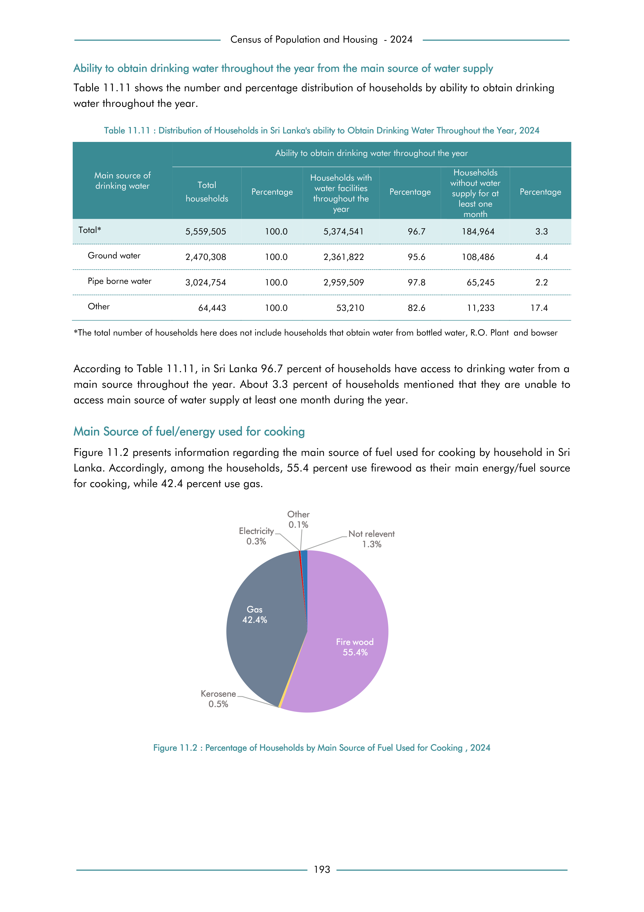

# Distribution of Households in Sri Lanka's ability to Obtain Drinking Water Throughout the Year, 2024


*Table 11.11, Final Report, 2024 Census of Population and Housing, Department of Census and Statistics, Sri Lanka*

## Structured Data formatted for [Lanka Data API](https://github.com/nuuuwan/lanka_data)

```json
{
    "Person": {
        "Time:2024": {
            "SourceOfDrinkingWater:GroundWater": {
                "WaterSupplyAvailability:HouseholdsWithWaterSupplyThroughoutTheYear": {
                    "Count": "Int:2361822"
                },
                "WaterSupplyAvailability:HouseholdsWithNoWaterSuppplyForAtLeastOneMonth": {
                    "Count": "Int:108486"
                }
            },
            "SourceOfDrinkingWater:PipeBorneWater": {
                "WaterSupplyAvailability:HouseholdsWithWaterSupplyThroughoutTheYear": {
                    "Count": "Int:2959509"
                },
                "WaterSupplyAvailability:HouseholdsWithNoWaterSuppplyForAtLeastOneMonth": {
                    "Count": "Int:65245"
                }
            },
            "SourceOfDrinkingWater:Other": {
                "WaterSupplyAvailability:HouseholdsWithWaterSupplyThroughoutTheYear": {
                    "Count": "Int:53210"
                },
                "WaterSupplyAvailability:HouseholdsWithNoWaterSuppplyForAtLeastOneMonth": {
                    "Count": "Int:11233"
                }
            }
        }
    }
}
```

- Source File: [lanka_data.json (950.0 B)](../../../../data/final-report-tables/chapter-11/11.11-Distribution-of-Households-in-Sri-Lanka's-ability-to-Obtain-Drinking-Water-Throughout-the-Year,-2024/lanka_data.json)

## Structured Data (similar to original layout)

```json
[
    {
        "source_of_drinking_water": "Total*",
        "values": {
            "households_with_water_supply_throughout_the_year": 5374541,
            "households_with_no_water_suppply_for_at_least_one_month": 184964
        }
    },
    {
        "source_of_drinking_water": "Ground water",
        "values": {
            "households_with_water_supply_throughout_the_year": 2361822,
            "households_with_no_water_suppply_for_at_least_one_month": 108486
        }
    },
    {
        "source_of_drinking_water": "Pipe borne water",
        "values": {
            "households_with_water_supply_throughout_the_year": 2959509,
            "households_with_no_water_suppply_for_at_least_one_month": 65245
        }
    },
    {
        "source_of_drinking_water": "Other",
        "values": {
            "households_with_water_supply_throughout_the_year": 53210,
            "households_with_no_water_suppply_for_at_least_one_month": 11233
        }
    }
]
```

- Source File: [data.json (861.0 B)](../../../../data/final-report-tables/chapter-11/11.11-Distribution-of-Households-in-Sri-Lanka's-ability-to-Obtain-Drinking-Water-Throughout-the-Year,-2024/data.json)

## Raw Data (directly scraped from PDF)

```json
[
    [
        "",
        "Table 11.11 : Distribution of Households in Sri Lanka's ability to Obtain Drinking Water Throughout the Year, 2024",
        "",
        "",
        "",
        "",
        ""
    ],
    [
        "",
        "",
        "",
        "Ability to obtain drinking water throughout the year",
        "",
        "",
        ""
    ],
    [
        "Main source of",
        "",
        "",
        "Households with",
        "",
        "Households \nwithout water",
        ""
    ],
    [
        "drinking water",
...
```
- Source File: [raw_data.json (1.1 KB)](../../../../data/final-report-tables/chapter-11/11.11-Distribution-of-Households-in-Sri-Lanka's-ability-to-Obtain-Drinking-Water-Throughout-the-Year,-2024/raw_data.json)

## Original PDF Page



- Source File: [original.pdf (48.2 KB)](../../../../data/final-report-tables/chapter-11/11.11-Distribution-of-Households-in-Sri-Lanka's-ability-to-Obtain-Drinking-Water-Throughout-the-Year,-2024/original.pdf)

## Source

- <https://www.statistics.gov.lk/Resource/en/Population/CPH_2024/CPH2024_Final_Eng.pdf#page=210>


[](https://opensource.org/licenses/MIT)
