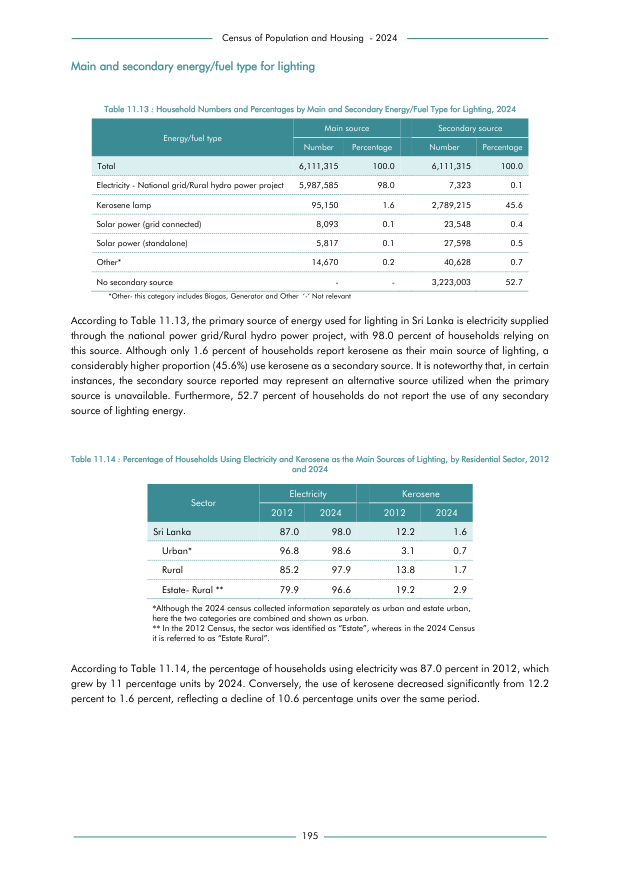

# Percentage of Households Using Electricity and Kerosene as the Main Sources of Lighting, by ResidentialSector, 2012 and 2024


*Table 11.14, Final Report, 2024 Census of Population and Housing, Department of Census and Statistics, Sri Lanka*

## Structured Data formatted for [Lanka Data API](https://github.com/nuuuwan/lanka_data)

```json
{
    "_meta": {
        "source_url": "https://www.statistics.gov.lk/Resource/en/Population/CPH_2024/CPH2024_Final_Eng.pdf#page=212",
        "source_description": "Table 11.14, Final Report, 2024 Census of Population and Housing, Department of Census and Statistics, Sri Lanka",
        "what": {
            "HouseholdEnergyElectricityAndKerosene": "Percentage of Households Using Electricity and Kerosene as the Main Sources of Lighting, by ResidentialSector, 2012 and 2024"
        },
        "when": [
            "2012",
            "2024"
        ],
        "where_who_types": [
            "sector"
        ]
    },
    "HouseholdEnergyElectricityAndKerosene": {
        "2012": {
            "Sri Lanka": {
                "sector": "Sri Lanka",
                "pct_values": {
                    "Electricity": 0.87,
                    "Kerosene": 0.122
                }
            },
            "Urban*": {
                "sector": "Urban*",
                "pct_values": {
                    "Electricity": 0.968,
                    "Kerosene": 0.031
                }
...
```

- Source File: [lanka_data.json (1.8 KB)](../../../../data/final-report-tables/chapter-11/11.14-Percentage-of-Households-Using-Electricity-and-Kerosene-as-the-Main-Sources-of-Lighting,-by-ResidentialSector,-2012-and-2024/lanka_data.json)

## Structured Data (similar to original layout)

```json
[
    {
        "sector": "Sri Lanka",
        "values": {
            "p_electricity_2012": 0.87,
            "p_electricity_2024": 0.98,
            "p_kerosene_2012": 0.122,
            "p_kerosene_2024": 0.016
        }
    },
    {
        "sector": "Urban*",
        "values": {
            "p_electricity_2012": 0.968,
            "p_electricity_2024": 0.986,
            "p_kerosene_2012": 0.031,
            "p_kerosene_2024": 0.007
        }
    },
    {
        "sector": "Rural",
        "values": {
            "p_electricity_2012": 0.852,
            "p_electricity_2024": 0.979,
            "p_kerosene_2012": 0.138,
            "p_kerosene_2024": 0.017
        }
    },
    {
        "sector": "Estate- Rural **",
...
```

- Source File: [data.json (764.0 B)](../../../../data/final-report-tables/chapter-11/11.14-Percentage-of-Households-Using-Electricity-and-Kerosene-as-the-Main-Sources-of-Lighting,-by-ResidentialSector,-2012-and-2024/data.json)

## Raw Data (directly scraped from PDF)

```json
[
    [
        "Sector",
        "Electricity",
        "",
        "Kerosene",
        ""
    ],
    [
        "",
        "2012",
        "2024",
        "2012",
        "2024"
    ],
    [
        "Sri Lanka",
        "87.0",
        "98.0",
        "12.2",
        "1.6"
    ],
    [
        "Urban*",
        "96.8",
        "98.6",
        "3.1",
        "0.7"
    ],
    [
...
```
- Source File: [raw_data.json (426.0 B)](../../../../data/final-report-tables/chapter-11/11.14-Percentage-of-Households-Using-Electricity-and-Kerosene-as-the-Main-Sources-of-Lighting,-by-ResidentialSector,-2012-and-2024/raw_data.json)

## Original PDF Page



- Source File: [original.pdf (61.3 KB)](../../../../data/final-report-tables/chapter-11/11.14-Percentage-of-Households-Using-Electricity-and-Kerosene-as-the-Main-Sources-of-Lighting,-by-ResidentialSector,-2012-and-2024/original.pdf)

(Table 1 on this page.)

## Source

- <https://www.statistics.gov.lk/Resource/en/Population/CPH_2024/CPH2024_Final_Eng.pdf#page=212>


[](https://opensource.org/licenses/MIT)
