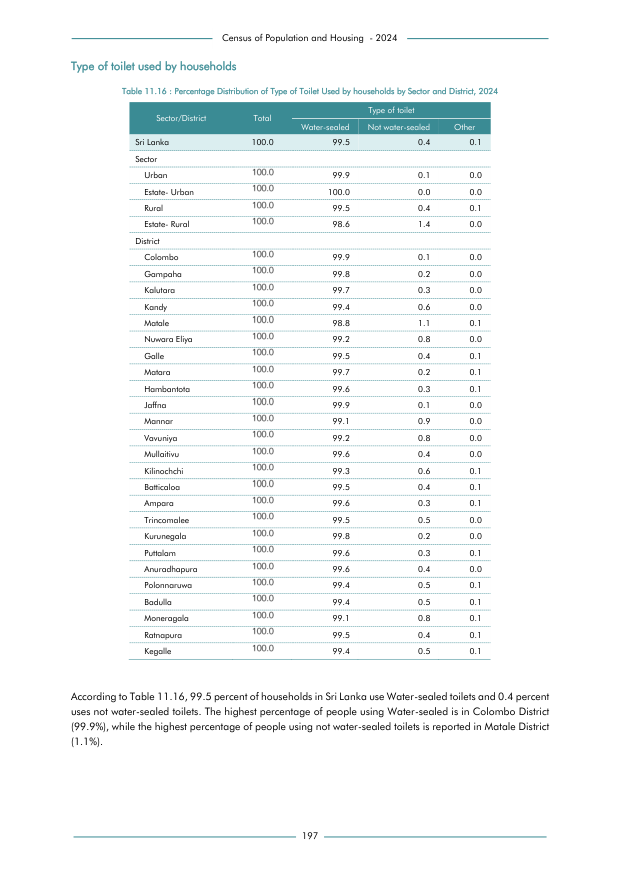

# Percentage Distribution of Type of Toilet Used by households by Sector and District, 2024


*Table 11.16, Final Report, 2024 Census of Population and Housing, Department of Census and Statistics, Sri Lanka*

## Structured Data (similar to original layout)

```json
[
    {
        "region_id": "LK-11",
        "region_name": "Colombo",
        "region_ent_type": "district",
        "values": {
            "p_water_sealed": 0.999,
            "p_not_water_sealed": 0.001,
            "p_other": 0.0
        }
    },
    {
        "region_id": "LK-12",
        "region_name": "Gampaha",
        "region_ent_type": "district",
        "values": {
            "p_water_sealed": 0.998,
            "p_not_water_sealed": 0.002,
            "p_other": 0.0
        }
    },
    {
        "region_id": "LK-13",
        "region_name": "Kalutara",
        "region_ent_type": "district",
        "values": {
            "p_water_sealed": 0.997,
            "p_not_water_sealed": 0.003,
            "p_other": 0.0
        }
...
```

- Source File: [data.json (5.2 KB)](../../../../data/final-report-tables/chapter-11/11.16-Percentage-Distribution-of-Type-of-Toilet-Used-by-households-by-Sector-and-District-2024/data.json)

## Raw Data (directly scraped from PDF)

```json
[
    [
        "Sector/District",
        "Total",
        "",
        "Type of toilet",
        "",
        ""
    ],
    [
        "",
        "",
        "Water-sealed",
        "Not water-sealed",
        "",
        "Other"
    ],
    [
        "Sri Lanka",
        "100.0",
        "99.5",
        "",
        "0.4",
        "0.1"
    ],
    [
        "Sector",
        "",
        "",
        "",
...
```
- Source File: [raw_data.json (2.5 KB)](../../../../data/final-report-tables/chapter-11/11.16-Percentage-Distribution-of-Type-of-Toilet-Used-by-households-by-Sector-and-District-2024/raw_data.json)

## Original PDF Page



- Source File: [original.pdf (72.4 KB)](../../../../data/final-report-tables/chapter-11/11.16-Percentage-Distribution-of-Type-of-Toilet-Used-by-households-by-Sector-and-District-2024/original.pdf)

## Source

- <https://www.statistics.gov.lk/Resource/en/Population/CPH_2024/CPH2024_Final_Eng.pdf#page=214>


[](https://opensource.org/licenses/MIT)
