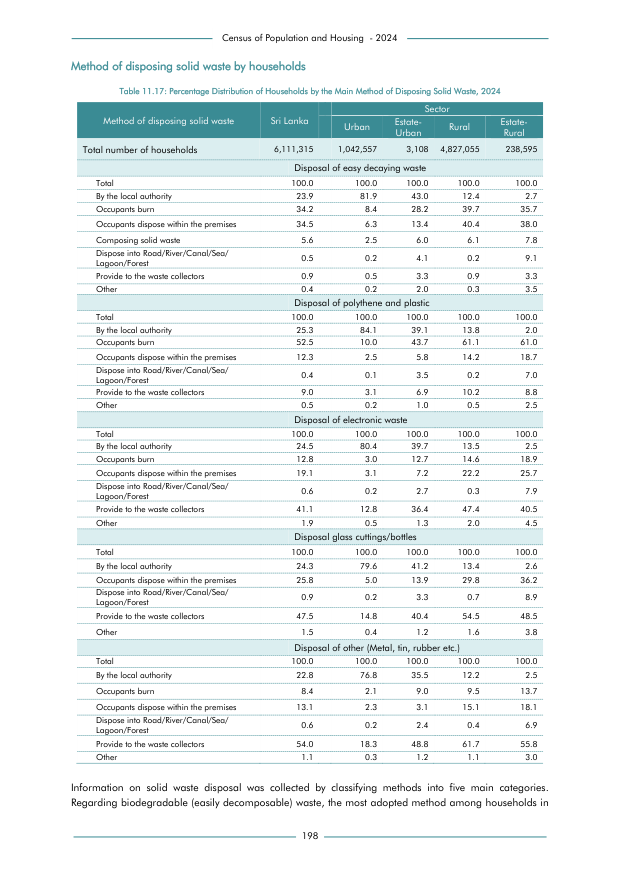

# Distribution of Households by the Main Method of Disposing Solid Waste, 2024


*Table 11.17, Final Report, 2024 Census of Population and Housing, Department of Census and Statistics, Sri Lanka*

## Raw Data (directly scraped from PDF)

```json
[
    [
        "",
        "",
        "",
        "",
        "Sector",
        ""
    ],
    [
        "Method of disposing solid waste",
        "Sri Lanka",
        "Urban",
        "Estate-",
        "Rural",
        "Estate-"
    ],
    [
        "",
        "",
        "",
        "Urban",
        "",
        "Rural"
    ],
    [
        "Total number of households",
        "6,111,315",
        "1,042,557",
        "3,108",
...
```
- Source File: [raw_data.json (4.1 KB)](../../../../data/final-report-tables/chapter-11/11.17-Distribution-of-Households-by-the-Main-Method-of-Disposing-Solid-Waste,-2024/raw_data.json)

## Original PDF Page



- Source File: [original.pdf (59.8 KB)](../../../../data/final-report-tables/chapter-11/11.17-Distribution-of-Households-by-the-Main-Method-of-Disposing-Solid-Waste,-2024/original.pdf)

## Source

- <https://www.statistics.gov.lk/Resource/en/Population/CPH_2024/CPH2024_Final_Eng.pdf#page=215>


[](https://opensource.org/licenses/MIT)
