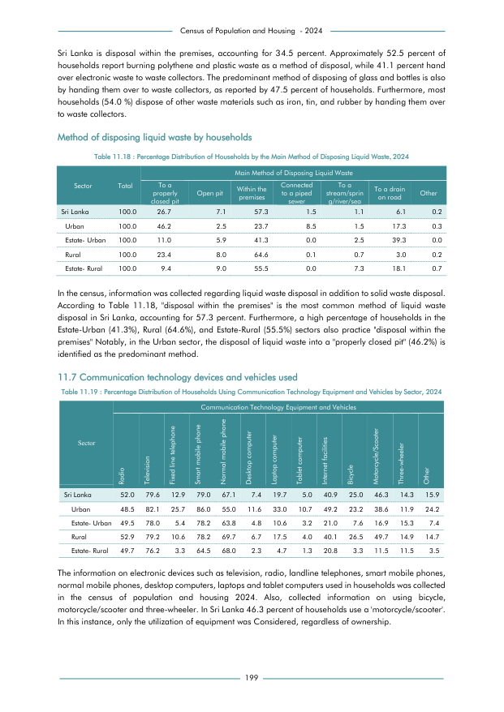

# Percentage Distribution of Households Using Communication Technology Equipment and Vehicles by Sector,2024


*Table 11.19, Final Report, 2024 Census of Population and Housing, Department of Census and Statistics, Sri Lanka*

## Structured Data formatted for [Lanka Data API](https://github.com/nuuuwan/lanka_data)

```json
{
    "House": {
        "Time:2024": {
            "Sector:urban": {
                "HouseholdAppliances:radio": {
                    "Percent": "Percent:0.485"
                },
                "HouseholdAppliances:television": {
                    "Percent": "Percent:0.821"
                },
                "HouseholdAppliances:fixed_line_telephone": {
                    "Percent": "Percent:0.257"
                },
                "HouseholdAppliances:smart_mobile_phone": {
                    "Percent": "Percent:0.86"
                },
                "HouseholdAppliances:normal_mobile_phone": {
                    "Percent": "Percent:0.55"
                },
                "HouseholdAppliances:desktop_computer": {
                    "Percent": "Percent:0.116"
                },
                "HouseholdAppliances:laptop_computer": {
                    "Percent": "Percent:0.33"
                },
                "HouseholdAppliances:tablet_computer": {
                    "Percent": "Percent:0.107"
                },
                "HouseholdAppliances:internet_facilities": {
                    "Percent": "Percent:0.492"
...
```

- Source File: [lanka_data.json (5.0 KB)](../../../../data/final-report-tables/chapter-11/11.19-Percentage-Distribution-of-Households-Using-Communication-Technology-Equipment-and-Vehicles-by-Sector-2024/lanka_data.json)

## Structured Data (similar to original layout)

```json
[
    {
        "sector": "Urban",
        "values": {
            "p_radio": 0.485,
            "p_television": 0.821,
            "p_fixed_line_telephone": 0.257,
            "p_smart_mobile_phone": 0.86,
            "p_normal_mobile_phone": 0.55,
            "p_desktop_computer": 0.116,
            "p_laptop_computer": 0.33,
            "p_tablet_computer": 0.107,
            "p_internet_facilities": 0.492,
            "p_bicycle": 0.232,
            "p_motorcycle_or_scooter": 0.386,
            "p_three_wheeler": 0.119,
            "p_other": 0.242
        }
    },
    {
        "sector": "Estate- Urban",
        "values": {
            "p_radio": 0.495,
            "p_television": 0.78,
            "p_fixed_line_telephone": 0.054,
            "p_smart_mobile_phone": 0.782,
            "p_normal_mobile_phone": 0.638,
            "p_desktop_computer": 0.048,
            "p_laptop_computer": 0.106,
            "p_tablet_computer": 0.032,
...
```

- Source File: [data.json (1.9 KB)](../../../../data/final-report-tables/chapter-11/11.19-Percentage-Distribution-of-Households-Using-Communication-Technology-Equipment-and-Vehicles-by-Sector-2024/data.json)

## Raw Data (directly scraped from PDF)

```json
[
    [
        "Sri Lanka",
        "Radio \n52.0",
        "Television \n79.6",
        "12.9",
        "79.0",
        "67.1",
        "Desktop computer \n7.4",
        "Laptop computer \n19.7",
        "Tablet computer \n5.0",
        "Internet facilities \n40.9",
        "Bicycle \n25.0",
        "Motorcycle/Scooter \n46.3",
        "Three-wheeler \n14.3",
        "Other \n15.9"
    ],
    [
        "Urban",
        "48.5",
        "82.1",
        "25.7",
        "86.0",
        "55.0",
        "11.6",
        "33.0",
        "10.7",
        "49.2",
        "23.2",
        "38.6",
...
```
- Source File: [raw_data.json (1.0 KB)](../../../../data/final-report-tables/chapter-11/11.19-Percentage-Distribution-of-Households-Using-Communication-Technology-Equipment-and-Vehicles-by-Sector-2024/raw_data.json)

## Original PDF Page



- Source File: [original.pdf (55.3 KB)](../../../../data/final-report-tables/chapter-11/11.19-Percentage-Distribution-of-Households-Using-Communication-Technology-Equipment-and-Vehicles-by-Sector-2024/original.pdf)

(Table 1 on this page.)

## Source

- <https://www.statistics.gov.lk/Resource/en/Population/CPH_2024/CPH2024_Final_Eng.pdf#page=216>


[](https://opensource.org/licenses/MIT)
