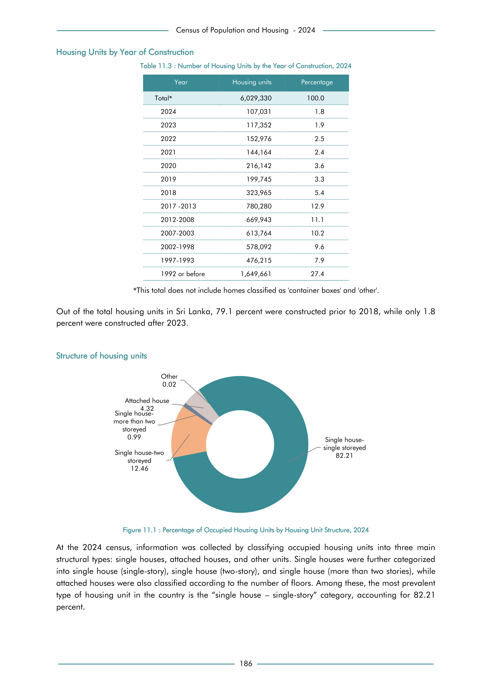

# Number of Housing Units by the Year of Construction, 2024


*Table 11.3, Final Report, 2024 Census of Population and Housing, Department of Census and Statistics, Sri Lanka*

## Structured Data (similar to original layout)

```json
[
    {
        "construction_year": "Total*",
        "values": {
            "housing_units": 6029330
        }
    },
    {
        "construction_year": "2024",
        "values": {
            "housing_units": 107031
        }
    },
    {
        "construction_year": "2023",
        "values": {
            "housing_units": 117352
        }
    },
    {
        "construction_year": "2022",
        "values": {
            "housing_units": 152976
        }
    },
    {
        "construction_year": "2021",
        "values": {
            "housing_units": 144164
        }
...
```

- Source File: [data.json (1.4 kB)](../../../../data/final-report-tables/chapter-11/11.3-Number-of-Housing-Units-by-the-Year-of-Construction,-2024/data.json)

## Raw Data (directly scraped from PDF)

```json
[
    [
        "Year",
        "Housing units",
        "Percentage"
    ],
    [
        "Total*",
        "6,029,330",
        "100.0"
    ],
    [
        "2024",
        "107,031",
        "1.8"
    ],
    [
        "2023",
        "117,352",
        "1.9"
    ],
    [
        "2022",
        "152,976",
        "2.5"
    ],
    [
        "2021",
        "144,164",
        "2.4"
...
```
- Source File: [raw_data.json (753 B)](../../../../data/final-report-tables/chapter-11/11.3-Number-of-Housing-Units-by-the-Year-of-Construction,-2024/raw_data.json)

## Original PDF Page



- Source File: [original.pdf (43.8 kB)](../../../../data/final-report-tables/chapter-11/11.3-Number-of-Housing-Units-by-the-Year-of-Construction,-2024/original.pdf)

## Source

- <https://www.statistics.gov.lk/Resource/en/Population/CPH_2024/CPH2024_Final_Eng.pdf#page=203>


[](https://opensource.org/licenses/MIT)
