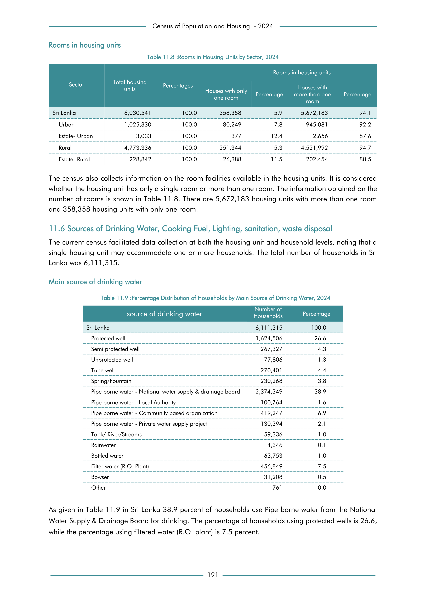

# Distribution of Households by Main Source of Drinking Water, 2024


*Table 11.9, Final Report, 2024 Census of Population and Housing, Department of Census and Statistics, Sri Lanka*

## Structured Data (similar to original layout)

```json
[
    {
        "source_drinking_water": "Sri Lanka",
        "values": {
            "households": 6111315
        }
    },
    {
        "source_drinking_water": "Protected well",
        "values": {
            "households": 1624506
        }
    },
    {
        "source_drinking_water": "Semi protected well",
        "values": {
            "households": 267327
        }
    },
    {
        "source_drinking_water": "Unprotected well",
        "values": {
            "households": 77806
        }
    },
    {
        "source_drinking_water": "Tube well",
        "values": {
            "households": 270401
        }
...
```

- Source File: [data.json (1.8 KB)](../../../../data/final-report-tables/chapter-11/11.9-Distribution-of-Households-by-Main-Source-of-Drinking-Water,-2024/data.json)

## Raw Data (directly scraped from PDF)

```json
[
    [
        "source of drinking water",
        "Number of \nHouseholds",
        "Percentage"
    ],
    [
        "Sri Lanka",
        "6,111,315",
        "100.0"
    ],
    [
        "Protected well",
        "1,624,506",
        "26.6"
    ],
    [
        "Semi protected well",
        "267,327",
        "4.3"
    ],
    [
        "Unprotected well",
        "77,806",
        "1.3"
    ],
    [
        "Tube well",
        "270,401",
        "4.4"
...
```
- Source File: [raw_data.json (1.1 KB)](../../../../data/final-report-tables/chapter-11/11.9-Distribution-of-Households-by-Main-Source-of-Drinking-Water,-2024/raw_data.json)

## Original PDF Page



- Source File: [original.pdf (58.9 KB)](../../../../data/final-report-tables/chapter-11/11.9-Distribution-of-Households-by-Main-Source-of-Drinking-Water,-2024/original.pdf)

(Table 1 on this page.)

## Source

- <https://www.statistics.gov.lk/Resource/en/Population/CPH_2024/CPH2024_Final_Eng.pdf#page=208>


[](https://opensource.org/licenses/MIT)
