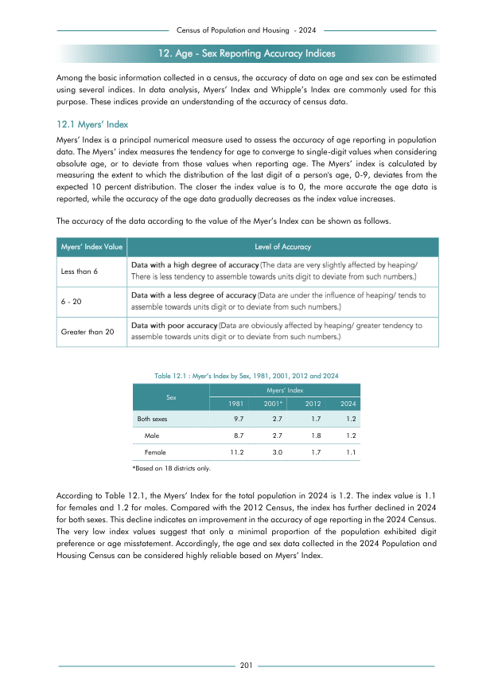

# Myer’s Index by Sex, 1981, 2001, 2012 and 2024


*Table 12.1, Final Report, 2024 Census of Population and Housing, Department of Census and Statistics, Sri Lanka*

## Structured Data formatted for [Lanka Data API](https://github.com/nuuuwan/lanka_data)

```json
{
    "_meta": {
        "source_url": "https://www.statistics.gov.lk/Resource/en/Population/CPH_2024/CPH2024_Final_Eng.pdf#page=218",
        "source_description": "Table 12.1, Final Report, 2024 Census of Population and Housing, Department of Census and Statistics, Sri Lanka",
        "what": {
            "MyersIndexBySex": "Myer\u2019s Index by Sex, 1981, 2001, 2012 and 2024"
        },
        "when": [
            "1981",
            "2001",
            "2012",
            "2024"
        ],
        "where_who_types": [
            "sex"
        ]
    },
    "MyersIndexBySex": {
        "1981": {
            "Both sexes": {
                "sex": "Both sexes",
                "values": {
                    "MyersIndex": 9.7
                }
            },
            "Male": {
                "sex": "Male",
                "values": {
                    "MyersIndex": 8.7
                }
...
```

- Source File: [lanka_data.json (1.9 KB)](../../../../data/final-report-tables/chapter-12/12.1-Myer’s-Index-by-Sex,-1981,-2001,-2012-and-2024/lanka_data.json)

## Structured Data (similar to original layout)

```json
[
    {
        "sex": "Both sexes",
        "values": {
            "myers_index_1981": 9.7,
            "myers_index_2001": 2.7,
            "myers_index_2012": 1.7,
            "myers_index_2024": 1.2
        }
    },
    {
        "sex": "Male",
        "values": {
            "myers_index_1981": 8.7,
            "myers_index_2001": 2.7,
            "myers_index_2012": 1.8,
            "myers_index_2024": 1.2
        }
    },
    {
        "sex": "Female",
        "values": {
            "myers_index_1981": 11.2,
            "myers_index_2001": 3.0,
            "myers_index_2012": 1.7,
            "myers_index_2024": 1.1
        }
    }
]
```

- Source File: [data.json (530.0 B)](../../../../data/final-report-tables/chapter-12/12.1-Myer’s-Index-by-Sex,-1981,-2001,-2012-and-2024/data.json)

## Raw Data (directly scraped from PDF)

```json
[
    [
        "",
        "Table 12.1 : Myer\u2019s Index by Sex, 1981, 2001, 2012 and 2024",
        "",
        "",
        ""
    ],
    [
        "Sex",
        "",
        "Myers\u2019 Index",
        "",
        ""
    ],
    [
        "",
        "1981",
        "2001*",
        "2012",
        "2024"
    ],
    [
        "Both sexes",
        "9.7",
        "2.7",
        "1.7",
        "1.2"
    ],
    [
...
```
- Source File: [raw_data.json (448.0 B)](../../../../data/final-report-tables/chapter-12/12.1-Myer’s-Index-by-Sex,-1981,-2001,-2012-and-2024/raw_data.json)

## Original PDF Page



- Source File: [original.pdf (75.7 KB)](../../../../data/final-report-tables/chapter-12/12.1-Myer’s-Index-by-Sex,-1981,-2001,-2012-and-2024/original.pdf)

## Source

- <https://www.statistics.gov.lk/Resource/en/Population/CPH_2024/CPH2024_Final_Eng.pdf#page=218>


[](https://opensource.org/licenses/MIT)
