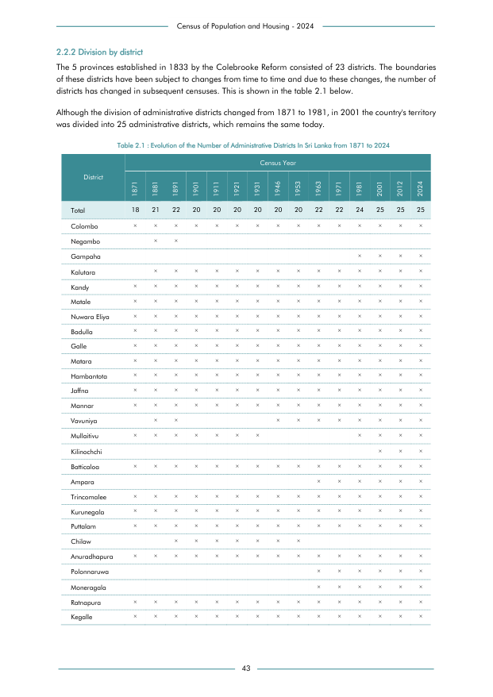

# Evolution of the Number of Administrative Districts In Sri Lanka from 1871 to 2024


*Table 2.1, Final Report, 2024 Census of Population and Housing, Department of Census and Statistics, Sri Lanka*

## Raw Data (directly scraped from PDF)

```json
[
    [
        "Census of Population and Housing - 2024"
    ],
    [
        "2.2.2 Division by district"
    ],
    [
        "The 5 provinces established in 1833 by the Colebrooke Reform consisted of 23 districts. The boundaries"
    ],
    [
        "of these districts have been subject to changes from time to time and due to these changes, the number of"
    ],
    [
        "districts has changed in subsequent censuses. This is shown in the table 2.1 below."
    ],
    [
        "Although the division of administrative districts changed from 1871 to 1981, in 2001 the country's territory"
    ],
    [
        "was divided into 25 administrative districts, which remains the same today."
    ],
    [
        "District",
        "1871",
        "1881",
        "1891",
        "1901",
        "1911",
        "1921",
...
```
- Source File: [raw_data.json (5.4 KB)](../../../../data/final-report-tables/chapter-2/2.1-Evolution-of-the-Number-of-Administrative-Districts-In-Sri-Lanka-from-1871-to-2024/raw_data.json)

## Original PDF Page



- Source File: [original.pdf (107.0 KB)](../../../../data/final-report-tables/chapter-2/2.1-Evolution-of-the-Number-of-Administrative-Districts-In-Sri-Lanka-from-1871-to-2024/original.pdf)

## Source

- <https://www.statistics.gov.lk/Resource/en/Population/CPH_2024/CPH2024_Final_Eng.pdf#page=60>


[](https://opensource.org/licenses/MIT)
