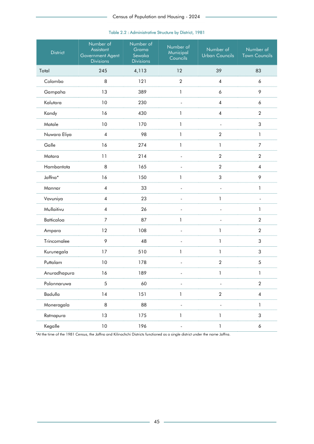

# Administrative Structure by District, 1981


*Table 2.2, Final Report, 2024 Census of Population and Housing, Department of Census and Statistics, Sri Lanka*

## Raw Data (directly scraped from PDF)

```json
[
    [
        "",
        "Government Agent",
        "Sewaka",
        "Councils",
        "Urban Councils",
        "Town Councils"
    ],
    [
        "",
        "Divisions",
        "Divisions",
        "",
        "",
        ""
    ],
    [
        "Total",
        "245",
        "4,113",
        "12",
        "39",
        "83"
    ],
    [
        "Colombo",
        "8",
        "121",
        "2",
...
```
- Source File: [raw_data.json (2.1 KB)](../../../../data/final-report-tables/chapter-2/2.2-Administrative-Structure-by-District,-1981/raw_data.json)

## Original PDF Page



- Source File: [original.pdf (89.6 KB)](../../../../data/final-report-tables/chapter-2/2.2-Administrative-Structure-by-District,-1981/original.pdf)

## Source

- <https://www.statistics.gov.lk/Resource/en/Population/CPH_2024/CPH2024_Final_Eng.pdf#page=62>


[](https://opensource.org/licenses/MIT)
