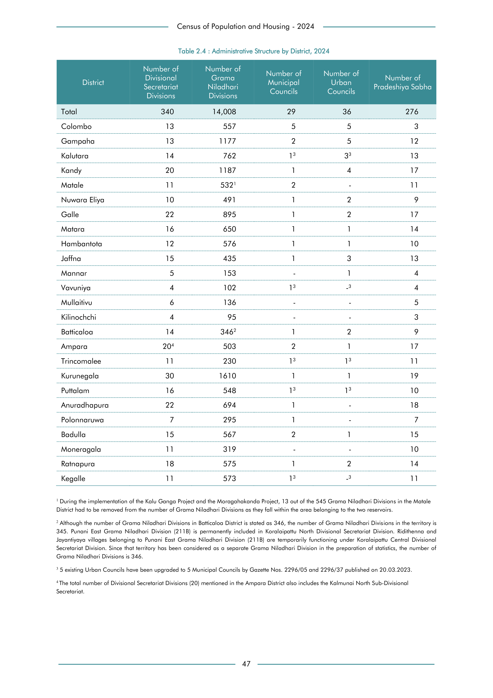

# Administrative Structure by District, 2024


*Table 2.4, Final Report, 2024 Census of Population and Housing, Department of Census and Statistics, Sri Lanka*

## Structured Data formatted for [Lanka Data API](https://github.com/nuuuwan/lanka_data)

```json
{
    "_meta": {
        "source_url": "https://www.statistics.gov.lk/Resource/en/Population/CPH_2024/CPH2024_Final_Eng.pdf#page=64",
        "source_description": [
            "Table 2.4, Final Report, 2024 Census of Population and Housing, Department of Census and Statistics, Sri Lanka"
        ],
        "what": {
            "AdministrativeStructure": "Administrative Structure by District, 2024"
        },
        "when": "2024",
        "where_who_types": [
            "province",
            "district",
            "country",
            "ed"
        ]
    },
    "AdministrativeStructure": {
        "2024": {
            "LK-11": {
                "region_id": "LK-11",
                "region_name": "Colombo",
                "region_ent_type": "district",
                "values": {
                    "GramaSevakaDivisions": 557,
                    "AssistantGovernmentAgendDivisions": 13,
                    "MunicipalCouncils": 5,
                    "UrbanCouncils": 5,
                    "TownCouncils": 3
                },
...
```

- Source File: [lanka_data.json (34.3 KB)](../../../../data/final-report-tables/chapter-2/2.4-Administrative-Structure-by-District,-2024/lanka_data.json)

## Structured Data (similar to original layout)

```json
[
    {
        "region_id": "LK-11",
        "region_name": "Colombo",
        "region_ent_type": "district",
        "values": {
            "assistant_government_agend_divisions": 13,
            "grama_sevaka_divisions": 557,
            "municipal_councils": 5,
            "urban_councils": 5,
            "town_councils": 3
        },
        "total_value": 583
    },
    {
        "region_id": "LK-12",
        "region_name": "Gampaha",
        "region_ent_type": "district",
        "values": {
            "assistant_government_agend_divisions": 13,
            "grama_sevaka_divisions": 1177,
            "municipal_councils": 2,
            "urban_councils": 5,
            "town_councils": 12
        },
        "total_value": 1209
    },
    {
        "region_id": "LK-13",
        "region_name": "Kalutara",
...
```

- Source File: [data.json (17.6 KB)](../../../../data/final-report-tables/chapter-2/2.4-Administrative-Structure-by-District,-2024/data.json)

## Raw Data (directly scraped from PDF)

```json
[
    [
        "",
        "Divisional",
        "Grama",
        "Number of",
        "Number of",
        "Number of"
    ],
    [
        "District",
        "Secretariat",
        "Niladhari",
        "Municipal",
        "Urban",
        "Pradeshiya Sabha"
    ],
    [
        "",
        "Divisions",
        "Divisions",
        "Councils",
        "Councils",
        ""
    ],
    [
        "Total",
        "340",
        "14,008",
        "29",
...
```
- Source File: [raw_data.json (4.1 KB)](../../../../data/final-report-tables/chapter-2/2.4-Administrative-Structure-by-District,-2024/raw_data.json)

## Original PDF Page



- Source File: [original.pdf (54.3 KB)](../../../../data/final-report-tables/chapter-2/2.4-Administrative-Structure-by-District,-2024/original.pdf)

## Source

- <https://www.statistics.gov.lk/Resource/en/Population/CPH_2024/CPH2024_Final_Eng.pdf#page=64>


[](https://opensource.org/licenses/MIT)
