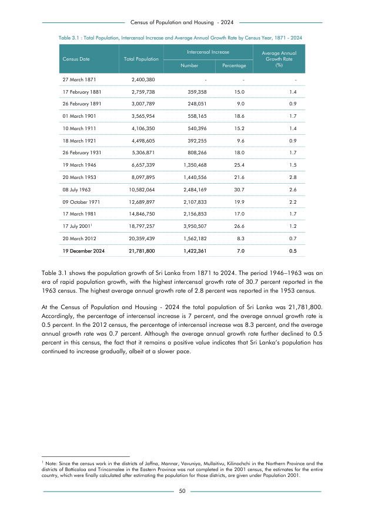

# Total Population, Intercensal Increase and Average Annual Growth Rate by Census Year, 1871 - 2024


*Table 3.1, Final Report, 2024 Census of Population and Housing, Department of Census and Statistics, Sri Lanka*

## Structured Data formatted for [Lanka Data API](https://github.com/nuuuwan/lanka_data)

```json
{
    "Person": {
        "Time:1871": {
            "Count": "Int:2400380"
        },
        "Time:1881": {
            "Count": "Int:2759738"
        },
        "Time:1891": {
            "Count": "Int:3007789"
        },
        "Time:1901": {
            "Count": "Int:3565954"
        },
        "Time:1911": {
            "Count": "Int:4106350"
        },
        "Time:1921": {
            "Count": "Int:4498605"
        },
        "Time:1931": {
            "Count": "Int:5306871"
        },
        "Time:1946": {
            "Count": "Int:6657339"
        },
        "Time:1953": {
            "Count": "Int:8097895"
        },
        "Time:1963": {
...
```

- Source File: [lanka_data.json (851.0 B)](../../../../data/final-report-tables/chapter-3/3.1-Total-Population-Intercensal-Increase-and-Average-Annual-Growth-Rate-by-Census-Year-1871-2024/lanka_data.json)

## Structured Data (similar to original layout)

```json
[
    {
        "census_date": "27 March 1871",
        "values": {
            "population": 2400380
        },
        "total_value": 2400380
    },
    {
        "census_date": "17 February 1881",
        "values": {
            "population": 2759738
        },
        "total_value": 2759738
    },
    {
        "census_date": "26 February 1891",
        "values": {
            "population": 3007789
        },
        "total_value": 3007789
    },
    {
        "census_date": "01 March 1901",
        "values": {
            "population": 3565954
        },
        "total_value": 3565954
    },
    {
...
```

- Source File: [data.json (2.0 KB)](../../../../data/final-report-tables/chapter-3/3.1-Total-Population-Intercensal-Increase-and-Average-Annual-Growth-Rate-by-Census-Year-1871-2024/data.json)

## Raw Data (directly scraped from PDF)

```json
[
    [
        "Table 3.1 : Total Population, Intercensal Increase and Average Annual Growth Rate by Census Year, 1871 - 2024",
        "",
        "",
        "",
        ""
    ],
    [
        "",
        "",
        "Intercensal Increase",
        "",
        "Average Annual"
    ],
    [
        "Census Date",
        "Total Population",
        "",
        "",
        "Growth Rate  \n(%)"
    ],
    [
        "",
        "",
        "Number",
        "Percentage",
        ""
    ],
    [
...
```
- Source File: [raw_data.json (3.0 KB)](../../../../data/final-report-tables/chapter-3/3.1-Total-Population-Intercensal-Increase-and-Average-Annual-Growth-Rate-by-Census-Year-1871-2024/raw_data.json)

## Original PDF Page



- Source File: [original.pdf (83.6 KB)](../../../../data/final-report-tables/chapter-3/3.1-Total-Population-Intercensal-Increase-and-Average-Annual-Growth-Rate-by-Census-Year-1871-2024/original.pdf)

## Source

- <https://www.statistics.gov.lk/Resource/en/Population/CPH_2024/CPH2024_Final_Eng.pdf#page=67>


[](https://opensource.org/licenses/MIT)
