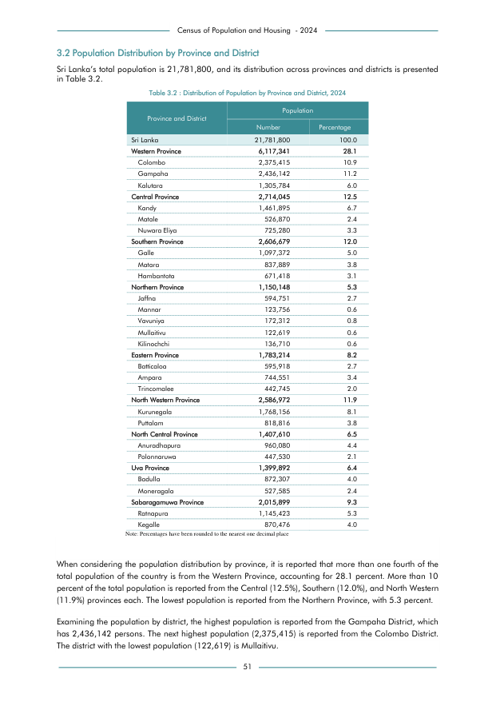

# Distribution of Population by Province and District, 2024


*Table 3.2, Final Report, 2024 Census of Population and Housing, Department of Census and Statistics, Sri Lanka*

## Structured Data formatted for [Lanka Data API](https://github.com/nuuuwan/lanka_data)

```json
{
    "Person": {
        "Time:2024": {
            "District:colombo": {
                "Count": "Int:2375415"
            },
            "District:gampaha": {
                "Count": "Int:2436142"
            },
            "District:kalutara": {
                "Count": "Int:1305784"
            },
            "District:kandy": {
                "Count": "Int:1461895"
            },
            "District:matale": {
                "Count": "Int:526870"
            },
            "District:nuwara_eliya": {
                "Count": "Int:725280"
            },
            "District:galle": {
                "Count": "Int:1097372"
            },
            "District:matara": {
                "Count": "Int:837889"
            },
            "District:hambantota": {
                "Count": "Int:671418"
            },
...
```

- Source File: [lanka_data.json (1.7 KB)](../../../../data/final-report-tables/chapter-3/3.2-Distribution-of-Population-by-Province-and-District-2024/lanka_data.json)

## Structured Data (similar to original layout)

```json
[
    {
        "region_id": "LK-11",
        "region_name": "Colombo",
        "region_ent_type": "district",
        "values": {
            "population": 2375415
        }
    },
    {
        "region_id": "LK-12",
        "region_name": "Gampaha",
        "region_ent_type": "district",
        "values": {
            "population": 2436142
        }
    },
    {
        "region_id": "LK-13",
        "region_name": "Kalutara",
        "region_ent_type": "district",
        "values": {
            "population": 1305784
        }
    },
    {
        "region_id": "LK-21",
        "region_name": "Kandy",
        "region_ent_type": "district",
        "values": {
...
```

- Source File: [data.json (8.3 KB)](../../../../data/final-report-tables/chapter-3/3.2-Distribution-of-Population-by-Province-and-District-2024/data.json)

## Raw Data (directly scraped from PDF)

```json
[
    [
        "",
        "Table 3.2 : Distribution of Population by Province and District, 2024",
        ""
    ],
    [
        "Province and District",
        "Population",
        ""
    ],
    [
        "",
        "Number",
        "Percentage"
    ],
    [
        "Sri Lanka",
        "21,781,800",
        "100.0"
    ],
    [
        "Western Province",
        "6,117,341",
        "28.1"
    ],
    [
        "Colombo",
        "2,375,415",
        "10.9"
...
```
- Source File: [raw_data.json (2.2 KB)](../../../../data/final-report-tables/chapter-3/3.2-Distribution-of-Population-by-Province-and-District-2024/raw_data.json)

## Original PDF Page



- Source File: [original.pdf (83.8 KB)](../../../../data/final-report-tables/chapter-3/3.2-Distribution-of-Population-by-Province-and-District-2024/original.pdf)

## Source

- <https://www.statistics.gov.lk/Resource/en/Population/CPH_2024/CPH2024_Final_Eng.pdf#page=68>


[](https://opensource.org/licenses/MIT)
