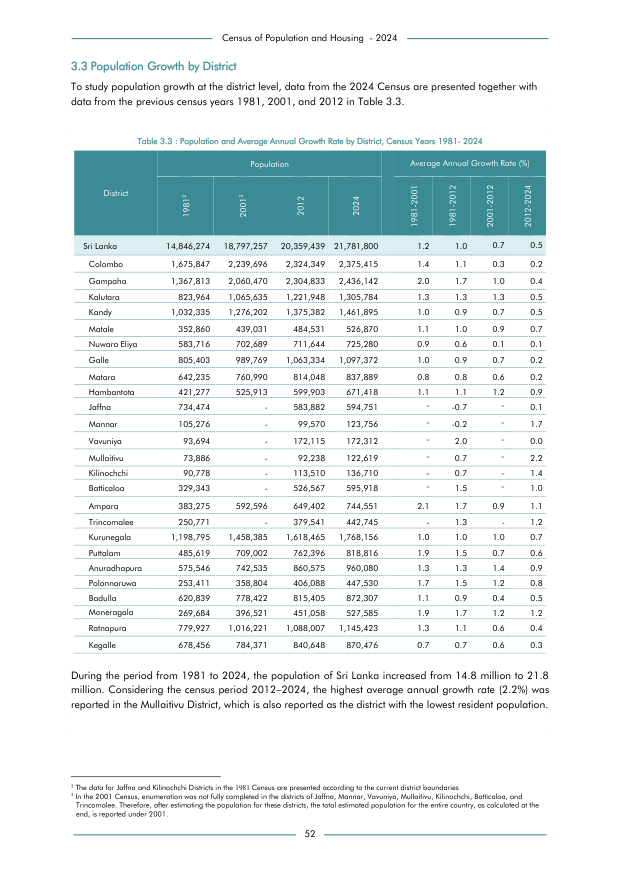

# Population and Average Annual Growth Rate by District, Census Years 1981- 2024


*Table 3.3, Final Report, 2024 Census of Population and Housing, Department of Census and Statistics, Sri Lanka*

## Raw Data (directly scraped from PDF)

```json
[
    [
        "Sri Lanka",
        "19812 \n14,846,274",
        "20013 \n18,797,257",
        "2012 \n   20,359,439    21,781,800",
        "2024",
        "1981-2001 \n1.2",
        "1981-2012 \n1.0",
        "2001-2012 \n0.7",
        "2012-2024 \n0.5"
    ],
    [
        "Colombo",
        "1,675,847",
        "2,239,696",
        "2,324,349",
        "2,375,415",
        "1.4",
        "1.1",
        "0.3",
        "0.2"
    ],
    [
        "Gampaha",
        "1,367,813",
        "2,060,470",
        "2,304,833",
        "2,436,142",
        "2.0",
...
```
- Source File: [raw_data.json (3.3 KB)](../../../../data/final-report-tables/chapter-3/3.3-Population-and-Average-Annual-Growth-Rate-by-District,-Census-Years-1981--2024/raw_data.json)

## Original PDF Page



- Source File: [original.pdf (121.6 KB)](../../../../data/final-report-tables/chapter-3/3.3-Population-and-Average-Annual-Growth-Rate-by-District,-Census-Years-1981--2024/original.pdf)

## Source

- <https://www.statistics.gov.lk/Resource/en/Population/CPH_2024/CPH2024_Final_Eng.pdf#page=69>


[](https://opensource.org/licenses/MIT)
