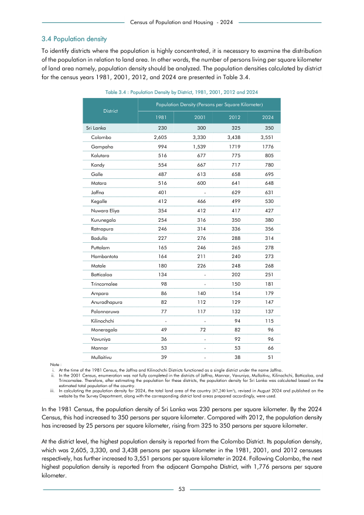

# Population Density by District, 1981, 2001, 2012 and 2024


*Table 3.4, Final Report, 2024 Census of Population and Housing, Department of Census and Statistics, Sri Lanka*

## Structured Data formatted for [Lanka Data API](https://github.com/nuuuwan/lanka_data)

```json
{
    "Person": {
        "Time:1981": {
            "District:colombo": {
                "PopulationDensity": "Float:2605.0"
            },
            "District:gampaha": {
                "PopulationDensity": "Float:994.0"
            },
            "District:kalutara": {
                "PopulationDensity": "Float:516.0"
            },
            "District:kandy": {
                "PopulationDensity": "Float:554.0"
            },
            "District:galle": {
                "PopulationDensity": "Float:487.0"
            },
            "District:matara": {
                "PopulationDensity": "Float:516.0"
            },
            "District:jaffna": {
                "PopulationDensity": "Float:401.0"
            },
            "District:kegalle": {
                "PopulationDensity": "Float:412.0"
            },
            "District:nuwara_eliya": {
                "PopulationDensity": "Float:354.0"
            },
...
```

- Source File: [lanka_data.json (8.0 KB)](../../../../data/final-report-tables/chapter-3/3.4-Population-Density-by-District-1981-2001-2012-and-2024/lanka_data.json)

## Structured Data (similar to original layout)

```json
[
    {
        "region_id": "LK-11",
        "region_name": "Colombo",
        "region_ent_type": "district",
        "values": {
            "population_density_1981": 2605,
            "population_density_2001": 3330,
            "population_density_2012": 3438,
            "population_density_2024": 3551
        }
    },
    {
        "region_id": "LK-12",
        "region_name": "Gampaha",
        "region_ent_type": "district",
        "values": {
            "population_density_1981": 994,
            "population_density_2001": 1539,
            "population_density_2012": 1719,
            "population_density_2024": 1776
        }
    },
    {
        "region_id": "LK-13",
        "region_name": "Kalutara",
        "region_ent_type": "district",
        "values": {
            "population_density_1981": 516,
            "population_density_2001": 677,
...
```

- Source File: [data.json (6.7 KB)](../../../../data/final-report-tables/chapter-3/3.4-Population-Density-by-District-1981-2001-2012-and-2024/data.json)

## Raw Data (directly scraped from PDF)

```json
[
    [
        "Census of Population and Housing  - 2024"
    ],
    [
        "3.4 Population density"
    ],
    [
        "To identify districts where the population is highly concentrated, it is necessary to examine the distribution"
    ],
    [
        "of the population in relation to land area. In other words, the number of persons living per square kilometer"
    ],
    [
        "of land area namely, population density should be analyzed. The population densities calculated by district"
    ],
    [
        "for the census years 1981, 2001, 2012, and 2024 are presented in Table 3.4."
    ],
    [
        "",
        "",
        "Population Density (Persons per Square Kilometer)",
        "",
        ""
    ],
    [
        "District",
        "",
        "",
...
```
- Source File: [raw_data.json (3.3 KB)](../../../../data/final-report-tables/chapter-3/3.4-Population-Density-by-District-1981-2001-2012-and-2024/raw_data.json)

## Original PDF Page



- Source File: [original.pdf (149.4 KB)](../../../../data/final-report-tables/chapter-3/3.4-Population-Density-by-District-1981-2001-2012-and-2024/original.pdf)

## Source

- <https://www.statistics.gov.lk/Resource/en/Population/CPH_2024/CPH2024_Final_Eng.pdf#page=70>


[](https://opensource.org/licenses/MIT)
