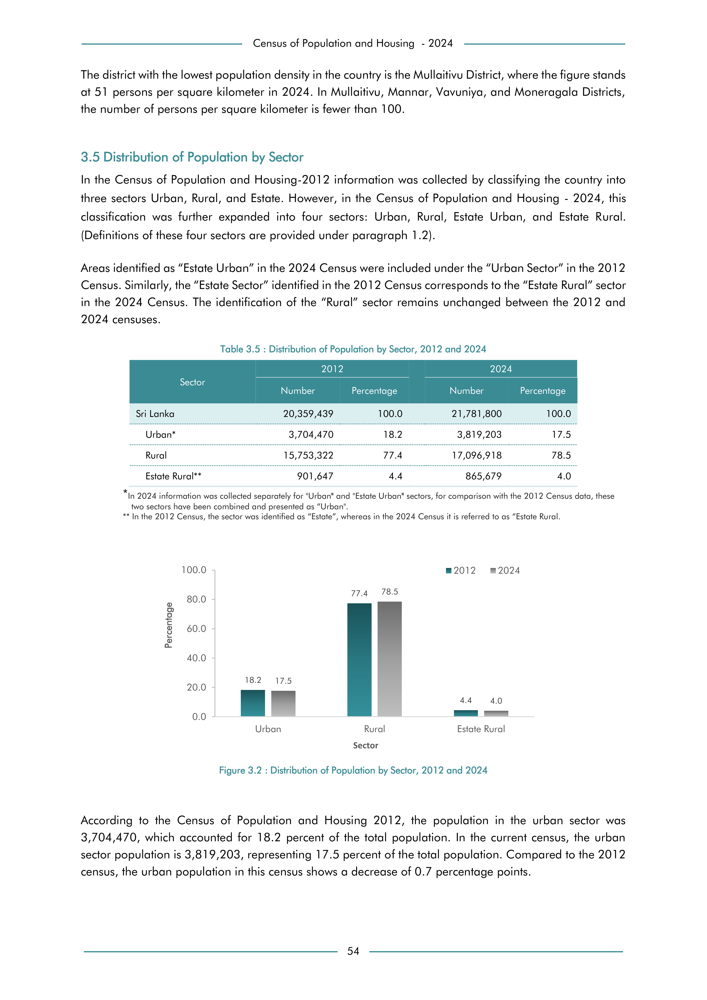

# Distribution of Population by Sector, 2012 and 2024


*Table 3.5, Final Report, 2024 Census of Population and Housing, Department of Census and Statistics, Sri Lanka*

## Structured Data formatted for [Lanka Data API](https://github.com/nuuuwan/lanka_data)

```json
{
    "Person": {
        "Sector:Urban": {
            "Time:2012": {
                "Count": "Int:3704470"
            },
            "Time:2024": {
                "Count": "Int:3819203"
            }
        },
        "Sector:Rural": {
            "Time:2012": {
                "Count": "Int:15753322"
            },
            "Time:2024": {
                "Count": "Int:17096918"
            }
        },
        "Sector:EstateRural": {
            "Time:2012": {
                "Count": "Int:901647"
            },
            "Time:2024": {
                "Count": "Int:865679"
            }
        }
    }
}
```

- Source File: [lanka_data.json (476.0 B)](../../../../data/final-report-tables/chapter-3/3.5-Distribution-of-Population-by-Sector,-2012-and-2024/lanka_data.json)

## Structured Data (similar to original layout)

```json
[
    {
        "sector": "Sri Lanka",
        "values": {
            "population_2012": 20359439,
            "population_2024": 21781800
        }
    },
    {
        "sector": "Urban*",
        "values": {
            "population_2012": 3704470,
            "population_2024": 3819203
        }
    },
    {
        "sector": "Rural",
        "values": {
            "population_2012": 15753322,
            "population_2024": 17096918
        }
    },
    {
        "sector": "Estate Rural**",
        "values": {
            "population_2012": 901647,
            "population_2024": 865679
        }
    }
]
```

- Source File: [data.json (502.0 B)](../../../../data/final-report-tables/chapter-3/3.5-Distribution-of-Population-by-Sector,-2012-and-2024/data.json)

## Raw Data (directly scraped from PDF)

```json
[
    [
        "",
        "2012",
        "",
        "2024",
        ""
    ],
    [
        "Sector",
        "Number",
        "Percentage",
        "Number",
        "Percentage"
    ],
    [
        "Sri Lanka",
        "20,359,439",
        "100.0",
        "21,781,800",
        "100.0"
    ],
    [
        "Urban*",
        "3,704,470",
        "18.2",
        "3,819,203",
        "17.5"
    ],
    [
...
```
- Source File: [raw_data.json (1.3 KB)](../../../../data/final-report-tables/chapter-3/3.5-Distribution-of-Population-by-Sector,-2012-and-2024/raw_data.json)

## Original PDF Page



- Source File: [original.pdf (94.5 KB)](../../../../data/final-report-tables/chapter-3/3.5-Distribution-of-Population-by-Sector,-2012-and-2024/original.pdf)

## Source

- <https://www.statistics.gov.lk/Resource/en/Population/CPH_2024/CPH2024_Final_Eng.pdf#page=71>


[](https://opensource.org/licenses/MIT)
