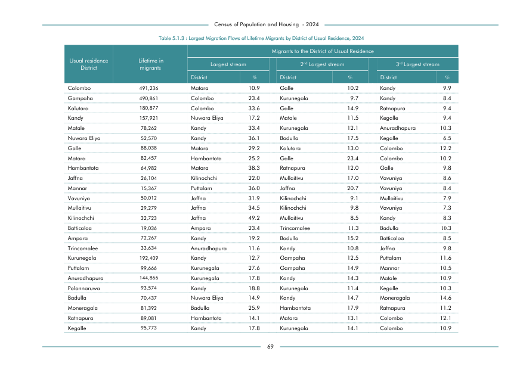

# Largest Migration Flows of Lifetime Migrants by District of Usual Residence, 2024


*Table 5.1.3, Final Report, 2024 Census of Population and Housing, Department of Census and Statistics, Sri Lanka*

## Structured Data (similar to original layout)

```json
[
    {
        "region_id": "LK-11",
        "region_name": "Colombo",
        "region_ent_type": "district",
        "values": {
            "lifetime_in_migrants": 491236,
            "1st_largest_stream_migration_district_name": "Matara",
            "p_1st_largest_stream_migration_district": 0.109,
            "2nd_largest_stream_migration_district_name": "Galle",
            "p_2nd_largest_stream_migration_district": 0.102,
            "3rd_largest_stream_migration_district_name": "Kandy",
            "p_3rd_largest_stream_migration_district": 0.099
        }
    },
    {
        "region_id": "LK-12",
        "region_name": "Gampaha",
        "region_ent_type": "district",
        "values": {
            "lifetime_in_migrants": 490861,
            "1st_largest_stream_migration_district_name": "Colombo",
            "p_1st_largest_stream_migration_district": 0.234,
            "2nd_largest_stream_migration_district_name": "Kurunegala",
            "p_2nd_largest_stream_migration_district": 0.097,
            "3rd_largest_stream_migration_district_name": "Kandy",
            "p_3rd_largest_stream_migration_district": 0.084
        }
    },
    {
...
```

- Source File: [data.json (12.7 KB)](../../../../data/final-report-tables/chapter-5/5.1.3-Largest-Migration-Flows-of-Lifetime-Migrants-by-District-of-Usual-Residence,-2024/data.json)

## Raw Data (directly scraped from PDF)

```json
[
    [
        "",
        "",
        "",
        "",
        "",
        "Migrants to the District of Usual Residence",
        "",
        ""
    ],
    [
        "Usual residence",
        "Lifetime in",
        "Largest stream",
        "",
        "2nd Largest stream",
        "",
        "3rd Largest stream",
        ""
    ],
    [
        "District",
        "migrants",
        "",
        "",
        "",
        "",
        "",
        ""
...
```
- Source File: [raw_data.json (3.4 KB)](../../../../data/final-report-tables/chapter-5/5.1.3-Largest-Migration-Flows-of-Lifetime-Migrants-by-District-of-Usual-Residence,-2024/raw_data.json)

## Original PDF Page



- Source File: [original.pdf (115.5 KB)](../../../../data/final-report-tables/chapter-5/5.1.3-Largest-Migration-Flows-of-Lifetime-Migrants-by-District-of-Usual-Residence,-2024/original.pdf)

## Source

- <https://www.statistics.gov.lk/Resource/en/Population/CPH_2024/CPH2024_Final_Eng.pdf#page=86>


[](https://opensource.org/licenses/MIT)
