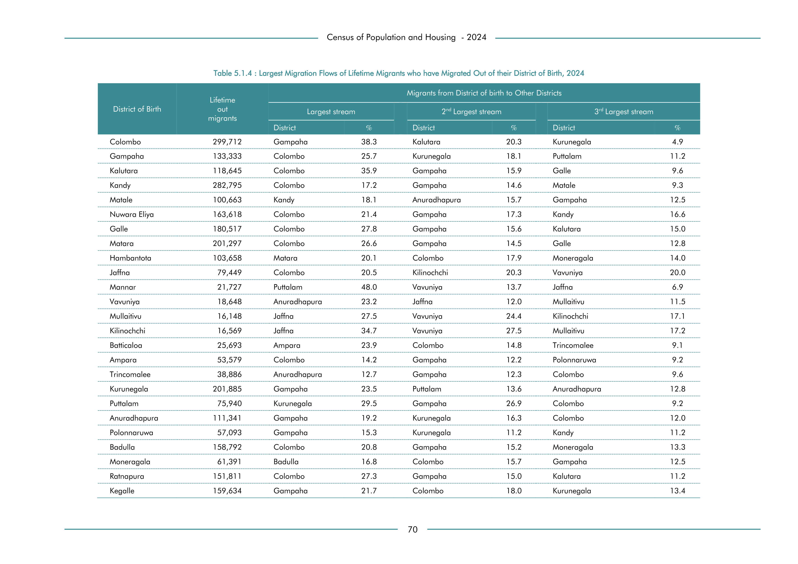

# Largest Migration Flows of Lifetime Migrants who have Migrated Out of their District of Birth, 2024


*Table 5.1.4, Final Report, 2024 Census of Population and Housing, Department of Census and Statistics, Sri Lanka*

## Structured Data (similar to original layout)

```json
[
    {
        "region_id": "LK-11",
        "region_name": "Colombo",
        "region_ent_type": "district",
        "values": {
            "lifetime_in_migrants": 299712,
            "1st_largest_stream_migration_district_name": "Gampaha",
            "p_1st_largest_stream_migration_district": 0.383,
            "2nd_largest_stream_migration_district_name": "Kalutara",
            "p_2nd_largest_stream_migration_district": 0.203,
            "3rd_largest_stream_migration_district_name": "Kurunegala",
            "p_3rd_largest_stream_migration_district": 0.049
        }
    },
    {
        "region_id": "LK-12",
        "region_name": "Gampaha",
        "region_ent_type": "district",
        "values": {
            "lifetime_in_migrants": 133333,
            "1st_largest_stream_migration_district_name": "Colombo",
            "p_1st_largest_stream_migration_district": 0.257,
            "2nd_largest_stream_migration_district_name": "Kurunegala",
            "p_2nd_largest_stream_migration_district": 0.181,
            "3rd_largest_stream_migration_district_name": "Puttalam",
            "p_3rd_largest_stream_migration_district": 0.112
        }
    },
    {
...
```

- Source File: [data.json (13.0 kB)](../../../../data/final-report-tables/chapter-5/5.1.4-Largest-Migration-Flows-of-Lifetime-Migrants-who-have-Migrated-Out-of-their-District-of-Birth,-2024/data.json)

## Raw Data (directly scraped from PDF)

```json
[
    [
        "",
        "Lifetime",
        "",
        "",
        "",
        "Migrants from District of birth to Other Districts",
        "",
        ""
    ],
    [
        "District of Birth",
        "out \nmigrants",
        "Largest stream",
        "",
        "2nd Largest stream",
        "",
        "3rd Largest stream",
        ""
    ],
    [
        "",
        "",
        "District",
        "%",
        "District",
        "%",
        "District",
        "%"
...
```
- Source File: [raw_data.json (3.4 kB)](../../../../data/final-report-tables/chapter-5/5.1.4-Largest-Migration-Flows-of-Lifetime-Migrants-who-have-Migrated-Out-of-their-District-of-Birth,-2024/raw_data.json)

## Original PDF Page



- Source File: [original.pdf (61.6 kB)](../../../../data/final-report-tables/chapter-5/5.1.4-Largest-Migration-Flows-of-Lifetime-Migrants-who-have-Migrated-Out-of-their-District-of-Birth,-2024/original.pdf)

## Source

- <https://www.statistics.gov.lk/Resource/en/Population/CPH_2024/CPH2024_Final_Eng.pdf#page=87>


[](https://opensource.org/licenses/MIT)
