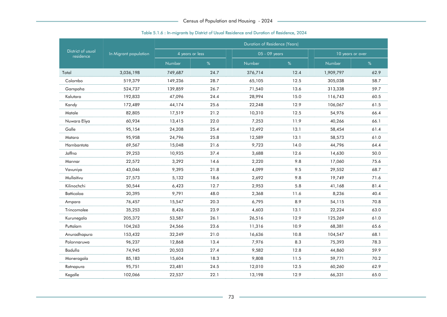

# In-migrants by District of Usual Residence and Duration of Residence, 2024


*Table 5.1.6, Final Report, 2024 Census of Population and Housing, Department of Census and Statistics, Sri Lanka*

## Structured Data formatted for [Lanka Data API](https://github.com/nuuuwan/lanka_data)

```json
{
    "Person": {
        "Time:2024": {
            "District:colombo": {
                "TimeDurationGroup:0To4Years": {
                    "Count": "Int:149236"
                },
                "TimeDurationGroup:5To9Years": {
                    "Count": "Int:65105"
                },
                "TimeDurationGroup:10To125Years": {
                    "Count": "Int:305038"
                }
            },
            "District:gampaha": {
                "TimeDurationGroup:0To4Years": {
                    "Count": "Int:139859"
                },
                "TimeDurationGroup:5To9Years": {
                    "Count": "Int:71540"
                },
                "TimeDurationGroup:10To125Years": {
                    "Count": "Int:313338"
                }
            },
            "District:kalutara": {
                "TimeDurationGroup:0To4Years": {
                    "Count": "Int:47096"
                },
                "TimeDurationGroup:5To9Years": {
...
```

- Source File: [lanka_data.json (7.1 KB)](../../../../data/final-report-tables/chapter-5/5.1.6-In-migrants-by-District-of-Usual-Residence-and-Duration-of-Residence-2024/lanka_data.json)

## Structured Data (similar to original layout)

```json
[
    {
        "region_id": "LK-11",
        "region_name": "Colombo",
        "region_ent_type": "district",
        "values": {
            "00_04_years": 149236,
            "05_09_years": 65105,
            "10_or_more_years": 305038
        },
        "total_value": 519379
    },
    {
        "region_id": "LK-12",
        "region_name": "Gampaha",
        "region_ent_type": "district",
        "values": {
            "00_04_years": 139859,
            "05_09_years": 71540,
            "10_or_more_years": 313338
        },
        "total_value": 524737
    },
    {
        "region_id": "LK-13",
        "region_name": "Kalutara",
        "region_ent_type": "district",
        "values": {
            "00_04_years": 47096,
            "05_09_years": 28994,
...
```

- Source File: [data.json (13.1 KB)](../../../../data/final-report-tables/chapter-5/5.1.6-In-migrants-by-District-of-Usual-Residence-and-Duration-of-Residence-2024/data.json)

## Raw Data (directly scraped from PDF)

```json
[
    [
        "District of usual \nresidence",
        "In Migrant population",
        "4 years or less",
        "",
        "",
        "05 - 09 years",
        "",
        "10 years or over",
        ""
    ],
    [
        "",
        "",
        "Number",
        "%",
        "Number",
        "%",
        "",
        "Number",
        "%"
    ],
    [
        "Total",
        "3,036,198",
        "749,687",
        "24.7",
        "376,714",
        "",
...
```
- Source File: [raw_data.json (3.4 KB)](../../../../data/final-report-tables/chapter-5/5.1.6-In-migrants-by-District-of-Usual-Residence-and-Duration-of-Residence-2024/raw_data.json)

## Original PDF Page



- Source File: [original.pdf (52.4 KB)](../../../../data/final-report-tables/chapter-5/5.1.6-In-migrants-by-District-of-Usual-Residence-and-Duration-of-Residence-2024/original.pdf)

## Source

- <https://www.statistics.gov.lk/Resource/en/Population/CPH_2024/CPH2024_Final_Eng.pdf#page=90>


[](https://opensource.org/licenses/MIT)
