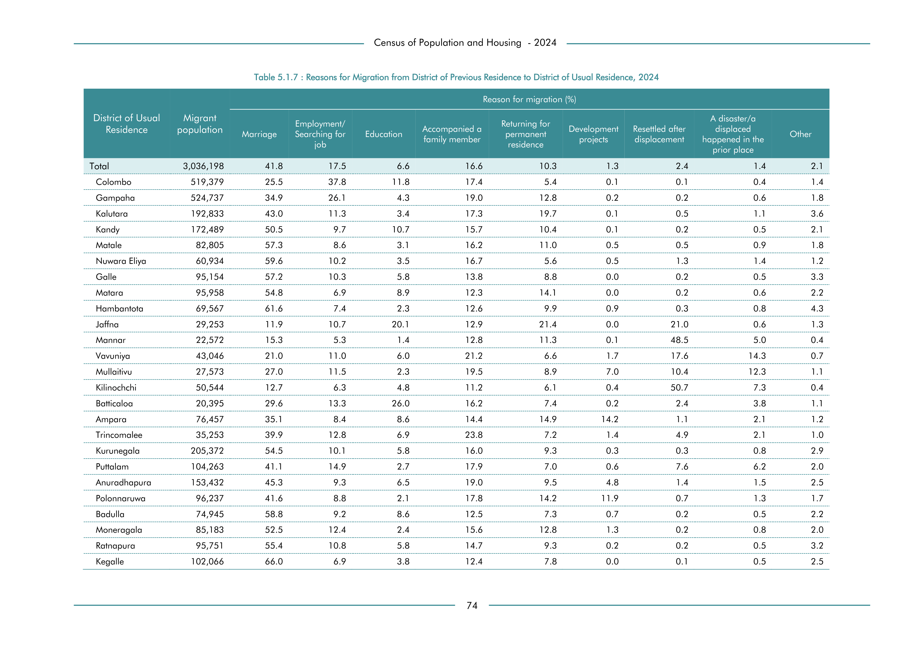

# Reasons for Migration from District of Previous Residence to District of Usual Residence, 2024


*Table 5.1.7, Final Report, 2024 Census of Population and Housing, Department of Census and Statistics, Sri Lanka*

## Structured Data (similar to original layout)

```json
[
    {
        "region_id": "LK-11",
        "region_name": "Colombo",
        "region_ent_type": "district",
        "values": {
            "total_value": 519379,
            "p_marriage": 0.255,
            "p_employment_searching_for_job": 0.378,
            "p_education": 0.118,
            "p_accompanied_a_family_member": 0.174,
            "p_returning_for_permanent_residence": 0.054,
            "p_development_projects": 0.001,
            "p_resettled_after_displacement": 0.001,
            "p_a_disaster_a_displaced_happened_in_the_prior_place": 0.004,
            "p_other": 0.014
        },
        "total_value": 519379.999
    },
    {
        "region_id": "LK-12",
        "region_name": "Gampaha",
        "region_ent_type": "district",
        "values": {
            "total_value": 524737,
            "p_marriage": 0.349,
            "p_employment_searching_for_job": 0.261,
            "p_education": 0.043,
            "p_accompanied_a_family_member": 0.19,
            "p_returning_for_permanent_residence": 0.128,
...
```

- Source File: [data.json (32.3 kB)](../../../../data/final-report-tables/chapter-5/5.1.7-Reasons-for-Migration-from-District-of-Previous-Residence-to-District-of-Usual-Residence,-2024/data.json)

## Raw Data (directly scraped from PDF)

```json
[
    [
        "",
        "",
        "",
        "",
        "",
        "",
        "Reason for migration (%)",
        "",
        "",
        "",
        ""
    ],
    [
        "District of Usual",
        "Migrant",
        "",
        "Employment/",
        "",
        "Accompanied a",
        "Returning for",
        "Development",
        "Resettled after",
        "A disaster/a \ndisplaced",
        ""
    ],
    [
        "Residence",
        "population",
...
```
- Source File: [raw_data.json (4.3 kB)](../../../../data/final-report-tables/chapter-5/5.1.7-Reasons-for-Migration-from-District-of-Previous-Residence-to-District-of-Usual-Residence,-2024/raw_data.json)

## Original PDF



- Source File: [original.pdf (35.2 kB)](../../../../data/final-report-tables/chapter-5/5.1.7-Reasons-for-Migration-from-District-of-Previous-Residence-to-District-of-Usual-Residence,-2024/original.pdf)

## Source

- <https://www.statistics.gov.lk/Resource/en/Population/CPH_2024/CPH2024_Final_Eng.pdf#page=91>


[](https://opensource.org/licenses/MIT)
