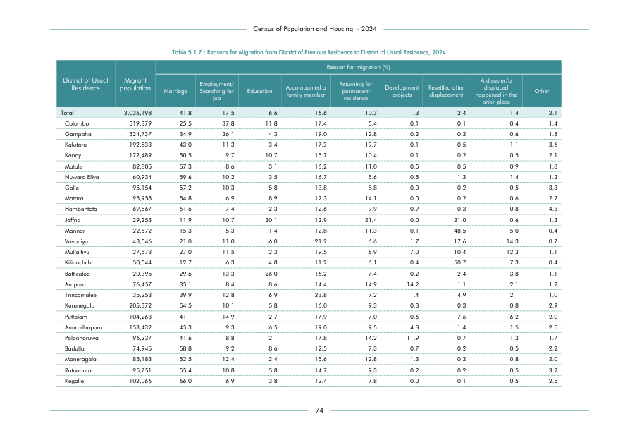

# Reasons for Migration from District of Previous Residence to District of Usual Residence, 2024


*Table 5.1.7, Final Report, 2024 Census of Population and Housing, Department of Census and Statistics, Sri Lanka*

## Raw Data (directly scraped from PDF)

```json
[
    [
        "",
        "",
        "",
        "",
        "",
        "",
        "Reason for migration (%)",
        "",
        "",
        "",
        ""
    ],
    [
        "District of Usual",
        "Migrant",
        "",
        "Employment/",
        "",
        "Accompanied a",
        "Returning for",
        "Development",
        "Resettled after",
        "A disaster/a \ndisplaced",
        ""
    ],
    [
        "Residence",
        "population",
...
```
- Source File: [raw_data.json (4.2 KB)](../../../../data/final-report-tables/chapter-5/5.1.7-Reasons-for-Migration-from-District-of-Previous-Residence-to-District-of-Usual-Residence-2024/raw_data.json)

## Original PDF Page



- Source File: [original.pdf (34.4 KB)](../../../../data/final-report-tables/chapter-5/5.1.7-Reasons-for-Migration-from-District-of-Previous-Residence-to-District-of-Usual-Residence-2024/original.pdf)

## Source

- <https://www.statistics.gov.lk/Resource/en/Population/CPH_2024/CPH2024_Final_Eng.pdf#page=91>


[](https://opensource.org/licenses/MIT)
