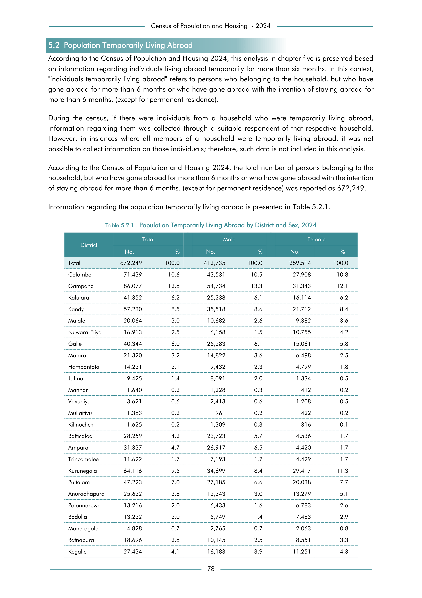

# Population Temporarily Living Abroad by District and Sex, 2024


*Table 5.2.1, Final Report, 2024 Census of Population and Housing, Department of Census and Statistics, Sri Lanka*

## Structured Data formatted for [Lanka Data API](https://github.com/nuuuwan/lanka_data)

```json
{
    "Person": {
        "Time:2024": {
            "District:LK-11": {
                "Sex:Male": {
                    "TemporarilyLivingAbroadCount": "Int:43531"
                },
                "Sex:Female": {
                    "TemporarilyLivingAbroadCount": "Int:27908"
                }
            },
            "District:LK-12": {
                "Sex:Male": {
                    "TemporarilyLivingAbroadCount": "Int:54734"
                },
                "Sex:Female": {
                    "TemporarilyLivingAbroadCount": "Int:31343"
                }
            },
            "District:LK-13": {
                "Sex:Male": {
                    "TemporarilyLivingAbroadCount": "Int:25238"
                },
                "Sex:Female": {
                    "TemporarilyLivingAbroadCount": "Int:16114"
                }
            },
            "District:LK-21": {
                "Sex:Male": {
                    "TemporarilyLivingAbroadCount": "Int:35518"
...
```

- Source File: [lanka_data.json (11.5 KB)](../../../../data/final-report-tables/chapter-5/5.2.1-Population-Temporarily-Living-Abroad-by-District-and-Sex,-2024/lanka_data.json)

## Structured Data (similar to original layout)

```json
[
    {
        "region_id": "LK-11",
        "region_name": "Colombo",
        "region_ent_type": "district",
        "values": {
            "male": 43531,
            "female": 27908
        },
        "total_value": 71439
    },
    {
        "region_id": "LK-12",
        "region_name": "Gampaha",
        "region_ent_type": "district",
        "values": {
            "male": 54734,
            "female": 31343
        },
        "total_value": 86077
    },
    {
        "region_id": "LK-13",
        "region_name": "Kalutara",
        "region_ent_type": "district",
        "values": {
            "male": 25238,
            "female": 16114
        },
        "total_value": 41352
...
```

- Source File: [data.json (10.5 KB)](../../../../data/final-report-tables/chapter-5/5.2.1-Population-Temporarily-Living-Abroad-by-District-and-Sex,-2024/data.json)

## Raw Data (directly scraped from PDF)

```json
[
    [
        "District",
        "Total",
        "",
        "Male",
        "",
        "Female",
        ""
    ],
    [
        "",
        "No.",
        "%",
        "No.",
        "%",
        "No.",
        "%"
    ],
    [
        "Total",
        "672,249",
        "100.0",
        "412,735",
        "100.0",
        "259,514",
        "100.0"
    ],
    [
        "Colombo",
...
```
- Source File: [raw_data.json (2.7 KB)](../../../../data/final-report-tables/chapter-5/5.2.1-Population-Temporarily-Living-Abroad-by-District-and-Sex,-2024/raw_data.json)

## Original PDF Page



- Source File: [original.pdf (54.6 KB)](../../../../data/final-report-tables/chapter-5/5.2.1-Population-Temporarily-Living-Abroad-by-District-and-Sex,-2024/original.pdf)

## Source

- <https://www.statistics.gov.lk/Resource/en/Population/CPH_2024/CPH2024_Final_Eng.pdf#page=95>


[](https://opensource.org/licenses/MIT)
