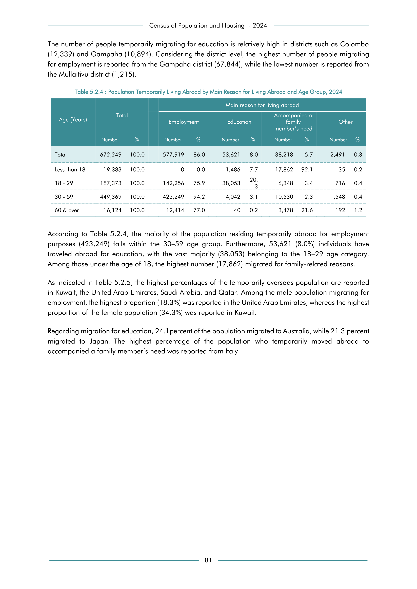

# Population Temporarily Living Abroad by Main Reason for Living Abroad and Age Group, 2024


*Table 5.2.4, Final Report, 2024 Census of Population and Housing, Department of Census and Statistics, Sri Lanka*

## Structured Data formatted for [Lanka Data API](https://github.com/nuuuwan/lanka_data)

```json
{
    "_meta": {
        "source_url": "https://www.statistics.gov.lk/Resource/en/Population/CPH_2024/CPH2024_Final_Eng.pdf#page=98",
        "source_description": [
            "Table 5.2.4, Final Report, 2024 Census of Population and Housing, Department of Census and Statistics, Sri Lanka"
        ],
        "what": {
            "PopulationAbroadByAgeGroup": "Population Temporarily Living Abroad by Main Reason for Living Abroad and Age Group, 2024"
        },
        "when": "2024",
        "where_who_types": [
            "age"
        ]
    },
    "PopulationAbroadByAgeGroup": {
        "2024": {
            "Total": {
                "age": "Total",
                "values": {
                    "Employment": 577919,
                    "Education": 53621,
                    "AccompanyingFamilyMemberInNeed": 38218,
                    "Other": 2491
                },
                "total_value": 672249,
                "pct_values": {
                    "Employment": 0.8597,
                    "Education": 0.0798,
                    "AccompanyingFamilyMemberInNeed": 0.0569,
                    "Other": 0.0037
...
```

- Source File: [lanka_data.json (2.6 KB)](../../../../data/final-report-tables/chapter-5/5.2.4-Population-Temporarily-Living-Abroad-by-Main-Reason-for-Living-Abroad-and-Age-Group,-2024/lanka_data.json)

## Structured Data (similar to original layout)

```json
[
    {
        "age": "Total",
        "values": {
            "employment": 577919,
            "education": 53621,
            "accompanying_family_member_in_need": 38218,
            "other": 2491
        },
        "total_value": 672249
    },
    {
        "age": "Less than 18",
        "values": {
            "employment": 0,
            "education": 1486,
            "accompanying_family_member_in_need": 17862,
            "other": 35
        },
        "total_value": 19383
    },
    {
        "age": "18 - 29",
        "values": {
            "employment": 142256,
            "education": 38053,
            "accompanying_family_member_in_need": 6348,
            "other": 716
        },
        "total_value": 187373
...
```

- Source File: [data.json (1014.0 B)](../../../../data/final-report-tables/chapter-5/5.2.4-Population-Temporarily-Living-Abroad-by-Main-Reason-for-Living-Abroad-and-Age-Group,-2024/data.json)

## Raw Data (directly scraped from PDF)

```json
[
    [
        "",
        "",
        "",
        "Employment",
        "",
        "Education",
        "",
        "family \nmember\u2019s need",
        "",
        "Other",
        ""
    ],
    [
        "",
        "Number",
        "%",
        "Number",
        "%",
        "Number",
        "%",
        "Number",
        "%",
        "Number",
        "%"
    ],
    [
        "Total",
        "672,249",
...
```
- Source File: [raw_data.json (1.0 KB)](../../../../data/final-report-tables/chapter-5/5.2.4-Population-Temporarily-Living-Abroad-by-Main-Reason-for-Living-Abroad-and-Age-Group,-2024/raw_data.json)

## Original PDF Page



- Source File: [original.pdf (45.2 KB)](../../../../data/final-report-tables/chapter-5/5.2.4-Population-Temporarily-Living-Abroad-by-Main-Reason-for-Living-Abroad-and-Age-Group,-2024/original.pdf)

## Source

- <https://www.statistics.gov.lk/Resource/en/Population/CPH_2024/CPH2024_Final_Eng.pdf#page=98>


[](https://opensource.org/licenses/MIT)
