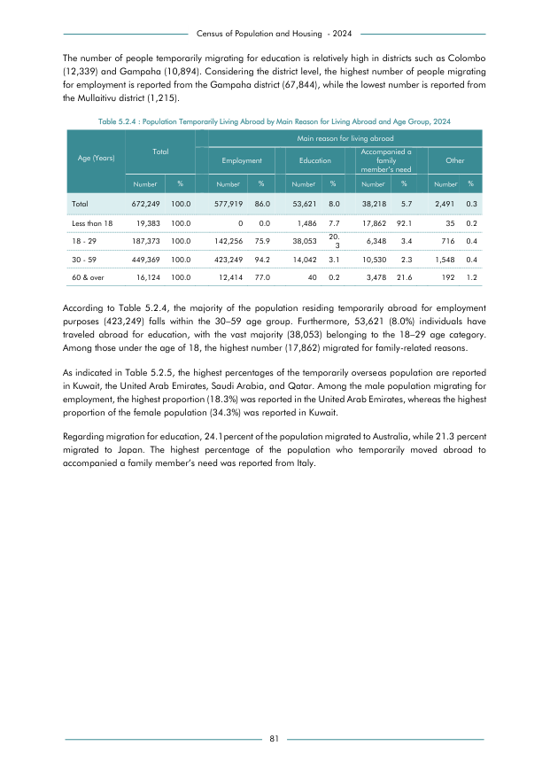

# Population Temporarily Living Abroad by Main Reason for Living Abroad and Age Group, 2024


*Table 5.2.4, Final Report, 2024 Census of Population and Housing, Department of Census and Statistics, Sri Lanka*

## Structured Data formatted for [Lanka Data API](https://github.com/nuuuwan/lanka_data)

```json
{
    "Person": {
        "Time:2024": {
            "AgeGroup:18To125Years": {
                "EmmigrationReason:employment": {
                    "Count": "Int:0"
                },
                "EmmigrationReason:education": {
                    "Count": "Int:1486"
                },
                "EmmigrationReason:family_in_need": {
                    "Count": "Int:17862"
                },
                "EmmigrationReason:other": {
                    "Count": "Int:35"
                }
            },
            "AgeGroup:18To29Years": {
                "EmmigrationReason:employment": {
                    "Count": "Int:142256"
                },
                "EmmigrationReason:education": {
                    "Count": "Int:38053"
                },
                "EmmigrationReason:family_in_need": {
                    "Count": "Int:6348"
                },
                "EmmigrationReason:other": {
                    "Count": "Int:716"
                }
...
```

- Source File: [lanka_data.json (1.5 KB)](../../../../data/final-report-tables/chapter-5/5.2.4-Population-Temporarily-Living-Abroad-by-Main-Reason-for-Living-Abroad-and-Age-Group-2024/lanka_data.json)

## Structured Data (similar to original layout)

```json
[
    {
        "age": "Less than 18",
        "values": {
            "employment": 0.0,
            "education": 1486,
            "accompanying_family_member_in_need": 17862,
            "other": 35
        },
        "total_value": 19383.0
    },
    {
        "age": "18 - 29",
        "values": {
            "employment": 142256,
            "education": 38053,
            "accompanying_family_member_in_need": 6348,
            "other": 716
        },
        "total_value": 187373
    },
    {
        "age": "30 - 59",
        "values": {
            "employment": 423249,
            "education": 14042,
            "accompanying_family_member_in_need": 10530,
            "other": 1548
        },
        "total_value": 449369
...
```

- Source File: [data.json (815.0 B)](../../../../data/final-report-tables/chapter-5/5.2.4-Population-Temporarily-Living-Abroad-by-Main-Reason-for-Living-Abroad-and-Age-Group-2024/data.json)

## Raw Data (directly scraped from PDF)

```json
[
    [
        "",
        "",
        "",
        "Employment",
        "",
        "Education",
        "",
        "family \nmember\u2019s need",
        "",
        "Other",
        ""
    ],
    [
        "",
        "Number",
        "%",
        "Number",
        "%",
        "Number",
        "%",
        "Number",
        "%",
        "Number",
        "%"
    ],
    [
        "Total",
        "672,249",
...
```
- Source File: [raw_data.json (1.0 KB)](../../../../data/final-report-tables/chapter-5/5.2.4-Population-Temporarily-Living-Abroad-by-Main-Reason-for-Living-Abroad-and-Age-Group-2024/raw_data.json)

## Original PDF Page



- Source File: [original.pdf (45.2 KB)](../../../../data/final-report-tables/chapter-5/5.2.4-Population-Temporarily-Living-Abroad-by-Main-Reason-for-Living-Abroad-and-Age-Group-2024/original.pdf)

## Source

- <https://www.statistics.gov.lk/Resource/en/Population/CPH_2024/CPH2024_Final_Eng.pdf#page=98>


[](https://opensource.org/licenses/MIT)
