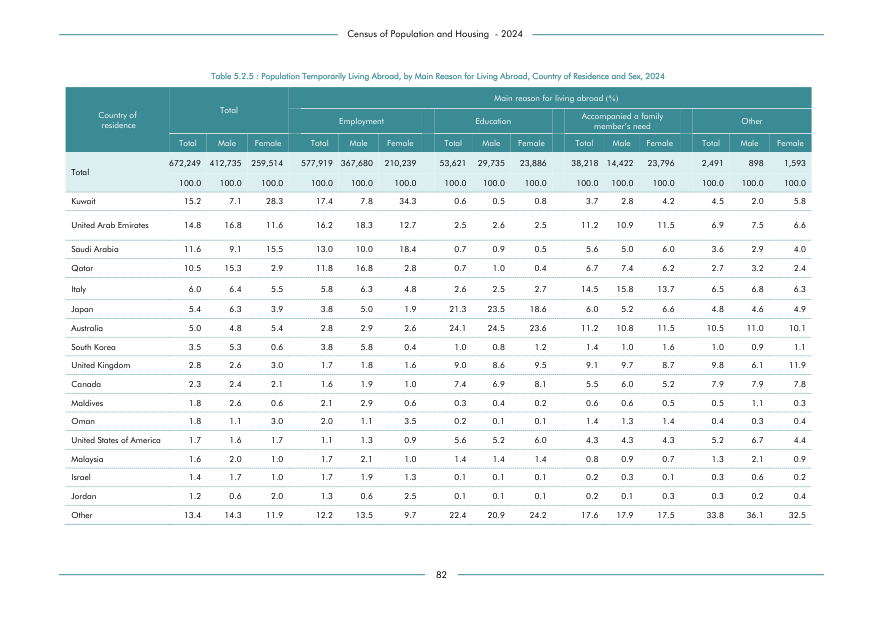

# Population Temporarily Living Abroad, by Main Reason for Living Abroad, Country of Residence and Sex,


*Table 5.2.5, Final Report, 2024 Census of Population and Housing, Department of Census and Statistics, Sri Lanka*

## Raw Data (directly scraped from PDF)

```json
[
    [
        "residence",
        "",
        "",
        "",
        "",
        "Employment",
        "",
        "",
        "Education",
        "",
        "",
        "Accompanied a family \nmember\u2019s need",
        "",
        "",
        "Other",
        ""
    ],
    [
        "",
        "Total",
        "Male",
        "Female",
        "Total",
        "Male",
        "Female",
        "Total",
        "Male",
        "Female",
...
```
- Source File: [raw_data.json (4.1 KB)](../../../../data/final-report-tables/chapter-5/5.2.5-Population-Temporarily-Living-Abroad,-by-Main-Reason-for-Living-Abroad,-Country-of-Residence-and-Sex,/raw_data.json)

## Original PDF Page



- Source File: [original.pdf (56.3 KB)](../../../../data/final-report-tables/chapter-5/5.2.5-Population-Temporarily-Living-Abroad,-by-Main-Reason-for-Living-Abroad,-Country-of-Residence-and-Sex,/original.pdf)

## Source

- <https://www.statistics.gov.lk/Resource/en/Population/CPH_2024/CPH2024_Final_Eng.pdf#page=99>


[](https://opensource.org/licenses/MIT)
