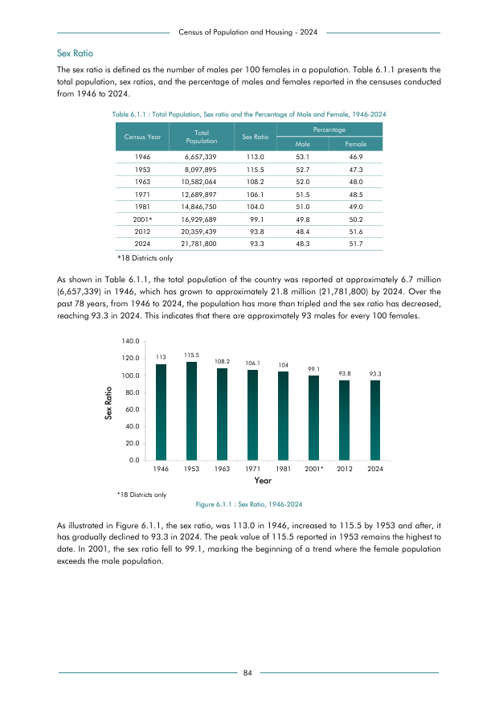

# Total Population, Sex ratio and the Percentage of Male and Female, 1946-2024


*Table 6.1.1, Final Report, 2024 Census of Population and Housing, Department of Census and Statistics, Sri Lanka*

## Structured Data (similar to original layout)

```json
[
    {
        "census_year": "1946",
        "values": {
            "population": 6657339,
            "sex_ratio": 113.0,
            "p_male": 0.531,
            "p_female": 0.469
        }
    },
    {
        "census_year": "1953",
        "values": {
            "population": 8097895,
            "sex_ratio": 115.5,
            "p_male": 0.527,
            "p_female": 0.473
        }
    },
    {
        "census_year": "1963",
        "values": {
            "population": 10582064,
            "sex_ratio": 108.2,
            "p_male": 0.52,
            "p_female": 0.48
        }
    },
    {
        "census_year": "1971",
...
```

- Source File: [data.json (1.3 KB)](../../../../data/final-report-tables/chapter-6/6.1.1-Total-Population-Sex-ratio-and-the-Percentage-of-Male-and-Female-1946-2024/data.json)

## Raw Data (directly scraped from PDF)

```json
[
    [
        "Table 6.1.1 : Total Population, Sex ratio and the Percentage of Male and Female, 1946-2024",
        "",
        "",
        "",
        "",
        ""
    ],
    [
        "Census Year",
        "Total",
        "Sex Ratio",
        "",
        "Percentage",
        ""
    ],
    [
        "",
        "Population",
        "",
        "Male",
        "",
        "Female"
    ],
    [
        "1946",
        "6,657,339",
        "113.0",
        "53.1",
...
```
- Source File: [raw_data.json (2.2 KB)](../../../../data/final-report-tables/chapter-6/6.1.1-Total-Population-Sex-ratio-and-the-Percentage-of-Male-and-Female-1946-2024/raw_data.json)

## Original PDF Page



- Source File: [original.pdf (92.1 KB)](../../../../data/final-report-tables/chapter-6/6.1.1-Total-Population-Sex-ratio-and-the-Percentage-of-Male-and-Female-1946-2024/original.pdf)

## Source

- <https://www.statistics.gov.lk/Resource/en/Population/CPH_2024/CPH2024_Final_Eng.pdf#page=101>


[](https://opensource.org/licenses/MIT)
