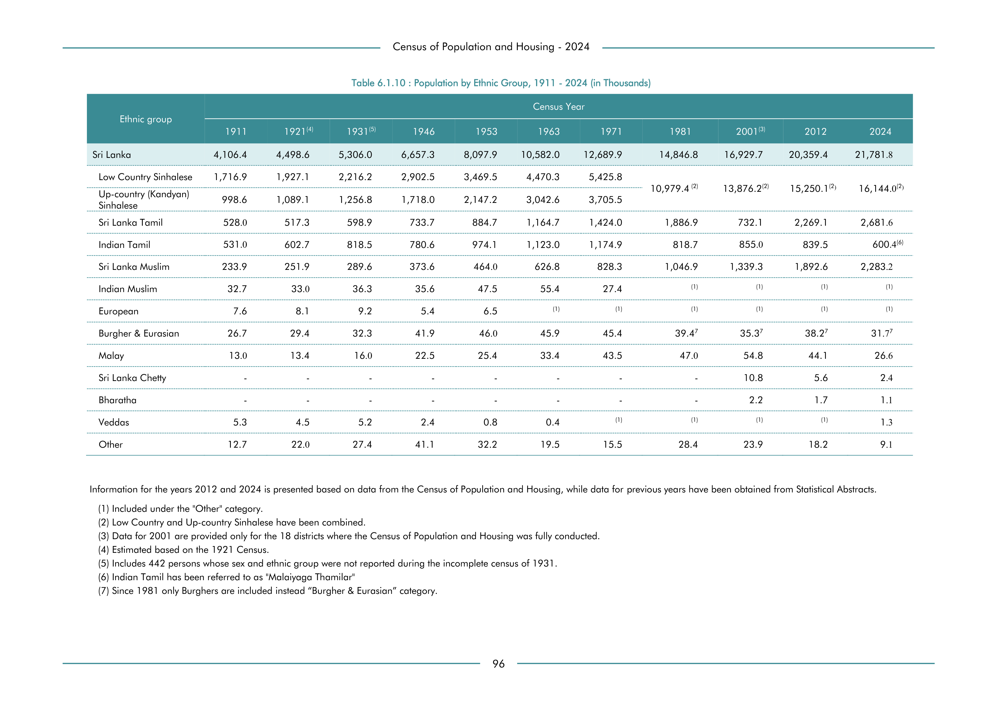

# Population by Ethnic Group, 1911 - 2024 (in


*Table 6.1.10, Final Report, 2024 Census of Population and Housing, Department of Census and Statistics, Sri Lanka*

## Structured Data (similar to original layout)

```json
[
    {
        "ethnicity": "Sri Lanka",
        "values": {
            "census_population_k_1911": 4106399,
            "census_population_k_1921": 4498600,
            "census_population_k_1931": 5306000,
            "census_population_k_1946": 6657300,
            "census_population_k_1953": 8097900,
            "census_population_k_1963": 10582000,
            "census_population_k_1971": 12689900,
            "census_population_k_1981": 14846800,
            "census_population_k_2001": 16929700,
            "census_population_k_2012": 20359400,
            "census_population_k_2024": 21781800
        }
    },
    {
        "ethnicity": "Low Country Sinhalese",
        "values": {
            "census_population_k_1911": 1716900,
            "census_population_k_1921": 1927100,
            "census_population_k_1931": 2216200,
            "census_population_k_1946": 2902500,
            "census_population_k_1953": 3469500,
            "census_population_k_1963": 4470300,
            "census_population_k_1971": 5425800,
            "census_population_k_1981": 0,
            "census_population_k_2001": 0,
            "census_population_k_2012": 0,
...
```

- Source File: [data.json (5.1 KB)](../../../../data/final-report-tables/chapter-6/6.1.10-Population-by-Ethnic-Group,-1911---2024-(in/data.json)

## Raw Data (directly scraped from PDF)

```json
[
    [
        "",
        "",
        "",
        "",
        "Table 6.1.10 : Population by Ethnic Group, 1911 - 2024 (in Thousands)",
        "",
        "",
        "",
        "",
        "",
        "",
        ""
    ],
    [
        "",
        "",
        "",
        "",
        "",
        "",
        "Census Year",
        "",
        "",
        "",
        "",
        ""
    ],
    [
...
```
- Source File: [raw_data.json (2.3 KB)](../../../../data/final-report-tables/chapter-6/6.1.10-Population-by-Ethnic-Group,-1911---2024-(in/raw_data.json)

## Original PDF Page



- Source File: [original.pdf (74.3 KB)](../../../../data/final-report-tables/chapter-6/6.1.10-Population-by-Ethnic-Group,-1911---2024-(in/original.pdf)

## Source

- <https://www.statistics.gov.lk/Resource/en/Population/CPH_2024/CPH2024_Final_Eng.pdf#page=113>


[](https://opensource.org/licenses/MIT)
