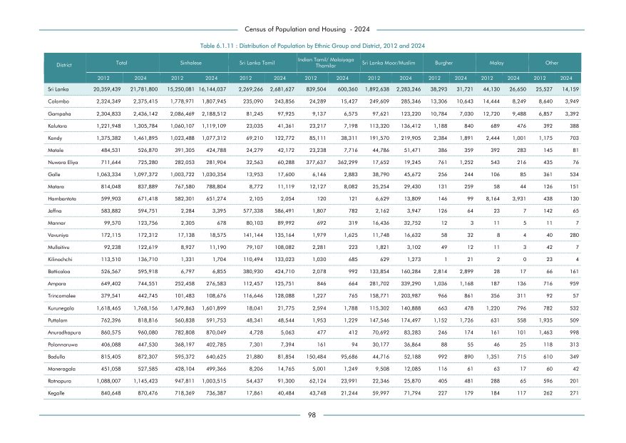

# Distribution of Population by Ethnic Group and District, 2012 and 2024


*Table 6.1.11, Final Report, 2024 Census of Population and Housing, Department of Census and Statistics, Sri Lanka*

## Structured Data (similar to original layout)

```json
[
    {
        "region_id": "LK-11",
        "region_name": "Colombo",
        "region_ent_type": "district",
        "values": {
            "total_2012": 2324349,
            "total_2024": 2375415,
            "sinhalese_2012": 1778971,
            "sinhalese_2024": 1807945,
            "sl_tamil_2012": 235090,
            "sl_tamil_2024": 243856,
            "ind_and_malaiyaga_tamil_2012": 24289,
            "ind_and_malaiyaga_tamil_2024": 15427,
            "sl_moor_2012": 249609,
            "sl_moor_2024": 285346,
            "burgher_2012": 13306,
            "burgher_2024": 10643,
            "malay_2012": 14444,
            "malay_2024": 8249,
            "other_2012": 8640,
            "other_2024": 3949
        }
    },
    {
        "region_id": "LK-12",
        "region_name": "Gampaha",
        "region_ent_type": "district",
        "values": {
            "total_2012": 2304833,
...
```

- Source File: [data.json (34.4 kB)](../../../../data/final-report-tables/chapter-6/6.1.11-Distribution-of-Population-by-Ethnic-Group-and-District,-2012-and-2024/data.json)

## Raw Data (directly scraped from PDF)

```json
[
    [
        "District",
        "Total",
        "",
        "Sinhalese",
        "",
        "Sri Lanka Tamil",
        "",
        "Indian Tamil/ Malaiyaga \nThamilar",
        "",
        "Sri Lanka Moor/Muslim",
        "",
        "Burgher",
        "",
        "Malay",
        "",
        "Other",
        ""
    ],
    [
        "",
        "2012",
        "2024",
        "2012",
        "2024",
        "2012",
        "2024",
        "2012",
        "2024",
...
```
- Source File: [raw_data.json (6.6 kB)](../../../../data/final-report-tables/chapter-6/6.1.11-Distribution-of-Population-by-Ethnic-Group-and-District,-2012-and-2024/raw_data.json)

## Original PDF Page



- Source File: [original.pdf (43.5 kB)](../../../../data/final-report-tables/chapter-6/6.1.11-Distribution-of-Population-by-Ethnic-Group-and-District,-2012-and-2024/original.pdf)

## Source

- <https://www.statistics.gov.lk/Resource/en/Population/CPH_2024/CPH2024_Final_Eng.pdf#page=115>


[](https://opensource.org/licenses/MIT)
