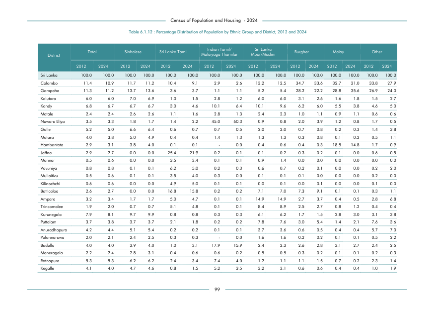

# Percentage Distribution of Population by Ethnic Group and District, 2012 and 2024


*Table 6.1.12, Final Report, 2024 Census of Population and Housing, Department of Census and Statistics, Sri Lanka*

## Structured Data (similar to original layout)

```json
[
    {
        "region_id": "LK-11",
        "region_name": "Colombo",
        "region_ent_type": "district",
        "values": {
            "p_total_2012": 0.114,
            "p_total_2024": 0.109,
            "p_sinhalese_2012": 0.117,
            "p_sinhalese_2024": 0.112,
            "p_sl_tamil_2012": 0.104,
            "p_sl_tamil_2024": 0.091,
            "p_ind_and_malaiyaga_tamil_2012": 0.029,
            "p_ind_and_malaiyaga_tamil_2024": 0.026,
            "p_sl_moor_2012": 0.132,
            "p_sl_moor_2024": 0.125,
            "p_burgher_2012": 0.347,
            "p_burgher_2024": 0.336,
            "p_malay_2012": 0.327,
            "p_malay_2024": 0.31,
            "p_other_2012": 0.338,
            "p_other_2024": 0.279
        }
    },
    {
        "region_id": "LK-12",
        "region_name": "Gampaha",
        "region_ent_type": "district",
        "values": {
            "p_total_2012": 0.113,
...
```

- Source File: [data.json (36.9 kB)](../../../../data/final-report-tables/chapter-6/6.1.12-Percentage-Distribution-of-Population-by-Ethnic-Group-and-District,-2012-and-2024/data.json)

## Raw Data (directly scraped from PDF)

```json
[
    [
        "District",
        "Total",
        "",
        "Sinhalese",
        "",
        "Sri Lanka Tamil",
        "",
        "Malaiyaga Thamilar",
        "",
        "Moor/Muslim",
        "",
        "Burgher",
        "",
        "Malay",
        "",
        "Other",
        ""
    ],
    [
        "",
        "2012",
        "2024",
        "2012",
        "2024",
        "2012",
        "2024",
        "2012",
        "2024",
...
```
- Source File: [raw_data.json (5.7 kB)](../../../../data/final-report-tables/chapter-6/6.1.12-Percentage-Distribution-of-Population-by-Ethnic-Group-and-District,-2012-and-2024/raw_data.json)

## Original PDF Page



- Source File: [original.pdf (40.7 kB)](../../../../data/final-report-tables/chapter-6/6.1.12-Percentage-Distribution-of-Population-by-Ethnic-Group-and-District,-2012-and-2024/original.pdf)

## Source

- <https://www.statistics.gov.lk/Resource/en/Population/CPH_2024/CPH2024_Final_Eng.pdf#page=116>


[](https://opensource.org/licenses/MIT)
