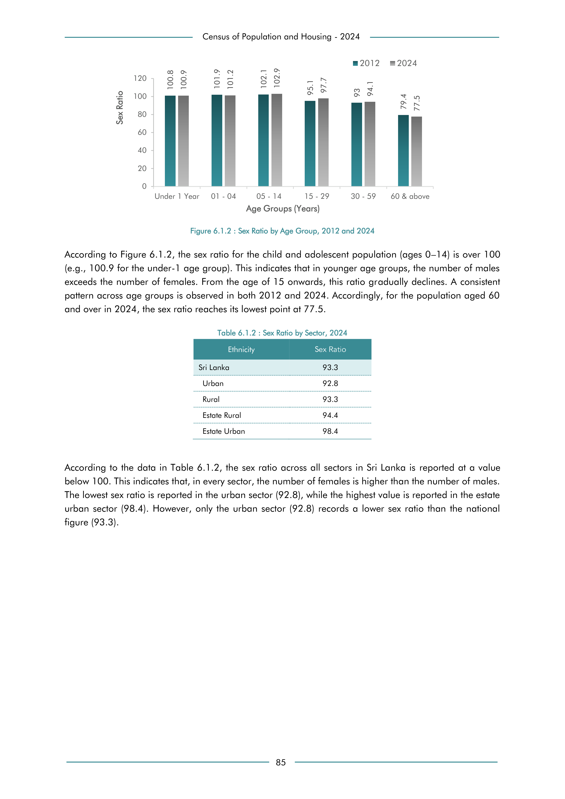

# Sex Ratio by Sector, 2024


*Table 6.1.2, Final Report, 2024 Census of Population and Housing, Department of Census and Statistics, Sri Lanka*

## Structured Data (similar to original layout)

```json
[
    {
        "sector": "Sri Lanka",
        "values": {
            "sex_ratio": 93.3
        }
    },
    {
        "sector": "Urban",
        "values": {
            "sex_ratio": 92.8
        }
    },
    {
        "sector": "Rural",
        "values": {
            "sex_ratio": 93.3
        }
    },
    {
        "sector": "Estate Rural",
        "values": {
            "sex_ratio": 94.4
        }
    },
    {
        "sector": "Estate Urban",
        "values": {
            "sex_ratio": 98.4
        }
...
```

- Source File: [data.json (410 B)](../../../../data/final-report-tables/chapter-6/6.1.2-Sex-Ratio-by-Sector,-2024/data.json)

## Raw Data (directly scraped from PDF)

```json
[
    [
        "120"
    ],
    [
        "100"
    ],
    [
        "80"
    ],
    [
        "60"
    ],
    [
        "40"
    ],
    [
        "20"
    ],
    [
        "0",
        "",
        "",
        "",
        "",
        "",
        ""
    ],
    [
        "",
...
```
- Source File: [raw_data.json (1.7 kB)](../../../../data/final-report-tables/chapter-6/6.1.2-Sex-Ratio-by-Sector,-2024/raw_data.json)

## Original PDF Page



- Source File: [original.pdf (38.5 kB)](../../../../data/final-report-tables/chapter-6/6.1.2-Sex-Ratio-by-Sector,-2024/original.pdf)

## Source

- <https://www.statistics.gov.lk/Resource/en/Population/CPH_2024/CPH2024_Final_Eng.pdf#page=102>


[](https://opensource.org/licenses/MIT)
