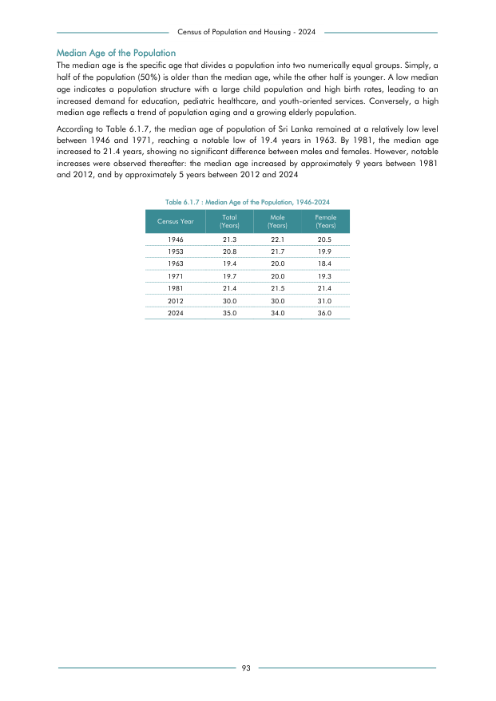

# Median Age of the Population, 1946-2024


*Table 6.1.7, Final Report, 2024 Census of Population and Housing, Department of Census and Statistics, Sri Lanka*

## Structured Data (similar to original layout)

```json
[
    {
        "census_year": "1946",
        "values": {
            "median_age_all": 21.3,
            "median_age_male": 22.1,
            "median_age_female": 20.5
        }
    },
    {
        "census_year": "1953",
        "values": {
            "median_age_all": 20.8,
            "median_age_male": 21.7,
            "median_age_female": 19.9
        }
    },
    {
        "census_year": "1963",
        "values": {
            "median_age_all": 19.4,
            "median_age_male": 20.0,
            "median_age_female": 18.4
        }
    },
    {
        "census_year": "1971",
        "values": {
            "median_age_all": 19.7,
            "median_age_male": 20.0,
...
```

- Source File: [data.json (1.0 KB)](../../../../data/final-report-tables/chapter-6/6.1.7-Median-Age-of-the-Population,-1946-2024/data.json)

## Raw Data (directly scraped from PDF)

```json
[
    [
        "Census of Population and Housing - 2024"
    ],
    [
        "Median Age of the Population"
    ],
    [
        "The median age is the specific age that divides a population into two numerically equal groups. Simply, a"
    ],
    [
        "half of the population (50%) is older than the median age, while the other half is younger. A low median"
    ],
    [
        "age  indicates  a  population  structure  with  a  large  child  population  and  high  birth  rates,  leading  to  an"
    ],
    [
        "increased  demand  for  education,  pediatric  healthcare,  and  youth-oriented  services.  Conversely,  a  high"
    ],
    [
        "median age reflects a trend of population aging and a growing elderly population."
    ],
    [
        "According to Table 6.1.7, the median age of population of Sri Lanka remained at a relatively low level"
    ],
    [
        "between  1946  and  1971,  reaching  a  notable  low  of  19.4  years  in  1963.  By  1981,  the  median  age"
    ],
    [
        "increased to 21.4 years, showing no significant difference between males and females. However, notable"
...
```
- Source File: [raw_data.json (1.8 KB)](../../../../data/final-report-tables/chapter-6/6.1.7-Median-Age-of-the-Population,-1946-2024/raw_data.json)

## Original PDF Page



- Source File: [original.pdf (40.8 KB)](../../../../data/final-report-tables/chapter-6/6.1.7-Median-Age-of-the-Population,-1946-2024/original.pdf)

## Source

- <https://www.statistics.gov.lk/Resource/en/Population/CPH_2024/CPH2024_Final_Eng.pdf#page=110>


[](https://opensource.org/licenses/MIT)
