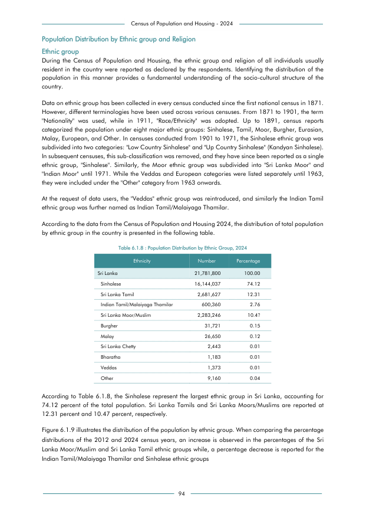

# Population Distribution by Ethnic Group, 2024


*Table 6.1.8, Final Report, 2024 Census of Population and Housing, Department of Census and Statistics, Sri Lanka*

## Structured Data formatted for [Lanka Data API](https://github.com/nuuuwan/lanka_data)

```json
{
    "Person": {
        "Time:2024": {
            "Ethnicity:sinhala": {
                "Count": "Int:16144037"
            },
            "Ethnicity:sri_lanka_tamil": {
                "Count": "Int:2681627"
            },
            "Ethnicity:sri_lanka_moor_or_muslim": {
                "Count": "Int:2283246"
            },
            "Ethnicity:burgher": {
                "Count": "Int:31721"
            },
            "Ethnicity:malay": {
                "Count": "Int:26650"
            },
            "Ethnicity:sri_lanka_chetty": {
                "Count": "Int:2443"
            },
            "Ethnicity:bharatha": {
                "Count": "Int:1183"
            },
            "Ethnicity:veddahs": {
                "Count": "Int:1373"
            },
            "Ethnicity:other": {
                "Count": "Int:9160"
            }
...
```

- Source File: [lanka_data.json (682.0 B)](../../../../data/final-report-tables/chapter-6/6.1.8-Population-Distribution-by-Ethnic-Group-2024/lanka_data.json)

## Structured Data (similar to original layout)

```json
[
    {
        "ethnicity": "Sri Lanka",
        "values": {
            "population": 21781800
        }
    },
    {
        "ethnicity": "Sinhalese",
        "values": {
            "population": 16144037
        }
    },
    {
        "ethnicity": "Sri Lanka Tamil",
        "values": {
            "population": 2681627
        }
    },
    {
        "ethnicity": "Indian Tamil/Malaiyaga Thamilar",
        "values": {
            "population": 600360
        }
    },
    {
        "ethnicity": "Sri Lanka Moor/Muslim",
        "values": {
            "population": 2283246
        }
...
```

- Source File: [data.json (999.0 B)](../../../../data/final-report-tables/chapter-6/6.1.8-Population-Distribution-by-Ethnic-Group-2024/data.json)

## Raw Data (directly scraped from PDF)

```json
[
    [
        "",
        "Census of Population and Housing - 2024",
        "",
        ""
    ],
    [
        "Population Distribution by Ethnic group and Religion",
        "",
        "",
        ""
    ],
    [
        "Ethnic group",
        "",
        "",
        ""
    ],
    [
        "During  the  Census  of  Population  and  Housing,  the  ethnic  group  and  religion  of  all  individuals  usually",
        "",
        "",
        ""
    ],
    [
        "resident in  the country  were  reported  as  declared by the respondents. Identifying the distribution  of the",
        "",
        "",
        ""
...
```
- Source File: [raw_data.json (3.2 KB)](../../../../data/final-report-tables/chapter-6/6.1.8-Population-Distribution-by-Ethnic-Group-2024/raw_data.json)

## Original PDF Page



- Source File: [original.pdf (41.3 KB)](../../../../data/final-report-tables/chapter-6/6.1.8-Population-Distribution-by-Ethnic-Group-2024/original.pdf)

## Source

- <https://www.statistics.gov.lk/Resource/en/Population/CPH_2024/CPH2024_Final_Eng.pdf#page=111>


[](https://opensource.org/licenses/MIT)
