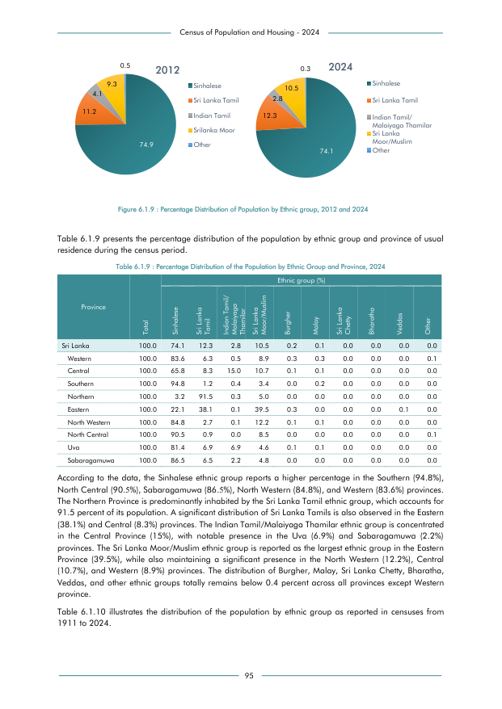

# Percentage Distribution of the Population by Ethnic Group and Province, 2024


*Table 6.1.9, Final Report, 2024 Census of Population and Housing, Department of Census and Statistics, Sri Lanka*

## Structured Data formatted for [Lanka Data API](https://github.com/nuuuwan/lanka_data)

```json
{
    "Person": {
        "Time:2024": {
            "Province:western": {
                "Ethnicity:sinhala": {
                    "Percentage": "Percent:83.6"
                },
                "Ethnicity:sri_lanka_tamil": {
                    "Percentage": "Percent:6.3"
                },
                "Ethnicity:indian_tamil": {
                    "Percentage": "Percent:0.5"
                },
                "Ethnicity:sri_lanka_muslim": {
                    "Percentage": "Percent:8.9"
                },
                "Ethnicity:malay": {
                    "Percentage": "Percent:0.3"
                },
                "Ethnicity:burgher": {
                    "Percentage": "Percent:0.3"
                },
                "Ethnicity:sri_lanka_chetty": {
                    "Percentage": "Percent:0.0"
                },
                "Ethnicity:bharatha": {
                    "Percentage": "Percent:0.0"
                },
                "Ethnicity:veddahs": {
                    "Percentage": "Percent:0.0"
...
```

- Source File: [lanka_data.json (7.7 KB)](../../../../data/final-report-tables/chapter-6/6.1.9-Percentage-Distribution-of-the-Population-by-Ethnic-Group-and-Province-2024/lanka_data.json)

## Structured Data (similar to original layout)

```json
[
    {
        "region_id": "LK-1",
        "region_name": "Western",
        "region_ent_type": "province",
        "values": {
            "sinhalese": 83.6,
            "sl_tamil": 6.3,
            "ind_and_malaiyaga_tamil": 0.5,
            "sl_moor": 8.9,
            "malay": 0.3,
            "burgher": 0.3,
            "sl_chetty": 0.0,
            "bharatha": 0.0,
            "veddahs": 0.0,
            "other": 0.1
        }
    },
    {
        "region_id": "LK-2",
        "region_name": "Central",
        "region_ent_type": "province",
        "values": {
            "sinhalese": 65.8,
            "sl_tamil": 8.3,
            "ind_and_malaiyaga_tamil": 15.0,
            "sl_moor": 10.7,
            "malay": 0.1,
            "burgher": 0.1,
            "sl_chetty": 0.0,
...
```

- Source File: [data.json (3.2 KB)](../../../../data/final-report-tables/chapter-6/6.1.9-Percentage-Distribution-of-the-Population-by-Ethnic-Group-and-Province-2024/data.json)

## Raw Data (directly scraped from PDF)

```json
[
    [
        "",
        "",
        "0.5",
        "",
        "2012",
        "",
        "",
        "",
        "0.3",
        "2024",
        ""
    ],
    [
        "",
        "9.3",
        "",
        "",
        "",
        "Sinhalese",
        "",
        "10.5",
        "",
        "",
        "Sinhalese"
    ],
    [
        "4.1",
        "",
...
```
- Source File: [raw_data.json (2.5 KB)](../../../../data/final-report-tables/chapter-6/6.1.9-Percentage-Distribution-of-the-Population-by-Ethnic-Group-and-Province-2024/raw_data.json)

## Original PDF Page



- Source File: [original.pdf (72.4 KB)](../../../../data/final-report-tables/chapter-6/6.1.9-Percentage-Distribution-of-the-Population-by-Ethnic-Group-and-Province-2024/original.pdf)

## Source

- <https://www.statistics.gov.lk/Resource/en/Population/CPH_2024/CPH2024_Final_Eng.pdf#page=112>


[](https://opensource.org/licenses/MIT)
