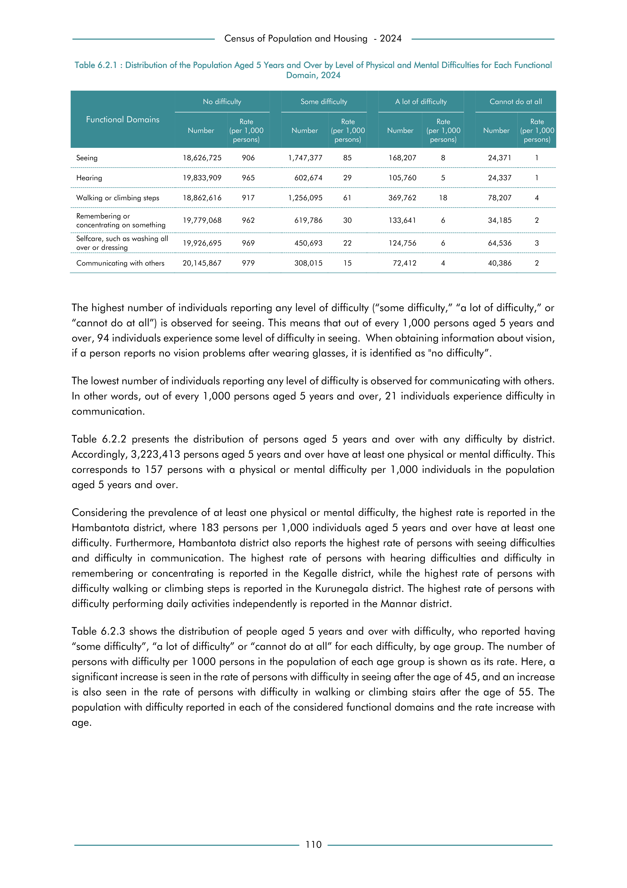

# Distribution of the Population Aged 5 Years and Over by Level of Physical and Mental Difficulties for EachFunctional Domain, 2024


*Table 6.2.1, Final Report, 2024 Census of Population and Housing, Department of Census and Statistics, Sri Lanka*

## Raw Data (directly scraped from PDF)

```json
[
    [
        "Functional Domains",
        "Number",
        "Rate  \n(per 1,000",
        "Number",
        "Rate  \n(per 1,000",
        "Number",
        "Rate  \n(per 1,000",
        "Number",
        "Rate  \n(per 1,000"
    ],
    [
        "",
        "",
        "persons)",
        "",
        "persons)",
        "",
        "persons)",
        "",
        "persons)"
    ],
    [
        "Seeing",
        "18,626,725",
        "906",
        "1,747,377",
        "85",
        "168,207",
...
```
- Source File: [raw_data.json (5.8 kB)](../../../../data/final-report-tables/chapter-6/6.2.1-Distribution-of-the-Population-Aged-5-Years-and-Over-by-Level-of-Physical-and-Mental-Difficulties-for-EachFunctional-Domain,-2024/raw_data.json)

## Original PDF



- Source File: [original.pdf (90.0 kB)](../../../../data/final-report-tables/chapter-6/6.2.1-Distribution-of-the-Population-Aged-5-Years-and-Over-by-Level-of-Physical-and-Mental-Difficulties-for-EachFunctional-Domain,-2024/original.pdf)

## Source

- <https://www.statistics.gov.lk/Resource/en/Population/CPH_2024/CPH2024_Final_Eng.pdf#page=127>


[](https://opensource.org/licenses/MIT)
