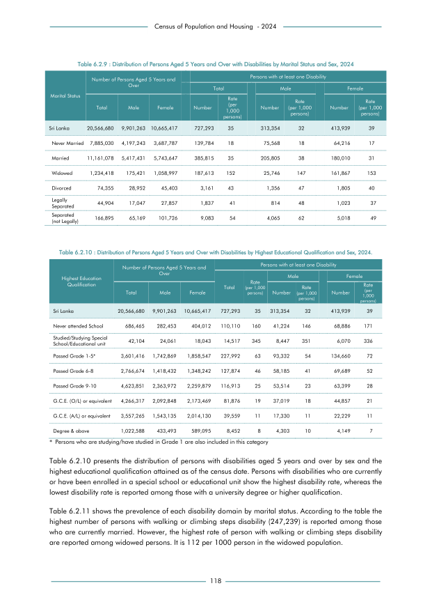

# Distribution of Persons Aged 5 Years and Over with Disabilities by Highest Educational Qualification and Sex,2024

*Table 6.2.10, Final Report, 2024 Census of Population and Housing, Department of Census and Statistics, Sri Lanka*

## Original PDF Page

- Source File: [original.pdf (55.8 KB)](../../../../data/final-report-tables/chapter-6/6.2.10-Distribution-of-Persons-Aged-5-Years-and-Over-with-Disabilities-by-Highest-Educational-Qualification-and-Sex,2024/original.pdf)

(Table 1 on this page.)

## Source

- <https://www.statistics.gov.lk/Resource/en/Population/CPH_2024/CPH2024_Final_Eng.pdf#page=135>

