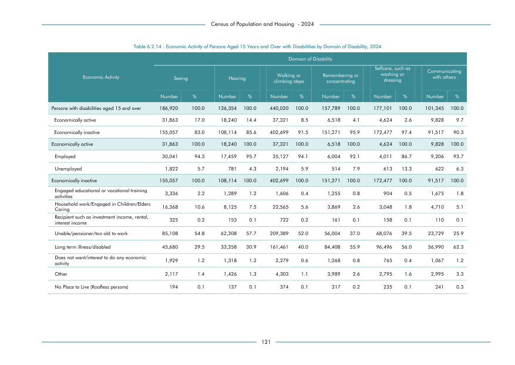

# Economic Activity of Persons Aged 15 Years and Over with Disabilities by Domain of Disability, 2024


*Table 6.2.14, Final Report, 2024 Census of Population and Housing, Department of Census and Statistics, Sri Lanka*

## Raw Data (directly scraped from PDF)

```json
[
    [
        "",
        "",
        "",
        "",
        "",
        "climbing steps",
        "",
        "concentrating",
        "",
        "dressing",
        "",
        "",
        ""
    ],
    [
        "",
        "Number",
        "%",
        "Number",
        "%",
        "Number",
        "%",
        "Number",
        "%",
        "Number",
        "%",
        "Number",
        "%"
...
```
- Source File: [raw_data.json (3.2 KB)](../../../../data/final-report-tables/chapter-6/6.2.14-Economic-Activity-of-Persons-Aged-15-Years-and-Over-with-Disabilities-by-Domain-of-Disability,-2024/raw_data.json)

## Original PDF Page



- Source File: [original.pdf (90.5 KB)](../../../../data/final-report-tables/chapter-6/6.2.14-Economic-Activity-of-Persons-Aged-15-Years-and-Over-with-Disabilities-by-Domain-of-Disability,-2024/original.pdf)

## Source

- <https://www.statistics.gov.lk/Resource/en/Population/CPH_2024/CPH2024_Final_Eng.pdf#page=138>


[](https://opensource.org/licenses/MIT)
