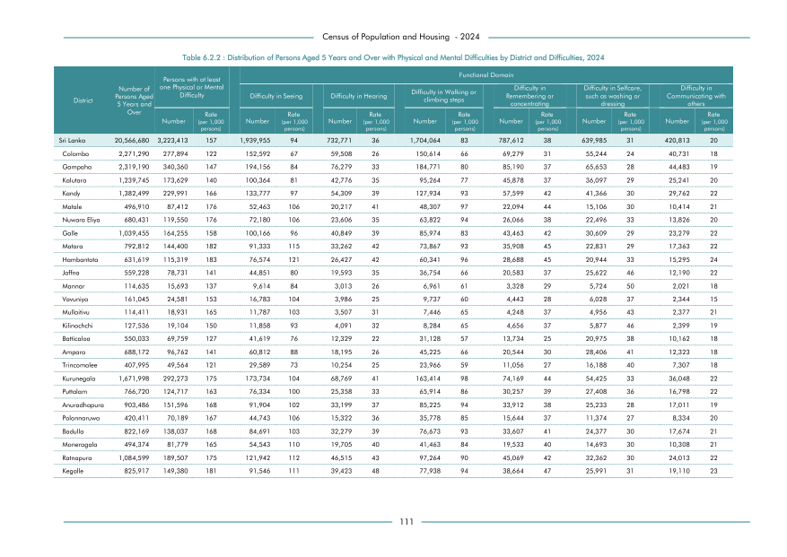

# Distribution of Persons Aged 5 Years and Over with Physical and Mental Difficulties by District and Difficulties,2024


*Table 6.2.2, Final Report, 2024 Census of Population and Housing, Department of Census and Statistics, Sri Lanka*

## Structured Data formatted for [Lanka Data API](https://github.com/nuuuwan/lanka_data)

```json
{
    "_meta": {
        "source_url": "https://www.statistics.gov.lk/Resource/en/Population/CPH_2024/CPH2024_Final_Eng.pdf#page=128",
        "source_description": [
            "Table 6.2.2, Final Report, 2024 Census of Population and Housing, Department of Census and Statistics, Sri Lanka"
        ],
        "what": {
            "Disabilities": "Distribution of Persons Aged 5 Years and Over with Physical and Mental Difficulties by District and Difficulties,2024"
        },
        "when": "2024",
        "where_who_types": [
            "null"
        ]
    },
    "Disabilities": {
        "2024": {
            "Sri Lanka": {
                "null": "Sri Lanka",
                "values": {
                    "NoDisability": 14341480,
                    "DifficultyInSeeing": 1939955,
                    "DifficultyInWalkingOrClimbingSteps": 1704064,
                    "DifficultyInRememberingOrConcentrating": 787612,
                    "DifficultyInHearing": 732771,
                    "DifficultyInSelfcareSuchAsWashingOrDressing": 639985,
                    "DifficultyInCommunicatingWithOthers": 420813
                },
                "total_value": 20566680,
                "pct_values": {
                    "NoDisability": 0.6973,
...
```

- Source File: [lanka_data.json (22.7 kB)](../../../../data/final-report-tables/chapter-6/6.2.2-Distribution-of-Persons-Aged-5-Years-and-Over-with-Physical-and-Mental-Difficulties-by-District-and-Difficulties,2024/lanka_data.json)

## Structured Data (similar to original layout)

```json
[
    {
        "null": "Sri Lanka",
        "values": {
            "difficulty_in_seeing": 1939955,
            "difficulty_in_hearing": 732771,
            "difficulty_in_walking_or_climbing_steps": 1704064,
            "difficulty_in_remembering_or_concentrating": 787612,
            "difficulty_in_selfcare_such_as_washing_or_dressing": 639985,
            "difficulty_in_communicating_with_others": 420813,
            "no_disability": 14341480
        },
        "total_value": 20566680
    },
    {
        "null": "Colombo",
        "values": {
            "difficulty_in_seeing": 152592,
            "difficulty_in_hearing": 59508,
            "difficulty_in_walking_or_climbing_steps": 150614,
            "difficulty_in_remembering_or_concentrating": 69279,
            "difficulty_in_selfcare_such_as_washing_or_dressing": 55244,
            "difficulty_in_communicating_with_others": 40731,
            "no_disability": 1743322
        },
        "total_value": 2271290
    },
    {
        "null": "Gampaha",
        "values": {
...
```

- Source File: [data.json (11.1 kB)](../../../../data/final-report-tables/chapter-6/6.2.2-Distribution-of-Persons-Aged-5-Years-and-Over-with-Physical-and-Mental-Difficulties-by-District-and-Difficulties,2024/data.json)

## Raw Data (directly scraped from PDF)

```json
[
    [
        "",
        "",
        "Persons with at least",
        "",
        "",
        "",
        "",
        "",
        "Functional Domain",
        "",
        "",
        "",
        "",
        "",
        ""
    ],
    [
        "Number of",
        "Difficulty",
        "one Physical or Mental",
        "",
        "Difficulty in Seeing",
        "",
        "Difficulty in Hearing",
        "",
        "Difficulty in Walking or",
        "Difficulty in",
        "Remembering or",
...
```
- Source File: [raw_data.json (6.5 kB)](../../../../data/final-report-tables/chapter-6/6.2.2-Distribution-of-Persons-Aged-5-Years-and-Over-with-Physical-and-Mental-Difficulties-by-District-and-Difficulties,2024/raw_data.json)

## Original PDF



- Source File: [original.pdf (70.3 kB)](../../../../data/final-report-tables/chapter-6/6.2.2-Distribution-of-Persons-Aged-5-Years-and-Over-with-Physical-and-Mental-Difficulties-by-District-and-Difficulties,2024/original.pdf)

## Source

- <https://www.statistics.gov.lk/Resource/en/Population/CPH_2024/CPH2024_Final_Eng.pdf#page=128>


[](https://opensource.org/licenses/MIT)
